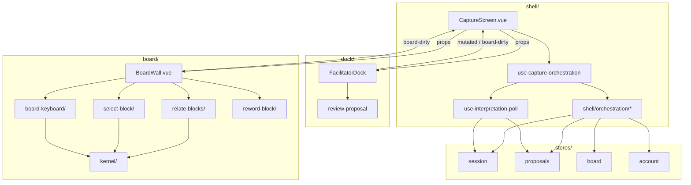

# Capture-loop topology migration — Design

**Spec**: `.specs/features/capture-loop-topology-migration/spec.md`
**Status**: Draft

---

## Architecture Overview

Mechanical refactor to ADR-012 topology. Zones stay props-in / events-out; shell owns refetch
orchestration. ADR-007 preserved: Pinia stores remain validated-only caches; zones emit typed
events upward; shell maps events to GET loaders.



**Chosen approach:** Incremental migration in seven phases (effort-map sequence). Alternative
rejected: big-bang directory rename in one PR — harder to review and bisect. Alternative rejected:
keep inline orchestration and only add docs — fails ADR-012 enforceability goal.

---

## Code Reuse Analysis

### Existing Components to Leverage

| Component | Location | How to Use |
| --------- | -------- | ---------- |
| Reword interaction | `board/interactions/reword-block/` | Keep; pattern for thin composable + optional usecase |
| Dock interactions | `dock/interactions/*` | Keep emit contract; no structural change |
| Interpretation poll | `composables/use-interpretation-poll.ts` | Move to `shell/composables/`; `refetchNow` stays `mutated` path |
| Board deep module API | `board/index.ts` | Unchanged public surface |
| Dep-cruiser patterns | `.dependency-cruiser.cjs` | Extend with planted violations per repo convention |
| Effort-map prototype | `.specs/effort-maps/prototype-shell-orchestration.md` | Implement types and file names verbatim |
| Semantic edit | `board/semantic-edit.ts` | Move to `board/kernel/` |
| Screen tests | `screens/*.test.ts` | Move with components; slim to wiring-only where orchestration tests absorb graph asserts |

### Integration Points

| System | Integration Method |
| ------ | ---------------- |
| Pinia stores | Shell composable binds store `load`/`refetch` as `CaptureEffectPorts` |
| Vue router | `router.ts` imports from `shell/` after move |
| Transport | Unchanged — interactions and kernel call `transport/board.ts` |
| E2E | No route or API changes — same user-visible flows |

---

## Components

### `shell/orchestration/refetch-graph.ts`

- **Purpose**: Single source of truth mapping zone events → refetch targets.
- **Location**: `src/app/capture-loop/shell/orchestration/refetch-graph.ts`
- **Interfaces**: `REFETCH_BY_ZONE_EVENT`, `refetchTargetsFor(event)`
- **Dependencies**: `zone-events.ts` types only
- **Reuses**: Effort-map #82 prototype

### `shell/orchestration/apply-capture-effect.ts`

- **Purpose**: Execute parallel refetch for a zone event given injected ports.
- **Location**: `src/app/capture-loop/shell/orchestration/apply-capture-effect.ts`
- **Interfaces**: `applyCaptureZoneEvent(event, ports, ctx)`
- **Dependencies**: `refetch-graph.ts`, port interfaces (no Vue)
- **Reuses**: Today’s `onBoardDirty` / cold-load logic extracted from `CaptureScreen.vue`

### `shell/composables/use-capture-orchestration.ts`

- **Purpose**: Thin Vue adapter wiring Pinia stores to orchestration pure functions.
- **Location**: `src/app/capture-loop/shell/composables/use-capture-orchestration.ts`
- **Interfaces**: `onMutated`, `onBoardDirty`, `coldLoad`, `shouldLoadProposals`, `loadProposals`
- **Dependencies**: orchestration modules, stores, `useInterpretationPoll`
- **Reuses**: Existing store APIs

### `board/kernel/`

- **Purpose**: Framework-free shared board logic importable by all interactions.
- **Location**: `src/app/capture-loop/board/kernel/`
- **Contents**: `semantic-edit.ts`, `apply-board-edit.ts` (extracted from mutations), `typing-surface.ts`
- **Dependencies**: `transport/board.ts` only from apply helper
- **Reuses**: Existing `semantic-edit.ts` body

### `board/interactions/relate-blocks/`

- **Purpose**: All relation/placement mutations (toolbar, drag, connect, withdraw/reinstate POST).
- **Location**: `src/app/capture-loop/board/interactions/relate-blocks/`
- **Interfaces**: `useRelateBlocks(options)` returning handlers + `relationError`
- **Dependencies**: `board/kernel/`, transport
- **Reuses**: Logic from `use-board-mutations.ts` minus keyboard

### `board/interactions/board-keyboard/`

- **Purpose**: Global key dispatch with typed callbacks into gestures.
- **Location**: `src/app/capture-loop/board/interactions/board-keyboard/`
- **Interfaces**: `useBoardKeyboard(dispatchTable)`
- **Dependencies**: `board/kernel/typing-surface.ts`
- **Reuses**: Keyboard block from `use-board-mutations.ts`; effort-map #84 research

### `board/interactions/select-block/`

- **Purpose**: Selection state, toolbar guards, withdraw-ask id.
- **Location**: `src/app/capture-loop/board/interactions/select-block/`
- **Interfaces**: `useSelectBlock(blocks)` → `selectedId`, `canPlace`, etc.
- **Dependencies**: `board/kernel/` (`isEventKind`)
- **Reuses**: `use-board-selection.ts` body

---

## Data Models (if applicable)

### Zone events (shell boundary)

```typescript
export type CaptureZoneEvent = 'mutated' | 'board-dirty'
export type RefetchTarget = 'session' | 'proposals' | 'board' | 'account'

export interface DockZoneEmit {
  mutated: () => void
  boardDirty: () => void
}
```

No Pinia or transport shape changes — ADR-007 stores unchanged.

---

## Error Handling Strategy

| Error Scenario | Handling | User Impact |
| -------------- | -------- | ----------- |
| Board POST 422 cycle | `relate-blocks` sets `relationError`; no `board-dirty` | Same inline error copy as today |
| Orchestration refetch failure | Stores swallow load errors today; poll retries | Unchanged |
| Cold load board 404 | Skip board load until contributions exist | Unchanged gate UX |

---

## Risks & Concerns

| Concern | Location | Impact | Mitigation |
| ------- | -------- | ------ | ---------- |
| Bundled mutations hard to split | `use-board-mutations.ts` | Missed keyboard/reword interaction | Split order: kernel → keyboard → relate-blocks → select-block; keep BoardWall tests green each phase |
| Screen tests assert refetch inline | `CaptureScreen.test.ts` | False failures after extract | Move graph asserts to `apply-capture-effect.test.ts` (effort-map tier A) |
| Dep-cruiser pathNot drift during move | `.dependency-cruiser.cjs` | False positives mid-migration | Update `board-public-api-only` to allow `shell/` in same task as first shell files |
| Import path churn | `router.ts`, tests | Broken builds between tasks | Phase 2 atomic: move files + fix all imports in one task |
| Keyboard regression | `BoardWall.test.ts` | UX break invisible to unit tests | Keep existing keydown tests; no chord map changes in this feature |

---

## Tech Decisions (only non-obvious ones)

| Decision | Choice | Rationale |
| -------- | ------ | --------- |
| Orchestration naming | `apply-capture-effect.ts` not `capture-effects.ts` | Matches verb + single entry point; graph lives in `refetch-graph.ts` |
| `mutated` path | Delegate to `poll.refetchNow()` not duplicate | Timer and immediate refetch share one code path (TOPO-01) |
| Kernel vs duplicate semantic-edit | `board/kernel/` + allowlist | #79; axis-of-change for RelationEdit model |
| Relate-blocks granularity | One folder | #85; shared POST + error surface |
| Usecase extraction | Only reword keeps phase machine | #81; single-step POST gestures stay composables |
| Account placement | `shell/account/` | #78; not a deep module |

**Project-level decisions:** No new `AD-NNN` — effort-map decisions are topology-local; ADR-012 is
the durable record. Update `.specs/STATE.md` Handoff only.

---

## Target directory tree (end state)

```
src/app/capture-loop/
  router.ts
  client.ts
  types.ts
  AGENTS.md
  shell/
    AGENTS.md
    CaptureScreen.vue
    CreateWorkshop.vue
    account/
    composables/
    orchestration/
  board/
    AGENTS.md
    kernel/
    composables/use-fresh-sticky-highlight.ts
    interactions/
      board-keyboard/
      relate-blocks/
      reword-block/
      select-block/
    index.ts
    BoardWall.vue
    ...
  dock/
    AGENTS.md
    composables/
    interactions/
  stores/
  transport/
  view-state/
```
