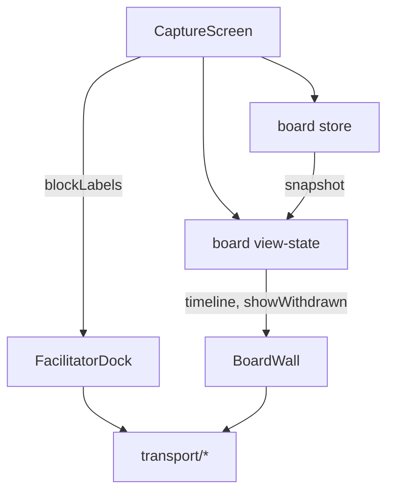

# Capture-loop transport seam — design

## Layout (delta)

```
src/app/capture-loop/
  client.ts              # unchanged — fetch primitives
  transport/
    proposals.ts         # accept, edit, reject, hold, unhold
    session.ts           # startSession, setScope, submitContribution
    board.ts             # postBoardOperation, BoardEdit
  view-state/
    board-view.ts        # showWithdrawn + timeline from snapshot
  dock/
    mutations.ts         # shim → re-exports transport/* (#68 removes)
  stores/
    board.ts             # snapshot, load, refetch only
  screens/
    CaptureScreen.vue    # composes stores, view-state, passes blockLabels
```

## Data flow



## Tech decisions

| Decision | Choice | Rationale |
| -------- | ------ | --------- |
| Shim | `dock/mutations.ts` re-exports | #62 AC; #68 removes |
| `BoardEdit` type | Lives in `transport/board.ts` | Co-located with POST |
| Timeline derivation | `view-state/board-view.ts` | View filter, not projection |
| Portal | `#reword-portal` only in `CaptureScreen` | Single owner per AC |

## Unchanged

- `client.ts` naming (ADR-007 / depcruise `ui-does-not-import-server-code`)
- POST-then-refetch mutation pattern
- `no-cross-store-imports` rule — dock must not import board store
