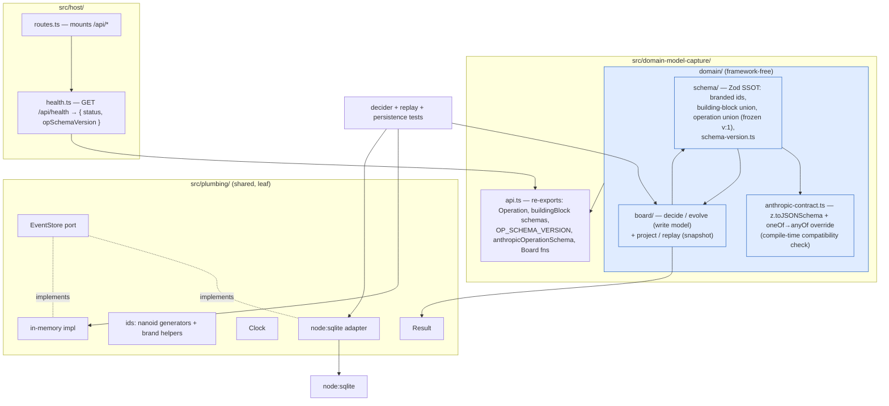

# Slice 0 — Skeleton + Irreversibles Design

**Spec**: `.specs/features/slice-0-skeleton-irreversibles/spec.md`
**Status**: Approved (Approach A; AD-010/011/012 recorded 2026-08-29)

Conforms to `.specs/STATE.md` decisions **AD-001…AD-009** and ADRs **001–011**. Reviewed through
`code-architecture`, `software-design`, `domain-modeling`, `distributed-systems`.

---

## Architecture Overview

Slice 0 stands up four things and wires nothing user-facing:

1. **The context-first tree** (ADR-002) — a one-shot scaffold move; only health-check stubs exist.
2. **`plumbing/`** — `Result`, branded-id generators, `Clock`, and the `EventStore` port with
   **two implementations** (`node:sqlite`, in-memory) behind one shared contract test.
3. **`domain-model-capture/domain/`** — the Zod-4 operation SSOT (full frozen union), the derived
   Anthropic-compatibility check, and the `Board` as pure `decide` / `evolve` / `project`.
4. **Release rails** — Changesets + a CI changeset-guard + the coverage ratchet.



**Dependency directions** (enforced by dependency-cruiser, each re-verified by a planted
violation): `plumbing/` is a leaf; `**/domain/**` imports no framework / no `node:*` / nothing
above it; a context's non-`api.ts` files are never imported by another context or by `host/`
(`host/` may import `*/api.ts` only); `app/` never imports a capability's `http.ts`/`data.ts`.

---

## Approach exploration — the one open architectural choice

Everything else is fixed by the ADRs. The latitude is **how much orchestration Slice 0 builds
around the primitives**.

### Approach A — Primitives only ✅ recommended

Slice 0 ships the `EventStore` port + two impls, and the pure `decide` / `evolve` / `project` /
`replay` functions. **No repository, no loader, no handler.** The persistence test wires
`store.read → replay → decide → store.append` directly; that wiring becomes a real component in
**Slice 2** when F06 (direct edit) gives it its first HTTP caller.

- **For:** complexity budget (`code-architecture`) — the loader has exactly one caller (a test)
  in Slice 0; the deletion test says it concentrates nothing yet. YAGNI on ownership cost
  (`software-design`). Nothing is lost — Slice 2 adds it against a concrete need.
- **Against:** the wire-up logic lives in a test helper until Slice 2; a reviewer sees the
  round-trip only in test code.

### Approach B — Thin `BoardStore` repository now

Add `domain-model-capture/infrastructure/board-store.ts`:
`load(workshopId) → { writeModel, snapshot, position }` and
`append(workshopId, expectedPosition, operations)`, wrapping the `EventStore` port + `replay`.

- **For:** "one repository per aggregate root" (`domain-modeling`); the round-trip is production
  code from day one.
- **Against:** one caller (a test) in Slice 0 — a shallow module by the deletion test until
  Slice 2; premature per the complexity budget.

### Approach C — Full capability slice now

Pull F06 reword/withdraw HTTP handler into Slice 0.

- **Rejected:** F06 is Slice 2 (ADR-010); this breaks the slice boundary and the "thesis beats
  earliest" sequencing.

**Recommendation: A.** Confirm before component detail.

---

## Code Reuse Analysis

### Existing components to leverage

| Component | Location | How to use |
| --- | --- | --- |
| `schema-version.ts` (`OP_SCHEMA_VERSION`, `canReplay`, `REPLAYABLE_OP_SCHEMA_VERSIONS`) + its test | `src/domain/schema-version.ts` | **Move** to `src/domain-model-capture/domain/schema/schema-version.ts`; keep behaviour and test verbatim (already satisfies S0-06 AC7) |
| `src/domain/AGENTS.md` (path-scoped domain rules + invariants) | `src/domain/AGENTS.md` | **Move** to `src/domain-model-capture/domain/AGENTS.md`; update the "Vocabulary note" reference paths. Slice 1 adds `src/session-facilitation/domain/AGENTS.md` |
| health route (chained Hono, `testClient` test, exposes `opSchemaVersion`) | `src/capabilities/health/http.ts` + `http.test.ts` | **Move** to `src/host/health.ts` + `health.test.ts`; swap the import to `domain-model-capture/api.ts`'s re-export of `OP_SCHEMA_VERSION`. Keep the chained shape and the `testClient` test as the worked example |
| route composition (`new Hono().route('/api', …)`) | `src/server.ts` | **Move/rename** to `src/host/routes.ts` (+ a `src/host/index.ts` entry). Update `knip.json` entry and `vite.config.ts` `coverage.exclude` |
| dependency-cruiser rules (5 rules, `tsPreCompilationDeps`, pnpm path anchor, verified-by-violation convention) | `.dependency-cruiser.cjs` | **Rewrite** the path-based rules for the context-first tree (see Components → dependency-cruiser). Re-verify each by planting a violation |
| vitest `projects` (domain=node, app=jsdom), v8 coverage block with the `autoUpdate`-off note | `vite.config.ts` | Domain project glob `src/**/*.test.ts` still works. **Flip** `coverage.thresholds.autoUpdate: true` (S0-26); update `coverage.exclude` for the `host/` rename |
| lefthook (block-main, staged-lint, pre-push gate), commitlint | `lefthook.yml` | Unchanged gate. **Add** an optional pre-push `changeset` warning job (S0-24 AC6) |
| CI (`pnpm check` mirror + `pnpm build`) | `.github/workflows/ci.yml` | **Add** a `changeset-guard` job on `pull_request` (S0-25) |
| `.env.example`, `.gitignore` | repo root | `.gitignore` already ignores `data/` — verify; add `.changeset` is NOT ignored |
| research notes (node:sqlite verified facts, AI SDK `oneOf→anyOf`) | `research/research-server.md`, `research/research-aisdk.md` | Reference for the adapter and the contract check; the spike appends findings to `research-aisdk.md` |

### Integration points

| System | Integration method |
| --- | --- |
| Vite + Hono one-process dev | `vite.config.ts` `@hono/vite-dev-server` `entry` changes `src/server.ts` → `src/host/index.ts`; `exclude` regex unchanged |
| `node:sqlite` | one adapter module; `DatabaseSync` from `node:sqlite`; `BEGIN IMMEDIATE`/`COMMIT`/`ROLLBACK` (no `db.transaction(fn)`); WAL via `PRAGMA` asserted with `.get()`; rows are null-prototype (never `hasOwnProperty`) — all per `research/research-server.md` |
| Anthropic (spike only) | `ai` + `@ai-sdk/anthropic`, one throwaway script under `scripts/`, not in the suite, not in CI |

---

## Components

### 1. Context-first tree migration

- **Purpose**: replace the layer-first scaffold with ADR-002's bounded-context tree.
- **Location**: `src/`
- **Target shape after Slice 0** (only what is earned — no empty folders):
  ```
  src/
    domain-model-capture/
      domain/
        AGENTS.md
        schema/            # Zod SSOT (see component 3)
        board/             # decide/evolve/project/replay (see component 5)
        anthropic-contract.ts
      api.ts               # the only cross-context surface
    plumbing/
      result.ts  ids.ts  clock.ts
      event-store/         # port + two impls + shared contract test
    host/
      index.ts  routes.ts  health.ts
    app/                   # unchanged Vue stub
  ```
  `session-facilitation/` and `derived-artifact-generation/` are **not** created (Slices 1 and 2).
  `domain-model-capture/capabilities/` and `/infrastructure/` are **not** created under Approach A.
- **Interfaces**: none (structural).
- **Dependencies**: dependency-cruiser rewrite, vitest/knip glob updates, the file moves above.
- **Reuses**: every "move" row in Code Reuse.

### 2. dependency-cruiser rules (context-first)

- **Purpose**: make ADR-002's two mechanical rules real, plus carry forward the existing four.
- **Location**: `.dependency-cruiser.cjs`
- **Rules** (each re-verified by a planted violation, per repo convention):
  | name | from | to | severity |
  | --- | --- | --- | --- |
  | `no-circular` | any | circular | error *(unchanged)* |
  | `domain-imports-no-framework` | `[^/]+/domain/` (glob) | hono/vue/pinia/ai/@ai-sdk/@vue-flow/@dagrejs/vite | error |
  | `domain-imports-no-node-builtins` | `/domain/` | `dependencyTypes: ['core']` | error |
  | `domain-imports-nothing-above` | `/domain/` | `^src/(host|app)` or another context | error |
  | `plumbing-is-a-leaf` | `^src/plumbing` | `^src/(domain-model-capture\|session-facilitation\|derived-artifact-generation\|host\|app)` | error |
  | `cross-context-only-via-api` | `^src/(<ctxA>)/(?!api\.ts)` | `^src/(<ctxB>)/` where `ctxB ≠ ctxA` and path is not `<ctxB>/api.ts` | error |
  | `host-imports-only-context-api` | `^src/host` | `^src/[^/]+/(?!api\.ts).*` under a context dir | error |
  | `ui-does-not-import-server-code` | `^src/app` | `^src/[^/]+/.*/(http\|data)\.ts$` | error *(generalised)* |
  | `no-cross-slice-imports` | `^src/[^/]+/capabilities/([^/]+)/` | sibling slice | error *(path generalised; inert until slices exist)* |
  | `not-to-dev-dep`, `no-orphans` | — | — | unchanged |
- **Dependencies**: `tsPreCompilationDeps: true` stays (type-only imports must not slip the
  framework rule); the pnpm `(?:^|/)node_modules/<pkg>/` anchor stays.
- **Reuses**: the existing config wholesale; only the `from`/`to` path anchors change.

### 3. Operation-log schema SSOT

- **Purpose**: one framework-free definition of every building-block and operation shape,
  versioned and frozen at `v: 1`.
- **Location**: `src/domain-model-capture/domain/schema/`
  - `ids.ts` — `WorkshopId`, `SessionId`, `BuildingBlockId`, `OperationId` (pending — see Tech
    Decisions) as `z.string().brand<'WorkshopId'>()` etc. Static-only (research/harness-tools).
  - `building-blocks.ts` — `z.discriminatedUnion('kind', [domainEvent, actor, system, hotSpot])`.
    `hotSpot` carries `kind: z.enum(['informational','model-affecting']).default('model-affecting')`.
  - `operations.ts` — the frozen union (below).
  - `author.ts` — `Author = z.object({ proposer: PartyRef.optional(), accepter: PartyRef })`
    (a human-authored direct edit has `accepter` only; a facilitator-originated op has both).
  - `schema-version.ts` — moved verbatim.
- **The operation union** — one `z.discriminatedUnion('kind', [...])` over every canvas Command.
  Each variant is a flat `z.object` (composes cleanly; `switch-exhaustiveness-check` sees it):
  ```ts
  const opBase = { v: z.literal(1).default(1), author: Author };
  // timestamp is NOT here — the application layer stamps `at` on append (see component 6)

  const reword = z.object({ ...opBase, kind: z.literal('reword'),
    target: BuildingBlockId, label: z.string().min(1) });
  const captureDomainEvent = z.object({ ...opBase, kind: z.literal('capture-domain-event'),
    id: BuildingBlockId, label: z.string().min(1) });
  // …identify-actor, identify-system, raise-hot-spot, withdraw, reinstate, place, unplace,
  //   sequence, unsequence, insert-between, link-cause, unlink-cause, annotate, unannotate,
  //   mark-pivotal, unmark-pivotal, resolve (reference: z.unknown() — REQUIRED), reopen
  export const Operation = z.discriminatedUnion('kind', [ /* all 20 */ ]);
  ```
  Shapes for the 16 not-yet-implemented variants are taken **verbatim from the canvas Commands
  table** and frozen. `resolve.reference` is `z.unknown()` but **required** (S0-07 AC5) — shape
  unconstrained, presence enforced.
- **Interfaces**: `Operation` (schema + inferred type), `BuildingBlock`, `Author`, the branded id
  schemas, `OP_SCHEMA_VERSION`, `canReplay`.
- **Dependencies**: `zod` (promoted to a direct `dependencies` entry — ADR-004).
- **Reuses**: `schema-version.ts` + test.

### 4. Anthropic-contract compatibility check

- **Purpose**: a **compile-time sensor** that a schema edit has not made the operation union
  un-sendable to Anthropic. **Not** the runtime artifact — per ADR-005 the facilitator passes the
  Zod schema straight to `Output.object`, and `@ai-sdk/anthropic@4.0.41` runs its own
  `oneOf → anyOf` sanitiser on the `outputFormat` path (`research/research-aisdk.md`). This module
  is the early-warning the R3 spike validates live.
- **Location**: `src/domain-model-capture/domain/anthropic-contract.ts`
- **Interfaces**:
  - `anthropicOperationSchema(): JSONSchema` — `z.toJSONSchema(Operation, { target: 'draft-2020-12', io: 'input', unrepresentable: 'throw', override })` where `override({ jsonSchema }) => { if (jsonSchema.oneOf) { jsonSchema.anyOf = jsonSchema.oneOf; delete jsonSchema.oneOf } }` (Zod-4 `override` is a **mutating void** callback — verified via context7).
- **Dependencies**: `zod` only (`z.toJSONSchema` is Zod-native — framework-free).
- **Test** (S0-22): asserts `JSON.stringify(result)` contains no `"oneOf"`; asserts
  `io: 'input'` picks up the `.default(1)` on `v` as an optional input; snapshots the shape.
- **Reuses**: component 3's `Operation`.

### 5. `Board` — decide / evolve / project / replay

- **Purpose**: the append-only log's guard and its projection, as pure functions.
- **Location**: `src/domain-model-capture/domain/board/`
- **Two folds** (AD-005):
  - **Write model** — `type BoardWriteModel = Map<BuildingBlockId, { kind: BuildingBlockKind; withdrawn: boolean }>`. The *only* thing `decide` reads. Slices 3–4 add `follows`/`causedBy` adjacency and hot-spot state here.
  - **Snapshot (read model)** — `type BoardSnapshot = { blocks: Map<BuildingBlockId, { kind; label; withdrawn; placement: 'backlog'; provenance: Author }>; position: number }`. What `replay` yields and consumers use. Placement is always `'backlog'` in Slice 0 (no `place` yet).
- **Interfaces**:
  - `decide(wm: BoardWriteModel, op: Operation): Result<Operation[], Rejection>` — pure, zero I/O. Returns `ok([op])` for the four implemented kinds on success (cascades add more, later slices); `err(rejection)` otherwise. Exhaustive `switch (op.kind)` — the 16 unimplemented kinds return `err({ kind: 'not-implemented-in-slice', operation: op.kind, classification: 'systemic' })`.
  - `evolve(wm: BoardWriteModel, op: Operation): BoardWriteModel` — the write-model fold.
  - `project(snap: BoardSnapshot, op: Operation): BoardSnapshot` — the snapshot fold (also bumps `position`).
  - `replay(log: Operation[]): BoardSnapshot` — `log.reduce(project, emptySnapshot)`.
  - `replayWriteModel(log: Operation[]): BoardWriteModel` — `log.reduce(evolve, emptyWriteModel)` (what an append path folds before `decide`).
- **Guards in `decide`** (Slice 0):
  | op | guard | rejection (all `classification: 'systemic'`) |
  | --- | --- | --- |
  | `capture-domain-event` / `identify-actor` / `identify-system` | `id` not already in wm | `{ kind: 'duplicate-id' }` |
  | `reword` | `target` in wm; `label` non-blank | `{ kind: 'unknown-target' }` / `{ kind: 'empty-label' }` |
  | `withdraw` | `target` in wm | `{ kind: 'unknown-target' }` |
  | `reinstate` | `target` in wm and `withdrawn` | `{ kind: 'unknown-target' }` / `{ kind: 'not-withdrawn' }` |
  Schema validity is assumed already parsed (the append path parses before `decide`); a re-parse
  in `decide` is belt-and-suspenders and cheap — include it, mapping a `ZodError` to
  `{ kind: 'schema', issues, classification: 'systemic' }`.
- **Dependencies**: `Result` (plumbing), component 3 schema. No framework, no `node:*`, no clock.
- **Tests** (S0-13…S0-18b, ADR-008): decider tests `Given(prior ops)/When(op)/Then(ops|rejection)`
  through the operation; replay tests `replay(log) === snapshot`; the **required** `fast-check`
  property `replay(log ++ [op]) === evolve(replay(log), op)` (property #3) and a kind-permission
  property (#2, partial). Inline `// AT-17` / `// AT-18a` / `// PRD F01 replay` tags.
- **Reuses**: `Result`, the schema union, the domain `AGENTS.md` invariants.

### 6. `plumbing/` — Result, ids, Clock, EventStore

- **Purpose**: the shared leaf every layer imports.
- **Location**: `src/plumbing/`
- **`result.ts`**:
  - `type Result<T, E> = { ok: true; value: T } | { ok: false; error: E }`
  - `ok(v)`, `err(e)`, `map(r, f)`, `andThen(r, f)`, `isOk`/`isErr`. Kept minimal — extend on use, not spec (ADR-003; neverthrow held in reserve).
- **`ids.ts`**:
  - `newWorkshopId(): WorkshopId` etc. — `nanoid()` (21 chars, URL-safe alphabet `A-Za-z0-9_-`) cast through the brand. **The only module importing `nanoid`** (evergreen: one seam). `workshopUrlSlug(id)` is the id itself (already URL-safe).
- **`clock.ts`**:
  - `type Clock = () => string` (ISO-8601 UTC). `systemClock` the default; tests pass a fixed one. Injected into the application layer (Slice 2+), which passes `now` down — not into `decide` (`software-design`: prefer a passed value over a clock interface reaching into the domain).
- **`event-store/`**:
  - `port.ts` — **synchronous** (AD-013):
    ```ts
    type StreamKey = { context: string; aggregate: string; id: string };
    type StoredOperation = { position: number; at: string; opVersion: number; operation: unknown };
    interface EventStore {
      append(stream: StreamKey, expectedPosition: number, ops: StoredOperationInput[]): Result<{ nextPosition: number }, AppendConflict>;
      read(stream: StreamKey): StoredOperation[];  // log order
    }
    ```
    `expectedPosition` = the caller's last-seen position (`-1` for a new stream). `AppendConflict = { kind: 'stale-position'; actual: number; classification: 'transient' }`.
    **No `Promise`** — `node:sqlite` (`DatabaseSync`), the `better-sqlite3` escape hatch, and the in-memory impl are all synchronous, and ADR-001 explicitly chose sync (`@libsql/client` was rejected partly because "async everywhere means your reducer/replay call sites become async"). A speculative `Promise` here is unearned async — `@typescript-eslint/require-await` flags it. Slice 2+ handlers call this from inside async Hono routes with no problem.
  - `sqlite-adapter.ts` — the **only** `node:sqlite` importer. `DatabaseSync` (synchronous); migrations (component 7); `append` runs `BEGIN IMMEDIATE` → re-check `MAX(position)` == `expectedPosition` → insert the batch → `COMMIT` (or `ROLLBACK` + `err`). Reads via `stmt.iterate()`. Never touches `row.hasOwnProperty`.
  - `memory-store.ts` — `Map<string, StoredOperation[]>` keyed by `context/aggregate/id`; identical `expectedPosition` + batch-atomic semantics. Lives in `plumbing/` (not test-only) — Slice 1's decider tests import it.
  - `contract-test.ts` — one `describe` factory run against both impls (S0-11b): batch of 3 → positions `0,1,2`; stale `expectedPosition` → transient `err`; a batch that throws mid-insert leaves the stream at its pre-batch length.
- **Dependencies**: `nanoid` (ids only), `node:sqlite` (sqlite-adapter only), `zod` (type-only,
  for `z.$brand` in `ids.ts`). No import from any context or `host`/`app`.
- **Reuses**: nothing from a context. The id *types* are defined here (`string & z.$brand<'…'>`);
  the domain schema module's `z.string().brand<'…'>()` produces the structurally identical type
  (see Risks / Tech Decisions — one brand mechanism, Zod's).

### 7. Database migrations + `db:reset`

- **Purpose**: auto-create and additively evolve the SQLite schema on startup.
- **Location**: `src/plumbing/event-store/migrations.ts` (+ `sqlite-adapter.ts` runs them).
- **Mechanism**: an ordered `Migration[]` = `{ id: number; up: string }`. On adapter
  construction: `CREATE TABLE IF NOT EXISTS _migrations (id INTEGER PRIMARY KEY, applied_at TEXT)`;
  for each migration whose `id` is absent, run `up` + record it, all inside one `BEGIN IMMEDIATE`.
  Additive-only is a **review rule**, not mechanically enforced; a test asserts no migration `up`
  string contains `DROP`/`ALTER … DROP` (a lint-grade guard, S0-19 AC2).
- **Migration 001**:
  ```sql
  CREATE TABLE operation_log (
    context   TEXT NOT NULL,
    aggregate TEXT NOT NULL,
    stream_id TEXT NOT NULL,
    position  INTEGER NOT NULL,
    op_version INTEGER NOT NULL,
    at        TEXT NOT NULL,
    operation TEXT NOT NULL,               -- JSON
    PRIMARY KEY (context, aggregate, stream_id, position)
  );
  ```
  WAL is set once per connection via `PRAGMA journal_mode=WAL` and asserted with `.get()`.
- **`db:reset`**: a `package.json` script — `node --eval "rm data/eventstormer.db*"` equivalent
  (delete the file + `-wal`/`-shm`); next `pnpm dev` recreates it. DB path from an env var
  (`EVENTSTORMER_DB`, default `./data/eventstormer.db`) so tests point at a temp file.
- **Dependencies**: `node:sqlite`, `node:fs` (reset script only, outside `domain/`).

### 8. `host/` composition root

- **Purpose**: boot the process, mount routes. Wiring, not logic (`code-architecture`).
- **Location**: `src/host/`
  - `index.ts` — the `@hono/vite-dev-server` entry; `export default app`.
  - `routes.ts` — `new Hono().route('/api', healthRoutes)` — one readable URL map.
  - `health.ts` — the moved chained route; imports `OP_SCHEMA_VERSION` from
    `domain-model-capture/api.ts`.
- **Dependencies**: `hono`, `domain-model-capture/api.ts` (only).
- **Reuses**: `src/server.ts` + the health capability verbatim (moved).

### 9. `domain-model-capture/api.ts`

- **Purpose**: the sole cross-context surface (ADR-002). Slice 0 keeps it thin and honest.
- **Location**: `src/domain-model-capture/api.ts`
- **Re-exports**: `Operation` (schema + type), the building-block schemas, `Author`, the branded
  id schemas + generators wiring, `OP_SCHEMA_VERSION` / `canReplay`, `anthropicOperationSchema`,
  and the `Board` functions (`decide`/`evolve`/`project`/`replay`). No translation logic yet —
  there is one internal context and (Slice 0) one external reader (`host/health.ts`). Slice 1's
  facilitator and Slice 2's Derived Artifact Generation consume it.

### 10. Changesets + CI changeset-guard + coverage ratchet

- **Purpose**: ADR-009's release rails.
- **Location**: `.changeset/config.json`, `.github/workflows/ci.yml`, `.github/workflows/release.yml`, `lefthook.yml`, `vite.config.ts`, `package.json`.
- **`.changeset/config.json`**: `{ "$schema": …, "changelog": ["@changesets/changelog-github", { "repo": "vinialbano/eventstormer" }], "commit": false, "access": "restricted", "baseBranch": "main", "updateInternalDependencies": "patch", "ignore": [] }`.
- **`release.yml`**: `changesets/action@v1` on push to `main` — maintains the standing "Version
  Packages" PR. `publish` is **not** set (unpublished app). Needs `contents: write` +
  `pull-requests: write`.
- **CI `changeset-guard` job** (on `pull_request`): checkout with `fetch-depth: 0`; if
  `git diff --name-only origin/${{ github.base_ref }}...HEAD` matches `^src/` **and** no
  `.changeset/*.md` is added in the same range → `exit 1` with a message. Slice 0's own PR:
  documented exception — the job is added but this PR is allowed to merge red on that job only
  (or the job is authored to no-op when `package.json version` is still the pre-release `0.1.0`
  and no `CHANGELOG.md` exists yet — cleaner; see Tech Decisions).
- **`vite.config.ts`**: `coverage.thresholds = { autoUpdate: true }` — no numbers. The `exclude`
  list swaps `src/server.ts` → `src/host/index.ts`, `src/host/routes.ts`.
- **`lefthook.yml`**: add a non-blocking pre-push job — if `git diff --cached --name-only`
  under `src/` and no staged `.changeset/*.md`, print a reminder (exit 0).
- **`package.json`**: `version` stays `0.1.0`; add scripts `changeset` (`changeset`),
  `db:reset`. Add devDeps `@changesets/cli`, `@changesets/changelog-github`, `fast-check`;
  runtime dep `nanoid`; promote `zod` to a direct dep.

---

## Data Models

### Persisted — `operation_log` row

```typescript
interface OperationLogRow {
  context: 'domain-model-capture'        // Slice 0's only value
  aggregate: 'board'
  stream_id: string                      // the WorkshopId value
  position: number                       // 0-based, contiguous per stream
  op_version: number                     // OP_SCHEMA_VERSION at write time
  at: string                             // ISO-8601 UTC, from Clock
  operation: string                      // JSON.stringify(Operation) — includes v, author, kind, payload
}
```
Additive-only forever (ADR-004). A future `v:2` operation is a new discriminated-union variant;
its rows carry `op_version` 2; upcasters (if ever needed) live in the adapter, never in `domain/`.

### In-memory — `BoardWriteModel` (guard state, AD-005)

```typescript
type BuildingBlockKind = 'domain-event' | 'actor' | 'system' | 'hot-spot'
type BoardWriteModel = Map<BuildingBlockId, { kind: BuildingBlockKind; withdrawn: boolean }>
```
Everything a Slice-0 guard reads. Slices 3–4 add `follows: Map<Id, Set<Id>>`,
`causedBy: Map<Id, Set<Id>>`, `hotSpots: Map<Id, { state; target }>`.

### In-memory — `BoardSnapshot` (read model)

```typescript
interface BoardSnapshot {
  blocks: Map<BuildingBlockId, {
    kind: BuildingBlockKind
    label: string
    withdrawn: boolean
    placement: 'backlog'                 // only value in Slice 0
    provenance: Author
  }>
  position: number                       // last folded op's position, -1 when empty
}
```
`replay(log) === snapshot` is asserted on this. Quoted-evidence / rendered-reference distinction,
timeline tracks, artifact templates — all Slice 2+ read-model concerns layered on top.

---

## Error Handling Strategy

Per `software-design` (classify by retry-behaviour) and ADR-003 (Result in domain, throw for the
truly unexpected, status mapping only in `http.ts`).

| Scenario | Handling | Caller impact |
| --- | --- | --- |
| Operation fails Zod parse | `decide` returns `err({ kind: 'schema', issues, classification: 'systemic' })`; nothing folded | (Slice 2 handler) 422 with the failing field |
| `reword`/`withdraw`/`reinstate` unknown target | `err({ kind: 'unknown-target', classification: 'systemic' })` | 422; a human fixes the input — never auto-retried |
| `reword` empty label | `err({ kind: 'empty-label', classification: 'systemic' })` | 422 inline |
| `capture-*` duplicate id | `err({ kind: 'duplicate-id', classification: 'systemic' })` | 422 (should not happen — ids are generated) |
| not-yet-implemented op kind | `err({ kind: 'not-implemented-in-slice', classification: 'systemic' })` | never reachable in Slice 0's own flows; the exhaustive switch's safety net |
| `EventStore.append` stale `expectedPosition` | `err({ kind: 'stale-position', actual, classification: 'transient' })` | (Slice 2 handler) reload stream → re-`replay` → re-`decide` → re-`append`; bounded retries |
| SQLite file missing | adapter auto-creates + migrates — not an error | — |
| SQLite file present but corrupt/unreadable | adapter **throws** an infrastructure error (not a `Result`); Slice 0 does **not** catch-and-empty and does **not** overwrite the file | process fails to boot with a clear message; F18's "offer a new workshop" is Slice 1 |
| `z.toJSONSchema` hits an unrepresentable type | `unrepresentable: 'throw'` — `pnpm check` fails at the contract test | build red; the schema author picks a representable shape |
| Spike: Anthropic 400 / dropped setting | recorded verbatim in the finding + `result.warnings`; **not** thrown into the suite | STATE.md + `research-aisdk.md` note; informs Slice 1 |

---

## Risks & Concerns

| Concern | Location | Impact | Mitigation |
| --- | --- | --- | --- |
| `plumbing/` needs the branded-id *types* but must not import a context's runtime (leaf rule) | `src/plumbing/event-store/port.ts`, `src/plumbing/ids.ts`, `.dependency-cruiser.cjs` `plumbing-is-a-leaf` | `ids` generators return `WorkshopId` etc.; a runtime import of the domain schema module would break the leaf rule (`tsPreCompilationDeps` catches even `import type`) | **One brand mechanism — Zod's own `$brand` symbol.** `plumbing/ids.ts` expresses the id types with Zod's primitive: `import type { z } from 'zod'; export type WorkshopId = string & z.$brand<'WorkshopId'>` (+ the nanoid generators). `domain-model-capture/domain/schema/ids.ts` owns the runtime schemas: `export const WorkshopId = z.string().brand<'WorkshopId'>()`. `z.infer<typeof WorkshopId>` is **structurally identical** to `plumbing`'s type — zero cast at the seam. `plumbing` imports only `zod` (an allowed npm dep, not a context). **Do NOT** hand-roll `string & { __brand: '…' }` (drifts from Zod's shape) or introduce a separate `declare const brand: unique symbol` (Matt Pocock's standalone pattern) — a second brand mechanism makes `plumbing`'s `WorkshopId` incompatible with the schema's `z.infer` and forces a cast at every plumbing↔domain crossing, reintroducing the id-mixup class the brand exists to prevent. `z.$brand` already *is* the hygienic unique-symbol pattern, with Zod owning the symbol. |
| dependency-cruiser rule rewrite is the highest-bug-risk task — silent-pass is the failure mode the repo already hit once (pnpm anchor) | `.dependency-cruiser.cjs` | A decorative rule = the one non-negotiable invariant unenforced | Every rule re-verified by planting a real violation and watching `pnpm depcruise` fail, then reverting — commit message records each. Non-negotiable per `AGENTS.md`. |
| Flipping `coverage.thresholds.autoUpdate: true` rewrites `vite.config.ts` on every local `pnpm test:coverage` | `vite.config.ts:38-49` | An agent running coverage mid-task produces an unrelated config diff; a 0/0-branch file can wedge the first real branch | CI runs `pnpm test`, **not** `pnpm test:coverage` — the ratchet only moves locally and deliberately. Note in `domain-model-capture/domain/AGENTS.md` that a threshold bump from coverage is a real, committed change. Hard `**/domain/** ≥ 90%` glob deferred to Slice 6 (ADR-010). |
| ADR-004 says "derived contract via `z.toJSONSchema()`"; ADR-005 says the facilitator passes the Zod union to `Output.object` directly — apparent contradiction | `docs/adr/004`, `docs/adr/005`, component 4 | An implementer builds a runtime derivation the facilitator never uses, or skips the check ADR-004 wants | Design resolves it: the derived schema is a **compile-time compatibility sensor** (+ what the R3 spike checks live), not the runtime artifact. Flag a one-line ADR-004 clarification for Slice 6 (`## Risks` → follow-up). |
| `node:sqlite` is RC — a minor Node bump can change a signature | `src/plumbing/event-store/sqlite-adapter.ts` | Adapter breaks on a Node upgrade | All `node:sqlite` calls in one module (S0-11); `EventStore` port + in-memory impl mean the domain/tests never see it; `better-sqlite3` swap stays one file (ADR-001/003). `.node-version` pin (Slice 6) reduces drift. |
| `OperationId` added beyond ADR-004's id list | component 3, spec Assumptions | An id nobody needs, frozen into the schema | Marked *pending* in the schema; Design decision below defers the keep/drop to whether the Slice 2 apply round-trip needs a correlation handle the log position can't give. Cheap to add later (new branded type), so **default: omit from the frozen union now**, add in the slice that needs it. |
| The spike makes a real, paid API call | `scripts/spike-structured-output.ts` | Cost (~cents); a key must be present | One call, `claude-sonnet-5`, documented ~cent cost; outside the suite and CI; skipped entirely if `ANTHROPIC_API_KEY` is absent (prints "skipped"). |
| `changeset-guard` on Slice 0's own PR | `.github/workflows/ci.yml` | The guard fails its own introducing PR | Author the job to no-op while `CHANGELOG.md` is absent (pre-first-release), so it passes on Slice 0 and enforces from Slice 1 — cleaner than a red-but-merge exception. |

> Test-coverage gaps the feature depends on: none — the scaffold has one health test; Slice 0
> establishes the domain suite.

---

## Tech Decisions (only non-obvious ones)

| Decision | Choice | Rationale |
| --- | --- | --- |
| Orchestration in Slice 0 | **Approach A** — primitives only; no repository/loader/handler | Complexity budget; the loader has one caller (a test) until Slice 2's F06 handler. Deletion test: it concentrates nothing yet. |
| Derived Anthropic contract | A **compile-time compatibility sensor**, not the facilitator's runtime schema | Reconciles ADR-004 (derive it) with ADR-005 (facilitator passes the Zod union). `@ai-sdk/anthropic@4.0.41` sanitises `oneOf→anyOf` itself on the `outputFormat` path; our module catches a breaking schema edit at `pnpm check`. → ADR-004 one-line clarification queued for Slice 6. |
| `at` (timestamp) placement | Stamped by the **application layer** from an injected `Clock`, written by the store; **not** a field `decide` reads or the facilitator supplies | F01 lists timestamp on every logged operation, but no Board invariant reads time; `software-design` prefers passing `now` over a clock reaching into the domain. |
| `author` placement | **On the `Operation`** (`{ proposer?, accepter }`), parsed as part of the frozen schema | F01: "every operation carries an author … both proposer and accepter". It is part of the log contract, not envelope metadata. |
| `OperationId` | **Omit** from the frozen v:1 union now | ADR-004 lists only Workshop/Session/BuildingBlock ids; the log `(stream, position)` pair is a sufficient identity for Slice 0. Add a branded `OperationId` in the slice that proves it needs one (Slice 2 apply round-trip correlation) — a new variant field is additive. |
| Stream key shape | 3 columns `(context, aggregate, stream_id)`, not one delimited string | ADR-003 "namespaced per context + aggregate"; clean `PRIMARY KEY` and a future `WHERE context = ?` guard. |
| Brand mechanism | **Zod's `$brand` only.** `plumbing/ids.ts`: `type WorkshopId = string & z.$brand<'WorkshopId'>` (type-only `zod` import) + nanoid generators. Domain schema module: `z.string().brand<'WorkshopId'>()`. Same structural shape → no cast at the seam. | ADR-004 mandates `.brand()`; a second brand (hand-rolled `__brand` or a standalone `unique symbol`) yields an incompatible `WorkshopId` and a cast at every plumbing↔domain crossing. Zod's `$brand` is already a hygienic unique symbol. |
| `changeset-guard` bootstrap | Job no-ops until `CHANGELOG.md` exists | Passes cleanly on Slice 0; enforces from Slice 1 — no "merge red" exception to remember. |
| In-memory `EventStore` lives in `plumbing/`, not `test/` | first-class module | Slice 1's decider tests import it too; a shared contract test proves parity with the sqlite adapter (`software-design`: seam, not a mock). |
| `EventStore` port is **synchronous** (AD-013) | `Result<…>` / `StoredOperation[]`, no `Promise` | Every implementation is sync (`node:sqlite` `DatabaseSync`, `better-sqlite3`, in-memory); ADR-001 chose sync deliberately; a speculative `Promise` is unearned async (`require-await` lint catches it) and would make every replay call site async for no benefit. |

> **Project-level decisions** in `.specs/STATE.md`: AD-010 (derived contract = compile-time
> sensor; ADR-004 clarification queued), AD-011 (`OperationId` omitted from v:1; add on proven
> need), AD-012 (`at` stamped by the application layer from `Clock`, not read by `decide`),
> AD-013 (`EventStore` port synchronous — no `Promise`).
