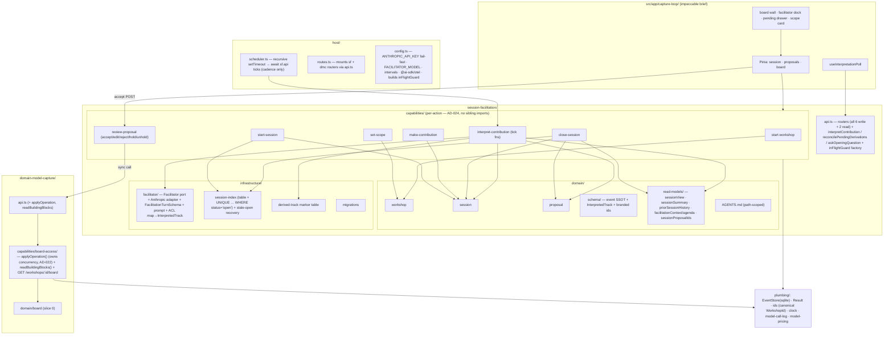

# Slice 1 — The Capture Loop · Design

**Spec:** `.specs/features/slice-1-capture-loop/spec.md`
**Context:** `.specs/features/slice-1-capture-loop/context.md`
**Status:** Draft — revised twice. Round 1 (stress-test): T1–T5. Round 2 (4 subagent reviews —
distributed-systems, domain-modeling, code-architecture, spec-quality): the fixes below, recorded
as AD-022 (`applyOperation` owns its concurrency), AD-023 (no derived state in events), AD-024
(per-action capabilities), plus a set of feature-local corrections.

Governing: ADR-002, ADR-003, ADR-004, ADR-005, ADR-007, ADR-008, ADR-010, ADR-011.
`.specs/STATE.md` AD-001, AD-005…AD-024 (AD-017…AD-024 are this slice's).

---

## Architecture Overview

Slice 1 stands up **`session-facilitation`** (new bounded context — 3 event-sourced aggregates, a
shared `domain/`, **7 per-action capabilities**, an `infrastructure/` layer), a **`board-access`**
capability in `domain-model-capture`, a thin **`host/` scheduler** + config, a `plumbing/`
model-call log, and the **capture screen**.



### Data flow — one contribution (crash-consistent, AD-021)

1. `POST /sessions/:id/contributions` → `Session.decide(Make Contribution)` (trim; reject empty
   pre-`decide`; length-bound 10 000; reject if `CLOSED`) → append `Contribution Made` →
   **`202 { contributionId }`**.
2. `scheduler` awaits `sf.api.interpretContribution(deps)`:
   - Select one eligible `(sessionId, contributionId)` — oldest un-interpreted `Contribution Made`
     **by `Session` stream position** (a stable total order — not `at`), open session, not in the
     injected in-flight guard. Mark in-flight.
   - Assemble `FacilitationTurnInput` (`facilitationContext` + `readBuildingBlocks` + segment).
   - `await facilitator.interpret(input)`.
3. **Success → one commit point.** The adapter maps its Anthropic-shaped output → `InterpretedTrack[]`
   (an anticorruption step) and mints a `proposalId` per proposal-worthy track, a `questionId` per
   `flag-phase` track, and — when `nextMove.move === 'ask'` — a `questionId` for the follow-up
   question. `Session.decide(Interpret Contribution)` appends **one** `Contribution Interpreted
   { contributionId, tracks: InterpretedTrack[], askQuestionId?, at }`. This is the interpret-once
   ledger entry **and** the source of truth for step 4. Clear the in-flight guard.
4. **Derivation** (`deriveTracks`, idempotent, no model call) — for each track **not yet marked in
   `derived_track`**:
   - `propose-building-block` → `Proposal.decide(Propose Building Block)` → append
     `Building Block Proposed` to `(session-facilitation, proposal, <proposalId>)` with
     `expectedPosition: -1`; a `stale-position` result = already born = treat as done. Mark
     `derived_track(contributionId, trackIndex)`.
   - `flag-phase` → `Session.decide(Ask Question)` append `Question Asked {kind:'phase', questionId}`.
   - `attribute-to-other-format` → `Contribution Attributed To Another Format`.
   - `answer-question` → `Session.decide(Answer Question, {questionId})` — **the decider rejects an
     unknown/closed question id** (domain rule, not a capability `if`); a rejection is logged, the
     track is marked done, nothing else happens.
   - plus, once per `Contribution Interpreted` with `askQuestionId`: `Session.decide(Ask Question)`
     append `Question Asked {kind:'free', questionId: askQuestionId, text: nextMove.questionText}`.
5. **`reconcilePendingDerivations`** — every scheduler cycle, for each open session, re-run step 4
   over any `Contribution Interpreted` track with **no `derived_track` row**. Bounded to open
   sessions + unmarked tracks (O(pending)). Repairs a crash between the ledger append and a
   derived append with no model call, no lost proposal.
6. **Provider-down** → no `Contribution Interpreted`; retried next cycle, no cap.
   **Schema-invalid** (after the adapter's one retry) → append **`Contribution Interpretation
   Failed { contributionId, reason }`** (a distinct event — not a flag on `Contribution
   Interpreted`); counts toward the interpret-once ledger; nothing derived.
7. **Model-call at-most-once has a known window:** a crash *after* `facilitator.interpret` returns
   but *before* the `Contribution Interpreted` append → on restart the contribution is re-selected
   and the model is called again (a second billable call, possibly different proposals).
   **Accepted for v1** (single-user, ~$0.005–0.5, non-deterministic result is not a correctness
   bug — no proposal is applied without a human accept). Mitigation deferred: pass Anthropic's
   request idempotency key (keyed on `contributionId`) if the SDK surfaces it — a Slice-6 hardening
   note.

### Data flow — the opening scope question (dock turn, not a screen)

`POST /workshops/:id/sessions` → `startSession` handler: **recover a stale slot** (if a
`session_index` row is `open` but its session stream has no `Session Started` event → `DELETE` it),
then `sessionIndex.reserve` → `Session.decide(Start Session)` append → `INSERT session_index` (on
the unique-index violation from a genuine concurrent open → compensate: the new session stream is
orphaned-harmless, return 409) → `202 { sessionId }`.

`scheduler` awaits `sf.api.askOpeningQuestion(deps)`: find an open session with no
`Question Asked {kind:'scope'}` (or one whose scope card was rejected and not re-asked) →
`facilitator.askOpening(scopeInput)` → append `Question Asked {kind:'scope', questionId, text,
scopeStatement}` (the `scopeStatement` field is required when `kind==='scope'` — enforced by a
`.refine` on the event schema). Provider-down → retried next cycle; the composer stays usable.

Client renders the `scopeStatement` as an **accept / edit / reject card in the dock** (same
component as a proposal card; submit target `POST /workshops/:id/scope`). Accept/edit →
`setScope` handler: **precondition** `readBuildingBlocks(workshopId).length === 0` (the lock —
*not* a `decide` argument, AD-023-adjacent / domain MAJOR 1); if non-empty → 409 (systemic),
`scope` unchanged. Then `Workshop.decide(Set Scope, {statement})` (validates non-empty, ≤ 10 000)
→ append `Scope Set` (repeatable at the aggregate level; the handler is the gate). Reject → the
card clears; `askOpeningQuestion` re-asks next cycle.

### Data flow — accept (synchronous; ADR-007 / AD-016 / AD-017 / AD-022)

`POST /proposals/:id/accept` →
1. `Proposal.decide(Accept Proposal)` — from `PROPOSED`/`EDITED`/`APPLY_FAILED`. **Mints the
   `BuildingBlockId` here, once, and puts it in the event:** `Proposal Accepted { proposalId,
   accepter, buildingBlockId, at }`. Already `ACCEPTED` → `ok([])` and **skip to step 3 with the
   stored id**. Already `APPLIED` → `ok([])`, return the stored outcome (full idempotency).
2. Build the `Operation` from the proposal payload + the **stored** `buildingBlockId` + `v:1` +
   `author:{proposer:'facilitator', accepter: creatorName}`; `.parse` against the SSOT.
3. `domainModelCapture.applyOperation(workshopId, operation)` — **no `expectedPosition`** (AD-022):
   it reads the current board position, `decide`s, appends, retries internally on `stale-position`.
   Returns `{ resultingBuildingBlockId, nextPosition }` or a merits `Rejection`
   (`duplicate-id` on a re-accept-after-apply = the idempotency signal → treat as applied;
   `unknown-target`/cycle → genuine `APPLY_FAILED`).
4. `Proposal.decide(Record Operation Applied | Record Operation Rejected)` → append.
5. `200 { boardPosition, proposal }` → client refetches `board` + `proposals`.

The two contexts never share a SQLite transaction (AD-016). Crash between step 3's commit and
step 4's append: the operation is applied, the `Proposal` reads `ACCEPTED` with a stored
`buildingBlockId`; a re-accept hits `duplicate-id` → recorded as applied. (The `OperationId`
correlation for the fully general case is still Slice 2 per AD-016 — but the stored-id path
already covers the accept-retry case, closing round-2 distsys B1.)

### Data flow — close (idempotent + self-healing)

`POST /sessions/:id/close` → `closeSession` handler, **every step run unconditionally** (each
idempotent), whether the session is `OPEN` or already `CLOSED`:
1. `Session.decide(Close Session)` → append `Session Closed { unresolvedQuestionIds, closedAt }`
   (raw facts only — **no summary struct**, AD-023). `ok([])` on an already-closed session is fine.
2. `sessionIndex.close(workshopId, sessionId)` — UPDATE → `closed`.
3. For each `proposalId` in `sessionProposalIds(sessionEvents)` whose `Proposal` is non-terminal:
   `Proposal.decide(Lapse Proposal, {cause})` → append (`PROPOSED`/`EDITED`/parked → `undisposed`;
   `APPLY_FAILED` → `apply-failed`, **no hot spot this slice**); `ACCEPTED` in-flight left alone.
   `decide` on a terminal proposal → `ok([])` → skip append.

`reconcilePendingDerivations` also sweeps for **`Session Closed` present but `session_index` still
`open`** → re-run steps 2–3. A crash mid-close self-heals within a cycle.

---

## Approach exploration — confirmed

| Axis | Chosen | AD / source |
|---|---|---|
| Client transport | short-poll | AD-018 |
| Event bus | defer to Slice 4 | AD-019 |
| `Hold` | `Proposal Held`/`Unheld` events (UL term "Hold") | AD-020 |
| Accept handler slice | Slice 1 | AD-017 |
| Multi-append safety | commit-point + idempotent derivation + bounded reconcile | AD-021 |
| `applyOperation` concurrency | handler owns it, no `expectedPosition` | AD-022 (round 2) |
| Derived state in events | never — read-time projection | AD-023 (round 2) |
| Capability granularity | per-action (7 caps), not one `capture-loop` | AD-024 (round 2) |
| Scope UI | first facilitator dock turn, F05 card | feature-local; flag #63 |
| Session summary | pure `sessionSummary(...)` projection | AD-023 |
| Op-log-in-log-order prompt caching | deferred — feed `readBuildingBlocks` | feature-local (T5b) |

---

## Code Reuse Analysis

### Existing components to leverage

| Component | Location | How to use |
|---|---|---|
| `EventStore` port + sqlite adapter + in-memory impl + shared contract test | `src/plumbing/event-store/` | New streams `(session-facilitation, {workshop\|session\|proposal}, id)`. **No new store type.** Add a contract-test case: `append(stream, -1, ops)` on an **existing** stream → `stale-position`, nothing written; and `append(stream, pos, [])` (empty batch) → the adapter throws (`sqlite-adapter.ts:74`) — so every idempotent-`decide` caller must **skip the append when `decide` returns `ok([])`** (explicit rule in every handler). |
| `Result` / `ok` / `err` | `src/plumbing/result.ts` | Every `decide` and handler. |
| Branded ids (`z.$brand` + `plumbing/ids.ts` mirror) | `src/plumbing/ids.ts`, `*/domain/schema/ids.ts` | **`WorkshopId` is promoted to canonical in `plumbing/ids.ts`** (it spans both contexts — an id brand is plumbing, code-architecture #3) and `domain-model-capture/domain/schema/ids.ts` is refactored to re-export it; `SessionId`, `ContributionId`, `ProposalId`, `QuestionId` are **`session-facilitation`-only**, defined in its own `schema/ids.ts` with the Slice-0 brand pattern (schema brand + `plumbing/ids.ts` type mirror). Check `domain-model-capture/api.ts`'s existing `SessionId` export — if unused, drop it (knip). |
| `Operation` SSOT + `decide`/`evolve`/`replay`/`replayWriteModel`/`project` | `src/domain-model-capture/` via `api.ts` | `board-access` calls `decide`; the facilitator schema is hand-written from knowledge of the SSOT (AD-015). |
| `anthropicOperationSchema` sensor | `domain-model-capture/domain/anthropic-contract.ts` | Left as the compile-time sensor (AD-010) — not the runtime facilitator schema. |
| `scripts/spike-structured-output.ts` + `research/research-aisdk.md` | `scripts/`, `research/` | Reference for the AI SDK call shape and the two AD-015 limits. |
| Hono app + `routes.ts` | `src/host/` | Each capability exports a **chained** router; `routes.ts` mounts via `api.ts` only. |
| Vitest `projects` (node / jsdom) + `fast-check` | `vite.config.ts` | `session-facilitation/domain` → node; `src/app` → jsdom; `Proposal` machine properties. |
| `domain-model-capture/domain/AGENTS.md` | — | Mirror it: add `session-facilitation/domain/AGENTS.md` (framework-free rule + this context's invariants). |

### Integration points — unchanged from round 1 except `readBuildingBlocks` replaces `readBoard`
(`data-boundaries.md`: publish the derived fact the consumer needs, not the internal `BoardSnapshot`
shape). `readBuildingBlocks(workshopId) → { id, kind, label }[]` serves both the facilitator prompt
and the scope-lock precondition (`.length === 0`).

---

## Components

### `session-facilitation/domain/workshop/` (1)
- `Workshop` write model: **`{ format: 'big-picture', creatorName }`** — nothing else (domain
  MAJOR 1; the scope lock is a handler precondition, "has scope been set" is read-model).
- `decide` for `Start Workshop` (name 1–80, non-blank), `Set Scope` (`{statement}` — non-empty,
  ≤ 10 000; no cross-context arg; repeatable). `evolve`. Emits `Workshop Started`, `Scope Set`.

### `session-facilitation/domain/session/` (2)
- `Session` — `OPEN → CLOSED` (terminal); `Map<QuestionId, Open|Resolved>`; interpret-once ledger
  `Set<ContributionId>` (keyed on the fact's stable id — modeling-uncertainty).
- `decide` for `Make Contribution` (reject if `CLOSED`; trimmed non-empty; ≤ 10 000), `Ask
  Question`, `Answer Question` (**rejects an unknown or `Resolved` `questionId`** — domain rule,
  round-2 domain MAJOR/MINOR 4), `Interpret Contribution` (second call for a seen `contributionId`
  → `ok([])`), `Fail Interpretation` (→ `Contribution Interpretation Failed`; also ledgered),
  `Close Session`. `evolve`.
- `Close Session` emits `Session Closed { unresolvedQuestionIds, closedAt }` — **raw facts only**
  (AD-023). A second `Close Session` on a `CLOSED` session → `ok([])` (idempotent, not a rejection).
- **Events:** `Session Started`, `Contribution Made` (`{contributionId, speaker, body,
  source:'typed', at}`), `Contribution Interpreted` (`{contributionId, tracks: InterpretedTrack[],
  askQuestionId?, at}`), `Contribution Interpretation Failed` (`{contributionId, reason, at}`),
  `Question Asked` (`{questionId, kind:'scope'|'phase'|'free', text, scopeStatement?, at}` —
  `.refine`: `scopeStatement` present ⟺ `kind==='scope'`), `Question Answered` (`{questionId,
  byContributionId, at}`), `Contribution Attributed To Another Format` (`{contributionId, format,
  note, at}`), `Session Closed`.

### `session-facilitation/domain/proposal/` (3)
- `Proposal` — disposition `PROPOSED ⇄ EDITED → ACCEPTED → APPLIED|APPLY_FAILED`; `REJECTED`
  terminal; `APPLY_FAILED` re-editable/re-acceptable; a reversible **held** marker orthogonal to
  disposition (AD-020 — the UL verb is **"Hold"**, so the events are **`Proposal Held` /
  `Proposal Unheld`**; canvas gets the term in the Slice-6 reconciliation).
- `decide` for `Propose Building Block` (birth — `{proposalId, sessionId, contributionId,
  blockKind, label, bar, evidenceSpan?}` — **no `overflow` field**; "index > 7 among this
  contribution's proposals" is a read-model computation), `Edit Proposal` (label ≤ 200),
  `Accept Proposal` (mints + carries `buildingBlockId`; idempotent while `ACCEPTED`/`APPLIED`),
  `Reject Proposal`, `Hold Proposal`, `Unhold Proposal`, `Record Operation Applied`,
  `Record Operation Rejected`, `Lapse Proposal` (`{cause}` — `ok([])` on a terminal proposal).
  `evolve`. `fast-check` properties for machine legality.
- **Events:** `Building Block Proposed`, `Proposal Edited`, `Proposal Accepted
  {..., buildingBlockId}`, `Proposal Rejected`, `Proposal Held`, `Proposal Unheld`, `Operation
  Applied`, `Operation Rejected`, `Proposal Lapsed`.

### `session-facilitation/domain/schema/` (4)
- The per-aggregate event SSOTs (`v: z.literal(1)`), the branded ids, and **`InterpretedTrack`**
  (the *stored* discriminated union — `propose-building-block` `{track, proposalId, blockKind,
  label, bar, evidenceSpan?}`, `flag-phase` `{track, questionId, questionText}`,
  `attribute-to-other-format` `{track, format, note}`, `answer-question` `{track, questionId}`).
  Framework-free. The adapter's Anthropic-shaped `FacilitationTurnSchema` lives in
  `infrastructure/` and **maps** to this (round-2 arch M3).

### `session-facilitation/domain/read-models/` (5) — pure, no I/O
- `sessionView(sessionEvents)` — interleaved transcript turns, open questions, scope status
  (`none`/`proposed`/`set`), per-contribution interpretation status
  (`pending`/`interpreting`/`interpreted`/`derived`/`failed`) — **includes a "fully derived"
  sub-state** so the client poll can stop correctly (round-2 distsys M1). Backs `GET
  /workshops/:id/session`.
- `sessionProposalIds(sessionEvents): ProposalId[]` — a fold over `Contribution Interpreted`
  tracks (round-2 arch M4). Used by `close-session` and `reconcile`.
- `sessionSummary(sessionEvents, appliedOpsForThisSession)` — **read-time** `{ blocksAdded,
  questionsAsked, questionsAnswered, questionsUnresolved, contributionCount, recentTurns:
  string[] }`. `blocksAdded` = count of `Operation Applied` on this session's `Proposal` streams
  (operations carry no `sessionId` — round-2 domain MAJOR 3). `recentTurns` = last **8**.
- `priorSessionHistory(workshopId, deps)` — read `session_index` for `closed` session ids, then
  each closed stream, then `sessionSummary` per stream, oldest first.
- `facilitationContext({ recentTranscript, openQuestions, scopeStatement, priorSummaries,
  buildingBlocks })` + `facilitationAgenda(...)` — the latter derived: open questions ∪
  blocks that look like unexpanded phase names. **No "stakeholder-check pending"** — that is F09 /
  Slice 4 (round-2 spec M5). One assembled `facilitationContext` per interpretation tick,
  not persisted (#66).

### `session-facilitation/infrastructure/facilitator/` (6)
- `Facilitator` port: `interpret(input): Promise<Result<FacilitationTurn, FacilitatorFailure>>`,
  `askOpening(input): Promise<Result<{ questionText, scopeStatement }, FacilitatorFailure>>`.
  `FacilitatorFailure = {kind:'provider-down'} | {kind:'schema-invalid', detail}`.
- Adapter: `generateText` + `Output.object(FacilitationTurnSchema)`; `instructions`; `outputFormat`;
  `effort:'low'`; no `temperature`; logs `result.warnings`; one `model-call-log` line per call.
  Ladder `claude-sonnet-5` → (~2× backoff) `claude-sonnet-5` → `claude-haiku-4-5` once. **One
  schema-retry total** across the ladder (not per step — round-2 distsys m4), then `schema-invalid`.
  Classify 5xx/timeout/transport → `provider-down`.
- `FacilitationTurnSchema` (AD-015): `Output.object({ interpretation:
  z.array(Track).max(12), nextMove })`. **`.max(12)` is a hard ceiling on proposals-per-turn**
  (round-2 spec M1 — issue #38 AC14), mirrored into `.describe()`. `label` `.max(200)`. `Track`
  fields as round 1; **no `z.unknown()`; ≤ 24 optionals** (a test counts them + asserts no empty
  `z.toJSONSchema` subschema). The adapter **maps** `Track` → `InterpretedTrack` and mints ids.
- `prompt.ts` — `instructions` (role + asymmetric bar + Big-Picture legend + phase rule + move
  menu + output-contract prose + **5–6 few-shot examples in the *library-lending* domain**) +
  session block (`scopeStatement`, format, prior summaries) + **the `readBuildingBlocks` list**
  (op-log-in-log-order caching deferred, T5b) + `facilitationContext`/`agenda` + the new segment.
- Infrastructure — imports `ai`; depcruise-clean here.

### `session-facilitation/infrastructure/session-index.ts` (7)
- Table `session_index(workshop_id, session_id PK, status CHECK IN ('open','closed'), started_at,
  closed_at)` + `CREATE UNIQUE INDEX ... ON session_index(workshop_id) WHERE status='open'`.
- `reserve(workshopId, sessionId)`, `close(workshopId, sessionId)`,
  `sessionIdsFor(workshopId): { open?: SessionId, closed: SessionId[] }`,
  `staleOpenRow(workshopId): SessionId | undefined` (an `open` row whose session stream lacks a
  `Session Started` event — round-2 distsys M2). The `startSession` handler calls `staleOpenRow`
  → `DELETE` before `reserve`.

### `session-facilitation/infrastructure/` — also (8)
- `derived-track` marker table `derived_track(contribution_id, track_index, PRIMARY KEY(...))` —
  presence = derived; `deriveTracks` inserts after a successful derive; `reconcile` skips marked
  tracks (AD-021 round-2 bound).
- `migrations.ts` — extends the Slice-0 migration set with `session_index` + `derived_track`.

### `session-facilitation/capabilities/` (9) — per-action (AD-024)
- **`start-workshop/`** — `POST /workshops` → `Workshop.decide(Start Workshop)`; nanoid slug id.
- **`set-scope/`** — `POST /workshops/:id/scope` → `readBuildingBlocks().length === 0` gate →
  `Workshop.decide(Set Scope)`.
- **`start-session/`** — `POST /workshops/:id/sessions` → stale-slot recovery → `reserve` →
  `Session.decide(Start Session)` → `INSERT session_index` → compensate on race.
- **`make-contribution/`** — `POST /sessions/:id/contributions` → `Session.decide(Make
  Contribution)` → `202`.
- **`review-proposal/`** — `POST /proposals/:id/{accept,edit,reject,hold,unhold}`. Accept runs the
  synchronous cross-context chain (the only handler touching two contexts).
- **`close-session/`** — `POST /sessions/:id/close` → the idempotent 3-step close.
- **`interpret-contribution/`** — no routes. Exports `interpretContribution(deps)`,
  `reconcilePendingDerivations(deps)`, `askOpeningQuestion(deps)` — each does **one unit of work
  and returns** (round-2 arch m1: named for the action, not "tick"). Holds `deriveTracks`.
- **Reads** — `GET /workshops/:id/session` (from `sessionView`), `GET /sessions/:id/proposals`
  (pending + terminal proposals of the session, disposition + `APPLY_FAILED` reason + held flag +
  the "index > 7" overflow grouping). Live in `make-contribution` / `review-proposal` routers
  respectively, or a tiny `read-session` capability — implementer's call, one router each.
- Handlers are thin (AD-009). Systemic `Rejection` → 4xx typed body; transient `stale-position` →
  reload / re-decide / re-append once → 409. **Every handler skips the append when `decide`
  returns `ok([])`** (round-2 distsys m3).
- **No capability imports a sibling** — shared code is in `domain/` or `infrastructure/`.

### `domain-model-capture/capabilities/board-access/` (10)
- Exported via `domain-model-capture/api.ts`:
  - `applyOperation(deps, workshopId, operation: Operation): Result<{ resultingBuildingBlockId,
    nextPosition }, Rejection>` — **no `expectedPosition`** (AD-022): read current pos → `decide`
    → `append`, bounded internal retry on `stale-position`.
  - `readBuildingBlocks(deps, workshopId): { id, kind, label }[]` — `replay` + `project`, then
    project to the minimal shape (round-2 arch m3).
- Route: `GET /workshops/:id/board` (chained router) — returns the full `BoardSnapshot` for the
  client `board` store (the client renders the wall; the *facilitator* gets the minimal list).
- No import of `session-facilitation`.

### `host/` (11)
- **`scheduler.ts`** — recursive `setTimeout` (not `setInterval`); each cycle **`await`s in
  sequence** `sf.api.askOpeningQuestion`, `interpretContribution`, `reconcilePendingDerivations`,
  each wrapped so a throw is logged and the loop continues. Default 750 ms. Started by
  `host/index.ts`; not started in tests. **Contains no business logic** (ordering three awaited
  calls is mechanical; the in-flight guard is injected, not owned here).
- **`config.ts`** — `ANTHROPIC_API_KEY` (**fail fast** on `pnpm dev` when unset), `FACILITATOR_MODEL`
  (default `claude-sonnet-5`), `INTERPRETATION_INTERVAL_MS`, `DATA_DIR`. Register `@ai-sdk/otel`.
  Build the **in-flight guard** (`Map<SessionId, ContributionId>` behind a small interface) and
  inject it into `interpret-contribution`. Wire `EventStore`, `Clock`, `Facilitator` adapter,
  mount routers, start the scheduler.
- Test mode: inject the scripted `Facilitator` double + a fresh in-flight guard; call the api
  functions directly; no key, no timers.

### `plumbing/model-call-log.ts` + `plumbing/model-pricing.ts` (12)
- One JSON line per call → `./data/model-calls.jsonl` (gitignored): `{ at, model,
  requestMessages, responseText, parseResult, warnings, usage:{inputTokens, outputTokens,
  cacheReadTokens}, costEstimateUsd }`. Cost = tokens × the pricing table.

### `src/app/capture-loop/` (13)
- **Shape (impeccable brief):** full-screen board wall (framework-free renderer, **backlog area
  only** — ADR-006, Vue Flow is Slice 3); floating dock (→ `Facilitator · n` pill, with a
  **parked dot** if anything is held); in-dock pending drawer (`Parked by you` / `Awaiting
  review`, `Accept all remaining`); inline proposal cards welded to the facilitator turn (Accept
  / Edit / Reject / Hold, `Accept all` per cluster); card-to-sticky flight + transcript receipt;
  quiet "catching up" state; facilitator questions render as **messages, not error states**;
  **pending proposals never render as board ghosts** (Slice-1 constraint — the dashed-ghost is
  reword-only, Slice 2). Empty first-run state per brief §5.
- **Scope (round-1 T2):** first dock turn = the scope statement as an accept / edit / reject card
  (same component as a proposal card; submit `POST /workshops/:id/scope`). No separate screen.
  `session` store exposes `scope: {status, proposedStatement?}`. Pre-`askOpeningQuestion` state
  (session started, question not yet asked) → the dock shows a quiet "getting started" placeholder.
- **Stores (Pinia, each one cold GET — ADR-007):** `session`, `proposals`, `board`. No store
  imports another.
- **`useInterpretationPoll`:** poll `session` + `proposals` every ~1 s while **any contribution
  is `interpreting` OR `interpreted`-but-not-`derived`** OR the scope is unset with an open
  session; stop otherwise (round-2 distsys M1). Refetch after every POST. `board` refetches only
  after an accept resolves.
- **No optimistic board updates.** WCAG 2.2 AA; `prefers-reduced-motion`; below ~1024 px the dock
  becomes a bottom sheet, the wall stays.
- Workshop-creation is a minimal name field; "start session" a button — flagged as candidate
  `impeccable` micro-surfaces, kept trivial in the locked visual world, not hand-designed screens.

---

## Data Models

### `session-facilitation` event SSOT (`domain/schema/`)

`v: z.literal(1)` on every event. `at` from the `Clock`. `accepter`/`author` = `creatorName`.

```
WorkshopStarted  { v:1, workshopId, format:'big-picture', creatorName, at }
ScopeSet         { v:1, workshopId, statement, at }
SessionStarted   { v:1, sessionId, workshopId, at }
ContributionMade { v:1, sessionId, contributionId, speaker, body, source:'typed', at }
ContributionInterpreted       { v:1, sessionId, contributionId, tracks: InterpretedTrack[], askQuestionId?, at }
ContributionInterpretationFailed { v:1, sessionId, contributionId, reason, at }
QuestionAsked    { v:1, sessionId, questionId, kind:'scope'|'phase'|'free', text, scopeStatement?, at }   // refine: scopeStatement ⟺ scope
QuestionAnswered { v:1, sessionId, questionId, byContributionId, at }
ContributionAttributedToAnotherFormat { v:1, sessionId, contributionId, format, note, at }
SessionClosed    { v:1, sessionId, workshopId, unresolvedQuestionIds: QuestionId[], closedAt }           // no summary — AD-023
BuildingBlockProposed { v:1, proposalId, sessionId, contributionId, blockKind, label, bar, evidenceSpan?, at }
ProposalEdited   { v:1, proposalId, label, at }
ProposalAccepted { v:1, proposalId, accepter, buildingBlockId, at }                                      // id minted here — distsys B1
ProposalRejected { v:1, proposalId, at }
ProposalHeld / ProposalUnheld { v:1, proposalId, at }
OperationApplied { v:1, proposalId, resultingBuildingBlockId, at }
OperationRejected{ v:1, proposalId, reason, at }
ProposalLapsed   { v:1, proposalId, cause:'undisposed'|'apply-failed', at }
```

### Non-event tables (`session-facilitation/infrastructure/`)

- `session_index(workshop_id, session_id PK, status, started_at, closed_at)` +
  `UNIQUE(workshop_id) WHERE status='open'`.
- `derived_track(contribution_id, track_index, PRIMARY KEY(contribution_id, track_index))`.

### The re-inflated operation (accept path)

`{ blockKind, label }` + the **stored** `buildingBlockId` (from `Proposal Accepted`) + `v:1` +
`author:{proposer:'facilitator', accepter:creatorName}` → parsed against the SSOT as
`capture-domain-event | identify-actor | identify-system`. **First task verifies**
`domain/schema/author.ts` accepts plain strings for `proposer`/`accepter`.

---

## Error Handling Strategy

| Scenario | Handling | User impact |
|---|---|---|
| Empty / whitespace contribution | trimmed, rejected before `decide` | inline "nothing to send" |
| Over-length contribution/scope; blank/>80 name; >12 tracks in a turn; >200-char label | `decide` / schema rejects (`systemic`) | inline error; the turn's overflow tracks past 12 are dropped by the schema |
| `Make Contribution` on `CLOSED` session | `decide` → `systemic` → 409 | "session is closed — start a new one" |
| Second `Start Session` while one genuinely open | `reserve` → unique violation → 409 | "a session is already open" |
| Stale `open` row from a crash | `startSession` detects (`staleOpenRow`) → `DELETE` → proceed | transparent |
| Provider down | ladder → `provider-down`; the tick retries every cycle, no cap | quiet "catching up"; composer usable; nothing lost |
| Schema-invalid (after one retry) | append `Contribution Interpretation Failed` | inline "didn't catch that — rephrase as a new contribution"; **no hot spot** |
| Crash between `Contribution Interpreted` and a derived append | `reconcilePendingDerivations` re-runs `deriveTracks` (unmarked tracks only) next cycle | proposals appear a cycle later; invisible |
| Crash after `facilitator.interpret` returns, before the ledger append | contribution re-selected → **second model call** | accepted for v1; ~cents; not a correctness bug |
| `answer-question` names an unknown/resolved `questionId` | `Session.decide(Answer Question)` rejects; logged; track marked done | no `Question Answered`; other tracks unaffected |
| Two accepts race the board stream | `applyOperation` retries `stale-position` internally (AD-022) | both apply; no `APPLY_FAILED` |
| Accept retried / double-clicked | `Proposal.decide(Accept)` idempotent; stored `buildingBlockId` reused; `duplicate-id` from the board = "already applied" | second click is a no-op; **one** sticky |
| `Operation Rejected` (unknown target / cycle) | `Proposal` → `APPLY_FAILED {reason}` | card shows reason + Edit / Re-accept / Reject |
| Crash mid-close | every close step is idempotent + `reconcile` sweeps "closed event, index still open" | self-heals within a cycle |
| `decide` → `ok([])` | handler skips `EventStore.append` (never calls it with `[]`) | transparent |
| Scheduler tick throws | logged, loop continues | none visible |
| Missing `ANTHROPIC_API_KEY` at `pnpm dev` | `config.ts` throws with a fix message before binding | clear startup error |

---

## Risks & Concerns

| Concern | Location | Impact | Mitigation |
|---|---|---|---|
| `domain-model-capture/api.ts` grows a write export (`applyOperation`) | `api.ts` | the sync-cross-context-command smell | Accepted (AD-016/ADR-002); `api.ts` makes it *visible* (integration.md prefers named coupling). depcruise `cross-context-only-via-api` re-verified by a planted import. |
| First context with ≥ 2 capabilities → `no-cross-slice-imports` never actually caught a violation | `.dependency-cruiser.cjs` | rule could be misconfigured | Re-verify by a planted `set-scope` → `make-contribution` import. Also re-verify `host-imports-only-context-api` (new `host/scheduler.ts`), `domain-imports-nothing-above` (new `sf/domain/`), `ui-does-not-import-server-code` (new `src/app/capture-loop/`). |
| `WorkshopId` brand promotion touches Slice 0 | `plumbing/ids.ts`, `domain-model-capture/domain/schema/ids.ts` + `api.ts` | small refactor, could ripple | One task, its own commit; `pnpm check` is the gate; the brand literal is unchanged so inference is stable. |
| stored `InterpretedTrack` vs adapter `FacilitationTurnSchema` drift | `domain/schema/` vs `infrastructure/facilitator/` | model output shape and stored shape diverge silently | The adapter's map function is the single seam; a test feeds a canned `FacilitationTurn` and asserts the `InterpretedTrack[]` + minted ids. |
| `reconcilePendingDerivations` still scans open sessions every cycle | `interpret-contribution` | wasted reads as a session grows | Bounded to open sessions + `derived_track`-unmarked tracks (AD-021 round-2). Named honestly as a periodic reconciliation (the bus is deferred, AD-019). |
| model-call at-most-once window (crash between the call return and the ledger append) | data flow step 7 | a second billable call, divergent proposals | Accepted for v1 (single-user, cents, no proposal auto-applies). Anthropic idempotency key keyed on `contributionId` → Slice-6 hardening note. |
| Slice 0's concurrent-append AC only exercised sequentially | `plumbing/event-store/` | `applyOperation`'s internal retry + `expectedPosition:-1` births rely on real optimistic concurrency | Add: an EventStore contract-test case for `append(stream,-1,ops)` on an existing stream and for an empty batch; a genuine two-accepts-race test at the accept seam (in `domain-model-capture`). |
| `resolve` op's `z.unknown()` + 20 union optionals (AD-015) | `operations.ts` | 400s if the facilitator schema touched them | Hand-shaped schema — 3 kinds, `v`/`author`/`id` dropped, no `z.unknown()`; tests: optional count ≤ 24, no empty `z.toJSONSchema` subschema. |
| Facilitator *judgment* quality is non-deterministic | — | S1-21/22/24 can't be unit-verified | Tested at the **translation layer** (`InterpretedTrack` → domain events) against the scripted double; **real-model quality is the Slice-5 eval** — marked in the traceability table. |
| Scope-in-dock diverges from brief §5 | — | brief-writer pictured a separate step | Flag `open-questions.md` #63 **this slice** (S1-51a); toward fewer surfaces, matches S1-08/S1-11. |
| "model editable by hand during an outage" (issue #38 AC15) not fully met | spec | over-claim risk on F04 | **Partially met**: the composer stays open, interpretation is queued + retried, nothing typed is lost. **Direct model edits (reword/withdraw) are Slice 2.** Stated in the spec + traceability. |
| `ai`/`@ai-sdk/anthropic`/`@ai-sdk/otel` devDep→dep + `markdown-it`/`DOMPurify`/`reka-ui` not yet installed | `package.json` | knip/depcruise noise | Install each at its verified pin in the task that first uses it. |

---

## Tech Decisions (feature-local; project-level are AD-017…AD-024)

| Decision | Choice | Rationale |
|---|---|---|
| `answer-question` validity | `Session.decide(Answer Question)` rejects unknown/resolved ids | domain rule, G/W/T-testable, not a capability `if` (round-2 domain 4). |
| `nextMove` question | `deriveTracks` emits `Question Asked {kind:'free'}` with a `questionId` minted into `Contribution Interpreted` | otherwise the follow-up question has no lifecycle — unanswerable, invisible to close (round-2 distsys M5). |
| `interpretationFailed` | a distinct `Contribution Interpretation Failed` event, not a flag | two facts in one event otherwise; cleaner `evolve`, cleaner Slice-5 failure counts (round-2 domain 6). |
| in-flight guard | injected into `interpret-contribution` from `host/`, behind a small interface | testability (drive the fns directly, no cross-test pollution — round-2 arch M5). |
| `reconcile` frequency + bound | every cycle, open sessions × `derived_track`-unmarked tracks | the safety net has to run without a triggering event; the marker table keeps it O(pending). |
| session summary | pure `sessionSummary(...)`, read-time, `blocksAdded` from `Operation Applied` counts | AD-023; operations carry no `sessionId`. |
| scope lock | `set-scope` handler precondition (`readBuildingBlocks().length===0`), not a `decide` arg | domain MAJOR 1 — a true invariant never delegates its data. |
| capability granularity | 7 per-action capabilities | AD-024 / ADR-010's own naming. |
| few-shot domain | library lending | ADR-005 — disjoint from the eval fixture. |
| FIFO key | `Session` stream position | stable total order; `at` is not monotonic in tests. |
| `WorkshopId` home | canonical in `plumbing/ids.ts` | spans both contexts → plumbing (code-architecture #3). |
| `readBuildingBlocks` not `readBoard` for the facilitator | minimal `{id,kind,label}[]` | data-boundaries: publish the fact, not the internal snapshot. |

---

## Test Coverage Matrix

| Layer | What | How | Spec IDs |
|---|---|---|---|
| `workshop` decider | format fixed; name bounds; `Set Scope` validates statement + is repeatable (no lock arg) | G/W/T | S1-01, S1-02, S1-09 |
| `set-scope` handler | lock precondition — 0 blocks → accept & replace; ≥ 1 block → 409, scope unchanged | integration over in-memory store + `readBuildingBlocks` stub | S1-10 |
| `session` decider | make-contribution open/closed; empty rejected pre-decide; length bound; interpret-once idempotent; **`Answer Question` rejects unknown/resolved id**; `Close Session` idempotent, carries only raw facts | G/W/T | S1-12…S1-15, S1-26, S1-59, S1-06, S1-60 |
| `proposal` decider | disposition machine; edit/hold/accept after terminal rejected; **accept mints + stores `buildingBlockId`, idempotent while ACCEPTED/APPLIED**; hold/unhold reversible; lapse idempotent; label ≤ 200 | G/W/T + `fast-check` sequences | S1-38, S1-39, S1-44, S1-45, S1-47, S1-52 |
| read-models | `sessionView` interleaving + scope status + derived sub-state; `sessionProposalIds` fold; `sessionSummary` determinism (read-time, `blocksAdded` from applied-op count); `priorSessionHistory` ordering; `facilitationAgenda` (no stakeholder input) | pure-function tests | S1-35, S1-36, S1-37, S1-60 |
| adapter map (ACL) | `FacilitationTurn` → `InterpretedTrack[]` + minted ids; `.max(12)` ceiling; ≤ 24 optionals; no empty `z.toJSONSchema` subschema | canned turns; schema-shape asserts | S1-19, S1-40 |
| translation (`deriveTracks`) | each track kind → right events/proposals; multi-track turn; `bar`/`evidenceSpan` persisted; phase → `Question Asked` not proposal; deeper-format → notice, no block; `nextMove.ask` → `Question Asked {free}`; unknown `questionId` dropped; overflow (>7) grouped, not dropped | scripted `Facilitator` double | S1-20…S1-25, S1-40, S1-53, S1-59 |
| interpretation crash-consistency | kill after the ledger append (drop `deriveTracks`) → `reconcile` restores every proposal, **no** second model call; `derived_track` prevents re-derive | drive fns directly; count model calls | S1-56 |
| facilitator adapter | ladder; provider-down vs schema-invalid; **one** schema-retry total; `warnings` logged; JSONL line; token+cost recorded; **no real HTTP** | mock `generateText` at the `ai` boundary | S1-17, S1-18, S1-27, S1-28, S1-30, S1-31, S1-50 |
| interpret-contribution capability | FIFO by stream position; one in flight per session; queue rebuilt from log by a fresh instance; `askOpeningQuestion` produces the scope question, incl. after a provider-down window; poll-stop only after fully derived | drive `interpretContribution`/`askOpeningQuestion`/`reconcilePendingDerivations` directly | S1-08, S1-11, S1-14, S1-16, S1-29, S1-33, S1-58 |
| scheduler | a throwing tick doesn't stop the loop | inject a throwing fn | S1-27 |
| accept seam (cross-context) | happy apply; `APPLY_FAILED` + reason + re-accept; **two contexts never share a transaction**; two accepts race → both apply (AD-022); double-accept → one sticky (stored id) | integration test in `session-facilitation` consuming the seam | S1-41, S1-42, S1-43, S1-44, S1-46, S1-47 |
| `applyOperation` | no `expectedPosition`; internal retry on `stale-position`; only merits `Rejection` bubbles | unit in `domain-model-capture` + a genuine race test | S1-42, S1-20 |
| session-index | reserve/close; second start rejected; **stale-open recovery**; `sessionIdsFor` enumerates closed; slot freed on close | unit + capability integration | S1-04, S1-05, S1-57 |
| session lifecycle | close lapses PROPOSED/EDITED/held (quiet) + APPLY_FAILED (no hot spot); ACCEPTED in-flight survives; re-run close = no-op; **crash-mid-close self-heals**; reopen rebuilds identical model; 3rd session's `facilitationContext` carries the first two summaries | capability integration | S1-06, S1-07, S1-33, S1-37 |
| board read | `GET /workshops/:id/board` returns the snapshot; `readBuildingBlocks` minimal shape | route + unit | S1-46, S1-48 |
| workshop URL | nanoid slug; full rebuild from the log on GET | integration | S1-03, S1-07 |
| app | screen per brief; scope card in the dock (no screen); dock/drawer collapse + parked dot; card→sticky; questions as messages; no board ghosts; poll starts/stops on the derived sub-state; server-confirmed; keyboard | Vitest + jsdom; `playwright-cli` visual | S1-48, S1-49, S1-54, S1-55, S1-61 |
| config | missing key → fail fast | unit | S1-32 |
| doc obligation | `open-questions.md` #63 updated **this slice** | file assertion in the task | S1-51a |
| release | `minor` changeset; `package.json` → 0.2.0 | CI changeset-guard | S1-51b |

---

## Docs to reconcile

**This slice (S1-51a):** `docs/domain/open-questions.md` #63 — record the scope resolution
(revisable-until-first-block; scope is a dock turn, not a screen; diverges from the canvas's "set
once" and the brief's "set elsewhere").

**Slice 6 (S1-51b) — present tense, no transition narration:**
- ADR-005: drop "rides back on the … contributions response" → AD-018; note op-log caching deferred.
- ADR-007: narrow "No polling, no SSE" to the accept path.
- `session-facilitation/canvas.md`: scope "set exactly once" → "revisable until first block";
  add `Proposal Held`/`Unheld` (AD-020, UL term "Hold"); summary is a read-time projection
  (AD-023); the interpretation commit-point/reconcile shape (AD-021); `Contribution Interpretation
  Failed` as a distinct event.
- AD-002 row: bus → Slice 4 (AD-019); "(Slice 2)" → AD-017.
- `open-questions.md` #66 — resolved: one assembled `facilitationContext` read model.
- `ARCHITECTURE.md` route table: the per-action routes + `GET .../board`; the `host/` scheduler.
- `domain-model-capture/api.ts`: check/remove the speculative `SessionId` export.
