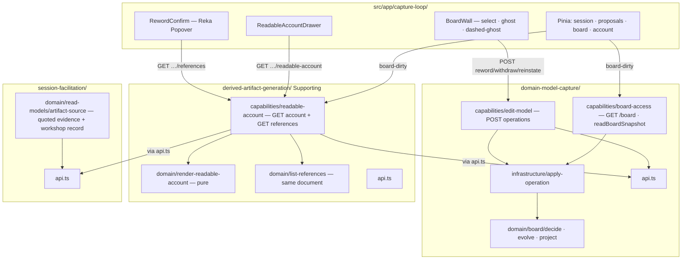

# Slice 2 — The Money Shot · Design

**Spec:** `.specs/features/slice-2-money-shot/spec.md`
**Context:** `.specs/features/slice-2-money-shot/context.md`
**Status:** Approved — Tasks written (`.specs/features/slice-2-money-shot/tasks.md`).

Governing: ADR-002, ADR-003, ADR-004, ADR-006, ADR-007, ADR-008, ADR-009, ADR-010.
`.specs/STATE.md` AD-005, AD-008, AD-009, AD-011, AD-012, AD-016, AD-017, AD-022, AD-024,
AD-026, AD-028, **AD-029**, **AD-030** (this slice).

---

## Architecture Overview

Three additions on the existing capture screen, no new route:

1. **`domain-model-capture/capabilities/edit-model`** — the F06 write: `POST
   /workshops/:id/board/operations` → `applyOperation` (sole Board writer, AD-022).
2. **`derived-artifact-generation/`** — new Supporting context, **no aggregate**. Pure
   `renderReadableAccount` + `listReferences` in `domain/`; one query slice owns both GETs.
3. **Capture-loop UI** — dashed-ghost reword, confirm popover, withdrawn ghosts, toggleable
   account drawer, 4th Pinia store.



### Data flow — reword (two-step, server-confirmed)

1. Select sticky → pencil / `E` / `Enter` → dashed-ghost editor (local UI state only).
2. ✓ / `Enter` on the ghost → `GET /api/workshops/:id/board/blocks/:blockId/references`
   → Reka **Popover** (portalled; must not clip inside the wall). No append yet.
3. Confirm popover → `POST /api/workshops/:id/board/operations` `{ kind:'reword', target,
   label, author:{ accepter:{ name: creatorName } }, v:1 }`.
4. Handler: **trim `label` first**. Empty / whitespace-only → 422 `{ error: 'empty-label', classification: 'systemic' }` **without** hitting `Operation` `min(1)` (that would be 400). Length > 10 000 → 400. Other kinds → 422 `not-implemented-in-slice`. Then `applyOperation`. Same-label reword still appends one op.
5. `200 { position }` → client emits `board-dirty` → refetch **board + account**.

Cancel (Esc / ✕ / popover dismiss) appends nothing.

### Data flow — live account

`GET /api/workshops/:id/readable-account` (DAG):

1. `readBoardSnapshot` (DMC api) — empty log → **200** empty-state document (not 404).
2. `readArtifactSource` (SF api) — workshop format/scope/creatorName + contribution
   bodies + `evidenceSpan`s.
3. `renderReadableAccount(input)` → `{ markdown, document }`.
4. Body `{ position, markdown }`. SPA: `markdown-it` → `DOMPurify.sanitize` → drawer HTML.

Same `document` feeds `listReferences(document, blockId)` for the confirm GET.

### Why the references GET is not in Capture (AD-029)

ARCHITECTURE.md lists `GET …/board/blocks/:blockId/references` under board URLs. The
**sites** this slice can name live in the readable account. If `edit-model` or
`board-access` owned that query, Core would import Supporting — forbidden (ADR-002,
Conformist arrow is Capture → DAG, never reverse).

`host/routes.ts` mounts DAG's router at that path. Slice 3/4 **extend `listReferences`**
with relation/annotation sites; they do not move the route into Capture.

---

## Approach exploration — confirmed

| Axis | Chosen | Why |
|---|---|---|
| Where references GET lives | **DAG** `readable-account` slice, ARCHITECTURE URL | AD-029. Discarded: Capture handler (inverts Core→Supporting); client-side parse of markdown (drifts from render). |
| DAG tactical depth | **Pure functions in `domain/`**, no aggregate, no `infrastructure/` | Canvas: no invariant, no state. The *computation* of rendered-ref vs quote is an invariant over derived data — one function both GETs call (`tactical-depth`). Slice 5's export is the concrete second caller. |
| Capture F06 writes | New **`edit-model`** slice; `applyOperation` lifted to `dmc/infrastructure/` | AD-024. Slices cannot import each other; `review-proposal` already calls apply via DMC `api.ts` (cross-context). Intra-context F06 uses the same infra module. |
| 4th Pinia store | **`account`** | Spec. Different GET, different lifetime. `no-cross-store-imports`. |
| Quoted evidence this slice | **`Contribution Made.body` + optional `evidenceSpan`** | No `rationale` field exists on Proposal. `evidenceSpan` is the stored verbatim substring (lenient bar). Do not add a rationale field. |
| Overlay | **Reka Popover**, portalled | `reka-ui@2.10.4` already in deps. Operate: overlays escape overflow. Not a modal (Operate: modal is last resort). |
| Markdown libs | `markdown-it` + `dompurify` in **`src/app/` only** | ADR-007. Domain emits Markdown; sanitise at the view. Pin at Execute via `pnpm view` (do not invent versions here). |
| E2E | **Extend the one Playwright spec** | ADR-008: one E2E. After the three accepts: open drawer, reword one sticky through confirm, assert account text + a quoted contribution unchanged. |

**Sole-writer placement (the intra-context cut):** today `applyOperation` lives in
`board-access/` and Slice 1's `review-proposal` already calls it via **DMC `api.ts`**
(cross-context). `edit-model` is the **same** context, so `api.ts` is the wrong seam
(it would be a slice importing a sibling through a public façade — still a sideways
dependency in spirit). Lift `applyOperation` (+ `boardStream` + the deps type it needs) to
`domain-model-capture/infrastructure/`. `board-access` HTTP and `read-building-blocks` import
those from `infrastructure/`. **`infrastructure/` must not import `capabilities/`.** `edit-model`
and `api.ts` import the infra module. `no-cross-slice-imports` stays green. This is a mechanical
move, not a behaviour change — plus the target-id fix.

---

## Code Reuse Analysis

### Existing Components to Leverage

| Component | Location | How to Use |
| --- | --- | --- |
| `decide` / `evolve` / `project` / `replay` | `src/domain-model-capture/domain/board/` | Extend `decide` for already-withdrawn / reword-withdrawn; cascades stay `[withdraw]` (AD-028). |
| `applyOperation` | `…/board-access/apply-operation.ts` | **Move** to `infrastructure/`; return `operation.target` when `id` absent. |
| `BoardAccessDeps` / `boardStream` | `…/board-access/deps.ts` | **Move** `boardStream` + apply deps to `infrastructure/`. Do **not** keep them in `board-access` for apply to import (that inverts infrastructure → capability). `readBoardSnapshot` takes `{ store }` only — do not reuse `BoardAccessDeps` (it requires unused `clock`). |
| `sessionIdsFor` / workshop stream | `session-facilitation/infrastructure/session-index.ts` + `StartSessionDeps.db` | `readArtifactSource` walks `sessionIdsFor` (open + closed). Not `start-workshop`. |
| `GET /board` serialisation | `…/board-access/http.ts` | Extract `readBoardSnapshot` (includes `withdrawn`) for DAG; GET board keeps 404 on empty stream. |
| `readBuildingBlocks` | `…/read-building-blocks.ts` | Unchanged (facilitator / scope lock). Today it **includes withdrawn blocks** and omits the `withdrawn` flag — do **not** claim it drops them, and do **not** overload it for artifacts. DAG reads `readBoardSnapshot`. Filtering withdrawn out of the facilitator prompt is out of this slice. |
| `Author` schema | `domain/schema/author.ts` | F06: `{ accepter }` only. |
| `sessionView` transcript | `session-facilitation/domain/read-models/session-view.ts` | Do **not** import from DAG. New `artifact-source.ts` folds workshop + session streams to `{ format, scope, narratorCount, quotes[] }`. |
| Pinia store shape | `stores/board.ts` | Copy the load/refetch/`HttpError` 404 pattern for `account.ts` (empty account is 200). |
| `board-dirty` | `CaptureScreen.vue` | Also `account.load`. Direct-edit POSTs emit the same event. |
| `layoutBoard` | `board/layout.ts` | Extend `BoardBlockInput` with `withdrawn`; ghosts still occupy a backlog cell (so reinstate has a target). |
| Reka Popover | `reka-ui` | Confirm list. |
| `postJson` | `dock/mutations.ts` | Add `postBoardOperation`. |
| Playwright spec | `e2e/capture-loop.spec.ts` | Append the money-shot beats; keep one test. |
| depcruise `CONTEXTS` | `.dependency-cruiser.cjs` | Already lists `derived-artifact-generation`. Plant a violation on the new `api.ts` wiring. |
| knip `src/*/api.ts` | `knip.json` | Already an entry. |

### Integration Points

| System | Integration Method |
| --- | --- |
| `host/routes.ts` | `.route('/api', editModelRoutes(io))` + `.route('/api', readableAccountRoutes({ store, db }))` via each `api.ts`. DAG needs `db` (session-index) for `readArtifactSource`; F06 does not. |
| EventStore | Same sqlite file, **separate streams**, never one transaction across DMC + SF (AD-016). F06 is one DMC append. DAG is read-only. |
| Capture-loop brief | Extend in place (drawer + confirm + withdraw affordance). Not a new surface. |

---

## Components

### `applyOperation` (moved) + target-id fix

- **Purpose**: Sole writer of the board stream.
- **Location**: `src/domain-model-capture/infrastructure/apply-operation.ts`
- **Interfaces**:
  - `applyOperation(deps, workshopId, operation): Result<ApplyResult, Rejection>`
  - `resultingBuildingBlockId` = `operation.id` if present, else `operation.target` (reword /
    withdraw / reinstate). **Never throw** on a successful decide.
- **Dependencies**: `EventStore`, `Clock`, `decide`, `replayWriteModel`.
- **Reuses**: existing retry loop.

### `edit-model` capability

- **Purpose**: Direct F06 HTTP.
- **Location**: `src/domain-model-capture/capabilities/edit-model/`
- **Interfaces**:
  - `POST /workshops/:id/board/operations` → `200 { position }` \| `400` \| `404` \| `422 { error, classification }`
- **Dependencies**: `applyOperation` (infra), `Operation` schema, creator name from body
  `author.accepter` (client supplies it; server does not look up users).
- **Reuses**: Hono chained router pattern from `board-access/http.ts`.

### Board `decide` extensions

- **Purpose**: Reject illegal F06 transitions.
- **Location**: `src/domain-model-capture/domain/board/decide.ts` + `model.ts` `Rejection`
- **New systemic rejections**:
  - `already-withdrawn` — `withdraw` of a withdrawn target
  - `withdrawn-target` — `reword` of a withdrawn target
- **Unchanged**: `reinstate` / `not-withdrawn` / `empty-label` / `unknown-target`.
- **Cascades**: still `ok([operation])` for withdraw (AD-028).

### `derived-artifact-generation` context

- **Purpose**: Deterministic projection of the model (+ session quotes) to Markdown.
- **Location**: `src/derived-artifact-generation/`
- **Layout**:
  ```
  CONTEXT.md          — skip; project marker is docs/domain/…/canvas.md (DMC/SF have none)
  api.ts
  domain/
    AGENTS.md         — same framework-free rule
    render-readable-account.ts
    list-references.ts
    model.ts          — AccountInput, AccountDocument, ReferenceSite
  capabilities/readable-account/
    http.ts           — both GETs
    deps.ts
  ```
- **Interfaces** (pure):
  ```ts
  renderReadableAccount(input: AccountInput): AccountDocument
  listReferences(document: AccountDocument, blockId: BuildingBlockId): ReferenceSite[]
  ```
- **Dependencies**: DMC `api.readBoardSnapshot`, SF `api.readArtifactSource`. Host mounts
  `readableAccountRoutes({ store, db })` — `db` is the session-index handle
  `readArtifactSource` needs. No EventStore of DAG's own. No AI SDK. DAG `domain/` imports
  `plumbing/` only — never DMC or SF `domain/`.
- **Reuses**: nothing — first files in this context.

### `readBoardSnapshot` (DMC public read)

- **Purpose**: Published snapshot for DAG (includes withdrawn, position, labels).
- **Location**: `board-access/read-board-snapshot.ts`, re-exported from `api.ts`
- **Empty stream**: `{ position: -1, blocks: [] }` — DAG turns that into the empty account.
  `GET /board` **keeps 404** (Slice 1 contract).

### `readArtifactSource` (SF public read)

- **Purpose**: Quoted evidence + coverage inputs without leaking aggregates.
- **Location**: `session-facilitation/domain/read-models/artifact-source.ts` (pure fold) +
  `session-facilitation/infrastructure/read-artifact-source.ts` (I/O). Re-exported from
  `api.ts`. **Not** a new SF slice, **not** `start-workshop`, **not** next to the domain
  fold (that would put `store.read` in `domain/`). If knip flags an unimported helper,
  export only through `api.ts`. Also re-export `type { SessionIndexDb }` from `api.ts` so
  DAG deps can type `db` without importing SF `infrastructure/`.
- **Shape**:
  ```ts
  {
    format: 'big-picture'
    scope: string | null
    narratorCount: number  // distinct speakers on Contribution Made; 0 if none
    quotes: { id: string; text: string }[]  // contribution bodies then evidenceSpans
  }
  ```

### Capture-loop UI

- **BoardWall**: selection, pencil (`aria-label="Reword"`), dashed-ghost, withdraw
  (`aria-label="Withdraw"`) / reinstate (`aria-label="Reinstate"`), ghosted withdrawn
  stickies. Props from `CaptureScreen`: `workshopId`, `accepter` (`creatorName`), `revision`
  (`board.snapshot.position`) — same parent-binding pattern as `FacilitatorDock`. Keyboard:
  focus → `E`/`Enter` reword **only if the sticky is not withdrawn**;
  on a ghost, those keys do not open dashed-ghost (Reinstate first). `Esc` cancels ghost
  then popover. Window-level `E`/`Enter` **must not** fire when `event.target` is an input,
  textarea, or `contenteditable`. Fix the stale comment that calls dashed-ghost "slice 3".
- **RewordConfirm**: Reka Popover (`aria-label="Reword impact"`); confirm control accessible
  name **Confirm reword** (distinct — T16 uses `getByRole('button', { name: 'Confirm reword' })`).
  Lists `ReferenceSite` (`kind: 'readable-account'`, human path e.g. "Readable account · Building
  blocks"). Takes `revision` (board `position` from parent). If popover is open and `revision`
  changes, refetch references or cancel — do not POST against a stale list.
- **ReadableAccountDrawer**: right-edge toggle (`aria-label="Readable account"`) on the
  capture screen (ADR-007 zone 3); Nunito UI; quoted passages visually distinct (e.g.
  `<blockquote>` after sanitise); rendered refs are ordinary strong text.
- **Stores**: `account.ts`; `CaptureScreen` `onBoardDirty` **always** loads board **and**
  account (even if the drawer is closed). Bind `@board-dirty` on **both** `FacilitatorDock`
  and `BoardWall` (Vue component events do not bubble). Bind BoardWall
  `:workshop-id` / `:accepter` / `:revision="board.snapshot.position"` so a store refetch
  moves the open popover's revision.
- **layout.ts**: `withdrawn?: boolean` on input; ghosts in the backlog grid.

---

## Data Models

### `AccountInput` / `AccountDocument`

```ts
interface AccountBlock {
  id: BuildingBlockId
  kind: 'domain-event' | 'actor' | 'system'
  label: string
  withdrawn: boolean
}

interface AccountQuote {
  id: string // contributionId or `span:${proposalId}`
  text: string
}

interface AccountInput {
  position: number
  format: 'big-picture'
  scope: string | null
  narratorCount: number
  blocks: AccountBlock[] // log / capture order
  quotes: AccountQuote[]
}

type Inline =
  | { type: 'text'; text: string }
  | { type: 'ref'; id: BuildingBlockId } // resolved at toMarkdown time
  | { type: 'quote'; text: string }      // never rewritten on reword

interface ReferenceSite {
  kind: 'readable-account'
  path: string // stable, e.g. 'building-blocks'
}

// `listReferences(document, blockId)` **includes** the building-blocks line for
// that id. The wall sticky is not a site; the account line is. An unknown id → [].

interface AccountDocument {
  markdown: string
  references: ReadonlyMap<BuildingBlockId, readonly ReferenceSite[]>
}
```

**Markdown contract (byte-identical):**

```
# Readable account
Format: Big Picture
Narrators: <n>
Scope: <statement | (not set)>

## Coverage
- Stakeholder check: not run
- Chosen problem: not run
- Timeline and relations: not run

## Building blocks
- Event: <label>          ← rendered references (id keyed in `references`)
- Actor: <label>
- System: <label>
- Event (withdrawn): <label>   ← same prefixes; withdrawn suffix after the kind word

## Quoted evidence
> <verbatim contribution or evidenceSpan>
```

Empty model: the same headings, `Narrators: 0`, `Scope: (not set)`, empty lists — still
deterministic. Labels in "Building blocks" are **inserted from `blocks[i].label` by id**,
never by searching quote text. Kind prefixes are exactly `Event` / `Actor` /
`System` (capitalised — not the wall's lowercase `event` aria words).

### `Rejection` additions

```ts
| { kind: 'already-withdrawn'; classification: 'systemic'; target: string }
| { kind: 'withdrawn-target'; classification: 'systemic'; target: string }
```

HTTP 422 `{ error: kind, classification: 'systemic' }` — machine-branchable, no 200-with-error
(software-design).

---

## Error Handling Strategy

| Error Scenario | Handling | User Impact |
| --- | --- | --- |
| Empty / whitespace label | Handler **trims first**; empty → 422 `empty-label` **before** `Operation.parse` (`min(1)` would 400 `""`). `decide` `empty-label` remains belt-and-suspenders for whitespace that reaches the decider. | Ghost stays open; previous label kept; inline "Name can't be empty." (UI does not POST). |
| Label > 10 000 | Handler 400 before decide | Same, "Too long." |
| Unknown / withdrawn target | 422 systemic | Popover closes; sticky unchanged. |
| Other operation kind | 422 `not-implemented-in-slice` | Should not be sendable from this UI. |
| Unknown workshop | 404 | Direct-edit and account GET. **Exception:** account GET on a **known workshop with empty board** is 200 empty doc — distinguish via workshop stream (SF `readArtifactSource` / workshop exists) vs unknown id. If workshop unknown → 404. If workshop exists and board empty → 200 empty. |
| `stale-position` | Internal retry in `applyOperation` | Invisible. Exhaustion throws (existing). |
| Confirm GET fails | Keep popover, show "Couldn't list where this appears — retry or cancel." | No silent commit. |
| Sanitise strips a tag | HTML view only | GET markdown (AC byte-identity) unchanged. |

---

## Risks & Concerns

| Concern | Location | Impact | Mitigation |
| --- | --- | --- | --- |
| `applyOperation` throws on successful F06 | `apply-operation.ts:49-52` | Every reword/withdraw 500s | Target-id fix + test that would have thrown on `main`. |
| CaptureScreen **filters withdrawn** | `CaptureScreen.vue:27-30` | Reinstate has no target | Stop filtering; pass `withdrawn` into layout. |
| `GET /board` 404 vs account 200 | `board-access/http.ts` | Easy to "fix" board 404 and break Slice 1 | Keep board 404; account uses `readBoardSnapshot` empty object. |
| Intra-context `edit-model` → `board-access` | — | `no-cross-slice-imports` red | Lift apply to `infrastructure/`. |
| Quote/ref mix-up in the template | new render | Substring AC fails | Quotes never concatenated with labels; refs only in the building-blocks section. |
| Popover clipped by wall `overflow: hidden` | `BoardWall.vue:181` | Confirm list invisible | Reka portal / `position: fixed` (Operate). |
| No proposal `rationale` | SF schema | Spec wording "rationales" | Use `evidenceSpan` + contribution bodies; document in spec assumption (already). |
| 4th store vs ADR-007 "three stores" | ADR-007 | Doc drift | Feature-local; Slice 6 ADR-007 wording. Same as AD-018 vs "no polling". |
| `markdown-it` in domain | temptation | LLM-free domain imports a parser unnecessarily | Domain builds Markdown with string templates; parser is app-only. |
| E2E length | `e2e/capture-loop.spec.ts` | Flakes | Append after existing accepts; scripted facilitator already in fixture. |

---

## Tech Decisions (only non-obvious ones)

| Decision | Choice | Rationale |
| --- | --- | --- |
| References GET owner | DAG, ARCHITECTURE URL | AD-029 |
| `applyOperation` home | `dmc/infrastructure/` | Sole writer; both slices + `api.ts` import it; no slice→slice |
| Quoted evidence | contribution `body` + `evidenceSpan` | Only verbatim fields that exist |
| Empty account HTTP | 200 if workshop exists | Drawer must not 404 on first-run |
| Confirm overlay | Reka Popover, not Dialog | Two-step, not a blocking modal |
| Render AST | `Inline` nodes → markdown + reference map | One function, two GETs; Slice 5 reuses `toMarkdown` |
| Withdraw affordance | Selected sticky: pencil + "Withdraw"; ghost: "Reinstate" | Brief specified ghosts, not the control; Operate: visible, not a hidden menu |
| Drawer edge | Right, over the wall, below neither dock | ADR-007 "beside the board"; dock is bottom-left |
| `package.json` version | Untouched | ADR-009; `minor` changeset only |
| `src/**/CONTEXT.md` | Not added | Project uses `docs/domain/` canvases; DMC/SF have none |

### Impeccable — capture-loop extension (Operate)

Not a new surface. No concept tournament (`new-work` "extend existing").

- **Job:** fix wording / drop a mistake and *see* the account move.
- **Focal moment:** confirm popover lists the account sites → commit → those labels change and
  a quoted contribution does not.
- **Must not invent:** dashed-ghost for proposals; optimistic board; a second page for the
  account; string-replace on quotes.
- **Builder task:** patch `.impeccable/surfaces/src-app-capture-loop.md` §3 (Enter **inside
  the dashed-ghost** opens the confirm popover, replacing `Enter` saves — not silent save;
  Enter / E on a focused committed sticky still opens the dashed-ghost), §4 (drawer in
  breadth; "3 stores" → 4), §6 (withdraw/reinstate; account toggle). Do not rewrite
  DESIGN.md's visual world.

### Project-level (appended)

**AD-029** — A query whose answer is a *derived artifact* (rendered-reference sites, the
readable account itself) lives in `derived-artifact-generation`, even if the URL looks like
`/board/…`. `domain-model-capture` never imports that context.

---

## Docs to reconcile (Slice 6 — do not edit now)

- ADR-007 "three Pinia stores" → four; "no polling" already superseded by AD-018.
- Capture-loop brief "Enter saves" on a committed sticky.
- ARCHITECTURE.md §4: note the references GET is mounted from DAG.

---

## Success of this design

This file is Approved. Tasks live in `tasks.md` (17 tasks). Execute offers sub-agents (17 > ~8).
Plan review 2026-08-31 folded: confirm-list includes the account line; Markdown kind prefixes;
`readBuildingBlocks` does not drop withdrawn; mermaid no longer has `edit-model` → `board-access`;
DAG host deps include `db`.
