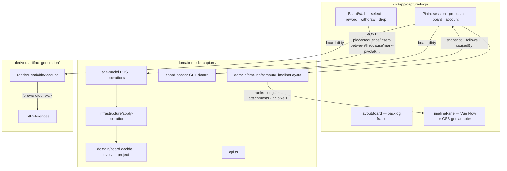

# Slice 3 — Relations + the Board · Design

**Spec:** `.specs/features/slice-3-relations-board/spec.md`
**Context:** `.specs/features/slice-3-relations-board/context.md`
**Status:** Approved — Tasks being written

Governing: ADR-002, ADR-003, ADR-004, ADR-006, ADR-007, ADR-008, ADR-009, ADR-010.
`.specs/STATE.md` AD-005, AD-006, AD-008, AD-009, AD-022, AD-024, AD-026, AD-028, AD-029,
AD-030, **AD-031** (this slice).

---

## Architecture Overview

No new route, no new capability slice, no new Pinia store. Widen the seams Slice 2
already owns:

1. **`Board.decide` / `evolve` / `project`** — remaining F01 ops, `follows`/`causedBy`
   adjacency on the write model, placement/pivotal on the snapshot.
2. **`edit-model` POST** — same URL; allow-list grows; hot-spot kinds stay 422.
3. **`computeTimelineLayout`** — new pure module under `domain-model-capture/domain/timeline/`.
4. **Capture-loop wall** — backlog frame stays; timeline is a Vue Flow adapter over domain
   ranks (CSS-grid fallback in-slice if the reflow spike fails).
5. **DAG `renderReadableAccount` / `listReferences`** — follows-order walk + relation sites.



### Data flow — sequence (representative F06 rest)

1. Gesture (handle-connect, semantic drop, or keyboard) → `POST /api/workshops/:id/board/operations`
   `{ kind:'sequence', predecessor, successor, author:{ accepter:{ name } }, v:1 }`.
2. Handler: frozen-union parse; kind not in the Slice-3 allow-list → 422
   `not-implemented-in-slice`; empty board stream → 404; else `applyOperation`.
3. `decide` reads write-model adjacency (never the snapshot): kind-permission, withdrawn,
   unknown, already-related, cycle (path = ids). Success → `ok([sequence])`.
4. `append` batch of that array (length 1 here; `unplace` / actor-withdraw are longer).
5. `200 { position }` → `board-dirty` → refetch board + account.

`project(sequence)` sets both endpoints `placement: 'timeline'`. Explicit `place` is only
the orphan-track factory (canvas #35). No extra `place` op on sequence.

### Data flow — layout

`GET /board` returns blocks + `follows` + `causedBy` (no pixels, **no precomputed
layout**). The SPA calls `computeTimelineLayout(snapshot, { includeWithdrawn })` from
`domain-model-capture/domain/timeline/` — a leaf: types only, no Hono, no `node:sqlite`.
Hide-withdrawn is a view filter, so ranks must be recomputable locally without a refetch.

depcruise `ui-does-not-import-server-code` only bans `http.ts` / `data.ts`. ADR-006 names
this file as the published read interface. **Do not** import `domain/board/decide.ts` or
`infrastructure/` from the app (plant a violation if a rule does not already catch
`decide`). `api.ts` still must not be imported from the SPA (it re-exports routers).

---

## Approach exploration — confirmed (spec Yes 2026-08-31)

| Axis | Chosen | Discarded |
| --- | --- | --- |
| F06 writes | Widen **`edit-model`** allow-list | New `edit-relations` slice (same POST, extra slice, `no-cross-slice-imports` buys nothing) |
| Layout pixels | SPA imports leaf `computeTimelineLayout`; dagre/grid adapter maps ranks → view | Layout on GET (cannot recompute hide-withdrawn locally); duplicate layout in the SPA |
| Sequence of unplaced | **`project(sequence)` sets placement**; one op | `decide` prepends `place` (false invariant — placement is display, canvas / AD-005) |
| Renderer | Vue Flow **`nodes-draggable=false`** + dagre from domain edges; 1h spike; grid fallback | Free node-drag (violates F02); grid-first (inverts ADR-006) |
| Actor rendering | **Chips inside the event custom node** (`attachments`) | Actors as Vue Flow nodes on the time axis |
| Facilitator tracks | **Out** (AD-031) | ADR-010 slice-3 row as written |

---

## Code Reuse Analysis

### Existing Components to Leverage

| Component | Location | How to Use |
| --- | --- | --- |
| `decide` / `evolve` / `project` / `replay` | `domain/board/` | Handle remaining kinds; extend write model + snapshot. |
| `applyOperation` | `infrastructure/apply-operation.ts` | Unchanged retry; **fix** `resultingBuildingBlockId` for ops without `id`/`target`. |
| `edit-model` `F06_KINDS` | `capabilities/edit-model/http.ts` | Widen; keep hot-spot kinds 422. Existing sequence-422 test becomes accept-sequence. |
| `readBoardSnapshot` | `board-access/read-board-snapshot.ts` | Add `follows`, `causedBy`, `pivotal`, `placement`. **Not** a precomputed `timeline` key. |
| `layoutBoard` | `app/.../board/layout.ts` | **Backlog only** — do not compute follows topology here. `placed`/`arrows` die or become adapter output. |
| `BoardWall` / sticky reword | `BoardWall.vue` | Keep dashed-ghost / withdraw. Add drop targets + timeline pane + hide-withdrawn toggle. |
| `postBoardOperation` | `dock/mutations.ts` | Widen `BoardEdit` union. |
| `board` store | `stores/board.ts` | Types grow; add **client-only** `showWithdrawn` (default false). |
| `renderReadableAccount` | DAG `domain/` | Walk placed events by `follows` tracks; register relation sites on the same map. |
| `listReferences` | DAG `domain/` | Remains a map lookup; sites added at render. |
| Replay property | `replay.test.ts` | Extend POOL with new ops; add write-model `evolve` twin. |
| `fast-check` | already a dep | New cycle + kind-permission properties (ADR-008). |
| Playwright spec | `e2e/capture-loop.spec.ts` | **One** spec: after reinstate, place/sequence two events, assert timeline + a follows reference site. |
| Vue Flow / dagre | **not installed** | Pin `@vue-flow/core@1.48.2`, `@dagrejs/dagre@3.1.1` (framework-gotchas). No `@types/dagre`. Do not install `@vue-flow/background` unless the spike needs it (earn-it). |
| `--color-pivotal` | `DESIGN.md` / `style.css` | Use; do not invent a second yellow. |
| Capture-loop brief | `.impeccable/surfaces/src-app-capture-loop.md` | Patch §3–§7 for timeline / drop / hide-withdrawn / keyboard. Operate, no new world. |

### Integration Points

| System | Integration Method |
| --- | --- |
| `host/routes.ts` | Unchanged mounts. |
| EventStore | Same board stream; batches from `decide` (AD-006). |
| Accept path | Still capture-only; `applyOperation` mapping must not break `id`-bearing ops. |
| depcruise | Plant: app ↛ `domain/board/decide.ts`; app ↛ `infrastructure/`. App → `domain/timeline/**` is the ADR-006 read interface. |

---

## Components

### Write model + snapshot (AD-005)

- **Purpose**: `decide` guards on kinds, withdrawn, and adjacency; display stays on the snapshot.
- **Location**: `src/domain-model-capture/domain/board/model.ts`
- **Shape**:

```ts
interface WriteBlock { kind: BuildingBlockKind; withdrawn: boolean }

interface BoardWriteModel {
  blocks: Map<BuildingBlockId, WriteBlock>
  follows: Map<BuildingBlockId, Set<BuildingBlockId>> // predecessor → successors
  causedBy: Map<BuildingBlockId, Set<BuildingBlockId>> // effect (event) → causes
}

interface SnapshotBlock {
  kind: BuildingBlockKind
  label: string
  withdrawn: boolean
  placement: 'backlog' | 'timeline'
  pivotal: boolean
  provenance: Author
}

interface BoardSnapshot {
  blocks: Map<BuildingBlockId, SnapshotBlock>
  follows: ReadonlyArray<{ predecessor: BuildingBlockId; successor: BuildingBlockId }>
  causedBy: ReadonlyArray<{ cause: BuildingBlockId; effect: BuildingBlockId }>
  position: number
}
```

- **`emptyWriteModel`**: `{ blocks: new Map(), follows: new Map(), causedBy: new Map() }` —
  **breaking** for every `Map` caller (`decide.test`, `evolve.test`, `model.test`
  `emptyWriteModel().size`, `replay.test` `.get`). Update those; do not keep a Map façade.
- **`evolve`**: capture inserts a block; `sequence` adds an edge; `unsequence` deletes one;
  `insert-between` deletes A→B, adds A→C and C→B; `link-cause` / `unlink-cause` mutate
  `causedBy`; `withdraw` sets withdrawn **and drops all incident follows + causedBy
  involving that id**; `reinstate` clears withdrawn only (adjacency already gone).
- **`project`**: same ops on the snapshot plus placement/pivotal/labels. `sequence` /
  `insert-between` / `place` → those events `placement: 'timeline'`. `unplace` → backlog.
  `mark-pivotal` / `unmark-pivotal` flip `pivotal` (events only; decide already rejected
  others). `reinstate` → backlog, `pivotal: false`, no edges (already dropped).
- **Dependencies**: none beyond schema ids.
- **Reuses**: existing folds; L-001 — tests that assert a fold wrote placement/pivotal MUST
  use a value distinct from the prior state.

### `decide` — remaining kinds

- **Purpose**: Pure guard + cascade derivation.
- **Location**: `decide.ts`
- **Rules** (all systemic):
  - **place / unplace**: target exists, `domain-event`, not withdrawn. `unplace` returns
    `[...unsequence for each incident follows edge, unplace]` (neighbours not rejoined).
    Duplicate place is **accepted**; `project` is idempotent (placement not in write model).
  - **sequence / unsequence**: both endpoints exist, both `domain-event`, not withdrawn,
    distinct ids. Duplicate edge → `already-related`. Self-loop / path successor↝predecessor
    → `cycle` with `path: BuildingBlockId[]`. Adding A→B cycles iff B already reaches A.
  - **insert-between(A,C,B)**: A→B exists (`missing-edge` else); A,C,B events, not withdrawn;
    cycle as if A→B removed and A→C, C→B added (C reaches A → `cycle`). Other successors of
    A untouched. One op in the log; `evolve` performs the three edge mutations.
  - **link-cause / unlink-cause**: cause is actor\|system, effect is event, both exist, not
    withdrawn. Duplicate → `already-related`. Missing unlink pair → `missing-edge`.
  - **mark-pivotal / unmark-pivotal**: event, not withdrawn. Marking an already-pivotal event
    still appends (like same-label reword) — snapshot unchanged; tests must flip false→true.
  - **withdraw actor/system**: `[withdraw, ...unlink-cause per effect in causedBy that
    lists this cause]`. Order: withdraw first, then unlinks (ticket pin).
  - **withdraw event**: `[withdraw]` only; `evolve` drops incident follows.
- **New `Rejection` variants**: `cycle` `{ path }`, `kind-permission` `{ operation, reason }`,
  `already-related`, `missing-edge`. HTTP 422 `{ error: kind, classification: 'systemic',
  path? }`.
- **Reuses**: existing unknown/withdrawn/empty-label/schema.

### `computeTimelineLayout`

- **Purpose**: Ranked tracks, no pixels (ADR-006).
- **Location**: `src/domain-model-capture/domain/timeline/compute-timeline-layout.ts`
- **Interface**:

```ts
interface TimelineLayout {
  tracks: Array<{
    eventIds: BuildingBlockId[] // follows order, roots first
    ranks: Record<string, number> // event id → topological rank
  }>
  edges: Array<{ predecessor: BuildingBlockId; successor: BuildingBlockId }>
  attachments: Record<string, BuildingBlockId[]> // event id → cause ids (actor/system)
  pivotal: BuildingBlockId[]
}

computeTimelineLayout(snapshot: BoardSnapshot, opts?: { includeWithdrawn?: boolean }): TimelineLayout
```

- **Algorithm**: among **placed, non-withdrawn** domain events, connected components of
  undirected `follows`; per component, topological rank = longest path from in-degree-0;
  order within a rank: **BuildingBlockId string sort** (deterministic). Hidden withdrawn
  events are omitted here; the client view-filter uses the same snapshot flag. Causes
  attach only if they are not withdrawn and the effect is in the layout.
- **Tests**: node-only goldens — two tracks; a branch (one event, two successors); orphan
  placed event; actor listed under its event, never in `eventIds`; withdrawn-with-edges
  omitted unless `includeWithdrawn: true`. L-001: a second successor must not be the same
  id as the first.
- **Reuses**: nothing in `src/app/`.

### `board-access` serialisation

- **Purpose**: Cold-load DTO.
- **Location**: `read-board-snapshot.ts` + `http.ts`
- **Body**: `{ position, blocks, follows, causedBy }`. Blocks include `placement` and
  `pivotal`. Empty log still `{ position: -1, blocks: [], follows: [], causedBy: [] }`
  from `readBoardSnapshot`; GET HTTP still **404** on empty stream (Slice 1).
  The SPA runs `computeTimelineLayout` after load / when `showWithdrawn` flips.
- **Client types**: `src/app/capture-loop/types.ts` `BoardSnapshot` / `BoardBlock` updated
  by hand (existing contract).

### `applyOperation` id mapping

- **Purpose**: Never throw on a successful decide (S3-31).
- **Location**: `apply-operation.ts`
- **Mapping** (keep `ApplyResult.resultingBuildingBlockId` required so accept.ts is
  unchanged): `id` if present → `target` if present → `successor` (sequence/unsequence) →
  `inserted` (insert-between) → `effect` (link/unlink-cause). Exhaustive switch.
- **Test**: `applyOperation(sequence)` returns 200-path without throw.

### `edit-model` allow-list

- **Purpose**: Direct F06 rest.
- **Location**: `http.ts` `F06_KINDS`
- **Allow**: existing three + `place` `unplace` `sequence` `unsequence` `insert-between`
  `link-cause` `unlink-cause` `mark-pivotal` `unmark-pivotal`.
- **Still 422**: `raise-hot-spot` `annotate` `unannotate` `resolve` `reopen`.

### Timeline pane (app)

- **Purpose**: Render tracks; pan/zoom; semantic connect/drop.
- **Location**: `src/app/capture-loop/board/TimelinePane.vue` (+ `use-dagre-layout.ts`)
- **Vue Flow** (`@vue-flow/core@1.48.2`): `nodes-draggable=false`, `fit-view-on-init`,
  pan/zoom on. Custom node slot `node-event` = existing sticky look + attachment chips +
  optional pivotal bar. Edges from `timeline.edges`. **Do not** import
  `@vue-flow/core/dist/theme-default.css` if it fights DESIGN.md — core `style.css` only,
  stickies stay ours.
- **Dagre** (`@dagrejs/dagre@3.1.1`): official ~40-line helper, `rankdir: 'LR'`, node
  width = existing `CELL` (132) so labels wrap instead of growing the box (ADR-006).
  Positions are view-only; refetch rebuilds them.
- **`onConnect`**: prevent local edge; `POST sequence`; `board-dirty`. Events
  `connectable`; actors are not nodes.
- **Semantic drop**: HTML5 drag from backlog onto (a) empty timeline pane → `place`;
  (b) an event node → `sequence` (predecessor = target, successor = dragged) or
  `link-cause` if the dragged kind is actor/system; (c) an existing edge →
  `insert-between`. Keyboard: selected sticky **Place on timeline** / **Unplace**;
  with two events selected (or last-placed + selected) **Sequence after**; cycle 422
  shown inline on the wall (`path` resolved to current labels).
- **Hide-withdrawn**: checkbox/toggle on the wall; `board.showWithdrawn`; default hidden;
  revealed = Slice 2 ghost treatment. Not POSTed.
- **Spike (Execute, time-boxed ~1h)**: reword a variable-length label on a placed event;
  if the whole board jumps, ship **CSS-grid-by-rank** (`timeline.tracks` × `ranks`, no
  Vue Flow) in this slice. Adapter swap only — domain layout unchanged.
- **Reuses**: sticky CSS, `postBoardOperation`, `board-dirty`.

### Readable account + references

- **Purpose**: Follows-order walk; relation sites.
- **Location**: `render-readable-account.ts`, `model.ts` `AccountInput` / `ReferenceSite`
- **Walk**: coverage line "Timeline and relations" becomes a real section (tracks as
  nested lists of rendered-reference labels). Building-blocks section remains for
  backlog + all kinds. Quotes unchanged.
- **Sites**: keep `{ kind: 'readable-account', path: 'building-blocks' }`. Add
  `{ kind: 'follows', path: '${predId}>${succId}' }` on both endpoints;
  `{ kind: 'caused-by', path: '${causeId}>${effectId}' }` on both. Path is **ids** so
  the site set is stable across reword (Slice 2 same-set AC). Popover displays current
  labels by looking up the snapshot.
- **`toAccountBlocks`**: still drops hot spots (none yet). Pass `follows` / `causedBy`
  / `placement` into `AccountInput`.

---

## Data Models

Published GET `/board` (app `types.ts` mirror):

```ts
interface BoardBlock {
  id: string
  kind: string
  label: string
  withdrawn: boolean
  placement: 'backlog' | 'timeline'
  pivotal: boolean
  provenance?: { accepter: { name: string } }
}

interface BoardSnapshot {
  position: number
  blocks: BoardBlock[]
  follows: { predecessor: string; successor: string }[]
  causedBy: { cause: string; effect: string }[]
}
```

`BoardEdit` in `mutations.ts` becomes a discriminated union covering the allow-list
(no `target` on sequence/link-cause).

---

## Error Handling Strategy

| Error Scenario | Handling | User Impact |
| --- | --- | --- |
| Cycle | 422 `cycle` + `path` ids | Inline "That would loop: A → … → A"; graph unchanged. |
| Kind-permission | 422 `kind-permission` | "Actors don't sit on the timeline." |
| Already-related / missing-edge | 422 | Inline; no append. |
| Unknown / withdrawn | existing 422 | Unchanged. |
| Hot-spot kind | 422 `not-implemented-in-slice` | Unreachable from this UI. |
| `stale-position` | `applyOperation` retry | Invisible. |
| Vue Flow reflow | Spike → grid fallback | Same ranks, no edge routing. |
| Confirm GET after a relation POST | Slice 2 stale-popover rule | Refetch or cancel. |

---

## Risks & Concerns

| Concern | Location | Impact | Mitigation |
| --- | --- | --- | --- |
| `applyOperation` throws on `sequence` | `apply-operation.ts:19-20` | Every relation POST 500s | Exhaustive id mapping + test. |
| `BoardWriteModel` is a `Map` | `model.ts:18`, `evolve.ts:11`, `replay.test.ts:92` | Adjacency has nowhere to live | Struct rewrite; fix every `.get`/`.size` caller in the same task as the type change. |
| Vue Flow default drag | Vue Flow defaults | Stored-looking free position, F02 fail | `nodes-draggable=false`; dagre from server ranks after every refetch. |
| App importing `api.ts` or `decide.ts` | temptation | Bundles Hono/sqlite or the write model into the SPA | Import **only** `domain/timeline/**`; plant app ↛ `decide.ts` |
| `layoutBoard` growing a second topology | `layout.ts:46-49` | Drift from `computeTimelineLayout` | Backlog-only; delete unused `placed`/`arrows` or fill only from GET `timeline`. |
| Reflow on wrap | ADR-006 | Whole-board jump | Fixed `CELL` width; spike; grid fallback same slice. |
| Cycle property too weak | new `fast-check` | Mutant accepts a cycle | Generate graphs, add one edge, assert: if `decide` ok then snapshot still DAG (Kahn). |
| E2E length | `e2e/capture-loop.spec.ts` | Timeouts | Append after existing beats; scripted facilitator already there. |
| Brief vs hide-withdrawn | brief §5 ghosts always visible | Spec default-hidden | View filter; ghosts remain the revealed treatment. Patch the brief. |
| Accept `resultingBuildingBlockId` | `accept.ts:116` | Capture path must stay required | Mapping keeps capture `id`; do not make the field optional. |

---

## Tech Decisions (only non-obvious ones)

| Decision | Choice | Rationale |
| --- | --- | --- |
| Sequence of unplaced | Snapshot fold, not extra `place` | Canvas / AD-005: placement is display; AC still "appears on the timeline" |
| Layout transport | SPA imports leaf `computeTimelineLayout` | Hide-withdrawn is local; ADR-006 published read interface; GET stays topology-only |
| Vue Flow drag | Off globally | F02 / brief anti-Miro; connect + HTML5 drop are the gestures |
| Actors on the timeline | Chips in the event node | Ticket: never a timeline slot; dagre only sees events |
| Duplicate place / mark-pivotal | Allowed no-op fold | Same as same-label reword; placement/pivotal not write-model invariants |
| Hide-withdrawn | Client `showWithdrawn`, default false | Spec: not a logged op |
| Vue Flow theme CSS | Core stylesheet only | DESIGN.md stickies, not xyflow chrome |
| `@vue-flow/background` | Not installed unless spike needs it | Earn-it; `time →` already drawn by the wall |
| Facilitator tracks | Deferred #41 | **AD-031** |
| `package.json` version | Untouched | ADR-009; `minor` changeset |

### Impeccable — capture-loop extension (Operate)

Not a new surface.

- **Job:** sort the backlog onto a Big-Picture wall without learning a graph editor.
- **Focal moment:** drop (or connect) → branch visible, actor under the event, account
  walk matches the arrows.
- **Must not invent:** free-position canvas; dashed ghosts for proposals; a second page;
  a milestone picker widget; optimistic nodes.
- **Builder task:** patch the brief §3 (timeline + arrows + pivotal bars + `time →` now
  real), §4 (slice-3 target is this sitting; drag-to-place semantic), §5 (hide-withdrawn
  default; reveal = ghosts), §6 (Place / Unplace / Sequence / Link cause; hide toggle),
  §7 (keyboard pan/zoom + the semantic actions). Do not rewrite DESIGN.md's world; token
  `--color-pivotal` is already reserved.

### Project-level (appended)

**AD-031** — Slice 3 does not extend `FacilitationTurnSchema`. Facilitator relation /
pivotal proposal tracks and the reword-hold-back gate land in Slice 4 (#41), eval of
those behaviours in Slice 5 (#42), ADR-010 wording in Slice 6 (#43).

---

## Docs to reconcile (Slice 6 — do not edit now)

- ADR-010 slice-3 row (facilitator proposes relations / reword-hold-back / F07 via
  proposals) — already parked on #43.
- ARCHITECTURE.md slice table, same drift.
- Capture-loop brief slice-1 "timeline is slice 3" sentences — **this slice patches the
  brief**; DESIGN.md visual world stays.

---

## Success of this design

User approves this file → Tasks (`tasks.md`). Expect ~18–22 tasks (domain folds, layout,
HTTP DTO, Vue adapter + spike, account/refs, e2e, changeset). Execute offers sub-agents
if the pack exceeds ~8.
