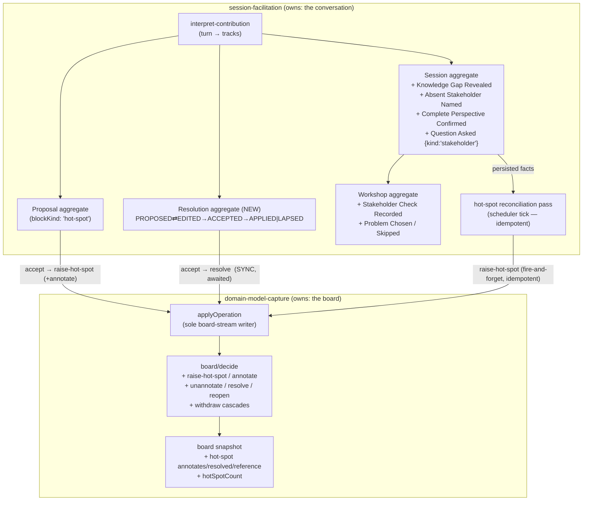

# Slice 4 — Hot Spots + Close Design

**Spec**: `.specs/features/slice-4-hot-spots-close/spec.md`
**Context**: `.specs/features/slice-4-hot-spots-close/context.md`
**Status**: Done — Execute complete, Verifier PASS

---

## Architecture Overview

Three moves, each landing in the context that owns the language:

1. **`domain-model-capture`** learns the five frozen hot-spot operations (`raise-hot-spot`,
   `annotate`, `unannotate`, `resolve`, `reopen`) — deciders, folds, the two withdraw
   cascades, and a projected hot-spot shape + count on the board snapshot. This is the only
   context that stores a hot spot's resolved state and reference (canvas "Does not own").

2. **`session-facilitation`** learns two proposal tracks (hot spot, resolution) and three
   question-track judgments (`Knowledge Gap Revealed`, `Absent Stakeholder Named`,
   `Complete Perspective Confirmed`), adds the `Resolution` aggregate + a `review-resolution`
   capability, and records the F09 stakeholder answer + chosen problem as `Workshop` events.

3. **The cross-context effect is choreography, not a bus, not a synchronous command.**
   `session-facilitation` persists the *triggering facts* on its own streams; a **hot-spot
   reconciliation pass** in the existing scheduler tick reads those facts and idempotently
   applies `raise-hot-spot` into `domain-model-capture`, tracked by a sweep-marker table. A
   crash between the fact and the raise self-heals on the next tick. The resolve chain stays
   synchronous (query-back shaped — the person waits on the outcome).



---

## Tech Decisions → new ADs

Three decisions here supersede or correct active `AD-NNN` entries; the rest are feature-local.
The AD numbers are allocated at the end of Design (STATE.md is the authority — currently
AD-031 is the max) and written into `.specs/STATE.md` `## Decisions`.

| # | Decision | Supersedes | Rationale |
| --- | --- | --- | --- |
| **AD-032** | **`Raise Hot Spot` is choreography over persisted facts, reconciled by the scheduler tick — not an event bus, not a synchronous cross-context command.** `session-facilitation` writes `Session Closed` / `Knowledge Gap Revealed` / `Absent Stakeholder Named` on its own streams; a hot-spot reconciliation pass (folded into `reconcilePendingDerivations` + `finishClose`) reads them and calls `applyOperation(raise-hot-spot)` idempotently, tracked by a `hot_spot_sweep` marker table. | **AD-019** (`status → superseded by AD-032`) — the in-process bus is not built. | code-architecture: choreography over domain events is the default; a synchronous 1-publisher/1-subscriber in-process bus is a disguised orchestrator that `knip` would flag as an unused abstraction. This is the exact shape AD-018 (always-async worker) and AD-021 (reconciled, not transactional) already established. Crash-safe: the fact is persisted before the raise; the tick repairs a partial run. |
| **AD-033** | **Slice 4 is strictly F08/F09/F18.** The facilitator relation / `insert-between` / `place` / `unplace` / `link-cause` / `mark-pivotal` proposal tracks and the F04 reword-hold-back gate build in **Slice 5 (#42)**, before their eval assertions. `FacilitationTurnSchema` this slice gains only the hot-spot, resolution, and question-track strands. | **AD-031** (its `(#41)` slice label only — the rest of AD-031 stands) | User 2026-09-02. #41's title and ACs are hot spots + close; AD-031's parenthetical was written after the slice plan. Same correction shape as AD-017 → AD-016. Issues #41/#42/#43 updated; comments posted. |
| **AD-034** | **The close is a two-phase ceremony with no new `Session` state.** "Close" opens a closing phase: the facilitator asks a `Question Asked {kind:'stakeholder'}` while the session is still `OPEN`; the person answers with a normal contribution (interpreted as `complete-perspective` or `absent-stakeholder` — acceptance test 44); `record-stakeholder-check` and `choose-problem` write `Workshop` events; `Close Session` fires last, running the atomic sweep. The open stakeholder question + the absence of `Session Closed` *are* the phase. | — (new) | domain-modeling: model uncertainty as state, but only add state that an invariant reads. No `CLOSING` state earns its place — every `Session` projection would have to handle it for a phase that is fully described by existing events. F18 "stops accepting contributions" begins at `Session Closed`, which is unchanged. |

`FacilitationTurnSchema` optional-parameter budget (AD-015 — ≤ 24): the new strands add
`modelAffecting?` + `annotatesTargetId?` (propose-hot-spot), `reference` (propose-resolution,
required), and `questionId` (the three judgments). Net new optionals: 2. Design task T-schema
includes the schema-walk test that fails if the count exceeds 24.

---

## Code Reuse Analysis

### Existing components to leverage

| Component | Location | How to use |
| --- | --- | --- |
| `applyOperation` | `domain-model-capture/infrastructure/apply-operation.ts` | Already the sole board-stream writer, already maps all 5 hot-spot kinds in `resultingBuildingBlockId`, already retries `stale-position`. `decide` gains the branches; this file is unchanged except possibly the response-shape note. |
| `board/decide.ts` exhaustive switch | `domain-model-capture/domain/board/decide.ts:445` | The 5 hot-spot kinds are the `not-implemented-in-slice` arm today — replace with real branches. `switch-exhaustiveness-check` already forces this. |
| `board/evolve.ts` / `project.ts` no-op arms | same dir | The 5 kinds are no-op arms today — fill them. Cascade helpers (`dropIncidentFollows`, `patchBlock`, `referencingEffects`) are the template for the annotation cascade. |
| `decideWithdraw` cascade pattern | `board/decide.ts:147` | Returns `[withdraw, ...unlink-cause]` batch-atomic (AD-006/AD-028). The annotated-block → hot-spot cascade follows the identical shape: `[withdraw, ...withdraw(annotatingHotSpot)]`. |
| `accept.ts` cross-context accept chain | `session-facilitation/capabilities/review-proposal/accept.ts` | The template for both (a) the hot-spot proposal accept (`raise-hot-spot` + optional `annotate` batch) and (b) `review-resolution` accept (`resolve` → record outcome). `OP_KIND` map extends with `hot-spot`. |
| `finishClose` idempotent close tail | `session-facilitation/infrastructure/session-close.ts` | Extend with the hot-spot sweep (unresolved questions + apply-failed proposals). Every step already idempotent; add the sweep-marker check. |
| `reconcilePendingDerivations` | `session-facilitation/capabilities/interpret-contribution/interpret.ts:332` | Extend to also run the hot-spot reconciliation for `Knowledge Gap Revealed` / `Absent Stakeholder Named` facts, and to call the extended `finishClose`. |
| `deriveTracks` / `derived_track` marker | `interpret.ts:191` + `infrastructure/derived-track.ts` | The exact pattern for the new `hot_spot_sweep` marker table + idempotent derivation of a cross-stream effect (AD-021). |
| `Proposal` aggregate (decide/evolve/replay) | `session-facilitation/domain/proposal/` | `Resolution` is the same skeleton minus `APPLY_FAILED` (canvas state machine) — copy the shape, not the file (code-architecture: no slice→slice sharing; both share only `domain/`). |
| `proposalsView` / `proposalCard` read models | `domain/read-models/proposals-view.ts` | Template for `resolutionsView` / `resolutionCard`. |
| `readArtifactSource` | `session-facilitation/infrastructure/read-artifact-source.ts` | Extend with the chosen problem + qualification + "stakeholder check not run" for #42. |
| `session_index` migration + `_sf_migrations` sequence | `session-facilitation/infrastructure/migrations.ts` | Add migration `id: 2` — `hot_spot_sweep` table. Additive-only (ADR-004). |
| SPA board store + `board-view` + `BoardWall` | `src/app/capture-loop/` | Callouts + count extend the existing snapshot render; no second renderer (ADR-006). |
| `impeccable` capture-loop brief | `.impeccable/surfaces/src-app-capture-loop.md` | Operate/Shape for the callout + count treatment; a **new** `.impeccable/surfaces/` brief for the in-dock close ceremony. |

### Integration points

| System | Integration method |
| --- | --- |
| `domain-model-capture` ← `session-facilitation` | `import { applyOperation, Operation, BuildingBlockId } from '../../../domain-model-capture/api.ts'` — already the sanctioned seam (`accept.ts` uses it). Cross-context reads for hot-spot state via `readBoardSnapshot` (the resolution judgment needs "open hot spots"). |
| Board stream ↔ session streams | Never one transaction (AD-016). The resolve chain: `Resolution.append` then `applyOperation` then `Resolution.append` — three separate commits. The raise choreography: `Session.append` (fact) then, a tick later, `applyOperation` (effect). |
| `host/routes.ts` | Mount `directHotSpotRoutes`, `reviewResolutionRoutes`, `recordStakeholderCheckRoutes`, `chooseProblemRoutes`, and widen `editModelRoutes`' `F06_KINDS` allow-list. |
| `host/scheduler.ts` | No shape change — `reconcilePendingDerivations` grows internally. |

---

## Components

### `domain-model-capture` — board hot-spot operations

- **Purpose**: apply, fold, and project the five hot-spot operations and their cascades.
- **Location**: `domain-model-capture/domain/board/{model,decide,evolve,project,replay}.ts`
- **Interfaces** (additions):
  - `decide(writeModel, { kind: 'raise-hot-spot', id, label, modelAffecting, author })` →
    `ok([op])`, or `err(duplicate-id)`.
  - `decide(writeModel, { kind: 'annotate', hotSpot, target, author })` → `ok([op])`, or
    `err(unknown-target | withdrawn-target | kind-permission)`. `kind-permission` when
    `hotSpot` is not a hot spot, or `target` **is** a hot spot ("a hot spot cannot annotate
    another hot spot").
  - `decide(writeModel, { kind: 'unannotate', hotSpot, author })` → `ok([op])` if the hot spot
    currently annotates something; `err('missing-edge')` if it annotates nothing (rejected
    no-op — discriminable from success, L-001 spirit).
  - `decide(writeModel, { kind: 'resolve', target, reference, author })` → `ok([op])`, or
    `err(unknown-target | withdrawn-target | kind-permission | already-resolved)`. The
    `reference` **key must be present** — enforced by the schema (`z.unknown()` on a required
    key fails `.parse` when absent) *and* re-checked in `decide` for a clear rejection.
  - `decide(writeModel, { kind: 'reopen', target, author })` → `ok([op])`, or
    `err(unknown-target | kind-permission | not-resolved)`.
  - `decideWithdraw` extended: withdrawing block `B` returns
    `[withdraw(B), ...withdraw(H) for each live hot spot H annotating B]` (batch-atomic).
    Withdrawing a hot spot `H` that annotates `T` returns `[withdraw(H), unannotate(H)]`.
  - `project` extended: `raise-hot-spot` adds a `hot-spot` snapshot block
    (`{ kind:'hot-spot', label, modelAffecting, withdrawn:false, annotates:null,
    resolved:false, reference:null, placement:'backlog', pivotal:false, provenance }`);
    `annotate` sets `annotates`; `unannotate` / withdraw clears it; `resolve` sets
    `resolved:true, reference:<value>`; `reopen` sets `resolved:false` (keeps `reference`
    value on the snapshot for #42; the client hides it while open); `reinstate` returns the
    hot spot naked (`annotates:null, resolved:false, reference:null` — acceptance test 17).
- **Dependencies**: none new (pure domain).
- **Reuses**: the write-model/snapshot pattern (AD-005), `decideWithdraw` cascade shape.

### `domain-model-capture` — board write model + snapshot shape

- **Purpose**: hold the minimum hot-spot state `decide` reads, and the projected shape
  consumers read.
- **Location**: `domain/board/model.ts`
- **Data model**: see Data Models below.
- **Reuses**: `BoardWriteModel` / `BoardSnapshot` / `SnapshotBlock` (extended, not replaced).

### `domain-model-capture` — `GET /workshops/:id/board` + snapshot read

- **Purpose**: carry the hot-spot fields + `hotSpotCount` to the client.
- **Location**: `capabilities/board-access/read-board-snapshot.ts` (+ `http.ts` unchanged —
  it returns `readBoardSnapshot` verbatim).
- **Interface**: `PublishedBoardSnapshot` gains, per hot-spot block, `annotates` /
  `resolved` / `reference`, and a top-level `hotSpotCount: number` (count of non-withdrawn
  `hot-spot` blocks). Determinism boundary unchanged — no pixels.
- **Reuses**: `readBoardSnapshot`, `replay`.

### `domain-model-capture` — direct hot-spot + reopen capability

- **Purpose**: the person creates a hot spot directly (no review) and reopens a resolved one.
- **Location**: `capabilities/edit-model/http.ts` (widen `F06_KINDS`) + a small dedicated
  route file if the shape diverges (`raise-hot-spot` needs `id` minted server-side; the
  generic `operations` endpoint takes a fully-formed `Operation`). **Decision**: add
  `capabilities/flag-hot-spot/http.ts` — `POST /workshops/:id/board/hot-spots`
  `{ label, modelAffecting?, annotatesTargetId? }` mints the id, builds `raise-hot-spot`
  (+ `annotate` when `annotatesTargetId` is set and live), author `{ accepter: { name } }`,
  calls `applyOperation`. `POST /workshops/:id/board/hot-spots/:blockId/reopen` → `reopen`.
  `annotate` / `unannotate` / `resolve` are *not* on the generic operations endpoint (they
  arrive via the proposal/resolution accept paths and the flag capability); `raise-hot-spot`
  and `reopen` are the only hot-spot kinds reachable directly.
- **Dependencies**: `BoardIo` (`{ store, clock }`), `creatorName` via the workshop stream
  (as `accept.ts` does).
- **Reuses**: `applyOperation`, `Operation` SSOT.

### `session-facilitation` — `Resolution` aggregate

- **Purpose**: one pending hot-spot resolution; protects "exactly one disposition at a time"
  and "every apply bounce is terminal, no retry" (canvas).
- **Location**: `session-facilitation/domain/resolution/{model,decide,evolve,replay}.ts`
- **State machine** (canvas): `PROPOSED ⇄ EDITED → ACCEPTED → APPLIED | LAPSED`;
  `REJECTED` terminal from `PROPOSED`/`EDITED`. No `APPLY_FAILED`.
- **Interfaces**:
  - `decide(wm, { type: 'Propose Resolution', resolutionId, sessionId, contributionId,
    hotSpotId, reference, at })` → `Resolution Proposed`.
  - `decide(wm, { type: 'Edit Resolution', resolutionId, reference, at })` → `Resolution Edited`
    (loops on `EDITED`; rejected after terminal).
  - `decide(wm, { type: 'Accept Resolution', resolutionId, accepter, at })` → `Resolution Accepted`.
  - `decide(wm, { type: 'Reject Resolution', resolutionId, at })` → `Resolution Rejected`.
  - `decide(wm, { type: 'Record Hot Spot Resolved', resolutionId, at })` → `Hot Spot Resolved`
    (→ `APPLIED`).
  - `decide(wm, { type: 'Record Resolution Rejected', resolutionId, reason, at })` →
    `Hot Spot Resolution Rejected` (→ `LAPSED`; reason: `already-resolved` | `withdrawn` |
    `not-a-hot-spot`).
  - `decide(wm, { type: 'Lapse Resolution', resolutionId, at })` → `Resolution Lapsed` (at
    session close, from `PROPOSED`/`EDITED`).
- **Dependencies**: none new (event-sourced Decider, pure).
- **Reuses**: `Proposal` decide/evolve/replay shape; `ProposalId`-style branded `ResolutionId`
  (new — `type ResolutionId = string & z.$brand<'ResolutionId'>` in `plumbing/ids.ts` +
  `newResolutionId`, mirrored in `session-facilitation/domain/schema/ids.ts`).

### `session-facilitation` — `review-resolution` capability

- **Purpose**: the person edits / accepts / rejects a proposed resolution; accept runs the
  synchronous resolve chain.
- **Location**: `session-facilitation/capabilities/review-resolution/{http,accept,deps}.ts`
- **Interfaces**:
  - `POST /resolutions/:id/edit` `{ reference }` · `POST /resolutions/:id/reject`
  - `POST /resolutions/:id/accept` — the synchronous chain (mirrors `accept.ts`):
    1. `Resolution.decide(Accept Resolution)` → `ACCEPTED` (idempotent while `ACCEPTED`/`APPLIED`).
    2. build `resolve` `Operation` `{ kind:'resolve', target: hotSpotId, reference,
       author: { proposer: { name:'facilitator' }, accepter: { name: creatorName } } }`.
    3. `applyOperation(io, workshopId, op)` — its own transaction.
    4. ok → `Resolution.decide(Record Hot Spot Resolved)`; `err(kind-permission|withdrawn-target)`
       → `Record Resolution Rejected(reason)`; `err(already-resolved)` → `Record Resolution
       Rejected('already-resolved')` (acceptance test 39 — second resolution lands `LAPSED`).
  - `GET /sessions/:id/resolutions` — `resolutionsView` for the drawer.
- **Dependencies**: `BoardIo`, workshop stream (for `creatorName` + `workshopId`), the hot-spot
  id from the `Resolution Proposed` event.
- **Reuses**: `accept.ts` structure verbatim; `readBoardSnapshot` is *not* needed here — the
  board's `decide` is the authority on "already resolved".

### `session-facilitation` — hot-spot proposal track

- **Purpose**: the facilitator proposes a hot spot through the F05 path; the person flips the
  kind and accepts.
- **Location**: `domain/schema/interpreted-track.ts` (+ `turn-schema.ts`, `map.ts`),
  `domain/schema/events.ts` (`Building Block Proposed`), `domain/proposal/*`,
  `capabilities/review-proposal/{accept,http}.ts`, `capabilities/interpret-contribution/interpret.ts`.
- **Changes**:
  - `InterpretedBlockKind` gains `'hot-spot'`. `Building Block Proposed` gains
    `modelAffecting: z.boolean().default(true)` and `annotatesTargetId: BuildingBlockId.optional()`
    (both **additive** — `v:1` stays; a proposal with neither is a plain capture).
  - `interpreted-track.ts` `proposeBuildingBlock` gains the same two optional fields.
  - `turn-schema.ts` `proposeBuildingBlock` gains `modelAffecting?` + `annotatesTargetId?`
    (a target the model names by label → mapped to an id across the ACL in `map.ts`, dropped
    if unresolvable), described inline. **A separate `flag-hot-spot`-style track is not
    added** — a hot spot is a building-block kind, so it rides `propose-building-block` with
    `blockKind: 'hot-spot'`. Keeps the optional-parameter budget at +2.
  - `Proposal.decide(Edit Proposal)` unchanged for label; a new
    `Set Proposal Kind { proposalId, modelAffecting, at }` → `Proposal Kind Set` lets the
    review card flip `modelAffecting` before accept (legal only in `REVIEWABLE`).
  - `accept.ts` `OP_KIND` gains `'hot-spot': 'raise-hot-spot'`; when `blockKind === 'hot-spot'`
    the accept builds `raise-hot-spot` (carrying `modelAffecting` from the last
    `Proposal Kind Set` or the birth default) and, if `annotatesTargetId` is set and the
    target is live, appends `annotate` as a batch follow-on in the same `applyOperation`
    call path (one `decide` returns `[raise-hot-spot, annotate]`? — **no**: `raise-hot-spot`
    and `annotate` are two operations and `applyOperation` takes one. **Decision**: the
    accept path calls `applyOperation(raise-hot-spot)` then `applyOperation(annotate)` — two
    board transactions, the second idempotent (`annotate` on an already-annotated hot spot
    with the same target is a rejected no-op / accepted no-op — pin in T-annotate). The
    `Proposal` records `APPLIED` after the raise; a failed follow-on `annotate` is logged,
    not surfaced — the hot spot exists, unannotated, which is a valid state).
- **Reuses**: the whole capture accept chain.

### `session-facilitation` — question-track judgments

- **Purpose**: `Knowledge Gap Revealed` / `Absent Stakeholder Named` / `Complete Perspective
  Confirmed` resolve their question and drive the downstream effect.
- **Location**: `domain/schema/events.ts`, `domain/session/{model,decide,evolve}.ts`,
  `domain/schema/interpreted-track.ts`, `turn-schema.ts`, `map.ts`, `interpret.ts`.
- **Changes**:
  - `SessionEvent` union gains `Knowledge Gap Revealed { sessionId, questionId,
    byContributionId, detail? }`, `Absent Stakeholder Named { sessionId, questionId,
    byContributionId, personName }`, `Complete Perspective Confirmed { sessionId, questionId,
    byContributionId }`.
  - `Session.decide` gains the three commands; each requires the question `open`, marks it
    `resolved` (via `evolve`), and is idempotent (a resolved question → `ok([])`).
    `Absent Stakeholder Named` is once **per (questionId, personName)** — a second naming of
    the same person on the same question → `ok([])`.
  - `interpreted-track.ts` gains `reveal-knowledge-gap { questionId, detail? }`,
    `name-absent-stakeholder { questionId, personName }`, `confirm-complete-perspective
    { questionId }`. `turn-schema.ts` gains the matching strands (one `questionId` optional
    each — budget +0 net, they reuse the `answer-question` shape).
  - `interpret.ts` `deriveTracks` switch gains the three cases: each `decideSession` +
    `appendSession`. The **hot-spot raise** is *not* done here — it is left for the hot-spot
    reconciliation pass (choreography, AD-032).
  - `Complete Perspective Confirmed` additionally triggers `record-stakeholder-check` with
    `complete: true` (acceptance test 44) — done in `interpret.ts` as a direct workshop
    append (same context, same tick), idempotent.
- **Reuses**: `deriveAnswerQuestion` shape; the `questions` map + `evolve`.

### `session-facilitation` — hot-spot reconciliation pass (AD-032)

- **Purpose**: turn persisted `session-facilitation` facts into `raise-hot-spot` operations
  on the board, idempotently, crash-safe.
- **Location**: `session-facilitation/infrastructure/hot-spot-sweep.ts` (new), called from
  `reconcilePendingDerivations` and `finishClose`.
- **Interface**: `reconcileHotSpots(deps, sessionId): void` — for the given session:
  - read the `Session` stream; for each `Knowledge Gap Revealed` and `Absent Stakeholder
    Named`, and (once `Session Closed` is present) each id in `unresolvedQuestionIds` and each
    `Proposal` in `APPLY_FAILED`, compute a **sweep key**:
    `kg:<questionId>` | `absent:<questionId>:<slug(personName)>` |
    `q:<questionId>` | `proposal:<proposalId>`.
  - if the key is **not** in `hot_spot_sweep`: mint a `BuildingBlockId`, build `raise-hot-spot`
    (`modelAffecting: true` for close-sweep and knowledge-gap; absent-stakeholder likewise),
    label derived from the fact (the question text / "Absent: <name>" / the proposal label),
    `applyOperation(io, workshopId, op)`; on `ok` **or** `duplicate-id`, write the marker row
    `(sweep_key, building_block_id, at)`. On any other board rejection, log and leave the key
    unmarked (retried next tick).
  - `q:<questionId>` and `kg:<questionId>` can collide (a question resolved by a knowledge gap
    is not in `unresolvedQuestionIds`, so no collision in practice) — the marker table is the
    guard regardless.
- **Dependencies**: `store`, `db` (the `hot_spot_sweep` table), `clock`; `workshopId` from the
  `Session Started` event.
- **Reuses**: `derived_track` marker pattern; `applyOperation`; `finishClose`'s read loop.

### `session-facilitation` — F09 workshop state + capabilities

- **Purpose**: record the stakeholder answer and the chosen problem on the `Workshop`.
- **Location**: `domain/schema/events.ts` (`WorkshopEvent`), `domain/workshop/{model,decide,
  evolve}.ts`, `capabilities/record-stakeholder-check/`, `capabilities/choose-problem/`.
- **Changes**:
  - `WorkshopEvent` gains `Stakeholder Check Recorded { workshopId, complete: boolean,
    absentNames: string[] }`, `Problem Chosen { workshopId, problemHotSpotId, qualification:
    'firm' | 'provisional' }`, `Problem Choice Skipped { workshopId, reason:
    'none-chosen' | 'no-impediments-yet' }`.
  - `Workshop.decide` gains `Record Stakeholder Check` (idempotent — second call replaces?
    **no** — a session can only run the check once; a second call after `Stakeholder Check
    Recorded` → `ok([])`), `Choose Problem`, `Skip Problem Choice`. `qualification` is
    `provisional` iff the recorded stakeholder check has `complete === false`.
  - `Choose Problem` validates the `problemHotSpotId` is a **currently-open** hot spot —
    the capability reads `readBoardSnapshot`, filters to open hot spots, and rejects an id
    not in that set (`unknown-open-hot-spot`).
  - Capabilities: `POST /workshops/:id/stakeholder-check` `{ complete, absentNames? }` —
    also, when `complete === false`, spawns one `name-absent-stakeholder`-equivalent hot spot
    per name via the **same reconciliation path** (write an `Absent Stakeholder Named`-style
    fact? — **Decision**: the stakeholder-check capability writes the fact
    `Stakeholder Check Recorded` on the Workshop, and `reconcileHotSpots` is extended to
    read `absentNames` off it, sweep key `absent-sc:<slug(name)>`). `POST /workshops/:id/chosen-problem`
    `{ problemHotSpotId } | { skipReason }`.
- **Reuses**: `Workshop` decide/evolve; `readBoardSnapshot` for the open-hot-spot filter.

### `session-facilitation` — `readArtifactSource` extension

- **Purpose**: hand #42 a ready projection.
- **Location**: `infrastructure/read-artifact-source.ts` + `domain/read-models/artifact-source.ts`
- **Change**: add `stakeholderCheck: { run: false } | { run: true, complete, absentNames }`,
  `chosenProblem: { skipped: true, reason } | { chosen: true, hotSpotId, label, qualification }
  | { notRun: true }`, and `openModelAffectingHotSpots: { id, label }[]` (from `readBoardSnapshot`).
- **Reuses**: the existing artifact-source assembly.

### `src/app/capture-loop` — hot-spot rendering

- **Purpose**: callouts on annotated stickies, a list for unannotated hot spots, a running
  count; live on every applied operation.
- **Location**: `board/view-state/board-view.ts` (derive callout/list/count from the
  snapshot), `board/BoardWall.vue` + `board/presentation/` (render), `board/layout.ts`
  (callout anchor rects — pure, no pixels cross the API), `stores/board.ts` (carry the new
  fields).
- **Interfaces**: `boardView(snapshot)` returns `hotSpots: { annotated: Map<targetId,
  HotSpotCallout[]>, unannotated: HotSpotCallout[], count: number }`.
- **Dependencies**: the extended `GET /board` body.
- **Reuses**: `board-view.ts` derivation pattern, the sticky renderer, `use-fresh-sticky-highlight`.

### `src/app/capture-loop` — direct flag + resolution cards + close ceremony

- **Purpose**: the person flags a hot spot, reviews resolutions, and walks the close.
- **Location**: `dock/interactions/flag-hot-spot/` (new), `dock/interactions/review-resolution/`
  (new — mirrors `review-proposal`), `dock/interactions/close-ceremony/` (new),
  `board/interactions/select-block/` (extend — a "flag hot spot" action on a selected block).
- **Interfaces**: composables `useFlagHotSpot`, `useReviewResolution`, `useCloseCeremony`;
  transport `transport/hot-spots.ts`, `transport/resolutions.ts`, `transport/close.ts`.
- **Dependencies**: the new HTTP capabilities; the `/impeccable` close-ceremony brief.
- **Reuses**: `use-review-proposal.ts`, `ProposalCard.vue`, `PendingDrawer.vue`, the dock feed.

### `/impeccable` — close-ceremony surface brief

- **Purpose**: the confirmed UX/UI brief for the in-dock close flow.
- **Location**: `.impeccable/surfaces/src-app-capture-loop-close.md` (new; naming to match
  the impeccable convention).
- **Process**: `/impeccable shape <surface>` before the close-ceremony UI tasks; Operate on
  the existing capture-loop brief for the callout + count treatment.

---

## Data Models

### Board write model (extended)

```typescript
interface BoardWriteModel {
  blocks: Map<BuildingBlockId, WriteBlock>          // WriteBlock unchanged: { kind, withdrawn }
  follows: Map<BuildingBlockId, Set<BuildingBlockId>>
  causedBy: Map<BuildingBlockId, Set<BuildingBlockId>>
  annotates: Map<BuildingBlockId, BuildingBlockId>  // NEW — hotSpotId → targetId (the live edge only)
  hotSpotResolved: Map<BuildingBlockId, boolean>    // NEW — hotSpotId → resolved (decide reads this for resolve/reopen)
}
```

`decide` reads `annotates` for the withdraw cascade and `unannotate` guard; `hotSpotResolved`
for the `resolve` (`already-resolved`) and `reopen` (`not-resolved`) guards. `WriteBlock.kind`
already includes `'hot-spot'` via `BuildingBlockKind`. `reference` is **not** on the write
model — no invariant reads it (AD-005).

### Board snapshot block (extended)

```typescript
interface SnapshotBlock {
  kind: BuildingBlockKind
  label: string
  withdrawn: boolean
  placement: 'backlog' | 'timeline'
  pivotal: boolean
  provenance: Author
  // NEW — only meaningful when kind === 'hot-spot':
  modelAffecting?: boolean          // set at raise; default true
  annotates?: BuildingBlockId | null
  resolved?: boolean
  reference?: unknown | null        // recorded value, retained through reopen; null until resolved
}
```

```typescript
interface BoardSnapshot {
  blocks: Map<BuildingBlockId, SnapshotBlock>
  follows: readonly FollowsEdge[]
  causedBy: readonly CausedByEdge[]
  hotSpotCount: number              // NEW — non-withdrawn hot-spot blocks
  position: number
}
```

`PublishedBoardSnapshot` (HTTP) mirrors the block additions and `hotSpotCount`.

### `Rejection` (extended)

```typescript
type Rejection =
  | /* …existing… */
  | { kind: 'already-resolved'; classification: 'systemic'; target: string }
  | { kind: 'not-resolved'; classification: 'systemic'; target: string }
  // 'kind-permission' (existing) covers "not a hot spot" / "hot spot cannot annotate a hot spot"
  // 'missing-edge' (existing) covers unannotate-with-no-annotation
  // 'schema' (existing) covers resolve with no reference key
```

### `Resolution` write model

```typescript
interface ResolutionWriteModel {
  born: boolean
  disposition: 'PROPOSED' | 'EDITED' | 'ACCEPTED' | 'APPLIED' | 'REJECTED' | 'LAPSED'
  hotSpotId?: BuildingBlockId
  reference?: string          // the last-edited reference text
}
```

### `hot_spot_sweep` marker table (migration `id: 2`)

```sql
CREATE TABLE hot_spot_sweep (
  sweep_key         TEXT NOT NULL PRIMARY KEY,   -- kg:<qId> | absent:<qId>:<slug> | q:<qId> | proposal:<pId> | absent-sc:<slug>
  building_block_id TEXT NOT NULL,
  at                TEXT NOT NULL
);
```

Additive-only, tracked in `_sf_migrations` (never collides with the op-log migration set).

### `Workshop` write model (extended)

```typescript
interface WorkshopWriteModel {
  started: boolean
  format?: 'big-picture'
  creatorName?: string
  stakeholderCheckRun: boolean        // NEW
  stakeholderComplete?: boolean       // NEW — drives chosen-problem qualification
  problemDecided: boolean             // NEW — chosen or skipped (idempotency guard)
}
```

---

## Error Handling Strategy

| Error scenario | Handling | User impact |
| --- | --- | --- |
| `resolve` with no `reference` key | `Operation.parse` fails → `decide` returns `err('schema')` → capability 400 | Facilitator's resolution card cannot be accepted; the reference field is required in the UI |
| `resolve` targets a non-hot-spot / withdrawn / already-resolved | `decide` → `err(kind-permission | withdrawn-target | already-resolved)` → `review-resolution` accept records `Hot Spot Resolution Rejected(reason)` → `Resolution` `LAPSED` | The person is told "already resolved / no longer exists"; no retry path (canvas) |
| `annotate` on unknown/withdrawn/hot-spot target | `decide` → `err(unknown-target | withdrawn-target | kind-permission)` → 422, log unchanged | Direct flag: 422 with the reason; facilitator follow-on annotate: logged, hot spot stays unannotated (valid state) |
| `raise-hot-spot` with a colliding id (sweep re-run) | `decide` → `err('duplicate-id')` → the sweep treats this as success and writes the marker | None — idempotent |
| Board unreachable / `applyOperation` throws (stale-position budget) | The synchronous resolve chain: propagates as 500. The choreography sweep: the tick logs and retries next cycle | Resolve: the person retries. Sweep: self-heals |
| Crash between `Session Closed` and the hot-spot sweep | `reconcilePendingDerivations` re-runs `reconcileHotSpots` every tick; unmarked keys are retried | A brief window where the close report under-counts hot spots; resolved within one tick |
| `Choose Problem` names a resolved / unknown hot spot | Capability reads `readBoardSnapshot`, rejects `unknown-open-hot-spot` → 409 | The picker only offers open hot spots, so this is a stale-client guard |
| Second `Close Session` | `Session.decide` → `ok([])`; `finishClose` idempotent | None |
| Model provider down during the stakeholder-check interpretation | Existing path — `provider-down` leaves the contribution for the next tick; the ceremony shows `Catching up…` | The person waits; the ceremony does not advance until the answer is interpreted |

---

## Risks & Concerns

| Concern | Location | Impact | Mitigation |
| --- | --- | --- | --- |
| `decide` is one 60-line function with a growing switch; the 5 new branches + 2 cascade extensions push cognitive complexity | `domain/board/decide.ts:392` | Lint gate is cognitive-complexity ≤ 15; a fat `decide` becomes unreviewable | Each new kind gets its own `decideX` helper (the file's established pattern); `decide` stays a dispatch switch. Verify the complexity gate stays green per-task. |
| `project` / `evolve` no-op arms for the 5 kinds are load-bearing today (replay consistency test) — filling them risks the `replay(log) === snapshot` invariant | `domain/board/project.ts:152`, `evolve.ts:104` | A fold that writes the wrong shape silently corrupts every consumer | ADR-008 property #3 (`replay(log ++ [op]) === evolve(replay(log), op)`) is already a `fast-check` test — extend its operation arbitrary to emit the 5 kinds. L-001: assert a fold that sets a field against a distinct prior value. |
| The facilitator follow-on `annotate` after `raise-hot-spot` is two transactions — a crash between leaves an unannotated hot spot | `review-proposal/accept.ts` (new path) | A hot spot the person meant to attach floats in the unannotated list | Accepted — an unannotated hot spot is an explicitly valid state (F08). The person can re-flag the annotation. Not worth a reconciliation marker at this scale. Documented in the accept path. |
| `reconcilePendingDerivations` sweeps **open** sessions only (AD-021 known gap) — the hot-spot sweep inherits it: a crash mid-`reconcileHotSpots` on a session then closed leaves a key unmarked | `interpret.ts:332` | A missing hot-spot callout after a close+crash; no corruption | `finishClose` (which runs on the half-closed sweep too) also calls `reconcileHotSpots` — so a closed session *is* reached via that path. Widening is still bounded (`finishClose` only runs while the index row disagrees with the stream). Documented; same risk posture as AD-021. |
| `FacilitationTurnSchema` optional-parameter creep against the AD-015 ≤ 24 ceiling | `infrastructure/facilitator/turn-schema.ts` | A 25th optional → Anthropic HTTP 400, facilitator dead | Net +2 this slice (see Tech Decisions). The schema-walk test (`turn-schema` test) already counts optionals and fails at 25 — extend its expected count, do not raise the ceiling. |
| `reference: z.unknown()` on a required key — does Zod v4 actually fail `.parse` when the key is absent? | `domain/schema/operations.ts:116` | If `z.unknown()` is implicitly optional, the "no reference → schema violation" AC is unmet | **Research finding (below)** — verified behaviour + a decider re-check as belt-and-suspenders. |
| SPA: the board store, `board-view`, and `BoardWall` were just reshaped by the topology migration (#87/#88); adding hot-spot fields touches freshly-moved code | `src/app/capture-loop/board/` | Merge friction / regressions in the new structure | The topology migration is merged and its test harness hardened (#88). Build on `main`; the board-view derivation seam is designed for exactly this kind of additive field. |

---

## Research

**Knowledge Verification Chain applied.**

1. **`z.unknown()` on a required key (Zod 4).** *Codebase*: `operations.ts:116` comment
   asserts "a missing `reference` key fails `.parse`". *Project docs*: not covered in
   `docs/agents/framework-gotchas.md`. *Context7 / web*: Zod v4 — `z.unknown()` produces an
   **optional** key in object schemas (same as v3: `unknown`/`any` keys are not required).
   **The comment is likely wrong.** *Mitigation*: (a) the `resolve` schema uses
   `reference: z.unknown()` **and** a `.refine()` on the `resolve` object that the input
   object has an own `reference` property (`'reference' in raw`), or switch to
   `z.unknown().refine(v => v !== undefined)` with `.superRefine` — **pin the exact
   mechanism in the T-resolve task with a test for both the present-`null` and absent
   cases**; (b) `decide` re-checks and returns `err('schema')` if `reference` is absent.
   This is flagged **uncertain until the task verifies it against the installed Zod**.

2. **In-process synchronous "bus" prior art in this repo.** *Codebase*: none — AD-019 planned
   it, AD-018/AD-021 superseded the need with scheduler-driven reconciliation. *Decision*:
   AD-032 — no bus. No external research needed; the pattern is `deriveTracks` +
   `derived_track`, already in the codebase.

3. **Two-phase close / a `Question Asked` while OPEN.** *Codebase*: `Question Asked` already
   supports `kind: z.enum(['scope', 'phase', 'free'])` and the scope question is asked while
   OPEN and answered by a contribution — the stakeholder question is the same shape with a
   new `kind` value. No new mechanism. *Decision*: AD-034.

---

## Open decisions for the Tasks phase (bounded — chosen defaults stand)

- Exact `unannotate` idempotency (`missing-edge` reject vs accepted no-op) — default:
  `missing-edge` reject (discriminable). Pin in T-unannotate.
- Whether the snapshot keeps `reference` visible after `reopen` — default: kept on the
  snapshot (for #42), hidden by the client while `resolved === false`. Pin in T-project.
- `Proposal Kind Set` vs reusing `Edit Proposal` with an optional `modelAffecting` — default:
  a distinct `Set Proposal Kind` command/event (keeps `Edit Proposal` label-only, matches the
  event-per-fact discipline). Pin in T-proposal-kind.
- Close-report "no hot spots is a signal" — a field on the close response / `readArtifactSource`
  (`hotSpotCount === 0` + a `noHotSpotsIsASignal: true` flag), not prose. Pin in T-close-report.

---

## Confirm before Tasks

This design: (1) adds no cross-context transaction and no event bus — `Raise Hot Spot` is
choreography reconciled by the existing tick (**AD-032**, supersedes AD-019); (2) keeps slice 4
to F08/F09/F18 (**AD-033**, corrects AD-031's label); (3) models the close as a two-phase
ceremony with no new `Session` state (**AD-034**); (4) extends the board write model +
snapshot per AD-005; (5) adds the `Resolution` aggregate and a `review-resolution` capability
mirroring the existing accept chain; (6) reuses `finishClose` / `reconcilePendingDerivations` /
`derived_track` for the idempotent sweep. ~9 phases expected → sub-agent delegation offer at
Execute.
