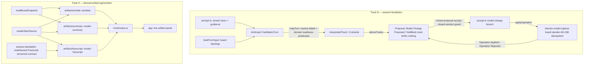

# Slice 5 — Artifacts + Facilitator Tracks Design

**Spec**: `.specs/features/slice-5-artifacts-facilitator-tracks/spec.md`
**Status**: Draft (revised 2026-09-05 after the four-lens adversarial review — domain-modeling,
code-architecture, distributed-systems, spec-quality)

---

## Architecture Overview

Two tracks. Track A adds three derived artifacts in `derived-artifact-generation` (DAG). Track
B teaches the facilitator to propose relation / pivotal / reword operations and carries them
through the existing F05 review + apply chain in `session-facilitation` — the board decider
already handles every one of those operations (Slice 3), with one gap the review surfaced
(AD-038).

**Track A** — three new capability slices in DAG, each its own Hono router mounted by
`host/routes.ts`, each a pure template/serialise over data read through the two upstream
`api.ts` surfaces plus a new `readSessionTranscript`. Routes follow ARCHITECTURE.md §5's
committed shape: `GET /workshops/:id/artifacts/model | /artifacts/summary` and
`GET /workshops/:id/sessions/:sessionId/artifacts/transcript`. No language model; nothing
materialised between requests; each render stamped `{ boardPosition, sessionRecordPosition,
renderedAt }` from the injected `Clock` (AD-012). Each artifact is also surfaced as a **live
panel** in the app that re-renders on every applied operation (like the readable account).

**Track B** — in `session-facilitation` only. Extend `FacilitationTurnSchema` and
`InterpretedTrack` with three strands; **teach `prompt.ts`** the strands and **feed
`buildTurnInput`** board topology (without this the model cannot use them); extend the
anticorruption seam (`mapTurn`) to resolve endpoint labels and apply two named
`session-facilitation/domain/` readiness predicates; generalise the `Proposal` aggregate with
a second birth event `Model Change Proposed` carrying a **named-field** `Intent` (AD-035);
extend the accept chain to build the `Operation` from the birth *event* and guard a closed
session; and fix the board decider's non-idempotent relation/pivotal/`resolve` `decide`
(AD-038) so the AD-016 crash-window retry converges correctly.



---

## Approach exploration (confirmed 2026-09-05; hardened after review)

| Fork | Chosen | Why |
| --- | --- | --- |
| How `Proposal` carries relation/pivotal/reword | **Generalise the birth event** (AD-035) — one aggregate, second birth `Model Change Proposed`, every disposition event reused byte-for-byte | Disposition machine is birth-agnostic (guards read `born`/`disposition`/`held`, never payload); `APPLY_FAILED` is reachable (unlike `Resolution`, which is why *it* is a sibling); the canvas already frames `Proposal` as "one pending model operation". Review confirmed SOUND. |
| F19 transcript home | **DAG capability over a versioned `session-facilitation` read contract** (AD-029) | Derived artifact → DAG; the projection work (dispositions, resulting-block ids, per-contributor counts) lives in SF. Review M3: the contract must be *explicitly versioned* (own Zod schema + test), not a loose `api.ts` export of SF's internal `Proposal` enum. |
| Reword-hold-back / pivotal-readiness | **Named `session-facilitation/domain/` predicates** `hasModelStructure` / `pivotalProposable` (`PIVOTAL_MIN_PLACED_EVENTS = 5`), *applied* at the seam (AD-036) | Review M2: "enough structure" / "a handful" is domain vocabulary and a product decision — name it, don't bury a magic number in the infra ACL. |
| `Intent` shape | **Named id fields** matching the `Operation` union (`predecessor`/`successor`/`inserted`/`cause`/`effect`/`target`), expanded from the label array at the seam (AD-035) | Review M1: a positional `endpoints[]` array re-expanded "by position" in `accept.ts` is where an off-by-one silently makes a wrong edge — on a frozen event, on the eval-deferred path. `InterpretedTrack`/`ProposalEvent` have no optional-count limit, so nothing forces the array inward. |
| JSON version stamp | **Composite** `{ boardPosition, sessionRecordPosition, renderedAt }` (AD-037) | Review MAJOR-2: `scope`/`stakeholderCheck`/`chosenProblem` are serialised and re-recordable with no board op — a board-position-only stamp lets two byte-different exports claim the same version. |
| Relation-op idempotency | **`decide` returns `ok([])` for an already-satisfied effect** (AD-038); `domain-model-capture` change, new task | Review BLOCKER-1: the board decider returns `already-related` (systemic) → `accept.ts` maps it to a spurious `APPLY_FAILED` with the edge on the board. Id-minting kinds reconverged via `duplicate-id`; relation ops had no such path. |
| Facilitator prompt + context | **Two dedicated tasks** (T1a `prompt.ts`, T1b `buildTurnInput` topology) | Review B1: without them the strands are schema-present but the model cannot emit them (no endpoint pairs visible, no structure signal) — and the deferred F11 eval is what would otherwise catch a green-but-dead track. |
| `mapTurn` caller wiring | **Folded into T4** (`interpret.ts` + `deps.ts` + the `model-readiness` predicate module + a post-`await` `readBoardSnapshot`) | Review B2: the single call site changes arity and needs a new full-snapshot read + `labelsProposedThisTurn` collection; unowned in the first draft. |
| Closed-session late accept | **Guard `accept.ts`** → 409 `session-closed`, Proposal re-lapsable | Review MAJOR-3: a crash-window `ACCEPTED` proposal + `finishClose` (skips `ACCEPTED`) + re-accept applies an edge to a closed board. Extends AD-025 to the accept path. |
| "Viewable in the app" | **Live panel** re-rendering on applied operations | Maintainer decision 2026-09-05. Download stays on-request + stamped. |
| `/api` route shape | **ARCHITECTURE.md §5's `/workshops/:id/artifacts/*`** — no divergence, T27 adds them to the §5 list | Review architecture-M1: `/api` is a SemVer contract (ADR-009); §5 already commits this shape. |
| AD-031 superseding AD | **Not needed** — AD-033 already redirects the tracks to Slice 5; ADR-010 slice-table wording is the Slice-6 doc pass | Review confirmed. |

---

## Code Reuse Analysis

### Existing Components to Leverage

| Component | Location | How to Use |
| --- | --- | --- |
| `prompt.ts` `buildInstructions` / `buildTurnInput` | `src/session-facilitation/infrastructure/facilitator/prompt.ts` | **Extend**: strand menu gains `propose-relation` / `propose-pivotal` / `propose-reword` with when-to-use guidance + the asymmetric-bar note for reword; `buildTurnInput` renders `follows` / `causedBy` / placement / pivotal / placed-event-count from the snapshot. |
| `assembleFacilitationContext` / the interpret capability | `src/session-facilitation/` interpret path (`interpret.ts`) | **Extend**: take one `readBoardSnapshot` *after* the model call, build `boardState` (`placedEventCount`, `hasModelStructure`, `isPlacedDomainEvent`, `labelsProposedThisTurn`), thread it into `mapTurn`. |
| Anticorruption seam | `src/session-facilitation/infrastructure/facilitator/map.ts` | **Extend**: `mapTurn` becomes a `flatMap`; imports the `model-readiness` predicates; resolves endpoint label arrays into named ids. |
| `FacilitationTurnSchema` + optional-count test | `.../facilitator/turn-schema.ts` + `.test.ts` | **Extend**: +3 discriminated members, all fields required → optional count stays 5. |
| `InterpretedTrack` union | `src/session-facilitation/domain/schema/interpreted-track.ts` | **Extend**: +3 stored strands (named id fields; `heldBack` on reword and below-threshold pivotal). |
| `Proposal` decide / evolve / replay / model | `src/session-facilitation/domain/proposal/` | **Extend**: `ProposalWriteModel` gains a `birthKind: 'block' \| 'model-change'` discriminant (not the full `Intent`); `replay` branches on birth event; `decide` gains `Propose Model Change` + `Edit Model Change`; disposition commands unchanged. |
| Synchronous accept→apply chain (AD-016/17) | `src/session-facilitation/capabilities/review-proposal/accept.ts` | **Extend**: model-change branch builds the `Operation` from the birth *event* (field-to-field, no positional spread, no id minting); closed-session guard; reuses `recordApplyOutcome`. |
| `recordApplyOutcome` | same file | **Extend**: an empty-decision `ok` from `applyOperation` (AD-038 already-satisfied) records `Operation Applied` with the returned current position. |
| Board decider | `src/domain-model-capture/domain/board/decide.ts` | **Modify** (AD-038): `sequence` / `link-cause` / `mark-pivotal` / `unmark-pivotal` / `resolve` return `ok([])` when the effect already holds, instead of a systemic `err`. `missing-edge` kinds unchanged. |
| `applyOperation` | `src/domain-model-capture/infrastructure/apply-operation.ts` | **Modify**: an empty `decide` result → `ok({ resultingBuildingBlockId: <target>, nextPosition: <current> })`, no append. |
| `deriveTracks` / `derived_track` marker (AD-021) | `src/session-facilitation/` interpret path | **Extend**: a non-`heldBack` model-change track births one `Model Change Proposed`. |
| `proposalCard` / `proposals-view` | `src/session-facilitation/domain/read-models/proposals-view.ts` | **Extend**: intent card DTO; the capability resolves endpoint ids → current labels. |
| `sessionView` | `src/session-facilitation/domain/read-models/session-view.ts` | **Extend**: a `heldBack` track (reword or pivotal) → a `notice` transcript turn. |
| `renderReadableAccount` graph helpers | `src/derived-artifact-generation/domain/render-readable-account.ts` | **Extract** to `src/derived-artifact-generation/domain/graph.ts` (pure move, no signature change); reuse in `render-summary`. |
| `artifactSource` read model + its types | `src/session-facilitation/domain/read-models/artifact-source.ts` | **Reuse**; `session-facilitation/api.ts` gains `export type { ArtifactSource, StakeholderCheck, ChosenProblem }` so DAG imports the shapes through the surface, not a deep path. |
| `list-references` rendered-reference helper | `src/derived-artifact-generation/domain/list-references.ts` | **Reuse** in the summary for block-name references. |
| `readBoardSnapshot` | `src/domain-model-capture/api.ts` | **Reuse**. |
| the `documentFor` 404 shape | `src/derived-artifact-generation/capabilities/readable-account/http.ts` | **Copy** the ~3-line 404 shape into each new capability (or lift a helper into DAG `domain/`) — never import across slices (`no-cross-slice-imports`). |
| Changeset + `.impeccable/surfaces/` | `.changeset/`, `.impeccable/` | **Reuse**. |
| `FACILITATOR_MODE=scripted` e2e harness | `e2e/`, `host/config.ts` | **Reuse** for the T25 full-pipe e2e. |

### Integration Points

| System | Integration Method |
| --- | --- |
| `domain-model-capture/api.ts` | DAG reads `readBoardSnapshot`; `accept.ts` calls `applyOperation`; `interpret.ts` reads `readBoardSnapshot` (was `readBuildingBlocks`). All existing arrows. AD-038 changes decider/`applyOperation` *behaviour*, not the surface. |
| `session-facilitation/api.ts` | Gains `readSessionTranscript` (+ its `SessionTranscript` Zod contract) and three type re-exports. DAG's `session-transcript` capability is the only caller of `readSessionTranscript`. |
| `host/routes.ts` | Mounts `modelExportRoutes`, `summaryRoutes`, `sessionTranscriptRoutes` at the §5 paths. |
| `src/app/` capture-loop | A live artifact panel: fetches the selected artifact, re-fetches on each applied operation (same trigger as the readable account), offers a stamped download. |
| ARCHITECTURE.md §5 | T27 adds the three routes to the `/api` surface list. |

---

## Components

### 0. Facilitator prompt + turn input — new-strand guidance + board topology

- **Purpose**: make the three new strands reachable by the real model.
- **Location**: `src/session-facilitation/infrastructure/facilitator/prompt.ts` (+ `prompt.test.ts`)
- **Interfaces**:
  - `buildInstructions()` — strand menu adds `propose-relation` (when the contribution implies an order / cause / placement or its removal; name endpoints by their exact board labels), `propose-pivotal` (only when the board already has a spine worth navigating; name the event), `propose-reword` (only when the model has structure; keep the person's wording).
  - `buildTurnInput(...)` — the board block list gains, per placed event, its `follows` predecessors/successors and `causedBy` links; a `pivotal` marker; a one-line "N events on the timeline" count.
- **Dependencies**: `readBoardSnapshot` fields already available to the interpret capability.
- **Reuses**: the existing instruction/section string builders.
- **Tests**: `prompt.test.ts` asserts the menu names the three strands and the turn input renders an edge + a pivotal marker for a fixture board.

### 1. `FacilitationTrack` — three new strands

- **Location**: `.../facilitator/turn-schema.ts`
- **Interfaces** (all fields required — optional count stays 5):
  - `propose-relation { track, relationKind: enum(sequence|insert-between|place|unplace|link-cause|unlink-cause), endpoints: z.array(z.string().min(1)).min(1).max(3), rationale: z.string().min(1) }`
  - `propose-pivotal { track, pivotalKind: enum(mark-pivotal|unmark-pivotal), eventLabel: z.string().min(1) }`
  - `propose-reword { track, targetLabel: z.string().min(1), newLabel: z.string().min(1).max(200) }`
  - Constraints mirrored into `.describe()`.

### 2. `InterpretedTrack` — three stored strands (named id fields)

- **Location**: `src/session-facilitation/domain/schema/interpreted-track.ts`
- **Interfaces**:
  - `propose-relation { track, proposalId, relationKind, predecessor?, successor?, inserted?, cause?, effect?, target? }` — exactly the fields the corresponding `Operation` needs, all `BuildingBlockId`; a `.refine` checks the field set matches `relationKind`.
  - `propose-pivotal { track, proposalId?, pivotalKind, target?: BuildingBlockId, heldBack: boolean, eventLabel: string }` — `proposalId`/`target` present iff `!heldBack`.
  - `propose-reword { track, proposalId?: ProposalId, target?: BuildingBlockId, newLabel: string, heldBack: boolean, targetLabel: string }` — `proposalId`/`target` present iff `!heldBack`.

### 3. `Intent` + `Model Change Proposed` / `Model Change Edited` events

- **Location**: `src/session-facilitation/domain/schema/events.ts`
- **`Intent`** (frozen once shipped, append-only replay):
  ```ts
  type Intent =
    | { kind: 'relation'; relationKind: 'sequence'|'insert-between'|'place'|'unplace'|'link-cause'|'unlink-cause';
        predecessor?: BuildingBlockId; successor?: BuildingBlockId; inserted?: BuildingBlockId;
        cause?: BuildingBlockId; effect?: BuildingBlockId; target?: BuildingBlockId }
    | { kind: 'pivotal'; pivotalKind: 'mark-pivotal'|'unmark-pivotal'; target: BuildingBlockId }
    | { kind: 'reword'; target: BuildingBlockId; newLabel: string }
  ```
- `Model Change Proposed { type, proposalId, sessionId, contributionId, intent, at }` — added to `ProposalEvent`.
- `Model Change Edited { type, proposalId, changed, at }` where `changed` carries **only** the mutable fields for the birth's `intent.kind` (endpoint id(s) / `target` / `newLabel`) — never re-asserts `kind` (mirrors `Proposal Edited` carrying only `label`).
- Every existing fold/switch over `ProposalEvent` updated for exhaustiveness (compile gate).

### 4. `model-readiness` domain predicates

- **Purpose**: name the F04/F07 readiness rules.
- **Location**: `src/session-facilitation/domain/model-readiness.ts` (+ `.test.ts`)
- **Interfaces**:
  - `hasModelStructure(snapshot): boolean` — ≥ 1 `follows`/`causedBy` edge OR ≥ 1 `pivotal` block.
  - `pivotalProposable(snapshot): boolean` — `placedDomainEventCount(snapshot) >= PIVOTAL_MIN_PLACED_EVENTS` (`= 5`, a named `const` with a one-line rationale comment referencing F07).
- **Reuses**: the `BoardSnapshot` type; no framework import (domain rule).

### 5. `mapTurn` — endpoint resolution + readiness application

- **Location**: `.../facilitator/map.ts` (+ `map.test.ts`), `interpret.ts`, `deps.ts`
- **Interface**: `mapTurn(turn, mint, resolveBlockId, boardState)` where `boardState = { placedEventCount, hasStructure, isPlacedDomainEvent(id), labelsProposedThisTurn: Set<string> }` — built by the interpret capability from **one `readBoardSnapshot` taken after the model call returns**; `labelsProposedThisTurn` accumulates `propose-building-block` labels as the turn's strands are mapped in order.
- **Rules**:
  - `propose-relation`: resolve each `endpoints` label; drop the track if any unresolved/ambiguous, arity wrong for `relationKind` (place/unplace = 1, sequence/link-cause/unlink-cause = 2, insert-between = 3), or two endpoints equal; else emit with the named id fields set.
  - `propose-pivotal`: resolve `eventLabel`; if `isPlacedDomainEvent(id) && pivotalProposable` → emit with `target` + `proposalId`; else emit `heldBack: true` (no `proposalId`/`target`).
  - `propose-reword`: resolve `targetLabel`; `heldBack = !hasStructure && !labelsProposedThisTurn.has(targetLabel)`; `proposalId`/`target` set only when not held.

### 6. `Proposal` aggregate — model-change birth & edit

- **Location**: `src/session-facilitation/domain/proposal/{model,evolve,decide,replay}.ts` (+ tests)
- **`ProposalWriteModel`**: `+ birthKind: 'block' | 'model-change'` (set by whichever birth fired). **Not** the full `Intent` — the accept handler reads `intent` off the birth *event*, not the folded model (avoids the fat-write-model smell).
- **`decide`**:
  - `Propose Model Change` → `[Model Change Proposed]`, `born`, `PROPOSED`.
  - `Edit Model Change` — legal only in `REVIEWABLE`; emits `Model Change Edited { changed }`. (No kind-mismatch branch is possible because `changed` has no `kind`.)
  - `Accept Proposal` for `birthKind === 'model-change'` — succeeds with no `buildingBlockId`.
- **`replay`**: recognise either birth; neither → `not-born`.
- **`machine.property.test.ts`**: generator includes the new commands; invariant `replay(log ++ [e]) === evolve(replay(log), e)` holds.

### 7. `deriveTracks` — model-change births

- A non-`heldBack` `propose-relation` / `propose-pivotal` / `propose-reword` track → one `Model Change Proposed` (seam-minted `proposalId`, `derived_track` marked, `expectedPosition: -1` idempotent). A `heldBack` track births nothing.

### 8. `review-proposal` accept — model-change branch + closed-session guard

- **Location**: `src/session-facilitation/capabilities/review-proposal/accept.ts` (+ `accept.test.ts`)
- **Flow** (birth `Model Change Proposed`):
  1. **Closed-session guard**: `replaySession(session).closed` → 409 `session-closed` (Proposal left re-lapsable). Applies to the block-proposal branch too.
  2. `decide(Accept Proposal)` — no `buildingBlockId`.
  3. Read `intent` from the birth event, apply the last `Model Change Edited.changed` over it. Build the `Operation` field-to-field: `relation` → `{ kind: relationKind, <named fields>, author }`; `pivotal` → `{ kind: pivotalKind, target, author }`; `reword` → `{ kind:'reword', target, label: newLabel, author }`. `author = { proposer:{name:'facilitator'}, accepter:{name: creatorName} }`.
  4. `applyOperation` — board owns concurrency (AD-022); an already-satisfied effect returns `ok` with the current position (AD-038).
  5. `recordApplyOutcome` — `Operation Applied` on `ok` (incl. the empty-decision case); `Operation Rejected` (→ `APPLY_FAILED`, surfaced) on `cycle` / `unknown-target` / `withdrawn-target` / `missing-edge` / `not-permitted`.

### 9. `domain-model-capture` board decider — AD-038 idempotency

- **Location**: `src/domain-model-capture/domain/board/decide.ts` (+ `decide.test.ts`), `src/domain-model-capture/infrastructure/apply-operation.ts` (+ `.test.ts`)
- `decide(sequence | link-cause)` on an existing edge → `ok([])`; `decide(mark-pivotal | unmark-pivotal)` on a block already in that state → `ok([])`; `decide(resolve)` on an already-resolved hot spot → `ok([])`. `insert-between` / `unsequence` / `unlink-cause` / `unplace` on a missing edge → unchanged `missing-edge` failure.
- `applyOperation` — empty `decide` result → `ok({ resultingBuildingBlockId: op.target ?? op.predecessor ?? …, nextPosition: currentPosition })`, no append.
- **Tests**: apply a relation op, then apply it again → second is `ok`, no new event, position unchanged; the crash-window shape — apply, drop the outcome commit, re-accept via the seam → `APPLIED`, one edge (integration test in `session-facilitation`).

### 10. `proposalCard` / `sessionView` read-model extensions

- **`proposalCard`**: `+ intent?: { kind; summary: string; endpoints?: {id,label}[]; target?: {id,label}; newLabel?: string }`; endpoint ids → current labels resolved by the capability from its board-snapshot read (withdrawn endpoint → label falls back to id).
- **`sessionView`**: a `heldBack` reword track → `{ kind:'notice', speaker:'facilitator', text:'Reword of "<label>" held until the model has structure', at }`; a `heldBack` pivotal track → `'Pivotal mark for "<label>" held — not enough events yet'`.

### 11. `readSessionTranscript` — versioned `session-facilitation` read contract

- **Purpose**: the ordered, annotated session record the F19 artifact renders.
- **Location**: `src/session-facilitation/domain/read-models/session-transcript.ts` + `infrastructure/read-session-transcript.ts` + `SessionTranscript` Zod schema, all exported from `api.ts` (+ tests).
- **Contract** (`SessionTranscript` — its own Zod schema + a contract test; `render-transcript` does **zero** derivation over it):
  ```ts
  interface SessionTranscript {
    format: 'big-picture'; scope: string | null
    position: number                       // session-record length
    turns: {
      kind: 'contribution' | 'question' | 'notice'
      speaker: string; text: string; at: string
      proposals: { summary: string
        disposition: 'proposed'|'edited'|'accepted'|'rejected'|'applied'|'apply-failed'|'lapsed'
        resultingBuildingBlockId: string | null }[]
    }[]
    contributorCounts: { speaker: string; accepted: number; edited: number; rejected: number }[]   // speaker asc
  }
  ```
- **Dependencies**: the `Session` stream + every `Proposal` stream for the session (`sessionProposalIds`, generalised to include `Model Change Proposed`).
- **Reuses**: `sessionView` transcript fold, `proposalCard` disposition logic. `edited` counts a proposal with ≥ 1 `Proposal Edited` / `Model Change Edited`; a `heldBack` track is a `notice` turn, counted nowhere.

### 12. `model-export` capability (DAG)

- **Route**: `GET /workshops/:id/artifacts/model` (JSON).
- **Location**: `src/derived-artifact-generation/capabilities/model-export/{http,deps}.ts` + `domain/{serialise,deserialise,model-json}.ts`.
- **Interfaces**:
  - `serialise({ snapshot, source, boardPosition, sessionRecordPosition, renderedAt }): ModelJson` — fixed key order; `buildingBlocks` sorted by id, `follows` by `(predecessor,successor)`, `causedBy` by `(cause,effect)`, `hotSpots` by id; `boardPosition` normalised `-1 → 0`; no quoted evidence.
  - `deserialise(json): Result<{ snapshot; source }, { kind:'invalid-model-json'; issues }>` — `ModelJson.parse` (bounds block/edge counts) then structural rebuild.
  - `fast-check` round-trip property; shuffled-snapshot determinism; "no contribution-body substring" assertion.
- **Reuses**: the copied 404 shape; `Clock`.

### 13. `summary` capability (DAG)

- **Route**: `GET /workshops/:id/artifacts/summary` (Markdown).
- **Location**: `.../capabilities/summary/{http,deps}.ts` + `domain/render-summary.ts`; shared `domain/graph.ts`.
- **Interface**: `renderSummary(input): { markdown; boardPosition; sessionRecordPosition }` — sections: header (format, contributors, scope + qualification, format steps not run); **Spine** (pivotal events in `follows` order, tie-break `(rank, id)`); **Shape** (per-kind counts, placed-vs-backlog, disconnected tracks, branch points — each named, ordered `(rank, id)`); **Open problems** (chosen problem + qualification; open model-affecting hot spots); **Coverage gaps** (events with no `causedBy` in-edge, unplaced events). Every section renders an explicit empty / "not run" line. No external-toolchain claim (SUM-08).
- **Reuses**: `graph.ts`, `list-references`, `kindWord`.

### 14. `session-transcript` capability (DAG)

- **Route**: `GET /workshops/:id/sessions/:sessionId/artifacts/transcript` (Markdown).
- **Location**: `.../capabilities/session-transcript/{http,deps}.ts` + `domain/render-transcript.ts`.
- **Interface**: `renderTranscript(t: SessionTranscript, renderedAt): { markdown; position }` — **pure formatting**: header (format, scope, session-record position, `renderedAt`); each turn verbatim with its proposal / disposition / resulting-block annotation; a **Contributions** table (speaker asc) with a "counts only, no judgement" line.
- **Reuses**: `readSessionTranscript` (SF api), `readArtifactSource`, `Clock`, `quoteLine`.
- **404s**: `workshop-not-found` and `session-not-found` distinct.

### 15. `graph.ts` extraction

- Move `undirectedNeighbours` / `connectedComponents` / `longestPathRanks` / `byId` from `render-readable-account.ts` into `src/derived-artifact-generation/domain/graph.ts`; readable-account re-imports. `render-readable-account.test.ts` golden fixtures are the before/after regression guard.

### 16. App live artifact panel

- **Location**: `src/app/capture-loop/` per the `.impeccable/surfaces/src-app-artifacts.md` brief.
- **Behaviour**: a panel lists the three artifacts; selecting one fetches + renders it; re-fetches on every applied operation (same signal the readable account uses); a download action produces the stamped file. Split across two tasks per the slice-4 precedent: **T24a** transport + store (with a `.integration.test.ts` for the store↔transport seam), **T24b** component + dock wiring (component tests, reduced-motion, focus order). New `docs/testing.md` M-sensor row(s) for the panel's re-fetch orchestration.

### 17. Release + reconciliation

- `.changeset/slice-5-artifacts-facilitator-tracks.md` — `minor` (→ 0.6.0).
- Issue #42 re-scoped; the eval/seed/demo follow-on filed (child of #9, blocked by #42, blocks #43); #43 blocked-by updated.
- `README.md` ADR-008 "deliberately untested" list — one precise line: *"the real model's decision to propose a relation / pivotal / reword — the schema, seam, gates, apply chain and lifecycle are unit/integration-tested with a hand-authored model response and one scripted-facilitator e2e; no test in v1 exercises the real model producing these strands."*
- `ARCHITECTURE.md` §5 — add the three artifact routes.

---

## Data Models

### `ModelJson` (derived-artifact-generation)

```ts
interface ModelJson {
  format: 'eventstormer.model'
  formatVersion: 1
  renderedAt: string
  boardPosition: number          // normalised: -1 -> 0
  sessionRecordPosition: number
  workshop: { format: 'big-picture'; scope: string | null; narratorCount: number
              stakeholderCheck: StakeholderCheck; chosenProblem: ChosenProblem }
  buildingBlocks: BlockJson[]     // sorted by id
  follows: { predecessor: string; successor: string }[]     // sorted
  causedBy: { cause: string; effect: string }[]             // sorted
}
```
`StakeholderCheck` / `ChosenProblem` imported from `session-facilitation/api.ts` (new type re-exports). `deserialise` caps `buildingBlocks`/`follows`/`causedBy` length (a generous bound, e.g. 10⁴) and rejects over-cap.

---

## Error Handling Strategy

| Error Scenario | Handling | User Impact |
| --- | --- | --- |
| Unknown workshop on any artifact route | 404 `{ error: 'workshop-not-found' }`, no file | "Workshop not found" |
| Unknown session on the transcript route | 404 `{ error: 'session-not-found' }`, no file | "Session not found" |
| Artifact render throws (a read fails mid-render) | 500, no partial file | Generic error; panel shows a retry |
| `propose-relation` endpoint unresolved / arity wrong / equal | Track dropped at `mapTurn` | Nothing appears |
| `propose-pivotal` below `pivotalProposable` | `heldBack` track + `sessionView` notice | "Pivotal mark held — not enough events yet" |
| Reword held by `hasModelStructure` | `heldBack` track + notice | "Reword held until the model has structure" |
| Accepted relation/pivotal op — effect already holds | `ok([])` from `decide` (AD-038) → `APPLIED` | Card shows applied; no error |
| Accepted relation/pivotal op — genuine failure (cycle, withdrawn endpoint, `insert-between` no edge, not permitted) | `Operation Rejected` → `APPLY_FAILED` (re-editable) | "This couldn't be applied" (F05) |
| Accept on a closed session | 409 `session-closed`; Proposal re-lapsable | "This session is closed" |
| `deserialise` given foreign / oversized JSON | `err({ kind: 'invalid-model-json', issues })` (round-trip test only — no import route) | N/A |
| Model briefly unavailable | Unchanged (AD-018 queue + ladder); new strands add schema only | Contribution still captured |
| Two model-change tracks, same pair, one contribution | Two `Proposal`s; second accept is a no-op `APPLIED` (AD-038) | Two cards; accepting both is safe |

---

## Risks & Concerns

| Concern | Location | Impact | Mitigation |
| --- | --- | --- | --- |
| Anthropic structured-output limits beyond the 24-optional rule (total property count, nesting) | `turn-schema.ts` | A schema the SDK rejects at call time | Optionals stay 5. **T26** runs a live structured-output smoke check of the assembled schema (R3-spike setup) before Execute closes; `anthropic-contract` compile-time sensor still runs under `pnpm check` (unaffected — no `Operation` union change this slice). |
| `Proposal` generalisation blast radius (`replay`, `decide`, `proposals-view`, `accept.ts`, `sessionProposalIds`, all Proposal tests) | `src/session-facilitation/domain/proposal/` | A regression in the shipped building-block path | AD-035 keeps every disposition event unchanged; only birth + edit + one `replay` branch + one `accept` branch are new. `machine.property.test.ts` extended, not rewritten. |
| Board-decider idempotency change (AD-038) touches a Slice-1/Slice-3 hot path | `domain-model-capture/domain/board/decide.ts` | A regression in direct F06/F07 editing | `decide.test.ts` + the `fast-check` replay property are the guard; the change is "systemic err → ok([])" for exactly the already-satisfied case, nothing else. Planted-violation check unchanged (no arch rule touched). |
| Determinism of the JSON export (key order, array order, `Map` iteration in `BoardSnapshot`) | `serialise.ts` | A byte-diff between two exports → core F10 guarantee fails | Fixed key-order literal + total-key sort; determinism test renders a snapshot **and a shuffled copy** and asserts byte-equality. Same shuffled-snapshot test added to `render-summary` and `render-transcript` (reliability review MINOR-5). |
| `heldBack` tracks invisible to anything reading only `Proposal` streams | `session-transcript.ts` | The record silently omits a held suggestion | `readSessionTranscript` folds `Contribution Interpreted.tracks`, not just proposals; a `heldBack` track → `notice` turn, excluded from counts. Test covers it. |
| `SessionTranscript` republishes SF's internal `Proposal` disposition enum into DAG | `api.ts`, `render-transcript.ts` | A future `Proposal`-machine change silently ripples into DAG golden fixtures | Declared as an explicit versioned contract (own Zod schema + contract test); `render-transcript` held to pure formatting, asserted in review (architecture review M3). |
| Graph-helper extraction could shift readable-account output | `render-readable-account.ts` → `graph.ts` | A byte-diff in the shipped live account | Pure move, no signature change; `render-readable-account.test.ts` golden fixtures run before/after in one task (T15). |
| Stale board-state at the gate (board gained an edge during the model `await`) | `interpret.ts`, `map.ts` | A held/released reword decided against a stale board | `boardState` read from one `readBoardSnapshot` post-`await`, same point as label resolution (AD-036, mirrors AD-025). |
| Same-contribution reword carve-out births an un-appliable proposal if accepted before its target block's own proposal | `accept.ts`, `deriveTracks` | `APPLY_FAILED` on an otherwise-fine reword | Accept ordering: the seam emits the block-proposal track before the reword track; `deriveTracks` births in track order; the person accepting out of order gets a normal `APPLY_FAILED` (recoverable). Documented in AD-036. |
| Live artifact panel adds a re-fetch orchestration branch with no sensor row | `src/app/capture-loop/` | An untested "catching up" / error branch | T24a/T24b split with a `.integration.test.ts` + `docs/testing.md` M-row, per slice-4 T48/T49. |
| Test-coverage gap: no genuine `APPLY_FAILED` through the accept seam existed pre-slice (Slice 1 T22 SPEC_DEVIATION) | `accept.ts` | The model-change `APPLY_FAILED` branch is first exercised here | T9 plants a cycle and an `insert-between`-with-no-edge and asserts `APPLY_FAILED` + surfaced card. |

> No new migration / marker table — artifacts are pure reads; `sessionProposalIds` generalisation is code-only over existing streams.

---

## Tech Decisions (only non-obvious ones)

| Decision | Choice | Rationale |
| --- | --- | --- |
| Aggregate for model-change proposals | Generalise `Proposal`'s birth event (AD-035) | Disposition machine identical incl. `APPLY_FAILED`; canvas-aligned. |
| `Intent` shape | Named id fields matching the `Operation` union; label array expanded at the seam | A positional array re-expanded by position is a silent-wrong-edge hazard on a frozen event (domain review M1). |
| Readiness gates | Named `session-facilitation/domain/` predicates, applied at the seam; `PIVOTAL_MIN_PLACED_EVENTS = 5` a named constant (AD-036) | Domain vocabulary / product decision — not a magic number in infra (domain review M2). |
| Below-threshold pivotal | Recorded as a `heldBack` track, not silently dropped (AD-036) | Symmetry with held reword; keeps the record and the future eval honest. |
| Relation-op idempotency | `decide` → `ok([])` for an already-satisfied effect; `applyOperation` → `ok` + current position (AD-038) | The AD-016 crash-window retry converged to a wrong `APPLY_FAILED` for target-bearing ops (reliability review BLOCKER-1). |
| Closed-session accept | `accept.ts` guards on `replaySession(session).closed` → 409 (AD-025 extended) | A crash-window `ACCEPTED` proposal could apply an edge to a closed board (reliability review MAJOR-3). |
| JSON version stamp | Composite `{ boardPosition, sessionRecordPosition, renderedAt }` (AD-037) | `ArtifactSource` fields are re-recordable with no board op (reliability review MAJOR-2). |
| `/api` routes | ARCHITECTURE.md §5's `/workshops/:id/artifacts/*`; T27 adds them to the §5 list | `/api` is a SemVer contract (ADR-009); §5 already commits the shape (architecture review M1). |
| `ArtifactSource` type sharing | `session-facilitation/api.ts` re-exports the types; DAG imports through the surface | "Reuse verbatim" would be a deep cross-context import; "mirror" would duplicate domain meaning (architecture review M2). |
| `SessionTranscript` | Explicit versioned read contract (Zod schema + contract test); `render-transcript` pure | Don't republish SF's internal shape as a loose `api.ts` export (architecture review M3). |
| Facilitator prompt + turn topology | Two dedicated tasks (T1a, T1b) | Without them the new strands are unreachable end-to-end (spec-quality review B1). |
| "Viewable in the app" | Live panel (re-render on applied operation) | Maintainer decision 2026-09-05. |
| AD-031 superseding AD | Not created — AD-033 covers the slice redirect; ADR-010 wording is the Slice-6 doc pass | Avoids a redundant fourth "which slice" AD. |

> **Project-level decisions** AD-035, AD-036, AD-037, AD-038 are in `.specs/STATE.md` `## Decisions`.

---

## Test Coverage Matrix (feeds Tasks)

| Area | Kind | Key assertions |
| --- | --- | --- |
| `prompt.ts` menu + turn topology | unit | menu names the 3 strands; turn input renders a `follows` edge + a pivotal marker for a fixture board |
| `FacilitationTurnSchema` +3 strands | unit | optional count == 5; each member parses; JSON-schema has no empty sub-schema; **live smoke** (T26, out of `pnpm check`) |
| `model-readiness` predicates | unit | `hasModelStructure` true on one edge / one pivotal / false on bare captures; `pivotalProposable` at 4 vs 5 placed events |
| `mapTurn` gates | unit | relation arity/resolution/equal-endpoint drops; pivotal <5 → `heldBack`; reword `heldBack` true structureless / false with one edge / false same-turn label; `boardState` from the post-`await` snapshot |
| `Proposal` model-change birth | unit (decide/replay/property) | birth → `PROPOSED`; `Edit Model Change` legal in `REVIEWABLE`; `Accept` needs no `buildingBlockId`; machine property incl. new commands |
| `deriveTracks` | unit | non-held model-change track → one `Model Change Proposed`; held track → nothing; idempotent re-run |
| board decider AD-038 | unit | duplicate `sequence`/`link-cause` → `ok([])`; already-pivotal `mark-pivotal` → `ok([])`; already-resolved `resolve` → `ok([])`; `insert-between` no edge → still `missing-edge`; `applyOperation` empty decision → `ok` + current position; `fast-check` replay property still green |
| `review-proposal` accept — model change | integration | accept relation → edge on snapshot; accept pivotal → `pivotal:true`; accept reword → label changed; reject → unchanged + `REJECTED`; planted cycle + `insert-between`-no-edge → `APPLY_FAILED` + surfaced; **crash-window shape**: apply, drop outcome commit, re-accept → `APPLIED`, one edge; accept on closed session → 409 |
| `sessionView` held notices | unit | reword + pivotal `heldBack` → correct notice turns; released → none |
| `readSessionTranscript` + `SessionTranscript` contract | unit + contract | turn order; per-turn proposal + disposition + resulting block; contributor counts (2 speakers, incl. `lapsed`/`apply-failed`), speaker-asc; held track excluded from counts; Zod contract test |
| `serialise` / `deserialise` | unit + property | golden (rich); `fast-check` round-trip (`{snapshot,source}`); shuffled-snapshot determinism; no contribution-body substring; empty board → `boardPosition:0`; oversized/foreign → `err` |
| `renderSummary` | unit | golden (rich + empty); determinism incl. **shuffled snapshot**; every section present on empty; no quoted evidence; spine `(rank,id)` order; branch points named; no toolchain claim |
| `renderTranscript` | unit | golden; determinism incl. shuffled; counts note present; `lapsed`/`apply-failed` annotations; held notice appears, excluded from counts; pure-formatting (no derivation) |
| graph-helper extraction | regression | `render-readable-account.test.ts` byte-identical before/after |
| routes (×3) | http | 200 + composite stamp on known workshop/session; 404 shapes (incl. `session-not-found`); render-throw → 500 no partial; requesting one artifact returns/writes nothing else; reads stay synchronous |
| app live panel | component + integration + e2e | T24a store↔transport `.integration.test.ts`; T24b renders returned bytes, re-fetch on applied op, error state, focus order; `docs/testing.md` M-row |
| full-pipe e2e (scripted facilitator) | e2e | one contribution → scripted `propose-relation` turn → seam → accept → board edge; then fetch the model artifact and assert a known id + the stamp |
| release | gate | `minor` changeset; ARCHITECTURE.md §5 updated; `pnpm check && pnpm build && pnpm test:e2e` green |

---

## Open Design Questions

None. Every spec assumption is confirmed (`y`) — the maintainer settled `/api` paths, the
closed-session guard, and "viewable = live panel" on 2026-09-05; AD-035/036/037/038 back the
rest.
