# Slice 5b — Facilitator Eval + Demo Seed Design

**Spec**: `.specs/features/slice-5b-facilitator-eval-demo-seed/spec.md`
**Status**: Draft

---

## Architecture Overview

Four independent tracks, one shared substrate. Only SUPS touches `**/domain/**`; EVAL and SEED
are `scripts/` + `eval/` only; PCARD is `src/app/` only.

```mermaid
graph TD
  subgraph EVAL["EVAL — eval/ + scripts/"]
    E1[extend EvalFixture schema] --> E2[new eval-oracles]
    E2 --> E3[scoreFixture rows] --> E4[report.ts splice]
    E5[8 fixtures from transcript.md]
  end
  subgraph SEED["SEED — scripts/seed/"]
    S1[interpretation.json fixture] --> S2[scripted facilitator]
    S2 --> S3[seed.ts: createRoutes + app.request replay]
  end
  subgraph SUPS["SUPS — 3 contexts"]
    U1[ApplyResult.outcome discriminant] --> U2[Resolution Superseded — inline in accept]
    U1 --> U3[Model Change Superseded — reconcile sweep]
    U2 --> U4[resolutionsView superseded fold]
    U3 --> U5[proposalsView superseded fold]
    U4 --> U6[dock card state]
    U5 --> U6
  end
  subgraph PCARD["PCARD — src/app/"]
    P1[types.ts intent mirror] --> P2[ProposalCard.vue model-change branch]
    P2 --> P3[DockFeed + PendingDrawer wiring]
    P3 --> P4[e2e dock-click, SPEC_DEVIATION removed]
  end
```



---

## Code Reuse Analysis

### Existing components to leverage

| Component | Location | How to use |
| --- | --- | --- |
| Eval harness | `eval/run.ts`, `eval/report.ts` | Extend `EvalFixture` / `EvalRow` / `scoreFixture`; `FIXTURE_FILES` list grows. `formatEvalTable` / `spliceEvalResults` unchanged. |
| Eval oracles | `src/session-facilitation/infrastructure/facilitator/eval-oracles.ts` | Add `proposesRelation(tracks, kind, labels)`, `proposesPivotal`, `proposesReword`, `flagsPhase` (already `hasFlagPhase`), `attributesToFormat`. Pure fns over `FacilitationTrack[]`. |
| `FacilitationTrack` union | `.../facilitator/turn-schema.ts:132-188` | The oracle input type; `RELATION_FIELDS` (`domain/schema/interpreted-track.ts:119`) gives endpoint order. |
| Scripted facilitator | `FACILITATOR_MODE=scripted` (`src/host/config.ts:103` branch) + `e2e/fixtures/facilitator-relations.json` | The seed's interpretation source — same mechanism, keyed by contribution body. |
| `createRoutes(config)` | `src/host/routes.ts` | The seed drives the **real** HTTP handlers in-process via `app.request()` — no network, satisfies SEED-04. |
| `loadConfig` / `HostConfig` | `src/host/config.ts` | The seed builds a config with `EVENTSTORMER_DB` pointed at the dev db + a scripted facilitator. |
| `applyOperation` / `ApplyResult` | `src/domain-model-capture/infrastructure/apply-operation.ts:14` | SUPS-01 widens the return type (one field). |
| `review-resolution/accept.ts` | `src/session-facilitation/capabilities/review-resolution/accept.ts` | SUPS-02: branch on `already-satisfied` after `applyOperation`. |
| `review-proposal/accept.ts` `recordApplyOutcome` | `.../review-proposal/accept.ts:291` | Reads the new outcome; unchanged for the reword case (handled by the sweep). |
| `reconcilePendingDerivations` | `src/session-facilitation/capabilities/interpret-contribution/` | SUPS-03: add a `supersededRewordSweep(deps)` call alongside the existing derive/hot-spot sweeps. Same `derived_track`-style marker discipline (AD-021). |
| `resolutionsView` / `proposalsView` | `src/session-facilitation/domain/read-models/` | Fold the new `Superseded` events into a `superseded` card field. Pure. |
| `replay` (resolution/proposal) | `.../resolution/replay.ts`, `.../proposal/replay.ts` + their `evolve.ts` | `evolve` gains a `Superseded` case that leaves disposition untouched. |
| `ProposalCard.vue` | `src/app/capture-loop/dock/ProposalCard.vue` | Add a model-change render branch; reuse `state` / `editing` / source-quote machinery. |
| `DockFeed.vue` / `PendingDrawer.vue` | `src/app/capture-loop/dock/` | Pass `intent` through; `kind-label.ts` gains `relation`/`pivotal`/`reword` labels. |
| `types.ts` `ProposalCard` | `src/app/capture-loop/types.ts:60` | Mirror `intent` (the server already returns it via `proposalsView`). |
| `e2e/artifacts-and-relations.spec.ts` | — | Replace the `POST /proposals/:id/accept` step with a dock click; delete the `SPEC_DEVIATION` block. |

### Integration points

| System | Integration |
| --- | --- |
| `eval/` Vitest project | New oracle unit tests join the existing `eval` project (reporter tests) — still out of the merge gate (AD-027). |
| `scripts/` + `tsconfig` | `seed.ts` joins `scripts/**/*.ts` in `tsconfig.include` (already there per STATE T21). New `pnpm seed` script in `package.json`. |
| `reconcilePendingDerivations` tick | SUPS-03's sweep is one more function in the existing scheduler tick — no new interval, no bus (AD-032 precedent). |
| `derived-artifact-generation` | Unchanged in 5b — the transcript/summary honesty work is 5c. |

---

## Components

### EVAL — fixture schema + oracles

- **Purpose**: one fixture case per F11 assertion, graded by deterministic oracles over the real
  facilitator's returned tracks.
- **Location**: `eval/fixtures/*.json`, `eval/run.ts`, `src/session-facilitation/infrastructure/facilitator/eval-oracles.ts`
- **Interfaces**:
  - `EvalFixture.expect` gains `phaseFlagged?: true`, `attributesToFormat?: string`,
    `relation?: { kind: InterpretedRelationKind; labels: string[] }`,
    `pivotal?: { kind: 'mark-pivotal' | 'unmark-pivotal'; label: string }`,
    `reword?: { from: string; to: string }`.
  - `proposesRelation(tracks, expected): boolean` — a `propose-relation` track whose
    `relationKind` matches and whose endpoint labels (resolved via the fixture's scope, or by
    substring) match `expected.labels` in order.
  - `proposesPivotal` / `proposesReword` / `attributesToFormat` — analogous.
  - `scoreFixture(fixture, outcomes)` gains one `EvalRow` per new `expect.*` key present.
- **Dependencies**: `FacilitationTrack` type only. No network, no Zod.
- **Reuses**: `contentWords` / `isPastTenseLabel` / `hasFlagPhase` unchanged; `RELATION_FIELDS`.

**Fixtures** (drawn from `transcript.md` turns — disjoint from the ADR-005 library-lending
few-shot):

| id | scope + contribution (from transcript) | assertion(s) |
| --- | --- | --- |
| `kind` *(exists)* | — | `kind` |
| `past-tense` *(exists)* | — | `pastTense` |
| `near-miss` *(exists)* | turn 4 "the expo fires the table" | `notFlagPhase` |
| `kept-phrasing` *(exists)* | turn 3 "the fire thing happens" | `sharesContentWord` |
| `phase-flagged` | turn 5 "we're into service — running plates…" | `phaseFlagged` |
| `deeper-format` | turn 6 "whenever there's an allergy on the ticket, expo has to check every plate…" | `attributesToFormat: 'policy'` |
| `relation` | turn 7 "the order has to be in before the kitchen starts cooking" | `relation: { kind: 'sequence', labels: ['order placed', 'kitchen …'] }` |
| `pivotal` | turn 8 "the moment that actually matters is when the food's delivered" | `pivotal: { kind: 'mark-pivotal', label: 'food delivered' }` |
| `reword` | turn 9 "that step I called 'order goes in' — call it 'order placed'" | `reword: { from: 'order goes in', to: 'order placed' }` |
| `integration-relation` | turn 10 "the server put the order in and the kitchen started right away" | `kind` + `relation` |
| `integration-pivotal` | turn 11 "the guest got their check — 'check dropped' is the real end" | `kind` + `pivotal`/`reword` |

`relation` / `pivotal` / `reword` / integration fixtures need a non-empty `buildingBlocks`
context so the readiness gates (AD-036) let the facilitator propose them — the fixture carries a
small pre-built board context (extend `EvalFixture` with an optional `priorBlocks: string[]`
folded into `facilitationContext.buildingBlocks`).

### SEED — offline demo loader

- **Purpose**: `pnpm seed` leaves a populated demo workshop with no network / no key.
- **Location**: `scripts/seed.ts`, `scripts/seed/interpretation.json`, `scripts/seed/facilitator.ts`
- **Interfaces**:
  - `pnpm seed [--force]` — CLI. Prints `workshop <id>` + `/workshops/<id>`.
  - `interpretation.json` — `{ [contributionBody: string]: FacilitationTurn }` — the committed
    scripted interpretation of every `transcript.md` turn (relation/pivotal/reword strands
    included), plus the scope answer.
  - `seedScriptedFacilitator(script): Facilitator` — a `Facilitator` port impl that looks up the
    turn by contribution body; throws on a miss (fixture must be complete — SEED-05 test guards).
- **Dependencies**: `createRoutes`, a `HostConfig` with `store` on the dev sqlite path + `clock`
  + the scripted facilitator; `app.request()`.
- **Flow**: resolve db path (`EVENTSTORMER_DB` ?? `./data/eventstormer.db`) → if a seed-marker
  workshop row exists and no `--force` → print refusal, exit 1 → (`--force`: delete its streams)
  → `POST /api/workshops` → `POST /api/workshops/:id/scope` (propose+accept) → `POST
  /api/workshops/:id/sessions` → per turn: `POST …/contributions`, run
  `interpretContribution(deps)` synchronously, `GET …/proposals`, `POST /api/proposals/:id/accept`
  for each → record the seeded workshop id in a `seed_marker` table (or a well-known
  `data/seed.json`). Exit 0.
- **Reuses**: the entire capability surface unchanged — the seed is just a scripted driver.

### SUPS — the explicit-outcome substrate + superseded marker

#### SUPS-01 — `ApplyResult` outcome discriminant

- **Location**: `src/domain-model-capture/infrastructure/apply-operation.ts`
- **Change**: `ApplyResult` gains `outcome: 'appended' | 'already-satisfied'`. Set
  `'already-satisfied'` in the empty-decision arm (`decided.value.length === 0`) and when the
  append path returns `duplicate-id` and the retry loop reconverges (id-minting equivalent).
  Set `'appended'` on a real append.
- **Blast radius**: every current caller ignores the field (TS structural typing — additive).
  `apply-operation.test.ts` gains an assertion per arm.

#### SUPS-02 — `Resolution Superseded`, inline

- **Location**: `src/session-facilitation/domain/schema/events.ts` (new event),
  `.../resolution/evolve.ts`, `.../resolution/decide.ts` (new command), `review-resolution/accept.ts`
- **Event**: `Resolution Superseded { resolutionId, hotSpotId, supersededByReference, at }` on
  `ResolutionEvent`.
- **Command**: `Record Resolution Superseded` → emitted by `decide` when the resolution is
  `ACCEPTED` (not yet `APPLIED`); `evolve` sets `disposition: 'APPLIED'` + `superseded: true` on
  the write model (so `replay` ends `APPLIED`, SUPS-05).
- **Handler**: in `acceptResolutionRoutes`, after `applied = applyOperation(...)`:
  ```
  if (applied.ok && applied.value.outcome === 'already-satisfied') {
    const boardRef = readBoardSnapshot(deps, workshopId).blocks.find(b => b.id === hotSpotId)?.reference
    if (boardRef !== undefined && boardRef !== reference) {
      append Record Resolution Superseded { supersededByReference: boardRef }
    } else {
      append Record Hot Spot Resolved            // genuinely idempotent — same text
    }
  } else if (applied.ok) { append Record Hot Spot Resolved }
  ```
  The board read is the Board context's own snapshot (a legitimate downstream read via
  `domain-model-capture/api.ts` — audit confirmed `derived-artifact-generation` and
  `interpret.ts` already do this; it is not cross-aggregate peeking, the Board is the authority
  on the resolved reference). It is used to *populate the recorded event*, not to compute a
  read-time answer.

#### SUPS-03 — `Model Change Superseded`, reconciliation sweep

- **Location**: new `src/session-facilitation/capabilities/interpret-contribution/superseded-sweep.ts`,
  wired into `reconcilePendingDerivations`; `events.ts` (new event), `proposal/evolve.ts`, `proposal/decide.ts`
- **Event**: `Model Change Superseded { proposalId, target, supersededByLabel, at }` on `ProposalEvent`.
- **Sweep** `supersededRewordSweep(deps)`:
  - For each open session, for each `reword` model-change proposal whose disposition is `APPLIED`
    and whose stream has no `Model Change Superseded`:
    - read the board label for `intent.target`; if it `!== newLabel` (folded) → append
      `Record Model Change Superseded { supersededByLabel: <board label> }`.
  - Idempotent: the "no marker yet" guard + the label check both re-evaluate cleanly next tick.
  - Open-sessions-only, consistent with AD-021's accepted bound (a reword race after close is
    not reachable — closed sessions reject accepts, AD-025).
- **Why a sweep, not the winning handler**: the losing proposal is the *earlier* one; its
  handler finished long ago. This is the domain-modeling eventual-consistency seam (event →
  subscriber → a *different* aggregate, own transaction). The sweep is the existing transport
  for exactly this (AD-021 / AD-032). Doing it in the winning handler would need a cross-sibling
  write with a crash window and no backstop.

#### SUPS-05/06 — fold, don't diff

- **`evolve`** (both aggregates): `Superseded` case sets `superseded: true`, disposition
  unchanged.
- **`resolutionCard` / `proposalCard`**: add `superseded?: boolean` from `writeModel.superseded`.
  Pure fold — **no** board-snapshot read in the read model (the read model has no `deps.store`
  for the board and must not gain one).

#### SUPS-07 — dock card state

- **Location**: `src/app/capture-loop/types.ts` (`superseded?: boolean` on `ProposalCard` /
  `ResolutionCard`), `ProposalCard.vue` / `ResolutionCard.vue`
- **Render**: when `superseded`, the `receipt` state renders "✓ superseded — <other text> was
  kept" instead of the plain applied receipt. One new `state` branch.

### PCARD — dock model-change proposal card

- **Purpose**: the dock renders relation/pivotal/reword proposals; accept/edit/reject/hold work.
- **Location**: `src/app/capture-loop/types.ts`, `.../dock/ProposalCard.vue`, `.../dock/DockFeed.vue`,
  `.../dock/PendingDrawer.vue`, `.../dock/kind-label.ts`, `.../transport/proposals.ts` (type only),
  `e2e/artifacts-and-relations.spec.ts`
- **Interfaces**:
  - `types.ts` `ProposalCard` gains `intent?: { kind: 'relation'|'pivotal'|'reword'; summary: string;
    endpoints?: {id,label}[]; target?: {id,label}; newLabel?: string }` (mirrors `proposalsView`'s
    `IntentCard` exactly).
  - `ProposalCard.vue` — when `intent` is present: pill = `kindLabel(intent.kind)`, body =
    `intent.summary`, edit affordance swaps the changed endpoint/label (emits `edit` with a
    structured payload the dock maps to `POST /proposals/:id/edit`'s `changed` shape).
  - `DockFeed.vue` — the live cluster renders a model-change card via the same component; a
    `liveLabel` fallback covers `intent`.
  - `PendingDrawer.vue` — overflow/parked groups render the model-change summary; no `blockKind`
    pill crash (guard).
- **Dependencies**: server path already complete (`GET /sessions/:id/proposals` returns `intent`;
  `POST /proposals/:id/{accept,edit}` handle model-change — verified in `review-proposal/http.test.ts`).
- **Reuses**: all disposition/held/overflow machinery in `ProposalCard.vue`.

---

## Data Models

### New events (`session-facilitation/domain/schema/events.ts`)

```typescript
// on ResolutionEvent
const ResolutionSuperseded = z.object({
  type: z.literal('Resolution Superseded'),
  resolutionId: ResolutionId,
  hotSpotId: BuildingBlockId,
  supersededByReference: ResolutionReference,   // the winning reference, recorded (not a pointer)
  at: z.string(),
})

// on ProposalEvent
const ModelChangeSuperseded = z.object({
  type: z.literal('Model Change Superseded'),
  proposalId: ProposalId,
  target: BuildingBlockId,
  supersededByLabel: z.string().min(1),         // the winning label, recorded
  at: z.string(),
})
```

Both carry **raw facts** (ids + the winning text as a recorded value) — no rollup, no count,
AD-023-consistent. Neither is a disposition transition.

### `ApplyResult` (`domain-model-capture/infrastructure/apply-operation.ts`)

```typescript
export interface ApplyResult {
  resultingBuildingBlockId: BuildingBlockId
  nextPosition: number
  outcome: 'appended' | 'already-satisfied'   // NEW
}
```

### `EvalFixture.expect` (`eval/run.ts`)

```typescript
interface Expect {
  kind?: 'domain-event' | 'actor' | 'system'
  pastTense?: true
  notFlagPhase?: true
  sharesContentWord?: true
  phaseFlagged?: true                                              // NEW
  attributesToFormat?: string                                      // NEW — expected format word
  relation?: { kind: InterpretedRelationKind; labels: string[] }   // NEW
  pivotal?: { kind: 'mark-pivotal' | 'unmark-pivotal'; label: string } // NEW
  reword?: { from: string; to: string }                            // NEW
}
// + optional priorBlocks?: string[]  on EvalFixture
```

---

## Error Handling Strategy

| Scenario | Handling | User impact |
| --- | --- | --- |
| `pnpm eval` — one model call fails | outcome `undefined`, counted not-passed for that run, loop continues (existing) | one low `k/5` row |
| `pnpm eval` — no key | non-zero exit, message names `.env.local` (existing) | — |
| `pnpm eval --report` — README markers missing | `spliceEvalResults` throws (existing) | script fails loudly |
| `pnpm seed` — fixture missing a turn's interpretation | `seedScriptedFacilitator` throws with the body; SEED-05 test catches it in CI | seed fails loudly, never a half-seed |
| `pnpm seed` — prior seed exists, no `--force` | print refusal, exit 1 | actionable message names `--force` |
| SUPS — `applyOperation` returns a real `Rejection` | unchanged — `review-resolution` LAPSE / `review-proposal` `APPLY_FAILED` paths | unchanged |
| SUPS — board read in SUPS-02 returns no block (withdrawn hot spot mid-race) | fall through to `Record Hot Spot Resolved` (no supersede claim without evidence) | resolution shows plain `APPLIED` |
| PCARD — card with neither `blockKind` nor `intent` | render nothing for that card (forward-compat guard) | — |

---

## Risks & Concerns

| Concern | Location | Impact | Mitigation |
| --- | --- | --- | --- |
| SUPS-02's board read couples `review-resolution` to `readBoardSnapshot`'s block shape | `review-resolution/accept.ts` | a snapshot-shape change ripples here | It already imports `applyOperation` / `Operation` from `domain-model-capture/api.ts`; `readBoardSnapshot` is on that same public surface. Read one field (`reference`), not the whole block. |
| The reword sweep runs every tick over every open session's proposals | `superseded-sweep.ts` | O(open reword proposals) per tick | Same cost profile as the existing derive / hot-spot sweeps (AD-021); guard on `APPLIED reword with no marker` keeps it O(pending). |
| `decideReword` still re-applies (last-write-wins) — the board briefly shows the loser's label until the winner accepts | `board/decide.ts:126` | a window where the board label is "wrong" | Out of scope (Slice 6 `BoardWriteModel` widen). 5b records the *outcome* honestly once both have applied; the transient is a single-user non-issue. |
| Eval `relation`/`pivotal`/`reword` fixtures depend on the readiness gates (AD-036) letting the model propose | `eval/fixtures/*.json` | a fixture that never triggers the strand scores 0/5 for the wrong reason | `priorBlocks` seeds enough board context; the `smoke:facilitation-schema` probe already proved the live model emits all three strands (STATE, `8de1dad`). |
| `pnpm seed` writing to the same db `pnpm dev` uses | `scripts/seed.ts` | a running `pnpm dev` could race the seed | Seed is a one-shot dev tool; document "run it with `pnpm dev` stopped". `--force` wipes only the seed-marker workshop, never the whole db. |
| e2e change could mask a real dock regression if the card doesn't actually render | `e2e/artifacts-and-relations.spec.ts` | false green | The e2e asserts the *rendered* card text + that accept happens via a real click, not just an absence of the `POST`. |

> Board decider convergence + all read models: audit found **no problem** — not re-listed here.

---

## Tech Decisions (only non-obvious ones)

| Decision | Choice | Rationale |
| --- | --- | --- |
| Seed interpretation source | A committed `scripts/seed/interpretation.json` replayed by a scripted `Facilitator` impl; `pnpm seed` makes no model call | Deterministic, offline, free, CI-safe. A live-model seed costs ~$1 and a key per run — hostile for a first-run / demo tool. → **AD-039** |
| Seed drives real handlers | `createRoutes(config)` + `app.request()` in-process, not lower-level function calls | SEED-04 — the board state must be produced by the same handlers a user's clicks would hit; `app.request` is zero-network and exercises the full Hono + capability + `EventStore` path. |
| `ApplyResult` gains an explicit outcome | `outcome: 'appended' \| 'already-satisfied'` | software-design "make the outcome explicit / method names state the assumption"; two callers (SUPS-02, and 5c's `blocksAdded`) need to branch on it now — earned, not speculative. → **AD-040** |
| Superseded is a recorded event, folded — never a read-time diff | `Resolution Superseded` / `Model Change Superseded` marker events; `superseded` is `writeModel.superseded` | domain-modeling: "dedup/resequencing is a business decision — push it into the model", "query less, event more"; the read-model-diff alternative is the named anti-pattern. |
| Per-kind detection mechanism | `resolve` → inline in the losing (second) handler on `already-satisfied`; `reword` → reconciliation sweep on the earlier proposal | The `resolve` loser's handler is running when it finds out; the `reword` loser's finished long ago (last-write-wins board). The sweep is the existing eventual-consistency transport (AD-021 / AD-032). |
| Marker records the winning text | `supersededByReference` / `supersededByLabel` carry the value, not a pointer | Consistent with the PRD's "reference is a recorded value, not a live pointer"; lets the card and (5c) the transcript render the outcome without a board read. |
| Eval oracle style | deterministic pure fns over `FacilitationTrack[]`, endpoint labels matched by order + substring | ADR-008 "you write the bespoke reducer regardless"; a fuzzy/LLM grader would make the eval non-deterministic on top of the model's own variance. |

> **Project-level decisions to append to `.specs/STATE.md` `## Decisions` at Execute:**
> **AD-039** (seed = committed interpretation fixture, replayed offline through real handlers)
> and **AD-040** (`ApplyResult` carries an explicit `appended` / `already-satisfied` outcome;
> the pattern for any converging single-writer apply).

---

## Open questions — resolved (agent's discretion, user "proceed" 2026-09-09)

1. **Seed marker storage** → `data/seed.json` file (no migration; the seed is a dev-only concern).
2. **`pnpm seed` scope answer** → replayed as a `set-scope` propose+accept (SEED-04 consistency).
3. **Eval `priorBlocks`** → flat `string[]` of labels folded as `domain-event` blocks; revisit
   if a fixture needs an actor/system endpoint.
4. **Seed orchestration location** → `src/host/seed.ts` (testable by the `domain` Vitest
   project); `scripts/seed.ts` is a thin jiti shim.
