# Slice 5c — Honest-Record Hardening Design

**Spec**: `.specs/features/slice-5c-honest-record-hardening/spec.md`
**Status**: Approved (2026-09-18)

---

## Architecture Overview

No new components, no new patterns — every fix extends a machine that already exists and follows
a reconciliation shape this codebase already uses three times (AD-021 `derived_track`, AD-032
`hot_spot_sweep`, `superseded-sweep.ts`'s reword race). Four independent surfaces, each touching
one seam:

```mermaid
graph TD
    subgraph "F4 — transcript resolution lane"
        A[readSessionTranscript] -->|+ resolution streams| B[sessionTranscript]
        B -->|+ resolutions field, via resolutionsView| C[SessionTranscript contract]
        C --> D[renderTranscript — pure, + resolution-lane branch]
    end
    subgraph "F5 — honest blocksAdded"
        E[applyOperation] -->|ApplyResult.outcome AD-040| F[recordApplyOutcome]
        F -->|Operation Applied.outcome NEW FIELD| G[Proposal stream]
        G --> H[assembleFacilitationContext blocksAdded count]
    end
    subgraph "F6/F7 — no stream stuck ACCEPTED"
        I[review-resolution accept] -->|any rejection reason| J[Record Resolution Rejected]
        K[reconcilePendingDerivations tick] -->|re-drive| L[acceptProposal / acceptResolution]
        L -->|idempotent, AD-038| M[applyOperation retry]
    end
    subgraph "F9 — decide.ts comment"
        N[decide.ts convergence branches] -.->|doc comment only| N
    end
```



Nothing here spans a transaction across two contexts — `review-resolution`'s wider recording and
the stuck-`ACCEPTED` sweep both stay inside AD-016/AD-021's existing separate-append shape. No new
architecture, no approach exploration needed (this is Design-inline territory for three of the
four surfaces); it is written up because the spec is Large (17 requirements across independent
files).

---

## Code Reuse Analysis

### Existing Components to Leverage

| Component | Location | How to Use |
| --- | --- | --- |
| `resolutionsView` / `resolutionCard` | `src/session-facilitation/domain/read-models/resolutions-view.ts` | Already computes disposition, `superseded`, `supersededByReference` per resolution — the transcript lane maps this output 1:1, no new derivation logic (per the spec assumption: "no board read needed"). |
| `sessionResolutionIds` | same file | Same fold pattern as `sessionProposalIds` — orders the lane by stream position. |
| `superseded-sweep.ts`'s `supersededRewordSweep` | `src/session-facilitation/capabilities/interpret-contribution/superseded-sweep.ts` | The exact shape for the new stuck-`ACCEPTED` sweep: iterate `openSessions`, read a stream, guard on write-model state, `decideOrEmpty` + append. Copy the shape, not the sweep. |
| `reconcilePendingDerivations` | `src/session-facilitation/capabilities/interpret-contribution/interpret.ts:585` | Gains one more call in its per-open-session loop, same place `reconcileHotSpots` / `finishClose` already sit. |
| `ApplyResult.outcome` (AD-040) | `src/domain-model-capture/infrastructure/apply-operation.ts` | Already threads `'appended' \| 'already-satisfied'` out of `applyOperation` — `recordApplyOutcome` in `review-proposal/accept.ts` currently discards it; F5 makes it flow onto the `Operation Applied` event. |
| `LAPSE_REASONS` set | `src/session-facilitation/capabilities/review-resolution/accept.ts:29` | Kept as the 200-vs-422 status split; F6 only removes it as the *recording* gate. |
| `console.warn` observability style | `hot-spot-sweep.ts:216`, `superseded-sweep.ts` (implicit — no warn today) | The sweep logs the same way the codebase already logs a retry-next-tick condition — no new logging abstraction. |

### Integration Points

| System | Integration Method |
| --- | --- |
| `domain-model-capture` (`applyOperation`) | Unchanged surface — `ApplyResult.outcome` already exists (AD-040); no `domain-model-capture` file changes in this slice. |
| `derived-artifact-generation` (`renderTranscript`) | Consumes the widened `SessionTranscript` contract; stays a pure formatter — one new branch, zero new derivation (ADR-008). |
| App SPA (P2 only) | `POST /proposals/:id/edit { field, label }` already exists server-side (`review-proposal/http.ts:124`) — P2 is frontend-only. |

---

## Components

### 1. `SessionTranscript` contract — resolution lane (F4 / HREC-01…04)

- **Purpose**: Carry one entry per `propose-resolution` track so the F19 transcript accounts for
  every hot-spot resolution, not just proposals.
- **Location**: `src/session-facilitation/domain/read-models/session-transcript-contract.ts`,
  `session-transcript.ts`, `src/session-facilitation/infrastructure/read-session-transcript.ts`
- **Interfaces**:
  - `SessionTranscript.resolutions: TranscriptResolution[]` (new field, zod-validated)
  - `sessionTranscript(sessionEvents, proposalStreams, resolutionStreams, options): SessionTranscript` (gains one parameter)
  - `readSessionTranscript` reads `sessionResolutionIds(sessionEvents)` and each `resolutionStream(id)`, same shape as the existing proposal-stream loading two lines above it
- **Dependencies**: `resolutionsView` (`resolutionCard`) for the per-resolution fold
- **Reuses**: `resolutionCard`'s existing `disposition` / `superseded` / `supersededByReference` —
  mapped to the transcript's lowercase disposition enum (see Data Models)

### 2. `renderTranscript` — resolution-lane formatting (F4 / HREC-03…04)

- **Purpose**: Render the resolution lane as Markdown, pure function of the contract.
- **Location**: `src/derived-artifact-generation/domain/render-transcript.ts`
- **Interfaces**: unchanged signature; one new local `resolutionsSection(transcript.resolutions)`
  helper, only rendered (a `## Resolutions` heading) when the array is non-empty (HREC-04)
- **Dependencies**: none beyond what's already imported
- **Reuses**: `quoteLine`, the existing table-building style from `contributionsTable`

### 3. `Operation Applied.outcome` — honest `blocksAdded` (F5 / HREC-05…07)

- **Purpose**: Let a proposal's applied event carry whether the apply appended or converged to a
  no-op, so a caller can exclude the no-op from any "how much did we add" count.
- **Location**: `src/session-facilitation/domain/schema/events.ts` (`OperationApplied` schema),
  `src/session-facilitation/domain/proposal/model.ts` (`Record Operation Applied` command +
  `Operation Applied` event union member), `src/session-facilitation/domain/proposal/decide.ts`
  (`decideRecordApplied` threads it through)
- **Interfaces**: `outcome?: 'appended' | 'already-satisfied'` — **optional**, so a historical
  event with no `outcome` field still parses (HREC-06 edge case: old streams fall back to
  counting all `Operation Applied`)
- **Dependencies**: `ApplyResult.outcome` (AD-040), already surfaced by `applyOperation`
- **Reuses**: the AD-040 discriminant end to end — `recordApplyOutcome` in
  `review-proposal/accept.ts` now passes `outcome: applied.value.outcome` into the
  `Record Operation Applied` command instead of dropping it

The one call site that computes a `blocksAdded` count —
`assembleFacilitationContext`'s `priors` reduce in `interpret.ts:134-137` — changes from
`.filter((event) => event.type === 'Operation Applied').length` to also require, per proposal
stream, that the write model is not `superseded` and the `Operation Applied` event's `outcome` is
not `'already-satisfied'`.

### 4. `review-resolution` — record every rejection (F6 / HREC-08)

- **Purpose**: Never leave a `Resolution` stuck `ACCEPTED` with an unrecorded board rejection.
- **Location**: `src/session-facilitation/capabilities/review-resolution/accept.ts`
- **Interfaces**: unchanged route shape. The `else` branch (currently: return 422, write nothing)
  becomes: append `Record Resolution Rejected { reason: applied.error.kind }` **and then** return
  422 (or, if the reason is a genuine lapse reason, 200 with the resolution card — unchanged
  behavior via the existing `LAPSE_REASONS` split, now used only to pick the response, never to
  gate the recording)
- **Dependencies**: none new — `decide.ts`'s `decideRecordRejected` already accepts any
  `reason: string` (`z.string().min(1)`, no allow-list on the schema side)
- **Reuses**: `decideOrEmpty` (`review-resolution/accept.ts:143`), the same helper the lapse branch
  already calls

### 5. Stuck-`ACCEPTED` sweep (F7 / HREC-09…12)

- **Purpose**: Re-drive any `Proposal` / `Resolution` left `ACCEPTED` with no later apply-outcome
  event — the AD-016 crash window, now closed by a reconciliation pass instead of only a human
  re-accept.
- **Location**: new file `src/session-facilitation/infrastructure/stuck-accepted-sweep.ts`, wired
  into `reconcilePendingDerivations` (`interpret.ts:585-595`) alongside `reconcileHotSpots` /
  `supersededRewordSweep`
- **Interfaces**:
  - `sweepStuckAccepted(deps, sessionId): void` — for each `sessionProposalIds` /
    `sessionResolutionIds` stream whose write-model `disposition === 'ACCEPTED'`, calls the
    extracted re-drivable accept function
  - `acceptProposal(deps, id): Handled` — **extracted** from
    `review-proposal/accept.ts`'s `acceptRoutes` handler body (the id→birth→session→workshop→
    dispatch logic, lines 213-246 today), so both the HTTP route and the sweep call the same
    function instead of duplicating it
  - `acceptResolution(deps, id): Handled` — same extraction from
    `review-resolution/accept.ts`'s `acceptResolutionRoutes` handler body
- **Dependencies**: `ReviewProposalDeps` / `ReviewResolutionDeps` (`{ store, clock }`) — a subset
  of `InterpretContributionDeps`, so the sweep can call both extracted functions with the deps it
  already has (structural typing, no new deps wiring)
- **Reuses**: the entire accept chain unchanged in behavior — a re-drive on an `ACCEPTED` stream
  skips the `Accept …` append (already past it) and goes straight to
  apply → `recordApplyOutcome`, exactly like a human re-clicking "accept" today. AD-038's
  idempotent `decide` and the `duplicate-id`-converges-to-applied path (already exhaustively
  tested) are what makes the re-drive safe to run every tick (HREC-10).

**Logging (HREC-12)**: `info` right before each re-drive attempt (`stuck-accepted-sweep: re-driving
proposal/resolution <id>`); `warn` if the write model is *still* `ACCEPTED` after the call returns
(mirrors `hot-spot-sweep.ts`'s existing `console.warn(...retrying next tick)` — no new persisted
tick-counter table. A stream stays `ACCEPTED` post-re-drive only in the documented closed-session
race, so `warn` firing every tick until the maintainer notices is the accepted signal, not a
threshold — introducing a marker table to count to N would be exactly the kind of speculative
abstraction the working agreements forbid for a condition this rare at v1 single-user scale).

**Closed-session bound (HREC-11)**: the sweep runs from `reconcilePendingDerivations`, which is
already open-sessions-only (AD-021's documented bound). No new code needed to enforce it — it's
inherited for free by sitting inside the existing loop. The doc comment on
`sweepStuckAccepted` states this explicitly (own line, no `.specs/` id).

### 6. `decide.ts` convergence-scope comment (F9 / HREC-13…14)

- **Purpose**: State the deliberate asymmetry between the AD-038 family (`ok([])` on an
  already-satisfied effect) and `withdraw` / `reinstate` / `reopen` / `unsequence` / `unannotate`
  (genuine failures), so a future reader doesn't file it as a bug.
- **Location**: `src/domain-model-capture/domain/board/decide.ts`, directly above the
  `export const decide` docstring (~line 515)
- **Interfaces**: none — comment-only change
- **Reuses**: cites `AD-038` (permitted per AGENTS.md — durable ADR/AD ids are allowed in
  comments); carries no `.specs/` task id

### 7. Dock relation/pivotal endpoint edit (P2, HREC-15…17)

- **Purpose**: Let a participant correct a wrong relation endpoint or pivotal target from the
  card, without rejecting and waiting for a re-propose.
- **Location**: `src/app/capture-loop/dock/ProposalCard.vue`,
  `src/app/capture-loop/dock/interactions/review-proposal/use-review-proposal.ts`,
  `src/app/capture-loop/types.ts`
- **Interfaces**: `ProposalCard.vue` gains an endpoint-select + label-input pair for a
  `relation`/`pivotal` card (today `editableIntent` only covers `reword`); emits
  `'edit-intent', { field, label }` where `field` comes from `RELATION_FIELDS[relationKind]` (for
  a relation) or is the literal `'target'` (for a pivotal); `editModelChangeProposal` (already
  wired, `use-review-proposal.ts:36`) posts `{ field, label }` unchanged
- **Dependencies**: `ProposalIntent.endpoints` (already resolved with `{ id, label }` per
  `types.ts:69`) supplies the endpoint picker's options
- **Reuses**: the entire server contract (`POST /proposals/:id/edit`, `unknown-label` 422) is
  already built and tested (5b) — this is presentation-layer work only, following the reword
  edit's existing `editing` / `draft` / emit pattern in `ProposalCard.vue` line ~58-86

**422 handling (HREC-16)**: `use-review-proposal.ts`'s `run(...)` wrapper already surfaces a
rejected promise to the card without losing in-progress state (the reword path does this today);
the endpoint editor reuses the same `run` call, so `unknown-label` naturally keeps the form open —
no new error-handling path needed.

---

## Data Models

### `SessionTranscript` (contract addition)

```typescript
interface TranscriptResolution {
  resolutionId: string
  hotSpotId: string
  reference: string
  disposition: 'proposed' | 'edited' | 'accepted' | 'applied' | 'superseded' | 'rejected' | 'lapsed'
  supersededByReference?: string
}

interface SessionTranscript {
  // ...unchanged fields...
  resolutions: TranscriptResolution[]
}
```

**Relationships**: One entry per `sessionResolutionIds(sessionEvents)` member, mapped from
`resolutionCard` — `disposition` is `resolutionCard.disposition.toLowerCase()` (via a `DISPOSITION`
lookup mirroring `session-transcript.ts`'s existing one for proposals) **except** when
`resolutionCard.superseded === true`, in which case the transcript disposition is the literal
`'superseded'` string regardless of the underlying `APPLIED` disposition (AC2).

### `Operation Applied` event (additive field)

```typescript
interface OperationApplied {
  type: 'Operation Applied'
  proposalId: string
  resultingBuildingBlockId: string
  outcome?: 'appended' | 'already-satisfied' // NEW — optional for backward compatibility
  at: string
}
```

**Relationships**: Set from `ApplyResult.outcome` at the one write site
(`review-proposal/accept.ts`'s `recordApplyOutcome`). Absent on every event written before this
slice — every reader treats `undefined` as `'appended'` (HREC-06 edge case).

---

## Error Handling Strategy

| Error Scenario | Handling | User Impact |
| --- | --- | --- |
| `review-resolution` gets an unclassified board rejection | `Record Resolution Rejected { reason }` is appended before the 422 is returned | Same 422 the caller sees today, but the `Resolution` stream is no longer stuck — a later transcript / summary read is honest |
| Sweep re-drives an `ACCEPTED` proposal whose session closed mid-tick | `applyOperation` proceeds fine (board doesn't know about session state), but the extracted `acceptProposal`'s session-closed guard returns 409 before it gets there, so nothing is recorded | Left `ACCEPTED` for a session that will never reopen — documented accepted gap (edge case, spec line ~208), consistent with AD-021's existing open-sessions-only bound |
| Sweep re-drives twice (two ticks) on the same now-resolved stream | Second call is a pure no-op — `disposition` is already terminal, the extracted accept function's own top-of-function short-circuit (`APPLIED`/`APPLIED-or-LAPSED` early return) fires | No duplicate events, no duplicate log line beyond the first tick's `info` |
| Historical `Operation Applied` event with no `outcome` | Treated as `'appended'` everywhere it's read | No crash, no regression on pre-slice data |

---

## Risks & Concerns

| Concern | Location | Impact | Mitigation |
| --- | --- | --- | --- |
| Extracting `acceptProposal` / `acceptResolution` out of the Hono route handlers touches code covered by the existing accept-chain test suite (`accept.test.ts`) | `review-proposal/accept.ts`, `review-resolution/accept.ts` | A careless extraction could change status-code mapping or the `Handled` shape the route returns | Extraction is mechanical (move the function body, keep the same `Handled` return type, route becomes `return context.json(acceptProposal(deps, id).json, acceptProposal(deps, id).status)`); the full existing test suite is the regression gate — no test is weakened to make this pass |
| The stuck-`ACCEPTED` sweep runs on every tick for every open session's every proposal/resolution, even when nothing is stuck | `stuck-accepted-sweep.ts` | A no-op read-and-check per stream per tick — bounded by open-session count, same complexity class as `supersededRewordSweep` (AD-021: "stays O(pending)") | Acceptable at v1 single-user scale; matches the existing sweep's cost profile exactly |
| `console.warn` on every tick a stream stays stuck could be noisy if the closed-session race were common | `stuck-accepted-sweep.ts` | Log spam, not a correctness bug | Documented as rare (crash window is sub-millisecond, per AD-021); revisit if it proves noisy in practice — not a blocker for this slice |

> No fragile code, tech debt, or security risk found beyond the above during the code reuse walk.

---

## Tech Decisions (only non-obvious ones)

| Decision | Choice | Rationale |
| --- | --- | --- |
| Where the `blocksAdded` fix lives | The one call site in `interpret.ts`'s `assembleFacilitationContext`, not a new exported helper | It's the only place in the codebase that counts `Operation Applied` for a "blocks added" tally (verified by grep) — no second call site to keep in sync, so no abstraction earned |
| `review-resolution`'s allow-list | Kept, repurposed from "what gets recorded" to "what gets a 200 vs a 422" | Matches the spec assumption exactly; avoids inventing a new status-mapping rule where the existing set already does the job |
| Stuck-sweep re-drive mechanism | Extract the existing route-handler logic into a plain function, call it from both the route and the sweep | Mirrors the AD-021 pattern (idempotent re-drivable derivation) instead of building a second, parallel accept implementation that could drift from the route's behavior |
| No new SQLite marker table for the sweep's "bounded ticks" warn | Log `warn` every tick the stream is still `ACCEPTED` post-re-drive, no counter | The one reachable stuck case (closed-session race) is already documented as an accepted gap; a counter table adds persistence + migration for a condition with no accepted resolution path anyway |

> **Project-level decisions to append to `.specs/STATE.md` `## Decisions`** (next slot **AD-041**):
> `Operation Applied` gains an optional `outcome: 'appended' | 'already-satisfied'` field (backward
> compatible), threaded from `ApplyResult.outcome` (AD-040) — the pattern for any future caller
> that must distinguish a real apply from a converged no-op on the recorded stream, not just at
> the point of applying it. Recorded at Tasks/Execute once Design is approved.

---

## Tips

(carried from the template — not restated per-item; see `references/design.md`)
