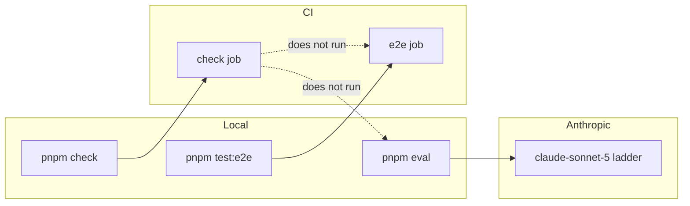

# Test-suite hardening Design

**Spec**: `.specs/features/test-suite-hardening/spec.md`
**Context**: `.specs/features/test-suite-hardening/context.md`
**Status**: Draft

---

## Architecture Overview

No new bounded context. Three seams, all existing:

1. **Merge gate** — CI gains a sibling job of `check`; `pnpm check` and pre-push stay browser-free.
2. **Deterministic suite** — extend colocated Vitest files; replace self-referential oracles with literals.
3. **Eval** — pure F11 oracles in facilitator infrastructure (run under `pnpm test`); live loop in repo-root `eval/` (run under `pnpm eval` only).

Chosen approach: **one feature, four phases** (oracles → domain/UI holes → gates/docs → eval). Rejected: splitting eval into a second PR (maintainer included it); putting E2E inside `pnpm check` (maintainer: CI-only); promptfoo/evalite (ADR-008: wrong shape for k/N).



---

## Code Reuse Analysis

### Existing Components to Leverage

| Component | Location | How to Use |
| --- | --- | --- |
| Playwright spec + config | `e2e/capture-loop.spec.ts`, `playwright.config.ts` | Locator rewrite + CI invokes `pnpm test:e2e` as-is |
| Board sticky `aria-label` | `src/app/capture-loop/board/BoardWall.vue` | E2E: `getByLabel('event: Book borrowed')` |
| Dock composer label | `DockComposer.vue` `aria-label="Describe what happens"` | Already used in E2E |
| G/W/T helpers | `session/decide.test.ts`, `proposal/decide.test.ts` | Same `replay` + `decide` + `isOk`/`isErr` |
| Accept HTTP harness | `review-proposal/accept.test.ts` | Seed helpers; add 404/409 cases |
| Dock fetch-mock pattern | `FacilitatorDock.test.ts` | Same `fetchMock` + store seed |
| CreateWorkshop mount | `CreateWorkshop.test.ts` | Same router + `stubGlobal('fetch')` |
| Adapter `scripted` / `depsWith` | `anthropic-adapter.test.ts` | Copy for `askOpening` ladder |
| `buildInstructions` / `buildTurnInput` | `prompt.ts` | Eval live path |
| `createAnthropicFacilitator` | `anthropic-adapter.ts` | Eval live path (real `generate`, not scripted) |
| `loadConfig` scripted vs live | `host/config.ts` | Eval does **not** boot host; calls facilitator port directly |
| CI Node/pnpm setup | `.github/workflows/ci.yml` `check` job | Duplicate in `e2e` job (install + Playwright) |
| Lefthook pre-push | `lefthook.yml` | Replace piecemeal steps with `pnpm check` |

### Integration Points

| System | Integration Method |
| --- | --- |
| GitHub Actions | New `e2e` job, `needs` none, same `concurrency` group; both `check` and `e2e` required |
| Anthropic | Eval only; `ANTHROPIC_API_KEY` from the developer’s `.env.local` via `process.loadEnvFile` in the eval entry, never from CI secrets |
| knip | `knip.json` `entry` += `eval/run.ts` so the live runner is not “unused”; oracles are imported from tests |

---

## Components

### CI e2e job

- **Purpose**: Merge-gate the existing Playwright spec.
- **Location**: `.github/workflows/ci.yml`
- **Interfaces**: Job `e2e`: checkout → pnpm/action-setup → setup-node 24.16.0 → `pnpm install --frozen-lockfile` → `pnpm exec playwright install --with-deps chromium` → `pnpm test:e2e`
- **Dependencies**: None on `check` (parallel). Fail the workflow if either job fails.
- **Reuses**: `playwright.config.ts` webServer env (scripted, empty key).

### Literal snapshot helper (optional, same-file)

- **Purpose**: One explicit expected Board snapshot for the withdraw sequence used by replay + roundtrip.
- **Location**: Inline in each test file (do not extract a shared production helper). Duplicate the literal; do not import `project` as the oracle.
- **Reuses**: Existing `op()` / `Operation.parse` fixtures.

### F11 oracles

- **Purpose**: Deterministic graders for kind, past tense, flag-phase presence, content-word overlap.
- **Location**: `src/session-facilitation/infrastructure/facilitator/eval-oracles.ts`
- **Interfaces**:
  - `contentWords(text: string): string[]` — lowercase tokens, drop stopwords of length ≤ 2
  - `sharesContentWord(label: string, segment: string): boolean`
  - `isPastTenseLabel(label: string): boolean` — last whitespace-separated word ends in `ed` (v1 heuristic; documented as such)
  - `hasFlagPhase(tracks: { track: string }[]): boolean`
  - `proposedKinds(tracks: { track: string; blockKind?: string }[]): string[]`
- **Dependencies**: none (no Zod, no AI SDK)
- **Reuses**: None. Tests in `eval-oracles.test.ts` colocated.

### Eval runner

- **Purpose**: N=5 live `interpret` calls per fixture; reduce to k/N rows; optional README splice.
- **Location**: `eval/run.ts`, `eval/fixtures/*.json`, `eval/report.ts`
- **Interfaces**:
  - `pnpm eval` → `jiti eval/run.ts` (or vitest project `name: 'eval'` with `include: ['eval/**/*.eval.ts']` — pick **plain node script + vitest only for oracles in src**, not a third vitest project, if knip/vite include globs fight. **Decision:** third Vitest project `eval` as ADR-008, `include: ['eval/**/*.test.ts']`, `fileParallelism: false`, `testTimeout: 120_000`. `pnpm eval` = `vitest run --project eval`. Domain/app projects must **not** include `eval/`.)
  - `pnpm eval --report` = same run then splice README
- **Dependencies**: `createAnthropicFacilitator` with the real `generate` used in production (`host/config.ts` live branch). Load `.env.local` then `.env` the same way `host/index.ts` does.
- **Reuses**: `buildInstructions`, `buildTurnInput`, empty-ish `FacilitationContext` per fixture (`scopeStatement` = restaurant kitchen service).

### README eval markers

- **Purpose**: F11 “results published in the README”.
- **Location**: `README.md` between `<!-- eval:results -->` and `<!-- /eval:results -->`
- **Reuses**: ADR-008 marker names.

---

## Data Models (if applicable)

### Eval fixture (committed JSON)

```typescript
interface EvalFixture {
  id: string // 'kind' | 'past-tense' | 'near-miss' | 'kept-phrasing'
  scopeStatement: string // restaurant / kitchen, never library
  contribution: { speaker: string; body: string }
  expect: {
    kind?: 'domain-event' | 'actor' | 'system'
    pastTense?: true
    notFlagPhase?: true
    sharesContentWord?: true
  }
}
```

**Relationships**: One fixture file per case under `eval/fixtures/`. Assertions with a missing `expect` key are not scored for that case.

### Eval row (report)

```typescript
interface EvalRow {
  caseId: string
  assertion: string
  passed: number // 0..5
  runs: 5
}
```

No `passed/runs` rolled into a single suite %.

---

## Error Handling Strategy

| Error Scenario | Handling | User Impact |
| --- | --- | --- |
| CI Playwright install fails | Job red | PR cannot merge |
| E2E spec flakes | No retries (`retries: 0`); fix product or spec | Same as today locally |
| `ANTHROPIC_API_KEY` missing for eval | Exit 1, stderr message | Developer sets `.env.local` |
| Eval provider-down on one run | That run fails the assertion (counts in k) | Visible as 3/5 not “skipped” |
| Eval schema-invalid | That run fails | Same |
| README markers missing on `--report` | Exit 1 | Maintainer restores markers |

---

## Risks & Concerns

| Concern | Location | Impact | Mitigation |
| --- | --- | --- | --- |
| Eval cost / flaky k/N | Anthropic | ~$0.60–1.20 per full run; non-determinism | Out of CI; N=5 makes flake visible instead of hidden; no retry-until-green |
| Past-tense heuristic is crude (`…ed`) | `eval-oracles.ts` | False fail on irregulars (“built”, “made”) | Fixtures use regular past (“ticket fired”, “order sent”); document heuristic |
| CI e2e duration | new job | Extra minutes per PR | Parallel with `check`; Chromium only; existing 45s test timeout |
| knip flags `eval-oracles.ts` if only eval/ imports it | facilitator folder | `pnpm check` red | Colocated `.test.ts` imports it (knip sees the test). Eval runner imports from `~/session-facilitation/...` |
| Self-referential property test remains | `replay.test.ts` property | Consistency ≠ correctness | Comment + literal sibling test (TSH-03) |
| README “Status: scaffold” is widely linked | `README.md` | Drift continues if we only patch testing.md | TSH-17 rewrites Status + real-vs-stubbed |

---

## Tech Decisions (only non-obvious ones)

| Decision | Choice | Rationale |
| --- | --- | --- |
| E2E vs `pnpm check` | CI job only | Maintainer; keeps Stop/pre-push fast. **AD-027** |
| Eval runner | Third Vitest project `eval`, not promptfoo | ADR-008 |
| Oracles in `src/` | Yes, unit-tested under `pnpm test` | Iron Law 2: deterministic graders belong on the merge gate |
| Past-tense oracle | Suffix `ed` on last word | Cheap, fixture-controlled; Slice 5 may replace with a word list |
| Content words | Tokens length > 2, lowercased | Matches PRD “content words in the segment” |
| Eval does not boot Hono | Direct `Facilitator.interpret` | Judgment is the model call, not HTTP wiring (already tested) |
| Pre-push | `pnpm check` as one job | Identity with AGENTS.md; lint included |

**Project-level:** AD-027 — CI merge gate is `pnpm check` + `pnpm build` + `pnpm test:e2e`. `pnpm check` and pre-push stay without e2e and without eval. Eval is `pnpm eval`, out of CI (ADR-008 unchanged).
