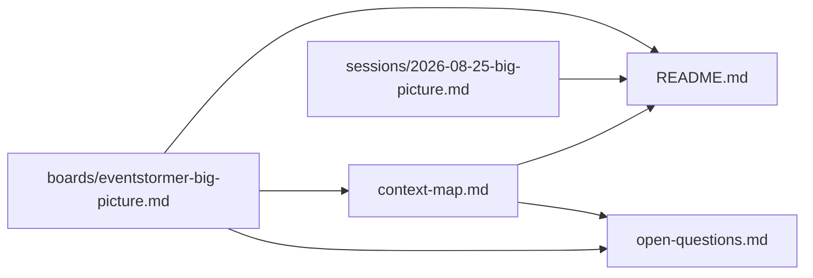

# Domain model — EventStormer

**Everything in this directory is `draft`.** It was written by an EventStorming workshop
(`eventstorming`), not confirmed by a human domain-modeling session. Promotion to
`confirmed` belongs to `ddd-strategic-design`, in a session with a human — never
this skill, however flatly a participant stated something during the workshop.

## Headline finding

A Big Picture workshop on EventStormer's own business line — running one facilitated session, end
to end — produced a 32-event board across four kinds (Domain Event, Actor, System, Hot Spot), none
of them a Command/Policy/Read Model/Aggregate (Big Picture's own legend held throughout, even
though the board went deliberately fine-grained by the participant's explicit choice). The most
valuable finding wasn't a new event — it was discovering that three things that looked like
distinct "hot spot" event types (an absent stakeholder, an admitted knowledge gap, an unanswered
question at close) are actually one creation event (**Hot Spot Raised**) preceded by three different
policy relationships that Big Picture can name but not model. That's ready-made scope for a Process
Modelling session on "the capture loop."

The PRD (`docs/product/PRD.md`) was used as seed material at the participant's request rather than
eliciting from a blank page — every candidate pulled from it is `[glossary]`, and none of them
count as confirmed without the explicit yes recorded in the session record.

## Artifact status

| Artifact | Status | Confidence | Evidence |
|---|---|---|---|
| Events (board) | draft | High | PRD F01–F10, confirmed line-by-line by the participant; session record has the full quality-gate reasoning, plus a resumed round that re-verified the event catalog (PRD completeness audit) and the four pivotal events (three independent tournament proposals, converged) |
| Actors/Systems | draft | High | Participant confirmed the list complete; no further additions offered |
| Hot spots / open questions | draft | Medium | Several are genuine PRD gaps (restore inconsistency, reinstatement conflict rule) with no resolution attempted here — that's correct, not incomplete |
| Candidate seams (`context-map.md`) | draft | Low | Derived in close-out from four of six heuristics (two — people in the room, body language — are physical and unavailable to this skill); single business line, so seams are necessarily thin |
| Chosen problem | not chosen | — | See exit gate outcome below |

## Dependency graph

```
boards/eventstormer-big-picture.md
  └── open-questions.md (hot spots and policy findings derived from the board)
  └── context-map.md (candidate seams derived from the board, in close-out)
sessions/2026-08-25-big-picture.md
  └── (backs every claim in the board and open-questions.md with its reasoning)
```

Lineage is tracked by `domain_lineage.py`, not hand-maintained here — see the stamps in each file's
front matter and run `python3 <skill-dir>/scripts/domain_lineage.py check` before trusting a date.

## Draft declaration

Nothing here is ready to build from without a human confirmation session. In particular: the three
policy relationships and the reinstatement-conflict rule are real gaps this workshop found and
intentionally did not resolve — that is Process Modelling's or Design-Level's job, not this
document's.

<!-- BEGIN lineage:index -->

| Artifact | Workshop | Scope | Status | Updated |
|---|---|---|---|---|
| [README.md](README.md) | big-picture | eventstormer-session | draft | 2026-08-25 |
| [boards/eventstormer-big-picture.md](boards/eventstormer-big-picture.md) | big-picture | eventstormer-session | draft | 2026-08-25 |
| [context-map.md](context-map.md) | big-picture | eventstormer-session | draft | 2026-08-25 |
| [open-questions.md](open-questions.md) | big-picture | eventstormer-session | draft | 2026-08-25 |
| [sessions/2026-08-25-big-picture.md](sessions/2026-08-25-big-picture.md) | big-picture | eventstormer-session | draft | 2026-08-25 |



<!-- END lineage:index -->