# Domain model — EventStormer

**Everything here is `draft`**, at two different depths. The strategic decisions below (goal,
subdomains, contexts, context map) were made **in session with the participant** and are
`[confirmed]` at the strategic level. What's still `draft` and unconfirmed is depth: each bounded
context's own event-stormed model (Commands/Events/Policies/Queries) is deferred to a future
Process Modelling or Design-Level EventStorming session, one context at a time.

## Where this stands

1. **Big Picture EventStorming (2026-08-25)** produced the discovered-form input: a 32-event board,
   candidate seams, and open questions. Its full write-up is preserved at
   `sessions/2026-08-25-big-picture.md` and `boards/eventstormer-big-picture.md`; its own
   discovered-form context map is preserved at `sessions/big-picture-context-map.md`.
2. **Process Modelling on "the capture loop" (2026-08-25)** formalized the three policy
   relationships Big Picture could name but not model (Absent Stakeholder Named / Knowledge Gap
   Revealed / Session-Closed-with-unresolved-Question → Raise Hot Spot), plus two more the session
   discovered: `Interpret Contribution` (a policy the board never named) and `Question Answered`
   (a question-track event distinct from any content outcome a contribution produces). Full model
   in `boards/capture-loop.md`; session record in `sessions/2026-08-25-process-modelling.md`; five
   acceptance tests in `acceptance-tests.md`.
3. **Design-Level EventStorming on "Question & Hot Spot Resolution" (2026-08-26)** stopped short
   of its intended scope: seam-validation found the named context does not hold as independent —
   evidence points to folding it into Session Facilitation. It also produced durable domain content
   for whichever context ended up owning it: the two-kind hot-spot split (informational vs.
   model-affecting) and the resolution invariant (deliberate confirmation + a recorded reference).
   Full reasoning in `sessions/2026-08-26-design-level.md`.
4. **DDD Strategic Design session (2026-08-25), phases 01–07**, run directly with the participant
   (not re-derived from the storm), produced:
   - `domain-and-goals.md` — the Impact Map: an AI reliably playing the facilitator role, so
     domain experts get a living model without needing a trained human facilitator.
   - `subdomain-catalog.md` — originally 4 v1 subdomains classified (Session Facilitation: Core,
     Domain Model Capture: Core, Question & Hot Spot Resolution: Supporting, Derived Artifact
     Generation: Supporting) + 1 roadmap subdomain (Multiplayer/Real-time Collaboration: Core,
     provisional) + 2 Technical Mechanisms (Voice Input, AI Model Provider Integration). See item 5.
   - Four bounded contexts, 1:1 with the v1 subdomains, each with a `canvas.md` (boundary
     confirmed) and `ubiquitous-language.md` (thin — deeper terms deferred) under
     `bounded-contexts/<slug>/`. See item 5.
   - `context-map.md` — the decided integration map: Domain Model Capture as an Open-Host Service
     hub, serving Session Facilitation (Customer/Supplier), Question & Hot Spot Resolution
     (Conformist), and Derived Artifact Generation (Conformist); Session Facilitation itself a
     smaller OHS to Question & Hot Spot Resolution (Conformist). See item 5.
5. **`ddd-strategic-design` decision (2026-08-26): adopted the Design-Level finding from item 3.**
   Question & Hot Spot Resolution is retired as a bounded context and subdomain; its capability
   (resolution judgment) and read model (open hot spots/questions) folded into Session
   Facilitation, now v1's only Core context of that shape. Three v1 subdomains remain (Session
   Facilitation incl. resolution: Core, Domain Model Capture: Core, Derived Artifact Generation:
   Supporting) + the same roadmap/Technical Mechanism rows. Every affected artifact was updated in
   the same pass: `context-map.md` (Decision section + diagram/table), `subdomain-catalog.md`,
   `bounded-contexts/session-facilitation/{canvas,ubiquitous-language}.md` (merged content), and
   the retired `bounded-contexts/question-hot-spot-resolution/{canvas,ubiquitous-language}.md`
   (marked superseded, preserved for provenance). See `open-questions.md` #17.
6a. **Big Picture EventStorming, resumed (2026-08-26).** Fixed the pivotal-event scoping defect
   item 6 below's Design-Level session had found but not corrected (`open-questions.md` #23): the
   original board's `Session Started` conflated two scopes. Split into `Workshop Started` (folds
   the former "Workshop Format Selected" candidate; once per workshop, fixes the format) and
   `Session Started` (repeatable; once per session, only after `Domain Problem Stated`, since a
   workshop determines what it's about before any session runs) — confirmed live by the
   participant, who also confirmed `Session Started` keeps its pivotal marker despite repeating.
   Pivotal events go from four to five. `boards/eventstormer-big-picture.md` updated in place (it
   was `draft`, so this is the ordinary resume case, not the confirmed-artifact one). Full reasoning
   in `sessions/2026-08-26-big-picture.md`.
6. **Design-Level EventStorming on Session Facilitation (2026-08-26)** turned this context's
   event-stormed model from `UNCONFIRMED` into `[storm]`-confirmed. Found a structural gap the
   Big Picture never modelled: `Workshop` (persists, one fixed format, spans many sessions and
   people) versus `Session` (one sitting). Named `Workshop` as the aggregate protecting four
   invariants — format immutability, a hard creator/accepted-invitee gate on starting a session,
   invitation state transitions (invited/accepted/declined/revoked), and "at most one open session
   per workshop" for v1. Formalized the resolution capability inherited from the retired Question &
   Hot Spot Resolution session as actual commands/events (`Resolution Proposed/Accepted/Rejected`,
   `Resolve Hot Spot` → `Hot Spot Resolved`), resolved the Proposal-vs-Contribution ambiguity
   (`open-questions.md` #7), and corrected the Big Picture board's pivotal-event scoping (`Session
   Started`/`Domain Problem Stated`/`Chosen Problem Named/Skipped` are workshop-scoped, not
   session-scoped — the board itself is left unedited). All six completion rules held. Full
   reasoning in `sessions/2026-08-26-design-level-session-facilitation.md`.
7. **Design-Level EventStorming on Domain Model Capture (2026-08-26)** turned this context's
   event-stormed model from `UNCONFIRMED` into `[storm]`-confirmed, **then corrected its own
   aggregate design in a same-day resume.** First draft: one `Board` aggregate for the whole
   workshop's graph. The participant challenged this directly — most operations (Reword,
   `causedBy`, annotation) have no invariant reaching outside one or two records, so one shared
   boundary was a mis-derivation. Corrected, invariant-first, to four Building Block aggregates
   (Domain Event, Actor, System, Hot Spot — each protecting only its own local state) plus
   `Timeline`, one per **connected component** of sequenced events (a workshop holds many at once),
   sized to exactly what the no-cycle invariant needs. `Timeline`'s birth (via `Place`, a factory),
   merge (`Sequence` across two components), and split (only when a removal actually disconnects
   the graph — a bifurcation that reunites downstream stays whole) are all stated precisely. Renamed
   the generic `Relate`/`Unrelate` into `Sequence`/`Unsequence` (`follows`), `Link Cause`/
   `Unlink Cause` (`causedBy`, owned by the Domain Event), and `Annotate`/`Unannotate` (Hot Spot's
   own target) — the shared verb read as awkward once three structurally different aggregates were
   involved. Added two cascading policies: withdrawing an Actor/System auto-`Unlink Cause`s every
   Domain Event that referenced it; withdrawing anything a Hot Spot annotates auto-withdraws that
   Hot Spot. Also dissolved the reinstatement conflict rule entirely (`open-questions.md` #3):
   `Reinstate` never restores relations or Timeline membership. Added `Insert Between` (atomic, not
   a bundle) and `Reopen` (Resolved → Open). Settled most of the `Hot Spot Raised` payload question
   (`open-questions.md` #13/#28); left the `kind` field's own necessity, a possible "destroy"
   operation, `Insert Between`'s atomicity guarantee, and the PRD's "timeline" (UI surface) vs.
   `Timeline` (aggregate) naming overlap as genuine open questions rather than guessed answers. All
   six completion rules held, both before and after the correction. Full reasoning in
   `sessions/2026-08-26-design-level-domain-model-capture.md`.

## Artifact status

| Artifact | Status | Confidence | Evidence |
|---|---|---|---|
| `domain-and-goals.md` | draft, confirmed strategically | High | Confirmed with the participant this session; Impact Map built from their own words |
| `subdomain-catalog.md` | draft, confirmed strategically | High | Every row confirmed with the participant, including the Multiplayer row's provisional flag |
| `bounded-contexts/*/canvas.md` (boundary sections) | draft, confirmed strategically | High | Purpose/type/team/boundary rationale confirmed per context |
| `bounded-contexts/session-facilitation/canvas.md` (event-stormed model) | draft, `[storm]`-confirmed | High | Design-Level pass, 2026-08-26 — `Workshop`/`Session`, the resolution mechanic, and every command/event/policy confirmed live; full reasoning in `sessions/2026-08-26-design-level-session-facilitation.md` |
| `bounded-contexts/domain-model-capture/canvas.md` (event-stormed model) | draft, `[storm]`-confirmed | High | Design-Level pass, 2026-08-26 — `Board` aggregate, every command/event/invariant confirmed live; full reasoning in `sessions/2026-08-26-design-level-domain-model-capture.md` |
| `bounded-contexts/derived-artifact-generation/canvas.md` (event-stormed model section) | `UNCONFIRMED` | — | Deliberately deferred — needs its own Design-Level pass, the last unstormed v1 context |
| `bounded-contexts/question-hot-spot-resolution/canvas.md` | **superseded** | — | Retired 2026-08-26 — `ddd-strategic-design` adopted the Design-Level finding that this context folds into Session Facilitation. Preserved unedited (plus a retirement notice) for provenance; see `context-map.md`'s "Decision" section |
| `bounded-contexts/session-facilitation/ubiquitous-language.md` | draft, mostly confirmed | High | Confirmed live through worked scenarios, Design-Level pass 2026-08-26 |
| `bounded-contexts/domain-model-capture/ubiquitous-language.md` | draft, mostly confirmed | High | Extended live, Design-Level pass 2026-08-26 — `Board`, Placed/Unplaced, Relate/Unrelate, Insert Between, Reopen |
| `bounded-contexts/derived-artifact-generation/ubiquitous-language.md` | draft, thin | Medium | Terms sourced from the Big Picture board where available; deeper elicitation deferred |
| `context-map.md` (decided form) | draft, confirmed strategically | High | Every relationship reasoned through the U/D test and confirmed with the participant; the 2026-08-26 Question & Hot Spot Resolution collapse is now adopted and reflected in the diagram/table; the Facilitation↔Capture relationship note tightened 2026-08-26 to name `Resolve Hot Spot` explicitly; the Domain Model Capture Design-Level session (2026-08-26) validated the seam without moving it |
| `sessions/big-picture-context-map.md` (discovered form) | superseded, preserved for provenance | — | The storm's original `[inferred]` candidates; see `context-map.md`'s "Superseded draft" section for how each maps to the decided form |
| `boards/capture-loop.md` | draft | High | Process Modelling session with the participant, 2026-08-25; every event/command/policy confirmed live, hot spots accounted for |
| `acceptance-tests.md` | draft | High | Five tests from the capture-loop session, six more (6–11) from Design-Level on Session Facilitation, and eight more (12–19) from Design-Level on Domain Model Capture, 2026-08-26 |
| `open-questions.md` | draft, live | — | Storm-originated hot spots + 5 items from the strategic-design session (7–11) + 3 items from Process Modelling (13–15) + 4 items from the Question & Hot Spot Resolution Design-Level session (17–20) + 9 items from the Session Facilitation Design-Level session (21–29) + 4 items from the Domain Model Capture Design-Level session (32–35); #3/#8/#13/#17/#20/#21/#22/#28 now resolved |

## Next steps (named, not started)

- A PRD update covering everything this line of sessions has found: F08's resolve/close mechanic
  and the new `Reopen` verb, `place`/`unplace` named as real operations, and `Insert Between` — the
  participant has taken ownership, to do after this workshop concludes (open-questions.md #29).
- Multiplayer/Real-time Collaboration needs its own scoping pass before it can be classified with
  confidence, now with a concrete consistency concern to resolve — "at most one open session per
  workshop" is a v1 simplification, not a permanent answer (open-questions.md #10/#26).
- Design-Level on Derived Artifact Generation, still entirely unstormed at the event level and now
  the last v1 context without one (open-questions.md #9 — on-demand vs. materialized export still
  undecided).
- Three smaller, genuinely open questions from the Domain Model Capture session, none owned yet:
  whether Hot Spot's `kind` field earns its place (open-questions.md #32), a possible "destroy"
  operation for true duplicates that currently conflicts with the confirmed no-merge rule
  (open-questions.md #33), and where `Insert Between`'s atomicity guarantee belongs in the
  operation-log model (open-questions.md #34).

## Dependency graph

```
boards/eventstormer-big-picture.md
  └── sessions/2026-08-25-big-picture.md
  └── sessions/big-picture-context-map.md (discovered form, superseded)
  └── open-questions.md (hot spots 1–6, from the storm)
  └── boards/capture-loop.md (Process Modelling harvest)
        └── sessions/2026-08-25-process-modelling.md
        └── acceptance-tests.md
        └── open-questions.md (items 13–15, from this session)
domain-and-goals.md
  └── subdomain-catalog.md
        └── bounded-contexts/<slug>/canvas.md (boundary) — one per subdomain
        └── bounded-contexts/<slug>/ubiquitous-language.md
              └── context-map.md (decided form)
                    └── open-questions.md (items 7–11, from this session)
        └── bounded-contexts/session-facilitation/canvas.md (Design-Level, 2026-08-26)
              └── bounded-contexts/session-facilitation/ubiquitous-language.md
              └── acceptance-tests.md (items 6–11)
              └── open-questions.md (items 21–29)
              └── sessions/2026-08-26-design-level-session-facilitation.md
```

## Draft declaration

Nothing here is ready to build from without further sessions. The strategic layer (goal,
subdomains, contexts, integration patterns) is confirmed; the tactical layer inside each context
(commands, events, policies, aggregates) is not, and is named explicitly as `UNCONFIRMED` rather
than guessed.

<!-- BEGIN lineage:index -->

| Artifact | Workshop | Scope | Status | Updated |
|---|---|---|---|---|
| [README.md](README.md) | design-level | domain-model-capture | draft | 2026-08-26 |
| [acceptance-tests.md](acceptance-tests.md) | design-level | domain-model-capture | draft | 2026-08-26 |
| [boards/capture-loop.md](boards/capture-loop.md) | process-modelling | capture-loop | draft | 2026-08-26 |
| [boards/eventstormer-big-picture.md](boards/eventstormer-big-picture.md) | big-picture | eventstormer-session | draft | 2026-08-26 |
| [bounded-contexts/derived-artifact-generation/canvas.md](bounded-contexts/derived-artifact-generation/canvas.md) | ddd-strategic-design | eventstormer-session | draft | 2026-08-25 |
| [bounded-contexts/derived-artifact-generation/ubiquitous-language.md](bounded-contexts/derived-artifact-generation/ubiquitous-language.md) | ddd-strategic-design | eventstormer-session | draft | 2026-08-25 |
| [bounded-contexts/domain-model-capture/canvas.md](bounded-contexts/domain-model-capture/canvas.md) | design-level | domain-model-capture | draft | 2026-08-26 |
| [bounded-contexts/domain-model-capture/ubiquitous-language.md](bounded-contexts/domain-model-capture/ubiquitous-language.md) | design-level | domain-model-capture | draft | 2026-08-26 |
| [bounded-contexts/question-hot-spot-resolution/canvas.md](bounded-contexts/question-hot-spot-resolution/canvas.md) | ddd-strategic-design | eventstormer-session | draft | 2026-08-26 |
| [bounded-contexts/question-hot-spot-resolution/ubiquitous-language.md](bounded-contexts/question-hot-spot-resolution/ubiquitous-language.md) | ddd-strategic-design | eventstormer-session | draft | 2026-08-26 |
| [bounded-contexts/session-facilitation/canvas.md](bounded-contexts/session-facilitation/canvas.md) | design-level | session-facilitation | draft | 2026-08-26 |
| [bounded-contexts/session-facilitation/ubiquitous-language.md](bounded-contexts/session-facilitation/ubiquitous-language.md) | design-level | session-facilitation | draft | 2026-08-26 |
| [context-map.md](context-map.md) | design-level | session-facilitation | draft | 2026-08-26 |
| [domain-and-goals.md](domain-and-goals.md) | ddd-strategic-design | eventstormer-session | draft | 2026-08-25 |
| [open-questions.md](open-questions.md) | big-picture | eventstormer-session | draft | 2026-08-26 |
| [sessions/2026-08-25-big-picture.md](sessions/2026-08-25-big-picture.md) | big-picture | eventstormer-session | draft | 2026-08-25 |
| [sessions/2026-08-25-process-modelling.md](sessions/2026-08-25-process-modelling.md) | process-modelling | capture-loop | draft | 2026-08-26 |
| [sessions/2026-08-26-big-picture.md](sessions/2026-08-26-big-picture.md) | big-picture | eventstormer-session | draft | 2026-08-26 |
| [sessions/2026-08-26-design-level-domain-model-capture.md](sessions/2026-08-26-design-level-domain-model-capture.md) | design-level | domain-model-capture | draft | 2026-08-26 |
| [sessions/2026-08-26-design-level-session-facilitation.md](sessions/2026-08-26-design-level-session-facilitation.md) | design-level | session-facilitation | draft | 2026-08-26 |
| [sessions/2026-08-26-design-level.md](sessions/2026-08-26-design-level.md) | design-level | question-hot-spot-resolution | draft | 2026-08-26 |
| [sessions/big-picture-context-map.md](sessions/big-picture-context-map.md) | big-picture | eventstormer-session | draft | 2026-08-25 |
| [subdomain-catalog.md](subdomain-catalog.md) | ddd-strategic-design | eventstormer-session | draft | 2026-08-26 |

```mermaid
graph LR
  acceptance_tests_md["acceptance-tests.md"] --> README_md["README.md"]
  boards_eventstormer_big_picture_md["boards/eventstormer-big-picture.md"] --> README_md["README.md"]
  bounded_contexts_domain_model_capture_canvas_md["bounded-contexts/domain-model-capture/canvas.md"] --> README_md["README.md"]
  context_map_md["context-map.md"] --> README_md["README.md"]
  domain_and_goals_md["domain-and-goals.md"] --> README_md["README.md"]
  open_questions_md["open-questions.md"] --> README_md["README.md"]
  sessions_2026_08_26_big_picture_md["sessions/2026-08-26-big-picture.md"] --> README_md["README.md"]
  sessions_2026_08_26_design_level_domain_model_capture_md["sessions/2026-08-26-design-level-domain-model-capture.md"] --> README_md["README.md"]
  sessions_2026_08_26_design_level_session_facilitation_md["sessions/2026-08-26-design-level-session-facilitation.md"] --> README_md["README.md"]
  sessions_2026_08_26_design_level_md["sessions/2026-08-26-design-level.md"] --> README_md["README.md"]
  subdomain_catalog_md["subdomain-catalog.md"] --> README_md["README.md"]
  boards_capture_loop_md["boards/capture-loop.md"] --> acceptance_tests_md["acceptance-tests.md"]
  bounded_contexts_domain_model_capture_canvas_md["bounded-contexts/domain-model-capture/canvas.md"] --> acceptance_tests_md["acceptance-tests.md"]
  bounded_contexts_session_facilitation_canvas_md["bounded-contexts/session-facilitation/canvas.md"] --> acceptance_tests_md["acceptance-tests.md"]
  boards_eventstormer_big_picture_md["boards/eventstormer-big-picture.md"] --> boards_capture_loop_md["boards/capture-loop.md"]
  sessions_2026_08_26_big_picture_md["sessions/2026-08-26-big-picture.md"] --> boards_eventstormer_big_picture_md["boards/eventstormer-big-picture.md"]
  context_map_md["context-map.md"] --> bounded_contexts_derived_artifact_generation_canvas_md["bounded-contexts/derived-artifact-generation/canvas.md"]
  subdomain_catalog_md["subdomain-catalog.md"] --> bounded_contexts_derived_artifact_generation_canvas_md["bounded-contexts/derived-artifact-generation/canvas.md"]
  boards_capture_loop_md["boards/capture-loop.md"] --> bounded_contexts_domain_model_capture_canvas_md["bounded-contexts/domain-model-capture/canvas.md"]
  boards_eventstormer_big_picture_md["boards/eventstormer-big-picture.md"] --> bounded_contexts_domain_model_capture_canvas_md["bounded-contexts/domain-model-capture/canvas.md"]
  bounded_contexts_session_facilitation_canvas_md["bounded-contexts/session-facilitation/canvas.md"] --> bounded_contexts_domain_model_capture_canvas_md["bounded-contexts/domain-model-capture/canvas.md"]
  context_map_md["context-map.md"] --> bounded_contexts_domain_model_capture_canvas_md["bounded-contexts/domain-model-capture/canvas.md"]
  open_questions_md["open-questions.md"] --> bounded_contexts_domain_model_capture_canvas_md["bounded-contexts/domain-model-capture/canvas.md"]
  sessions_2026_08_26_design_level_domain_model_capture_md["sessions/2026-08-26-design-level-domain-model-capture.md"] --> bounded_contexts_domain_model_capture_canvas_md["bounded-contexts/domain-model-capture/canvas.md"]
  subdomain_catalog_md["subdomain-catalog.md"] --> bounded_contexts_domain_model_capture_canvas_md["bounded-contexts/domain-model-capture/canvas.md"]
  boards_eventstormer_big_picture_md["boards/eventstormer-big-picture.md"] --> bounded_contexts_domain_model_capture_ubiquitous_language_md["bounded-contexts/domain-model-capture/ubiquitous-language.md"]
  bounded_contexts_domain_model_capture_canvas_md["bounded-contexts/domain-model-capture/canvas.md"] --> bounded_contexts_domain_model_capture_ubiquitous_language_md["bounded-contexts/domain-model-capture/ubiquitous-language.md"]
  context_map_md["context-map.md"] --> bounded_contexts_question_hot_spot_resolution_canvas_md["bounded-contexts/question-hot-spot-resolution/canvas.md"]
  open_questions_md["open-questions.md"] --> bounded_contexts_question_hot_spot_resolution_canvas_md["bounded-contexts/question-hot-spot-resolution/canvas.md"]
  sessions_2026_08_26_design_level_md["sessions/2026-08-26-design-level.md"] --> bounded_contexts_question_hot_spot_resolution_canvas_md["bounded-contexts/question-hot-spot-resolution/canvas.md"]
  subdomain_catalog_md["subdomain-catalog.md"] --> bounded_contexts_question_hot_spot_resolution_canvas_md["bounded-contexts/question-hot-spot-resolution/canvas.md"]
  context_map_md["context-map.md"] --> bounded_contexts_question_hot_spot_resolution_ubiquitous_language_md["bounded-contexts/question-hot-spot-resolution/ubiquitous-language.md"]
  open_questions_md["open-questions.md"] --> bounded_contexts_question_hot_spot_resolution_ubiquitous_language_md["bounded-contexts/question-hot-spot-resolution/ubiquitous-language.md"]
  boards_capture_loop_md["boards/capture-loop.md"] --> bounded_contexts_session_facilitation_canvas_md["bounded-contexts/session-facilitation/canvas.md"]
  boards_eventstormer_big_picture_md["boards/eventstormer-big-picture.md"] --> bounded_contexts_session_facilitation_canvas_md["bounded-contexts/session-facilitation/canvas.md"]
  bounded_contexts_question_hot_spot_resolution_canvas_md["bounded-contexts/question-hot-spot-resolution/canvas.md"] --> bounded_contexts_session_facilitation_canvas_md["bounded-contexts/session-facilitation/canvas.md"]
  context_map_md["context-map.md"] --> bounded_contexts_session_facilitation_canvas_md["bounded-contexts/session-facilitation/canvas.md"]
  open_questions_md["open-questions.md"] --> bounded_contexts_session_facilitation_canvas_md["bounded-contexts/session-facilitation/canvas.md"]
  sessions_2026_08_26_design_level_session_facilitation_md["sessions/2026-08-26-design-level-session-facilitation.md"] --> bounded_contexts_session_facilitation_canvas_md["bounded-contexts/session-facilitation/canvas.md"]
  sessions_2026_08_26_design_level_md["sessions/2026-08-26-design-level.md"] --> bounded_contexts_session_facilitation_canvas_md["bounded-contexts/session-facilitation/canvas.md"]
  subdomain_catalog_md["subdomain-catalog.md"] --> bounded_contexts_session_facilitation_canvas_md["bounded-contexts/session-facilitation/canvas.md"]
  boards_eventstormer_big_picture_md["boards/eventstormer-big-picture.md"] --> bounded_contexts_session_facilitation_ubiquitous_language_md["bounded-contexts/session-facilitation/ubiquitous-language.md"]
  bounded_contexts_question_hot_spot_resolution_ubiquitous_language_md["bounded-contexts/question-hot-spot-resolution/ubiquitous-language.md"] --> bounded_contexts_session_facilitation_ubiquitous_language_md["bounded-contexts/session-facilitation/ubiquitous-language.md"]
  sessions_2026_08_26_design_level_session_facilitation_md["sessions/2026-08-26-design-level-session-facilitation.md"] --> bounded_contexts_session_facilitation_ubiquitous_language_md["bounded-contexts/session-facilitation/ubiquitous-language.md"]
  bounded_contexts_derived_artifact_generation_canvas_md["bounded-contexts/derived-artifact-generation/canvas.md"] --> context_map_md["context-map.md"]
  bounded_contexts_domain_model_capture_canvas_md["bounded-contexts/domain-model-capture/canvas.md"] --> context_map_md["context-map.md"]
  bounded_contexts_question_hot_spot_resolution_canvas_md["bounded-contexts/question-hot-spot-resolution/canvas.md"] --> context_map_md["context-map.md"]
  bounded_contexts_session_facilitation_canvas_md["bounded-contexts/session-facilitation/canvas.md"] --> context_map_md["context-map.md"]
  sessions_2026_08_26_design_level_md["sessions/2026-08-26-design-level.md"] --> context_map_md["context-map.md"]
  subdomain_catalog_md["subdomain-catalog.md"] --> context_map_md["context-map.md"]
  open_questions_md["open-questions.md"] --> domain_and_goals_md["domain-and-goals.md"]
  boards_eventstormer_big_picture_md["boards/eventstormer-big-picture.md"] --> domain_and_goals_md["domain-and-goals.md"]
  boards_eventstormer_big_picture_md["boards/eventstormer-big-picture.md"] --> open_questions_md["open-questions.md"]
  bounded_contexts_domain_model_capture_canvas_md["bounded-contexts/domain-model-capture/canvas.md"] --> open_questions_md["open-questions.md"]
  bounded_contexts_session_facilitation_canvas_md["bounded-contexts/session-facilitation/canvas.md"] --> open_questions_md["open-questions.md"]
  context_map_md["context-map.md"] --> open_questions_md["open-questions.md"]
  sessions_2026_08_26_big_picture_md["sessions/2026-08-26-big-picture.md"] --> open_questions_md["open-questions.md"]
  sessions_2026_08_26_design_level_domain_model_capture_md["sessions/2026-08-26-design-level-domain-model-capture.md"] --> open_questions_md["open-questions.md"]
  sessions_2026_08_26_design_level_session_facilitation_md["sessions/2026-08-26-design-level-session-facilitation.md"] --> open_questions_md["open-questions.md"]
  sessions_2026_08_26_design_level_md["sessions/2026-08-26-design-level.md"] --> open_questions_md["open-questions.md"]
  boards_capture_loop_md["boards/capture-loop.md"] --> sessions_2026_08_25_process_modelling_md["sessions/2026-08-25-process-modelling.md"]
  boards_eventstormer_big_picture_md["boards/eventstormer-big-picture.md"] --> sessions_2026_08_26_big_picture_md["sessions/2026-08-26-big-picture.md"]
  boards_capture_loop_md["boards/capture-loop.md"] --> sessions_2026_08_26_design_level_domain_model_capture_md["sessions/2026-08-26-design-level-domain-model-capture.md"]
  boards_eventstormer_big_picture_md["boards/eventstormer-big-picture.md"] --> sessions_2026_08_26_design_level_domain_model_capture_md["sessions/2026-08-26-design-level-domain-model-capture.md"]
  bounded_contexts_domain_model_capture_canvas_md["bounded-contexts/domain-model-capture/canvas.md"] --> sessions_2026_08_26_design_level_domain_model_capture_md["sessions/2026-08-26-design-level-domain-model-capture.md"]
  bounded_contexts_session_facilitation_canvas_md["bounded-contexts/session-facilitation/canvas.md"] --> sessions_2026_08_26_design_level_domain_model_capture_md["sessions/2026-08-26-design-level-domain-model-capture.md"]
  context_map_md["context-map.md"] --> sessions_2026_08_26_design_level_domain_model_capture_md["sessions/2026-08-26-design-level-domain-model-capture.md"]
  open_questions_md["open-questions.md"] --> sessions_2026_08_26_design_level_domain_model_capture_md["sessions/2026-08-26-design-level-domain-model-capture.md"]
  boards_capture_loop_md["boards/capture-loop.md"] --> sessions_2026_08_26_design_level_session_facilitation_md["sessions/2026-08-26-design-level-session-facilitation.md"]
  bounded_contexts_session_facilitation_canvas_md["bounded-contexts/session-facilitation/canvas.md"] --> sessions_2026_08_26_design_level_session_facilitation_md["sessions/2026-08-26-design-level-session-facilitation.md"]
  context_map_md["context-map.md"] --> sessions_2026_08_26_design_level_session_facilitation_md["sessions/2026-08-26-design-level-session-facilitation.md"]
  open_questions_md["open-questions.md"] --> sessions_2026_08_26_design_level_session_facilitation_md["sessions/2026-08-26-design-level-session-facilitation.md"]
  sessions_2026_08_26_design_level_md["sessions/2026-08-26-design-level.md"] --> sessions_2026_08_26_design_level_session_facilitation_md["sessions/2026-08-26-design-level-session-facilitation.md"]
  boards_capture_loop_md["boards/capture-loop.md"] --> sessions_2026_08_26_design_level_md["sessions/2026-08-26-design-level.md"]
  bounded_contexts_question_hot_spot_resolution_canvas_md["bounded-contexts/question-hot-spot-resolution/canvas.md"] --> sessions_2026_08_26_design_level_md["sessions/2026-08-26-design-level.md"]
  context_map_md["context-map.md"] --> sessions_2026_08_26_design_level_md["sessions/2026-08-26-design-level.md"]
  open_questions_md["open-questions.md"] --> sessions_2026_08_26_design_level_md["sessions/2026-08-26-design-level.md"]
  boards_eventstormer_big_picture_md["boards/eventstormer-big-picture.md"] --> sessions_big_picture_context_map_md["sessions/big-picture-context-map.md"]
  domain_and_goals_md["domain-and-goals.md"] --> subdomain_catalog_md["subdomain-catalog.md"]
  context_map_md["context-map.md"] --> subdomain_catalog_md["subdomain-catalog.md"]
  boards_eventstormer_big_picture_md["boards/eventstormer-big-picture.md"] --> subdomain_catalog_md["subdomain-catalog.md"]
```



<!-- END lineage:index -->