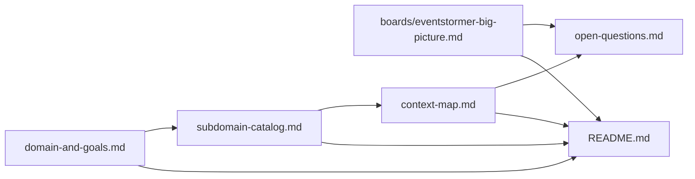

# Domain model — EventStormer

**Everything here is `draft`**, at two different depths. The strategic decisions below (goal,
subdomains, contexts, context map) were made **in session with the participant** and are
`[confirmed]` at the strategic level. What's still `draft` and unconfirmed is depth: each bounded
context's own event-stormed model (Commands/Events/Policies/Queries) is deferred to a future
Process Modelling or Design-Level EventStorming session, one context at a time.

## Where this stands

1. **Big Picture EventStorming (2026-08-25)** produced the discovered-form input: a 32-event board,
   candidate seams, and open questions. Its full write-up is preserved at
   `sessions/2026-08-25-big-picture.md` and `boards/eventstormer-big-picture.md`; its own
   discovered-form context map is preserved at `sessions/big-picture-context-map.md`.
2. **DDD Strategic Design session (2026-08-25), phases 01–07**, run directly with the participant
   (not re-derived from the storm), produced:
   - `domain-and-goals.md` — the Impact Map: an AI reliably playing the facilitator role, so
     domain experts get a living model without needing a trained human facilitator.
   - `subdomain-catalog.md` — 4 v1 subdomains classified (Session Facilitation: Core, Domain Model
     Capture: Core, Question & Hot Spot Resolution: Supporting, Derived Artifact Generation:
     Supporting) + 1 roadmap subdomain (Multiplayer/Real-time Collaboration: Core, provisional) +
     2 Technical Mechanisms (Voice Input, AI Model Provider Integration).
   - Four bounded contexts, 1:1 with the v1 subdomains, each with a `canvas.md` (boundary
     confirmed) and `ubiquitous-language.md` (thin — deeper terms deferred) under
     `bounded-contexts/<slug>/`.
   - `context-map.md` — the decided integration map: Domain Model Capture as an Open-Host Service
     hub, serving Session Facilitation (Customer/Supplier), Question & Hot Spot Resolution
     (Conformist), and Derived Artifact Generation (Conformist); Session Facilitation itself a
     smaller OHS to Question & Hot Spot Resolution (Conformist).

## Artifact status

| Artifact | Status | Confidence | Evidence |
|---|---|---|---|
| `domain-and-goals.md` | draft, confirmed strategically | High | Confirmed with the participant this session; Impact Map built from their own words |
| `subdomain-catalog.md` | draft, confirmed strategically | High | Every row confirmed with the participant, including the Multiplayer row's provisional flag |
| `bounded-contexts/*/canvas.md` (boundary sections) | draft, confirmed strategically | High | Purpose/type/team/boundary rationale confirmed per context |
| `bounded-contexts/*/canvas.md` (event-stormed model sections) | `UNCONFIRMED` | — | Deliberately deferred — needs a Process Modelling or Design-Level pass per context |
| `bounded-contexts/*/ubiquitous-language.md` | draft, thin | Medium | Terms sourced from the Big Picture board where available; deeper elicitation deferred |
| `context-map.md` (decided form) | draft, confirmed strategically | High | Every relationship reasoned through the U/D test and confirmed with the participant |
| `sessions/big-picture-context-map.md` (discovered form) | superseded, preserved for provenance | — | The storm's original `[inferred]` candidates; see `context-map.md`'s "Superseded draft" section for how each maps to the decided form |
| `open-questions.md` | draft, live | — | Storm-originated hot spots + 5 items raised in this session (items 7–11) |

## Next steps (named, not started)

- Process Modelling on "the capture loop" (Question & Hot Spot Resolution's three policies) —
  already flagged by the Big Picture workshop as the natural next storm, and confirmed this
  session as the most fully-specified candidate.
- Design-Level on Domain Model Capture, to settle its aggregate boundary (open-questions.md #8)
  and the reinstatement re-validation rule (open-questions.md #3).
- Multiplayer/Real-time Collaboration needs its own scoping pass before it can be classified with
  confidence (open-questions.md #10).

## Dependency graph

```
boards/eventstormer-big-picture.md
  └── sessions/2026-08-25-big-picture.md
  └── sessions/big-picture-context-map.md (discovered form, superseded)
  └── open-questions.md (hot spots 1–6, from the storm)
domain-and-goals.md
  └── subdomain-catalog.md
        └── bounded-contexts/<slug>/canvas.md (boundary) — one per subdomain
        └── bounded-contexts/<slug>/ubiquitous-language.md
              └── context-map.md (decided form)
                    └── open-questions.md (items 7–11, from this session)
```

## Draft declaration

Nothing here is ready to build from without further sessions. The strategic layer (goal,
subdomains, contexts, integration patterns) is confirmed; the tactical layer inside each context
(commands, events, policies, aggregates) is not, and is named explicitly as `UNCONFIRMED` rather
than guessed.

<!-- BEGIN lineage:index -->

| Artifact | Workshop | Scope | Status | Updated |
|---|---|---|---|---|
| [README.md](README.md) | ddd-strategic-design | eventstormer-session | draft | 2026-08-25 |
| [domain-and-goals.md](domain-and-goals.md) | ddd-strategic-design | eventstormer-session | draft | 2026-08-25 |
| [subdomain-catalog.md](subdomain-catalog.md) | ddd-strategic-design | eventstormer-session | draft | 2026-08-25 |
| [context-map.md](context-map.md) | ddd-strategic-design | eventstormer-session | draft | 2026-08-25 |
| [open-questions.md](open-questions.md) | big-picture + ddd-strategic-design | eventstormer-session | draft | 2026-08-25 |
| [boards/eventstormer-big-picture.md](boards/eventstormer-big-picture.md) | big-picture | eventstormer-session | draft | 2026-08-25 |
| [sessions/2026-08-25-big-picture.md](sessions/2026-08-25-big-picture.md) | big-picture | eventstormer-session | draft | 2026-08-25 |
| [sessions/big-picture-context-map.md](sessions/big-picture-context-map.md) | big-picture | eventstormer-session | superseded | 2026-08-25 |
| [bounded-contexts/session-facilitation/canvas.md](bounded-contexts/session-facilitation/canvas.md) | ddd-strategic-design | eventstormer-session | draft | 2026-08-25 |
| [bounded-contexts/session-facilitation/ubiquitous-language.md](bounded-contexts/session-facilitation/ubiquitous-language.md) | ddd-strategic-design | eventstormer-session | draft | 2026-08-25 |
| [bounded-contexts/domain-model-capture/canvas.md](bounded-contexts/domain-model-capture/canvas.md) | ddd-strategic-design | eventstormer-session | draft | 2026-08-25 |
| [bounded-contexts/domain-model-capture/ubiquitous-language.md](bounded-contexts/domain-model-capture/ubiquitous-language.md) | ddd-strategic-design | eventstormer-session | draft | 2026-08-25 |
| [bounded-contexts/question-hot-spot-resolution/canvas.md](bounded-contexts/question-hot-spot-resolution/canvas.md) | ddd-strategic-design | eventstormer-session | draft | 2026-08-25 |
| [bounded-contexts/question-hot-spot-resolution/ubiquitous-language.md](bounded-contexts/question-hot-spot-resolution/ubiquitous-language.md) | ddd-strategic-design | eventstormer-session | draft | 2026-08-25 |
| [bounded-contexts/derived-artifact-generation/canvas.md](bounded-contexts/derived-artifact-generation/canvas.md) | ddd-strategic-design | eventstormer-session | draft | 2026-08-25 |
| [bounded-contexts/derived-artifact-generation/ubiquitous-language.md](bounded-contexts/derived-artifact-generation/ubiquitous-language.md) | ddd-strategic-design | eventstormer-session | draft | 2026-08-25 |



<!-- END lineage:index -->
