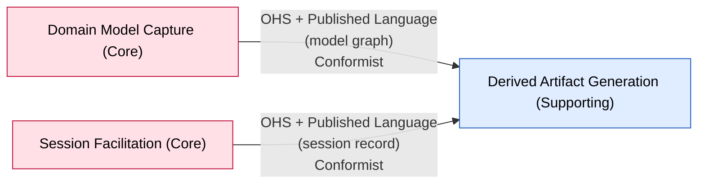

# Bounded Context: Derived Artifact Generation

> Design-Level EventStorming, resumed 2026-08-28. Reconciles this context's event-stormed model
> to product truth after the 2026-08-28 PRD F10 determinism pass (commit `ec3d094`). **Flow C
> (a non-deterministic, AI-generated summary) is retired** — every v1 artifact is now a
> deterministic template render, no language model in any path. The model is three
> independently-requested artifacts (`Export Model`, `Export Model Summary`,
> `Export Session Transcript`) plus a **live** in-app readable account. The AI Model Provider
> dependency and the `Summary Generation Failed` path are gone. Full reasoning in
> `sessions/2026-08-28-design-level-derived-artifact-generation.md`; the original pass is
> `sessions/2026-08-27-design-level-derived-artifact-generation.md`.

**Status:** draft • **Provenance:** `[confirmed]` (boundary, from `ddd-strategic-design`) /
`[storm]` (event-stormed model, 2026-08-27 + 2026-08-28 resume)

- **Purpose:** Project the accepted domain model — and the session record that produced it — into
  artifacts a person outside the session can use. **Every artifact is a deterministic function of
  the model or the session record; none is produced by a language model** (PRD F10, §7). Three
  independently-requested artifacts:
  1. **Model export** (`Export Model`) — the complete model, rendered. The **representation** —
     machine-readable JSON, or the human-readable Markdown *readable account* (a full walk of the
     model) — is a parameter the domain does not distinguish: same content, same `follows`-order
     walk, same rendered-reference / quoted-evidence rules. The JSON representation round-trips
     (re-importing it reproduces the model exactly); that is a property of the representation, not
     a second command.
  2. **Model summary** (`Export Model Summary`) — a distinct artifact, because it is a **designed
     reduction**: the model's own outline. Answers "give me the gist," not "give me the model."
  3. **Session transcript export** (`Export Session Transcript`, PRD F19) — the verbatim
     expert↔facilitator conversation, each turn annotated with the proposal it produced, that
     proposal's disposition, and the building block it became; plus per-contributor accept / edit /
     reject counts. Distinct source (the session record, not the model) and distinct rules.
- Plus a **live in-app readable account** — a view, re-rendered on every applied operation (the
  same coupling that keeps the board F02 current), not a command. No staleness fallback in the
  normal case; a "catching up" indicator only if rendering is debounced under load.
- **Subdomain type:** Supporting — re-confirmed with the participant 2026-08-28. Pure deterministic
  template rendering of an already-correct model, no external dependency.
- **Domain experts:** The participant; the Engineer actor (downstream reader) is a secondary
  source, and the editable engineer surface (F16) is out for v1.
- **Owning team:** One team (currently: the participant), owns all v1 contexts.

## Boundary rationale

- **Language boundary:** thin — "export," "readable account," "summary," "transcript." This
  context borrows Domain Model Capture's and Session Facilitation's language rather than
  translating it, which is expected for a Conformist downstream of clean, same-team upstreams.
- **Capability boundary:** project-model-and-record-to-artifact. Passes the single-name test.
- **Consistency boundary:** **none — confirmed `[storm]` 2026-08-27, re-confirmed 2026-08-28.**
  This context is purely read-and-render; it enforces no invariant and holds no aggregate. The
  worst failure it can produce is a stale or ugly artifact, never a corrupt model. See
  "Aggregates," below.
- **Does not own:** model truth (Domain Model Capture); the transcript and the proposal-lifecycle
  record (Session Facilitation); deciding what belongs in the model (Session Facilitation).

## Event-stormed model

> Confirmed `[storm]` (Design-Level pass 2026-08-27, reconciled to PRD F10 on 2026-08-28).
> Reasoning in `sessions/2026-08-28-design-level-derived-artifact-generation.md`.

### The three artifacts — all deterministic, all on demand

Every artifact is produced **on demand** — nothing is materialised between requests, and
**requesting one never produces another** (PRD F10). Each is a byte-identical function of its
input: same model in → same `Export Model` / `Export Model Summary` out; same session record in →
same `Export Session Transcript` out.

**`Export Model` → `Model Exported`**

| | |
|---|---|
| Actor | Engineer, or Domain Expert |
| Parameter | representation ∈ { JSON, readable account (Markdown) } — **domain-invisible** |
| Reads | The full model graph from Domain Model Capture (Conformist): every building block, both relation kinds, annotations, hot-spot open/resolved state + recorded reference, the operation log, provenance; plus the workshop record from Session Facilitation (F18: format, scope, stakeholder answer, chosen-problem qualification) |
| Produces | The rendered model in the requested representation |
| Rules | Same model in → **byte-identical** artifact out. *Rendered reference*: a building block id is resolved at render time and always carries the current label — cannot go stale. *Quoted evidence*: frozen free text (transcript quotes, stored proposal rationales) reproduced verbatim — **never follows a rewording**. The readable account carries quoted evidence; **the JSON representation does not**. Both representations state the format that produced them, the narrator count, the scope and chosen problem with their qualification, and **which steps of the format were not run** (distinct from run-and-found-nothing). Every download embeds the operation-log position and timestamp it was rendered at. No interpretation step anywhere |

**`Export Model Summary` → `Model Summary Generated`**

| | |
|---|---|
| Actor | Domain Expert |
| Reads | The model graph (Capture) + the workshop record (F18) |
| Produces | The model's own outline, assembled deterministically: workshop scope and format; the pivotal events in `follows` order as the spine; counts of each building-block kind and of placed-vs-backlog events, disconnected tracks and branch points; each branch point named; the chosen problem with its qualification and the open model-affecting hot spots; the model-derived coverage gaps (events with no cause, unplaced events) alongside the format steps not run |
| Rules | Deterministic template render — same model in → **byte-identical** out. **No quoted evidence, no causal prose, no cross-board interpretation** — any of those would require a language model. Carries the same coverage disclosure (format, narrators, scope, chosen problem, steps not run) and the same rendered-at stamp as `Export Model` |

**`Export Session Transcript` → `Transcript Exported`** (PRD F19)

| | |
|---|---|
| Actor | Domain Expert |
| Reads | The **session record** from Session Facilitation (Conformist): the `Session` stream — conversation turns in order, plus the full `Proposal` lifecycle (proposed / edited / accepted / rejected / applied / apply-failed / lapsed) with timing. Correlated with Domain Model Capture's `Operation Applied` (keyed to proposal id, carries the resulting building block id) to name what each turn produced |
| Produces | Every turn in order, verbatim, each annotated with the proposal it produced and that proposal's **terminal disposition, rendered distinctly**: *applied as building block B* / *rejected by the expert* / *proposed but never taken up* / *accepted but apply-failed (hot spot raised)*. Plus, **per contributor**, how many proposals they accepted, edited, and rejected — counts only, no interpretation. States the workshop format and scope; embeds the session-record position and timestamp it was rendered at |
| Rules | Verbatim reproduction, **no summarisation**. Same session record in → **byte-identical** out. The per-contributor counts live here, not in `Export Model`, because an edit and a rejection reach the session record but never the operation log — so a model-reading artifact structurally cannot report them |

### Events in

| Event | Published by | Reaction in this context | Notes |
|---|---|---|---|
| — (none required for correctness) | — | — | All three artifacts are on-demand pulls. This context does not need to react to any upstream event to be correct |
| *(read, not reacted to)* `Operation Applied` | Domain Model Capture | `Export Session Transcript` resolves it (via the session record) to name the building block each applied proposal became | Correlation data, not a triggered reaction (#51, closed at source) |

The live in-app readable account re-renders on every applied operation — an implementation
coupling to the operation stream, not a modelled domain reaction.

### Events out

**None to any other bounded context.** All three artifacts are terminal — consumed by a human or
an engineer outside the model boundary. This context publishes nothing anyone downstream reacts to.

### Policies

**None**, and none are needed — there is no `When [event] then [command]` anywhere in this
context. (Confirmed `[storm]`: the absence is real, not an omission.)

### Queries / views / read models

| Query / view | Used by | Answers | Built from / backed by |
|---|---|---|---|
| **Live in-app readable account** | Domain Expert (a panel beside the board) | "What does my model read like right now?" | A render of the model, **re-rendered on every applied operation** — same coupling as the board (F02). Not eventually consistent, not stale-able: the visible account never disagrees with the model. Only a "catching up" indicator if rendering is debounced under load |
| Model export | Engineer / Domain Expert | "What is the model — machine-readable, or as a readable walk?" | `Export Model` output, in the requested representation |
| Model summary | Domain Expert | "What's the gist?" | `Export Model Summary` output |
| Session transcript + contributions | Domain Expert | "What was actually said, and what did it produce?" | `Export Session Transcript` output |

### Aggregates / consistency boundaries

**None.** Applying the invariant-first test: there is no rule this context must keep true. The
participant confirmed it is "purely read and render" (2026-08-27), and re-confirmed 2026-08-28.
An aggregate with no invariant is a table — so there is no aggregate here, no state machine, and
**completion rule 6 is N/A**.

The one rule that governs output — *each artifact is a deterministic function of its input* — is a
property of the **rendering function**, not protected state. It is verified by acceptance test 22,
not by an aggregate.

**"And what happens when that rule breaks anyway?"** (the corrective-policy question): a
non-deterministic render is a **bug**, caught by the determinism test — not a business condition
the domain accommodates. There is no corrective policy, because there is no tolerated failure.
With Flow C retired, there is no longer any path in this context that is non-deterministic by
design.

### External systems

**None.** Retired 2026-08-28: the phase 05–06 canvas recorded "None — a terminal, read-only
context"; the 2026-08-27 pass added the **AI Model Provider** for Flow C's synthesized summary;
the 2026-08-28 PRD F10 reconciliation removed Flow C, so this context has **no external
dependency** again — pure deterministic template rendering.

## Integration arrows

**Seam validation (2026-08-28).** Both upstream edges are **decided**, not candidates:

- **Domain Model Capture → Derived Artifact Generation** — the inherited seam. Holds unchanged:
  Capture stays this context's model upstream, Conformist, OHS + Published Language over the model
  graph. `Export Model` and `Export Model Summary` read it.
- **Session Facilitation → Derived Artifact Generation** — adopted by `ddd-strategic-design`
  2026-08-28 (was a candidate revision from the 2026-08-27 pass). Conformist, OHS + Published
  Language over the **session record** (the `Session` stream: turns + proposal lifecycle).
  `Export Session Transcript` reads it.

Derived Artifact Generation is a **Conformist downstream of two Core contexts** — the same "one
model, many derived views" shape the product pitches, one layer out. No aggregate spans either
seam (there is no aggregate). Ownership: one team, one person, unchanged.

- **Boundary Commands** (arrive from outside): `Export Model`, `Export Model Summary`,
  `Export Session Transcript` — all from actors via the app, none from another context's policy.
- **Boundary Events** (published for others): **none.**
- **External systems:** **none.**
- **Anticorruption needs:** none — thin Conformist projection of two clean same-team upstreams.

## Hot-spots and open questions

| Topic | Type | What's unresolved | Owner / next |
|---|---|---|---|
| Flow B disposition rendering (#56) | ~~white-spot~~ **resolved 2026-08-28** | `Export Session Transcript` renders all four terminal dispositions distinctly (applied / rejected / never-taken / apply-failed) — participant's call: "more accurate to the history" | — |
| PRD F10 divergence (count + determinism) (#40 / #70) | ~~white-spot~~ **resolved 2026-08-28** | Reconciled *to* product truth this pass: Flow C retired, every artifact deterministic, no language model. Canvas now matches PRD F10 / F19 / §7 | — |
| Flow C persistence (#44) | ~~white-spot~~ **moot 2026-08-28** | There is no Flow C | — |
| Coverage-disclosure source of truth (#42) | white-spot | `Export Model` / `Export Model Summary` must state which format steps were not run — which needs the full step list for that format. Where that definition lives is unspecified | Unowned, undated |
| Upstream completeness for `Export Model` (#43) | white-spot | Whether Capture's `Board` embeds every datum the deterministic model render needs — a shaping constraint on Domain Model Capture, not this context | `domain-model-capture` — note for its next resume. Unowned, undated |
| DDD-artifact generator (#41) | white-spot, out of v1 | Deriving EventStorming / Strategic-DDD artifacts (boards, canvases, context maps) from the model — raised and deferred, not v1 | Unowned, undated |
| Context/history the facilitator sees | white-spot `[carried]` | Was shared with `../../open-questions.md` #27 — **resolved 2026-08-27** for Session Facilitation (`Facilitation context`); not this context's concern now that Flow C is gone | closed |

## Code evidence (as-is)

No implementation of this context exists — the repository has only scaffold (`src/capabilities/health`,
`src/domain/schema-version`). Nothing to consult or disclose. PRD F10 / F19 are product truth
(reconciled with the participant 2026-08-28), and per `AGENTS.md` product truth wins over this
canvas where they disagree.

## Opportunities / problems

- Determinism is now the whole story — every artifact is a template render, verified by acceptance
  test 22. F11's eval-suite discipline (every assertion reported separately, run more than once)
  is the natural model for the determinism test.
- The AI narrative summary is **parked as a post-v1 idea** (PRD §7), not designed against. If it
  returns, it re-introduces this context's first external dependency and first non-deterministic
  output — a Flow C in all but name, and worth its own pass then.
- `Export Model`'s representation parameter (JSON / readable account) is deliberately domain-
  invisible. If the two representations ever diverge in *content* (not just format), that is a
  real second artifact and the single command no longer fits.

<!-- BEGIN lineage:index -->
<!-- END lineage:index -->