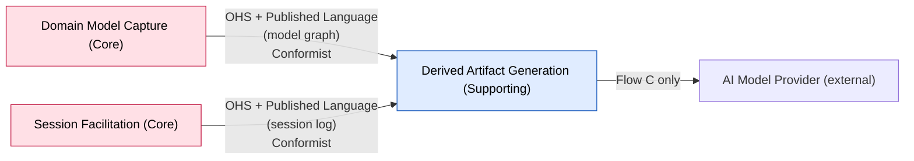

# Bounded Context: Derived Artifact Generation

> Design-Level EventStorming pass (2026-08-27). Turned this context's event-stormed model from
> `UNCONFIRMED` into `[storm]`-confirmed, and expanded it well past the phase 05–06 sketch: it is
> no longer a two-shape projection but a family of **three artifact types**, one of which is
> deliberately non-deterministic. Full reasoning in
> `sessions/2026-08-27-design-level-derived-artifact-generation.md`.

**Status:** draft • **Provenance:** `[confirmed]` (boundary, from `ddd-strategic-design`) /
`[storm]` (event-stormed model, this session)

- **Purpose:** Project the accepted domain model — and the session record that produced it — into
  artifacts a person outside the session can use. Three types (PRD F10 named only the first two):
  1. **Structured outcome** — a JSON export plus a template-rendered readable account, both a pure
     deterministic function of the model.
  2. **Session transcript export** — the verbatim expert↔facilitator conversation, each turn
     annotated with what it produced, so the reader can feed it into another tool.
  3. **Synthesized summary** — a narrative account produced with the AI Model Provider.
     **Non-deterministic by construction**, and stamped as such.
- **Subdomain type:** Supporting
- **Domain experts:** The participant; the Engineer actor (downstream reader) is a secondary
  source, and the editable engineer surface (F16) is out for v1.
- **Owning team:** One team (currently: the participant), owns all v1 contexts.

## Boundary rationale

- **Language boundary:** thin — "export," "readable account," "transcript," "summary." This
  context borrows Domain Model Capture's and Session Facilitation's language rather than
  translating it, which is expected for a Conformist downstream of clean, same-team upstreams.
- **Capability boundary:** project-model-and-record-to-artifact. Passes the single-name test.
- **Consistency boundary:** **none — confirmed `[storm]` this session.** This context is purely
  read-and-render; it enforces no invariant and holds no aggregate. The worst failure it can
  produce is a stale or ugly artifact, never a corrupt model. See "Aggregates," below.
- **Does not own:** model truth (Domain Model Capture); the transcript and the proposal-lifecycle
  log (Session Facilitation); deciding what belongs in the model (Session Facilitation).

## Event-stormed model

> Confirmed `[storm]` this Design-Level pass (2026-08-27). Reasoning in
> `sessions/2026-08-27-design-level-derived-artifact-generation.md`.

### The three flows

Every artifact is produced **on demand** — nothing exists between requests. Each of the three
types is requested independently; asking for one never produces another.

**Flow A — Structured outcome (deterministic)**

| | |
|---|---|
| Actor | Engineer, or Domain Expert |
| Command | `Export Structured Model` |
| Reads | The full model graph from Domain Model Capture (Conformist): every building block, both relation kinds, annotations, hot-spot open/resolved state + recorded reference, business scope, stakeholder answer, chosen problem, provenance, and the operation log |
| Produces | `Structured Export Generated` → the **JSON export** + the **template-rendered Markdown readable account** |
| Rules | Same model in → **byte-identical** artifact out. *Rendered reference*: a building block id is resolved at render time and always carries the current label. *Quoted evidence*: frozen free text (transcript quotes, stored proposal rationales) reproduced verbatim — **never follows a rewording**. Every artifact states the format that produced it, how many narrators contributed, and **which steps of the format were not run** (distinct from run-and-found-nothing). No interpretation step anywhere in this flow |

**Flow B — Session transcript export (deterministic reproduction)**

| | |
|---|---|
| Actor | Domain Expert |
| Command | `Export Session Transcript` |
| Reads | The **session log** from Session Facilitation (Conformist): conversation turns in order, plus proposal-made / proposal-accepted / proposal-rejected events with their timing. Correlated with Domain Model Capture's building blocks to name what each turn produced |
| Produces | `Transcript Exported` → every turn in order, each annotated with the proposal it produced and that proposal's disposition and resulting building block |
| Rules | Reproduction only — verbatim turns, no summarization |

**Flow C — Synthesized summary (non-deterministic)**

| | |
|---|---|
| Actor | Domain Expert |
| Command | `Generate Summary` |
| Reads | The model (Capture) + the session log (Facilitation) |
| Uses | **AI Model Provider** (external system) |
| Produces | `Summary Generated` → a narrative artifact, **explicitly stamped AI-generated / non-deterministic** so it can never be mistaken for A or B |
| Failure path | AI Model Provider unavailable or erroring → `Summary Generation Failed`; the user is told to retry later; **no partial artifact**. Flows A and B are unaffected — there is no non-AI fallback summary, and none is wanted |

### Events in

| Event | Published by | Reaction in this context | Notes |
|---|---|---|---|
| — (none required for correctness) | — | — | All three flows are on-demand pulls. This context does not need to react to any upstream event to be correct |
| *(optional)* any model-changing event | Domain Model Capture | Flip the readable-account preview's staleness flag | Not required — the preview can equally detect staleness by comparing operation-log position on view. Left as an implementation choice, not a modelled reaction |

### Events out

**None to any other bounded context.** All three artifacts are terminal — consumed by a human or
an engineer outside the model boundary. This context publishes nothing anyone downstream reacts to.

### Policies

**None**, and none are needed — there is no `When [event] then [command]` anywhere in this
context. (Confirmed: the absence is real, not an omission.)

### Queries / views / read models

| Query / view | Used by | Answers | Built from / backed by |
|---|---|---|---|
| Readable-account preview | Domain Expert (a panel beside the board) | "What does my model read like right now?" | A projection of Flow A's Markdown. **Eventually consistent** — allowed to go stale, carries a "the model changed since this was rendered" signal (GitHub-PR-style), refreshed on demand or periodically, **never real-time** |
| Structured export | Engineer | "What does the model look like, machine-readably?" | Flow A's JSON |
| Session transcript + contributions | Domain Expert | "What was actually said, and what did it produce?" | Flow B's output |

### Aggregates / consistency boundaries

**None.** Applying the invariant-first test: there is no rule this context must keep true. The
participant confirmed it is "purely read and render." An aggregate with no invariant is a table —
so there is no aggregate here, and no state machine, and completion rule 6 is N/A.

The one rule that governs output — *the structured outcome is a deterministic function of the
model* — is a property of the **rendering function**, not protected state. It is verified by
acceptance test 22, not by an aggregate.

**"And what happens when that rule breaks anyway?"** (the corrective-policy question): a
non-deterministic render of Flow A is a **bug**, caught by the determinism test — not a business
condition the domain accommodates. There is no corrective policy, because there is no tolerated
failure. Flow C is different: it is *defined* as non-deterministic, so there is no rule to break.

### External systems

| System | Used by | Failure mode |
|---|---|---|
| **AI Model Provider** (Anthropic / OpenAI / Google) | Flow C only | Unavailable → `Summary Generation Failed`, user told to retry, no partial output. A and B unaffected |

This is a change from the phase 05–06 canvas, which recorded "None — a terminal, read-only
context." Flow C makes this context an AI Model Provider consumer.

## Integration arrows

**Seam validation.** The inherited candidate seam (Capture → Artifact, Conformist) **holds** —
Capture stays this context's upstream and nothing about the model contract changed. But this
session found a **second upstream the context map does not record**: Session Facilitation, for the
session log (transcript + proposal lifecycle) that Flows B and C need. Recorded as a **candidate
revision with evidence** in `context-map.md`; adopting it is `ddd-strategic-design`'s call.

- **Upstream (this context depends on):** Domain Model Capture (Conformist, model graph); Session
  Facilitation (Conformist, session log — **new candidate edge**).
- **Downstream (consumers of this context):** the Engineer and the Domain Expert — actors outside
  the model boundary, not bounded contexts. No context consumes this one.
- **Boundary Commands** (arrive from outside): `Export Structured Model`, `Export Session
  Transcript`, `Generate Summary` — all from actors via the app, none from another context's policy.
- **Boundary Events** (published for others): **none.**
- **Anticorruption needs:** none — thin Conformist projection of two clean same-team upstreams.

## Hot-spots and open questions

| Topic | Type | What's unresolved | Owner / next |
|---|---|---|---|
| PRD F10 divergence: artifact count | white-spot | F10 names exactly two artifacts; v1 now has three (A/B/C) | Participant — PRD pass, alongside the F08/F01 pass already owned (`../../open-questions.md` #29) |
| PRD F10 divergence: determinism | white-spot | F10 states the readable account is "never generated by a language model" because "determinism is the product's central claim." Flow C deliberately breaks that, with a non-deterministic AI-generated summary. Accepted `[storm]` this session as a v1 goal | Participant — PRD pass |
| New context-map edge | candidate `[inferred]` seam / `[storm]` evidence | Session Facilitation → Derived Artifact Generation is not on the decided context map. Evidence: the transcript and proposal lifecycle "belong to Session Facilitation" (participant), and Flows B and C read them | `ddd-strategic-design` — adopt or revise. Recorded in `context-map.md` |
| DDD-artifact generator | white-spot, out of v1 | Deriving EventStorming / Strategic-DDD artifacts (boards, canvases, context maps) from the model was raised and deferred — not v1 | Unowned, undated |
| Upstream completeness for Flow A | white-spot | The participant's idea that Capture's aggregates should embed every datum Flow A's deterministic report needs — a shaping constraint on Domain Model Capture, not this context | `domain-model-capture` — note for its next resume |
| "Which steps were not run" — source of truth | white-spot | Flow A's coverage disclosure needs to know what steps a given format *has*, to say which were skipped. Where that format-definition knowledge lives is unspecified | Unowned, undated |
| Context/history the facilitator sees | white-spot `[carried]` | Unspecified beyond "whatever context he has" — shared with `../../open-questions.md` #27; relevant to Flow C's inputs | `../../open-questions.md` #27 |

## Code evidence (as-is)

No implementation of this context exists — the repository has only scaffold (`src/capabilities/health`,
`src/domain/schema-version`). Nothing to consult or disclose. The PRD (F10) is the only prior
written input, and it was treated as a hypothesis to confirm, not a source of truth.

## Opportunities / problems

- The determinism split (A/B deterministic, C explicitly not) is the load-bearing design decision
  here. F11's eval-suite discipline — every assertion reported separately, run more than once —
  is the natural model for a Flow A determinism test (acceptance test 22).
- Flow C introduces this context's first external dependency and its first non-deterministic
  output. Whether C's output should be persisted (and become a stale-able read model like the
  preview) or always thrown away after handing it over was not pressed this session.

<!-- BEGIN lineage:index -->
<!-- END lineage:index -->