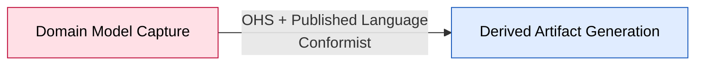

# Bounded Context: Derived Artifact Generation

> Phase 05–06 canvas. Boundary facts confirmed this session; the event-stormed model is left
> `UNCONFIRMED`.

**Status:** draft • **Provenance:** `[confirmed]` (boundary) / `UNCONFIRMED` (event-stormed model)

- **Purpose:** Project the confirmed domain model into readable, engineering-consumable output
  (PRD F10) — a structured export and a readable account, derived from Domain Model Capture rather
  than hand-maintained.
- **Subdomain type:** Supporting
- **Domain experts:** The participant; the Engineer actor (downstream reader) is a secondary
  source once F16 (engineer-facing surface) is in scope — explicitly out for v1.
- **Owning team:** One team (currently: the participant), owns all four v1 contexts.
- **Status:** draft

## Boundary rationale

- **Language boundary:** thin — "export," "readable account." No divergent vocabulary found this
  session; this context borrows Domain Model Capture's language rather than translating it, which
  is expected for a Conformist downstream of a clean, same-team upstream.
- **Capability boundary:** project-model-to-artifact (noun–verb). Passes the single-name test.
- **Consistency boundary:** none expected — a stateless projection of an already-consistent model.
- **Does not own:** model truth (Domain Model Capture); deciding what belongs in the model
  (Session Facilitation, Question & Hot Spot Resolution).

## Event-stormed model

> Deferred.

### Commands

| Command | Actor / source | Handled by | Produces event(s) | Notes |
|---|---|---|---|---|
| Export Model (structured) / Export Model (readable account) | Engineer (or the participant) | UNCONFIRMED | UNCONFIRMED | PRD F10 names two output shapes; not yet modelled as commands |

### Events in

| Event | Published by | Reaction in this context | Notes |
|---|---|---|---|
| UNCONFIRMED | Domain Model Capture | Re-projection, if this is a materialized read model rather than on-demand | Deferred — depends on whether F10's export is computed on request or kept live |

### Events out

None expected — a terminal, read-only context.

### Policies

None identified.

### Queries / views / read models

| Query / view | Used by | Answers | Built from / backed by |
|---|---|---|---|
| Structured export | Engineer | "What does the model look like, machine-readably?" | Domain Model Capture's graph |
| Readable account | Domain expert, Engineer | "What does the model say, in prose?" | Domain Model Capture's graph |

### Aggregates / consistency boundaries

None — stateless projection.

### External systems

None identified this session; PRD explicitly declines compatibility with any external
documentation toolchain (`open-questions.md`, declined capabilities).

## Integration arrows

- **Upstream (this context depends on):** Domain Model Capture — Conformist, no accommodation
  needed for a thin projection.
- **Downstream (consumers of this context):** the Engineer actor (outside the model boundary —
  consumes the artifact, not a bounded context itself).
- **Published language / contracts:** the two output shapes named in PRD F10 (structured export,
  readable account).
- **Anticorruption needs:** none.

## Hot-spots and open questions

None specific to this context beyond the general engineer-surface scoping already recorded in the
PRD (F16 out of scope for v1).

## Code evidence (as-is)

Not run this session. UNCONFIRMED.

## Opportunities / problems

- Whether the export is computed on-demand or maintained as a live materialized view is an open
  design question worth settling before this context's event-stormed model is filled in.

<!-- BEGIN lineage:index -->
<!-- END lineage:index -->