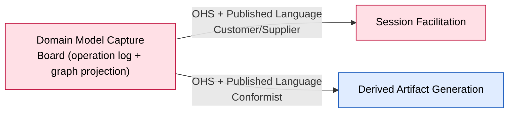

# Bounded Context: Domain Model Capture

> Design-Level EventStorming, three passes. Pass 1 (2026-08-26) confirmed the commands, events and
> policies; a same-day resume corrected the aggregate design from a single `Board` into four
> Building Block aggregates plus `Timeline`. **Pass 2 (2026-08-27) collapsed all five back into one
> event-sourced `Board`** — once the workshop operation log was confirmed single-writer and
> totally ordered, the graph is a projection over that log and every invariant is checked at
> append time. Full reasoning in
> `sessions/2026-08-27-design-level-domain-model-capture-board.md`, with pass 1 preserved at
> `sessions/2026-08-26-design-level-domain-model-capture.md`.

**Status:** draft • **Provenance:** `[confirmed]` (boundary, from `ddd-strategic-design`) /
`[storm]` (event-stormed model, 2026-08-26 and 2026-08-27)

- **Purpose:** Own the accepted domain model — a typed graph of Domain Event / Actor / System /
  Hot Spot Building Blocks and their `follows` / `causedBy` / annotation relations, with stable
  identities and the lifecycle every Building Block kind goes through. The model is a **projection
  over the workshop's append-only operation log**; the log is the source of truth.
- **Subdomain type:** Core
- **Domain experts:** The participant; no dedicated data-modeling expert consulted.
- **Owning team:** One team (currently: the participant), owns all v1 contexts.

## Boundary rationale

- **Language boundary:** Domain Event / Actor / System / Hot Spot — not "Element" or "Node."
  "Reworded" — not "Rename." Both `[confirmed]`. `Board` is the confirmed name for the aggregate
  (the workshop's operation log and the graph projected from it); the 2026-08-26 pass tried `Board`,
  retired it for `Timeline`, and pass 2 restored it once the boundary turned out to be the whole
  log after all.
- **Capability boundary:** own-the-model — validate and record every model-mutating operation, and
  serve the current graph and the operation log to consumers.
- **Consistency boundary:** **one aggregate — `Board`, one per Workshop.** The workshop operation
  log is single-writer (Session Facilitation allows at most one open session per workshop, v1) and
  applied in strict arrival order (F01). Every operation is validated against the current
  projection of the graph before it is appended. There is no smaller boundary to draw: the one
  invariant that needs whole-graph visibility (`follows`-acyclicity) forces the whole graph into
  one boundary, and single-writer serialization makes that boundary free of contention.
- **Does not own:** deciding what to propose or when to close a session (Session Facilitation);
  judging *why* a hot spot should be raised or resolved (Session Facilitation — this context only
  executes the raise/resolve/reopen once asked); projecting the model into readable output
  (Derived Artifact Generation); enforcing "at most one open session per workshop" (a Session
  Facilitation set-scoped constraint this context depends on but does not police).

## Event-stormed model

> Confirmed `[storm]` across the 2026-08-26 and 2026-08-27 Design-Level passes.

### Commands

Every command is an **operation** appended to the workshop log. All are handled by the one `Board`
aggregate, which `decide`s each against the current projection and either appends it or rejects it
with a reason (F01: "rejected and the model is unchanged").

| Command | Actor / source | Produces event(s) | Notes |
|---|---|---|---|
| Capture Domain Event | automatic (policy, on Proposal Accepted) `[carried]` | Domain Event Captured | Kind-specific, not a generic "Create Building Block" |
| Identify Actor | automatic (policy, on Proposal Accepted) `[carried]` | Actor Identified | |
| Identify System | automatic (policy, on Proposal Accepted) `[carried]` | System Identified | |
| Raise Hot Spot | Session Facilitation (policy-triggered, or direct from Domain Expert) `[carried]` | Hot Spot Raised | Two routes, same event either way |
| Reword | Domain Expert (F06, direct) | `<Kind>` Reworded | Local — reads only the target block |
| Withdraw | Domain Expert (F06, direct), **plus cascading policies** | `<Kind>` Withdrawn | Severs every relation the block participates in; hidden by default. See Policies — cascades `Unlink Cause` and `Withdraw` on annotating Hot Spots |
| Reinstate | Domain Expert (F06, direct) | `<Kind>` Reinstated | **Naked** — no relation restored. Re-enters the backlog like a fresh capture; re-linking is separate and explicit. Old relations may be surfaced as UI hints — facilitation, not a Board concern |
| Place | Domain Expert (F06, direct) | Domain Event Placed | Domain Event only. Marks the event as placed (it has a position in the sequence); a placed event with no `follows` edge is its own single-member track |
| Unplace | Domain Expert (F06, direct) | Domain Event Unplaced | Domain Event only. Severs the event's `follows` edges and returns it to the backlog |
| Sequence | Domain Expert (F06, direct) | Domain Event Sequenced | Adds one `follows` edge, event → event. **Cycle-checked against the whole graph** — rejected with the offending path named if it would close a cycle |
| Unsequence | Domain Expert (F06, direct) | Domain Event Unsequenced | Removes one `follows` edge |
| Insert Between(A, C, B) | Domain Expert (F06, direct) | Domain Event Sequence Reshaped `[inferred]` — event name not confirmed with the participant | One atomic operation: `A→B` replaced by `A→C→B`. **Cycle-checked exactly like `Sequence`** — if `C` already has a path to `A`, rejected. Other successors of `A` untouched (the graph is a DAG, not a queue) |
| Link Cause | Domain Expert (F06, direct) | Actor Linked / System Linked | Adds a `causedBy` edge, Actor/System → Domain Event, recorded on the Event's own record. **Rejected if the target Domain Event or the source Actor/System does not exist or is withdrawn** |
| Unlink Cause | Domain Expert (F06, direct), **or cascading policy** | Actor Unlinked / System Unlinked | Also fires automatically when the linked Actor/System is withdrawn — see Policies |
| Annotate | Domain Expert (F06, direct) | Hot Spot Annotated | Sets the Hot Spot's annotation target — any non-Hot-Spot Building Block, or none. **Rejected if a named target does not exist or is withdrawn** |
| Unannotate | Domain Expert (F06, direct) | Hot Spot Unannotated | |
| Mark Pivotal / Unmark Pivotal | Domain Expert (F07, via proposal or direct) | Domain Event Marked/Unmarked Pivotal | Freely reversible; nothing depends on the mark, so it is not in the write model |
| Resolve | Domain Expert (via Session Facilitation's Resolution Accepted) `[carried, extended]` | Hot Spot Resolved | Requires a recorded, deliberately-untyped reference. The reference is a **recorded value, not a live pointer** — it is not policed if it later names a withdrawn block (#49) |
| Reopen | Domain Expert | Hot Spot Reopened | Resolved → Open, to correct a wrong resolution. A recurring-but-differently-caused issue is a **new** `Raise Hot Spot`, not a `Reopen` |

### Events in

| Event | Published by | Reaction in this context | Notes |
|---|---|---|---|
| Proposal Accepted | Session Facilitation `[carried]` | Triggers Capture Domain Event / Identify Actor / Identify System, by proposed kind | `[carried]` from `boards/capture-loop.md` |
| Resolution Accepted | Session Facilitation | Triggers Resolve | Facilitation judges, the Board executes |

### Events out

| Event | Consumed by | Meaning | Produced by |
|---|---|---|---|
| Domain Event Captured / Actor Identified / System Identified / Hot Spot Raised | Derived Artifact Generation | A new Building Block exists | the corresponding operation |
| `<Kind>` Reworded | Derived Artifact Generation | A Building Block's articulation changed; its identity did not | Reword |
| `<Kind>` Withdrawn | Derived Artifact Generation, **the Board's own cascading policies** | A Building Block's relations were severed, hidden by default | Withdraw |
| `<Kind>` Reinstated | Derived Artifact Generation | A withdrawn Building Block returned, naked | Reinstate |
| Domain Event Placed / Unplaced | Derived Artifact Generation | Placement changed | Place / Unplace |
| Domain Event Sequenced / Unsequenced / Sequence Reshaped `[inferred name]` | Derived Artifact Generation | `follows` topology changed | Sequence / Unsequence / Insert Between |
| Actor Linked / Unlinked, System Linked / Unlinked | Derived Artifact Generation | `causedBy` changed | Link Cause / Unlink Cause |
| Hot Spot Annotated / Unannotated | Derived Artifact Generation | annotation target changed | Annotate / Unannotate |
| Domain Event Marked/Unmarked Pivotal | Derived Artifact Generation | Milestone marker toggled | Mark / Unmark Pivotal |
| Hot Spot Resolved / Reopened | Session Facilitation, Derived Artifact Generation | A hot spot's resolution (with its reference) is recorded, or corrected | Resolve / Reopen |
| Operation Applied | Session Facilitation (`Proposal`), Derived Artifact Generation (Flow B) | An operation from a proposal was applied; carries the proposal id and the resulting Building Block id | any operation originating from a Proposal (#51) |
| Operation Rejected | Session Facilitation (`Proposal`) | An operation from a proposal failed validation; carries the proposal id and the reason | any rejected operation originating from a Proposal (#51) |

**Two kinds of event, kept distinct** (per `anoria-commons:domain-modeling` event-sourced
guidance): the **fold events** above are the operations themselves — fine-grained, internal,
replayed to rebuild the write model. The **published events** are the same list seen as the
outward contract Session Facilitation and Derived Artifact Generation consume. The Board does not
leak a separate internal fold stream past its boundary; the operation is the unit both sides see.

### Policies

| When this event happens | Then this operation is appended | Rule / rationale | Status |
|---|---|---|---|
| Actor Withdrawn / System Withdrawn | `Unlink Cause`, for every Domain Event whose `causedBy` list references it | Confirmed live 2026-08-26: "the Link Cause is cleared. If we reinstate, we'll need to link again." Now a set of follow-on operations the Board appends in the same serialized log | `[storm]` |
| Any Building Block Withdrawn | `Withdraw` on every Hot Spot currently annotating it | Confirmed live 2026-08-26: block-vs-cascade considered, cascade chosen — "the latter is better" | `[storm]` |

Because the log is single-writer and serialized, a cascade is just more operations appended after
the triggering one — no cross-aggregate transaction, no coordination.

### Queries / views / read models

| Query / view | Used by | Answers | Built from |
|---|---|---|---|
| The full model graph | Derived Artifact Generation | "What is the current, accepted model?" | folding the whole operation log |
| Open hot spots for this workshop | Session Facilitation (`Contribution Interpreted`'s resolution judgment) | "What could this contribution be resolving?" | the projection, filtered to Hot Spots in `Open` |
| Connected components of placed events (F02's "timeline" surface) | Derived Artifact Generation, F02 UI | "Which events form one continuous track?" | the `follows` adjacency in the projection — a derived grouping, **not** an aggregate; merging and splitting tracks is just the recomputed grouping after a `Sequence` / `Unsequence` / `Withdraw` |

### Aggregates / consistency boundaries

**One aggregate: `Board`.** Event-sourced; its stream is the workshop's operation log.

- **Invariant:** the operation log, folded in arrival order, always yields a valid graph —
  `follows` acyclic, every relation's endpoints of the permitted kinds, no operation targeting a
  missing or withdrawn Building Block, every hot-spot resolution carrying a reference.
- **Responsibility:** `decide(current projection, operation) → operation appended, or rejected
  with a reason`. Be the single source of truth the whole model is derived from.
- **Whose job / why one boundary:** the accept-or-reject answer is synchronous and the issuing
  user's, right now (F01: "rejected with the offending path named"). "We can't really do multiple
  operations in parallel if the result of one may invalidate another" — the participant, 2026-08-27.
  So: transactional, one boundary.

**Write model (what the guards read):**

| In the write model | Not in the write model (projection / read-model detail) |
|---|---|
| Building Block id → { kind, withdrawn? } | label / wording |
| `follows` adjacency (cycle checks) | pivotal marker (nothing depends on it) |
| `causedBy` endpoints (endpoint-kind check) | placement-for-display, backlog vs. timeline |
| hot-spot open/resolved state, annotation target id | the resolution **reference** value (recorded, not guarded — #49) |

Everything on the right still lives in the events and in Derived Artifact Generation's
projections. If a new rule ever needs a dropped field, replay reconstructs it from the same log.

**decide / evolve.** `decide` is pure: projection + operation → event(s) or rejection, no
mutation. `evolve` folds one operation onto the projection. Replay = `evolve` over the whole log
from empty (F01 line 625: "replaying the operation log from empty reproduces the current snapshot
exactly").

**Back-of-envelope cost** (elicited 2026-08-27, not estimated): low hundreds of Building Blocks
per workshop, single-digit thousands of operations over a workshop's life, a couple of operations
per minute at peak even with multiplayer. Folding that log is sub-millisecond; a cycle check over
low-hundreds of Building Blocks is instant; snapshotting is available if the fold ever gets slow.
Single-writer means no contention. The one big boundary is affordable.

**Set-scoped rules, enforced outside the aggregate:** Building Block id uniqueness; "the system
never merges two building blocks" (F01); "at most one open session per workshop" (Session
Facilitation). None is a `Board` invariant.

**Corrective policies:** the two cascades above are the business's existing corrections, modelled
as follow-on operations. No invariant is deliberately relaxed to buy concurrency — there is no
concurrency to buy.

**Facets this workshop cannot honestly fill** (Aggregate Design Canvas): Throughput and Size were
elicited as rough orders of magnitude (above), not measured. Left as `[storm]` estimates.

**Deliberately not modelled — genuine open questions, not decisions:**
- Whether a Hot Spot's `kind` (informational / model-affecting) is worth storing as its own field
  (#32).
- A "destroy" operation for true duplicates — floated, participant unsure, conflicts with F01's
  "never merges two building blocks" (#33).
- Any `Board`-level close / lock / archive — floated in #25, not designed. v1 has no `Board` death.

**State machine.**

```
Board — one per Workshop, event-sourced:

   (birth: the Workshop is created — an empty Board, ready to accept operations)
                              │
                              ▼
                            OPEN ──accepts operations for the Workshop's whole life──┐
                              ▲                                                       │
                              └───────────────────────────────────────────────────────┘

   No modelled death for v1. Archiving / locking a Workshop (#25) is not designed.

Building Block lifecycles — now projection state, not separate aggregates:

   ACTIVE ──Withdraw (severs relations, triggers cascades)──▶ WITHDRAWN
   WITHDRAWN ──Reinstate (naked)──▶ ACTIVE

   Domain Event, orthogonal:  Marked Pivotal ⇄ Unmarked Pivotal
   Domain Event, orthogonal:  Placed ⇄ Unplaced
   Hot Spot, orthogonal:      OPEN ──Resolve (+ reference)──▶ RESOLVED ──Reopen──▶ OPEN
```

The connected-component grouping ("timeline" tracks) is a derived view over `follows`, recomputed
after every topology change — it has no lifecycle of its own.

### External systems

None identified.

## Integration arrows



**Seam validated, not re-decomposed.** The inherited candidate holds: Domain Model Capture is the
map's upstream hub. Pass 2's aggregate collapse is purely internal — nothing crossing the boundary
changed.

- **Upstream (this context depends on):** none for the model — this context is the hub. One
  **operational** dependency: the `Board`'s single-writer premise rests on Session Facilitation's
  "at most one open session per workshop" constraint (#46) plus F01's append-in-arrival-order. The
  Board assumes serialized operations; it does not enforce the serialization.
- **Downstream:** Session Facilitation (Customer/Supplier — issues creation, `Resolve`, `Reopen`;
  consumes `Hot Spot Raised/Resolved/Reopened`, `Operation Applied`, `Operation Rejected`),
  Derived Artifact Generation (Conformist — consumes every event out, reads the full-graph and
  connected-component read models).
- **Boundary Commands** (arrive from outside): every operation in the Commands table, whether from
  Session Facilitation's policies or from the Domain Expert directly via F06 / F07.
- **Boundary Events** (published for others): every event in the Events-out table, including
  `Operation Applied` / `Operation Rejected` keyed to the proposal id (#51).
- **Anticorruption needs:** none — this context is the upstream of the whole map; its own contract
  is the protection the others get.

## Hot-spots and open questions

| Topic | Type | What's unresolved | Reference |
|---|---|---|---|
| Aggregate boundary | ~~white-spot~~ **resolved, twice** | 2026-08-26: one `Board` → four Building Block aggregates + `Timeline`. 2026-08-27: all five → one event-sourced `Board`, once single-writer + total-order was confirmed | `../../open-questions.md` #8, #48 |
| `Insert Between` cycle-safety | ~~white-spot~~ **resolved** | Same cycle check as `Sequence`; no "C must be fresh" rule | `../../open-questions.md` #50 |
| Cross-aggregate referential integrity | ~~white-spot~~ **resolved** | `Link Cause` / `Annotate` to a withdrawn or missing target → rejected at append. Resolution reference is a recorded value, not a live pointer — dangling is not a failure state | `../../open-questions.md` #49 |
| `Insert Between` atomicity vs. F01's per-operation guarantee | ~~white-spot~~ **resolved** | `Insert Between` is one operation in the log, atomic because the append is atomic — F01's per-operation guarantee covers it directly | `../../open-questions.md` #34 |
| PRD F02's "timeline" vs. the aggregate | ~~white-spot, naming~~ **largely moot** | The `Timeline` aggregate is gone; only F02's UI surface and a derived connected-component read model remain | `../../open-questions.md` #37 |
| Hot Spot `kind` field | white-spot | Whether `kind` earns its place as a stored field is still genuinely unsure | `../../open-questions.md` #32 — unowned |
| "Destroy" operation for true duplicates | white-spot, tension with F01 | Floated, participant unsure; conflicts with "never merges/deletes" | `../../open-questions.md` #33 — unowned |
| Upstream-completeness for Flow A's deterministic report | white-spot `[carried]` | Whether the Board's published events / graph carry every datum the deterministic account needs — handed to Derived Artifact Generation's resume to specify | `../../open-questions.md` #43 |
| Context / history the facilitator sees before its next question | white-spot `[carried]` | Unspecified beyond "whatever context he has" | `../../open-questions.md` #27 |

## Code evidence (as-is)

Not run this session. UNCONFIRMED.

## Opportunities / problems

- The event-sourced `Board` matches what F01 already specifies (append-only log, replay reproduces
  the snapshot). Recognizing the aggregate as event-sourced is not a new design choice — it names
  what the PRD already required.
- The PRD's operation-log kind list (F01) needs revisiting: `sequence` / `unsequence` /
  `insert between` / `link cause` / `unlink cause` / `annotate` / `unannotate` / `reopen` are new
  or renamed verbs; `place` / `unplace` are real independent operations. Candidate for the
  participant's owned PRD pass (#29), alongside F08 and F10.

<!-- BEGIN lineage:index -->
<!-- END lineage:index -->