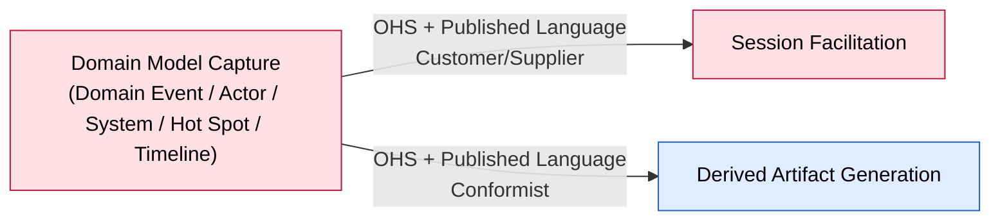

# Bounded Context: Domain Model Capture

> Design-Level EventStorming pass (2026-08-26), **corrected in a same-day resume** once the
> participant pushed back on the aggregate design: a single `Board` aggregate was a
> mis-derivation — invariants that were never actually shared got lumped into one boundary instead
> of each earning its own. Reworked invariant-first into four aggregate types. Full reasoning in
> `sessions/2026-08-26-design-level-domain-model-capture.md`.

**Status:** draft • **Provenance:** `[confirmed]` (boundary, from `ddd-strategic-design`) /
`[storm]` (event-stormed model, this session)

- **Purpose:** Own the accepted domain model — a typed graph of Domain Event/Actor/System/Hot Spot
  Building Blocks and their relations, with stable identities, and the shared lifecycle every
  Building Block kind goes through (Reworded, Withdrawn, Reinstated; Domain Event additionally
  Placed via a Timeline, Sequenced/Unsequenced, Marked/Unmarked Pivotal; Actor/System additionally
  Linked/Unlinked as a cause; Hot Spot additionally Annotated/Unannotated, Resolved/Reopened).
- **Subdomain type:** Core
- **Domain experts:** The participant; no dedicated data-modeling expert consulted.
- **Owning team:** One team (currently: the participant), owns all v1 contexts.

## Boundary rationale

- **Language boundary:** Domain Event / Actor / System / Hot Spot — not "Element" or "Node."
  "Reworded" — not "Rename." Both `[confirmed]`. This session adds `Timeline` (`[storm]`, the
  participant's own choice) for the one aggregate that isn't a Building Block itself — a connected
  DAG of placed, sequenced Domain Events.
- **Capability boundary:** own-the-model (Building Block/relation storage and lifecycle, with the
  invariants that keep it consistent).
- **Consistency boundary:** **Corrected this session — there is no single aggregate.** Each
  Building Block kind (Domain Event, Actor, System, Hot Spot) is its own aggregate, one per
  instance; `Timeline` is a fifth, structurally different aggregate — one per connected component
  of sequenced Domain Events, born, grown, merged and split as the graph changes. See Aggregates,
  below, for the invariant-first reasoning behind the split.
- **Does not own:** deciding what to propose or when to close a session (Session Facilitation);
  judging *why* a hot spot should be raised or resolved (Session Facilitation — this context only
  executes the raise/resolve/reopen once asked); projecting the model into readable output
  (Derived Artifact Generation).

## Event-stormed model

> Confirmed `[storm]` this Design-Level pass (2026-08-26), corrected same-day. Reasoning in
> `sessions/2026-08-26-design-level-domain-model-capture.md`.

### Commands

| Command | Actor / source | Handled by | Produces event(s) | Notes |
|---|---|---|---|---|
| Capture Domain Event | automatic (policy, on Proposal Accepted) `[carried]` | `Domain Event` (new instance) | Domain Event Captured | Kind-specific, not a generic "Create Building Block" — confirmed in the capture-loop session |
| Identify Actor | automatic (policy, on Proposal Accepted) `[carried]` | `Actor` (new instance) | Actor Identified | |
| Identify System | automatic (policy, on Proposal Accepted) `[carried]` | `System` (new instance) | System Identified | |
| Raise Hot Spot | Session Facilitation (policy-triggered, or direct from Domain Expert) `[carried]` | `Hot Spot` (new instance) | Hot Spot Raised | Two routes (reviewed / direct-no-review), same event either way |
| Reword | Domain Expert (F06, direct) | the Building Block's own aggregate | `<Kind>` Reworded | Purely local — no other instance is ever consulted |
| Withdraw | Domain Expert (F06, direct) | the Building Block's own aggregate, **plus cascading policies** | `<Kind>` Withdrawn | See Policies — withdrawing an Actor/System cascades `Unlink Cause`; withdrawing anything a Hot Spot annotates cascades `Withdraw` on that Hot Spot; withdrawing a placed Domain Event may split or dissolve its `Timeline` |
| Reinstate | Domain Expert (F06, direct) | the Building Block's own aggregate | `<Kind>` Reinstated | **Naked** — no relation is restored, no Timeline membership either. A reinstated Domain Event re-enters the backlog exactly like a fresh capture; re-linking (causedBy, annotation, sequencing) is a separate, explicit act. Old relations may be surfaced as UI hints, but that's facilitation, not an aggregate concern |
| Place | Domain Expert (F06, direct) | `Timeline` (**factory** — births a new single-event Timeline) | Domain Event Placed | Domain Event only. Creates a Timeline of size one; the event now belongs to it |
| Unplace | Domain Expert (F06, direct) | `Timeline` | Domain Event Unplaced | Domain Event only. If the event is a Timeline's sole member, the Timeline is dissolved; otherwise it's removed and the Timeline recomputes its connected components — see split rule below |
| Sequence | Domain Expert (F06, direct) | `Timeline` — **may span two instances** | Domain Event Sequenced | Cycle-checked. If both events already share a Timeline, adds an edge inside it. If they belong to two different Timelines, this is a **merge**: both are read, the join is checked, one surviving Timeline is written and the other retired — one transaction, exactly the two components involved, no more |
| Unsequence | Domain Expert (F06, direct) | `Timeline` | Domain Event Unsequenced | Removes one edge; recomputes connected components of what remains. **Splits only if the removal actually disconnects the graph** — a bifurcation that reunites downstream stays one Timeline even after one branch is cut |
| Insert Between(A, C, B) | Domain Expert (F06, direct) | `Timeline` | one atomic event: `A→B` replaced by `A→C→B` | First-class command, not a bundle. Leaves `A`'s other successors (if any) untouched — a Timeline is a DAG, not a queue |
| Link Cause | Domain Expert (F06, direct) | `Domain Event` (the target — its own `causedBy` list) | Actor Linked / System Linked | The Event owns this relation; the Actor/System has no back-reference |
| Unlink Cause | Domain Expert (F06, direct), **or cascading policy** | `Domain Event` | Actor Unlinked / System Unlinked | Also fires automatically when the linked Actor/System is withdrawn — see Policies |
| Annotate | Domain Expert (F06, direct) | `Hot Spot` (its own annotation-target field) | Hot Spot Annotated | Target: any non-Hot-Spot Building Block, or none |
| Unannotate | Domain Expert (F06, direct) | `Hot Spot` | Hot Spot Unannotated | |
| Mark Pivotal / Unmark Pivotal | Domain Expert (F07, via proposal or direct) | `Domain Event` | Domain Event Marked/Unmarked Pivotal | Freely reversible; nothing else depends on the mark |
| Resolve | Domain Expert (via Session Facilitation's Resolution Accepted) `[carried, extended]` | `Hot Spot` | Hot Spot Resolved | Requires a recorded, deliberately-untyped reference |
| Reopen | Domain Expert | `Hot Spot` | Hot Spot Reopened | Resolved → Open, for correcting a wrong resolution. A recurring-but-differently-caused issue is a **new** `Raise Hot Spot`, not a `Reopen` — different identity |

### Events in

| Event | Published by | Reaction in this context | Notes |
|---|---|---|---|
| Proposal Accepted | Session Facilitation `[carried]` | Triggers Capture Domain Event / Identify Actor / Identify System, by proposed kind | `[carried]` from `boards/capture-loop.md` |
| Resolution Accepted | Session Facilitation | Triggers Resolve | New this session's boundary — Facilitation judges, Capture executes |

### Events out

| Event | Consumed by | Meaning | Produced by |
|---|---|---|---|
| Domain Event Captured / Actor Identified / System Identified / Hot Spot Raised | Derived Artifact Generation | A new Building Block exists | the respective aggregate's own creation |
| `<Kind>` Reworded | Derived Artifact Generation | A Building Block's articulation changed; its identity did not | Reword |
| `<Kind>` Withdrawn | Derived Artifact Generation, **this context's own cascading policies** | A Building Block's connections were severed, hidden by default | Withdraw |
| `<Kind>` Reinstated | Derived Artifact Generation | A withdrawn Building Block returned, naked | Reinstate |
| Domain Event Placed / Unplaced | Derived Artifact Generation | Timeline membership changed | `Timeline` |
| Domain Event Sequenced / Unsequenced | Derived Artifact Generation | `follows` topology changed, possibly a Timeline merge or split | `Timeline` |
| Actor Linked / Unlinked, System Linked / Unlinked | Derived Artifact Generation | `causedBy` changed | `Domain Event` |
| Hot Spot Annotated / Unannotated | Derived Artifact Generation | annotation target changed | `Hot Spot` |
| Domain Event Marked/Unmarked Pivotal | Derived Artifact Generation | Milestone marker toggled | `Domain Event` |
| Hot Spot Resolved | Session Facilitation, Derived Artifact Generation | A hot spot's resolution, with its reference, is recorded | `Hot Spot` |
| Hot Spot Reopened | Session Facilitation, Derived Artifact Generation | A resolution was corrected; the hot spot is open again | `Hot Spot` |

### Policies

| When this event happens | Then this command/action occurs | Rule / rationale | Status |
|---|---|---|---|
| Actor Withdrawn / System Withdrawn | `Unlink Cause`, for every Domain Event whose `causedBy` list references it | Confirmed live: "the Link Cause is cleared. If we reinstate, we'll need to link again." Cross-aggregate, reactive — not a single transaction; each affected Domain Event is updated independently | `[storm]`, new this session |
| Any Building Block Withdrawn | `Withdraw` on every Hot Spot currently annotating it | Confirmed live: block-vs-cascade was considered and cascade chosen — "the latter is better." A withdrawn thing shouldn't be left with a live-looking annotation pointing at it | `[storm]`, new this session |

### Queries / views / read models

| Query / view | Used by | Answers | Built from / backed by |
|---|---|---|---|
| The full model graph | Derived Artifact Generation | "What is the current, accepted model?" | Every Building Block aggregate plus every Timeline, read together |
| Open hot spots for this workshop | Session Facilitation (`Contribution Interpreted`'s resolution judgment) | "What could this contribution be resolving?" | Every Hot Spot aggregate, filtered to `Open` |

### Aggregates / consistency boundaries

**Invariant-first — the mistake this session corrected was skipping straight to "one aggregate for
the context" instead of asking, per rule, which invariant each candidate actually protects.**

| Aggregate | Protects | Handles |
|---|---|---|
| `Domain Event` (one per instance) | Nothing beyond its own fields — label, active/withdrawn, pivotal. Its `causedBy` sources live here too: `causedBy` never chains, so nothing outside the one Event ever needs to see it | Capture, Reword, Withdraw, Reinstate, Mark/Unmark Pivotal, Link Cause, Unlink Cause |
| `Actor` / `System` (one per instance) | Nothing beyond label/active state — no relation data lives here at all; "caused" is the Event's own list, never a back-reference | Identify, Reword, Withdraw, Reinstate |
| `Hot Spot` (one per instance) | Its own annotation target (one field, never chaining) and its own Open/Resolved state | Raise, Reword, Withdraw, Reinstate, Annotate, Unannotate, Resolve, Reopen |
| `Timeline` (one per **connected component** of sequenced, placed Domain Events — a workshop holds many, plus the backlog of unplaced/unsequenced events) | **No `follows` edge may create a cycle.** This is the one invariant that can't be checked from one or two records — it needs the whole reachable chain, which is exactly what a connected component is | Place (factory), Unplace, Sequence (may merge two instances), Unsequence, Insert Between |

**Why the split, precisely** (see `sessions/2026-08-26-design-level-domain-model-capture.md` for
the full discovery-loop walk): Reword/Mark-Pivotal/Resolve/Reopen have no invariant reaching
outside one record. `causedBy` and annotation are structurally-typed, non-chaining edges — a
two-record check at most, owned entirely by one side. Only `follows`-cycle-prevention is systemic,
and it's systemic only within a connected component, not across the whole workshop — so `Timeline`
is sized to exactly what the invariant needs, no more.

**`Timeline`'s birth/merge/split, stated precisely:**

- **Birth:** `Place` creates a new, single-event Timeline. There is no "placed but unattached"
  state — a lone placed event is a Timeline of one.
- **Merge:** `Sequence(A, B)` where `A` and `B` already belong to two different Timelines reads
  both, checks the join (trivially cycle-free, since each side was already acyclic on its own),
  and commits as one surviving Timeline; the other is retired. The transaction spans exactly the
  two components involved — bounded by the invariant, not unbounded.
- **Split:** `Unsequence`, or an event leaving a Timeline via `Withdraw`/`Unplace`, recomputes the
  connected components of what remains. **It splits only if the removal actually disconnects the
  graph** — a bifurcation that reunites further downstream (a diamond shape) stays one Timeline
  even after one of its two paths is cut.
- **Dissolution:** removing the last member of a Timeline (its sole event withdrawn or unplaced)
  retires the Timeline entirely.

**Deliberately not modelled — genuine open questions, not decisions:**
- Whether a Hot Spot's `kind` (informational / model-affecting) is worth storing as its own field.
  The payload direction is agreed (kind, trigger, annotation target); the participant is unsure
  the `kind` field itself earns its place. See Hot-spots below.
- A "destroy" operation for true duplicates. Floated by the participant, explicitly unsure, and it
  conflicts with F01's confirmed "the system never merges two building blocks." Not designed here.
- Whether a Hot Spot annotating a now-withdrawn target should itself be reachable/queryable, or
  whether the cascading withdrawal above makes that moot in practice. Not pressed further this
  session.

**State machines, one per aggregate:**

```
Domain Event / Actor / System / Hot Spot — the shared lifecycle:

        (birth: Capture/Identify/Raise → <Kind> Captured/Identified/Raised)
                              ACTIVE

           Withdraw (severs any relation this instance owns,
                      triggers cascades above)
                              │
                              ▼
                          WITHDRAWN ──Reinstate (naked, lands ACTIVE
                                                  with no relations)──▶ ACTIVE

  Orthogonal, Domain Event only:  Mark Pivotal ⇄ Unmark Pivotal (freely reversible, structural)
  Orthogonal, Hot Spot only:      OPEN ──Resolve (+ reference)──▶ RESOLVED
                                   OPEN ◀──────────Reopen───────── RESOLVED

Timeline — a structurally different lifecycle, states are cardinalities not flags:

        (birth: Place → Domain Event Placed)
              size = 1, no edges
                    │
        Sequence (grows / may MERGE two Timelines into one)
                    ▼
              size ≥ 1, DAG of `follows` edges, no cycle possible
                    │
        Unsequence / Withdraw / Unplace of a member
        (recomputes connected components)
                    │
         ┌──────────┴──────────┐
         ▼                     ▼
   still connected      SPLIT into N Timelines
   (no change in count)  (only if the removal
                          actually disconnects it)
                    │
        last member leaves
                    ▼
                (death: Timeline dissolved)
```

No modelled death for the four Building Block aggregates — `Withdrawn` is the closest thing to a
terminus and it is reversible. `Timeline` is the one aggregate here with a real death: it dissolves
when its last member leaves.

**Facets this workshop cannot honestly fill (per `anoria-commons:domain-modeling`'s Aggregate
Design Canvas):** Throughput and Size were not elicited this session — left open, same as Session
Facilitation's canvas.

### External systems

None identified this session.

## Integration arrows



**Seam validated, not re-decomposed** — the one candidate inherited from the Big Picture/strategic
design session holds: Domain Model Capture stays the map's upstream hub. The aggregate correction
this session made is purely internal to this context; nothing about what crosses the boundary
changed.

- **Upstream (this context depends on):** none — this context is the hub.
- **Downstream (consumers of this context):** Session Facilitation (Customer/Supplier — every
  command it issues into this context, listed above, and every event it consumes back:
  `Hot Spot Raised`, `Hot Spot Resolved`, and now `Hot Spot Reopened`), Derived Artifact Generation
  (Conformist — consumes every event out).
- **Published language / contracts:** the Building Block lifecycle contract, now fully named:
  capture/identify/raise (kind-specific creation), reword, withdraw, reinstate, place, unplace,
  sequence, unsequence, insert-between, link/unlink cause, annotate/unannotate, mark/unmark
  pivotal, resolve, reopen.
- **Boundary Commands** (arrive from outside): every command in the table above, whether from
  Session Facilitation's policies or from the Domain Expert directly via F06/F07.
- **Boundary Events** (published for others): every event in the table above.
- **Anticorruption needs:** none — this context is the upstream of the whole map; its own contract
  is the protection the others get.

## Hot-spots and open questions

| Topic | Type | What's unresolved | Next question / expert |
|---|---|---|---|
| Reinstatement conflict rule | ~~white-spot~~ **resolved** | Dissolved — reinstate never restores relations, so there's nothing to have a conflict-resolution rule for | `../../open-questions.md` #3 — closed this session |
| Aggregate boundary | ~~white-spot~~ **resolved, corrected same-day** | Was a single `Board`; corrected to four Building Block aggregates plus `Timeline`, invariant-first | `../../open-questions.md` #8 — closed, then refined this session |
| Hot Spot `kind` field | white-spot | Payload direction agreed (kind, trigger, annotation target); whether `kind` itself is worth storing is still genuinely unsure per the participant | new, unowned |
| "Destroy" operation for true duplicates | white-spot, tension with confirmed rule | Floated, participant explicitly unsure; conflicts with F01's "never merges/deletes" | new, unowned |
| `Insert Between`'s atomicity vs. F01's per-operation atomicity guarantee | white-spot | F01 currently only guarantees atomicity for one logged operation; `Insert Between` needs the same guarantee across what could be logged as multiple effects | new, unowned |
| PRD's "timeline" (F02, the UI surface) vs. `Timeline` (this session's aggregate) | white-spot, naming | The participant accepted the possible overlap and said the PRD can be updated to differentiate if needed; not resolved here | new, unowned |
| Context shape / history the facilitator sees before asking its next question | white-spot `[carried]` | Unspecified beyond "whatever context he has" | `../../open-questions.md` #27 |

## Code evidence (as-is)

Not run this session. UNCONFIRMED.

## Opportunities / problems

- This context's aggregate boundary is now settled at the right grain — many small aggregates
  instead of one context-wide one — which should make the eventual implementation's contention and
  load profile far better than the original single-`Board` draft would have.
- The PRD's operation-log kind list (F01) should be revisited: `place`/`unplace` turn out to be
  real, independent operations, and `sequence`/`unsequence`/`insert-between`/`link cause`/
  `unlink cause`/`annotate`/`unannotate`/`reopen` are new or renamed verbs the PRD doesn't yet name.
  Candidate for the participant's next PRD pass, alongside the F08 update already owned from the
  prior session (`open-questions.md` #29).

<!-- BEGIN lineage:index -->
<!-- END lineage:index -->