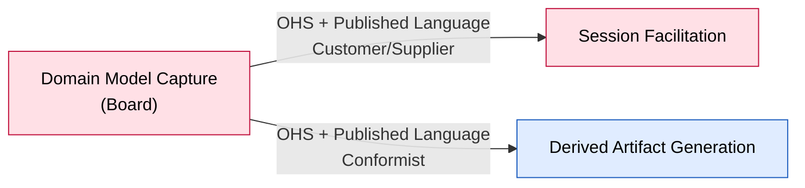

# Bounded Context: Domain Model Capture

> Design-Level EventStorming pass (2026-08-26). Turns the event-stormed model from `UNCONFIRMED`
> into `[storm]`-confirmed. Full reasoning in
> `sessions/2026-08-26-design-level-domain-model-capture.md`.

**Status:** draft • **Provenance:** `[confirmed]` (boundary, from `ddd-strategic-design`) /
`[storm]` (event-stormed model, this session)

- **Purpose:** Own the accepted domain model — a typed graph of Domain Event/Actor/System/Hot Spot
  Building Blocks and their relations, with stable identities, and the shared lifecycle every
  Building Block kind goes through (Placed/Unplaced, Related/Unrelated, Reworded, Withdrawn,
  Reinstated; Hot Spot additionally Resolved/Reopened; Domain Event additionally Marked/Unmarked
  Pivotal).
- **Subdomain type:** Core
- **Domain experts:** The participant; no dedicated data-modeling expert consulted.
- **Owning team:** One team (currently: the participant), owns all v1 contexts.

## Boundary rationale

- **Language boundary:** Domain Event / Actor / System / Hot Spot — not "Element" or "Node."
  "Reworded" — not "Rename." Both `[confirmed]`. This session adds `Board` for the aggregate
  itself (`[storm]`, the participant's own choice, drawing on EventStorming's own vocabulary — the
  PRD already used "board" informally for the same snapshot).
- **Capability boundary:** own-the-model (Building Block/relation storage and lifecycle, with the
  invariants that keep it consistent).
- **Consistency boundary:** **Confirmed this session — `Board` is the aggregate**, one per
  Workshop, accumulating across all of that workshop's sessions. See Aggregates, below.
- **Does not own:** deciding what to propose or when to close a session (Session Facilitation);
  judging *why* a hot spot should be raised or resolved (Session Facilitation — this context only
  executes the raise/resolve/reopen once asked); projecting the model into readable output
  (Derived Artifact Generation).

## Event-stormed model

> Confirmed `[storm]` this Design-Level pass (2026-08-26). Reasoning in
> `sessions/2026-08-26-design-level-domain-model-capture.md`.

### Commands

| Command | Actor / source | Handled by | Produces event(s) | Notes |
|---|---|---|---|---|
| Capture Domain Event | automatic (policy, on Proposal Accepted) `[carried]` | `Board` | Domain Event Captured | Kind-specific, not a generic "Create Building Block" — confirmed in the capture-loop session |
| Identify Actor | automatic (policy, on Proposal Accepted) `[carried]` | `Board` | Actor Identified | |
| Identify System | automatic (policy, on Proposal Accepted) `[carried]` | `Board` | System Identified | |
| Raise Hot Spot | Session Facilitation (policy-triggered, or direct from Domain Expert) `[carried]` | `Board` | Hot Spot Raised | Two routes (reviewed / direct-no-review), same event either way |
| Reword | Domain Expert (F06, direct) | `Board` | `<Kind>` Reworded | |
| Withdraw | Domain Expert (F06, direct) | `Board` | `<Kind>` Withdrawn | Severs every relation the Building Block held |
| Reinstate | Domain Expert (F06, direct) | `Board` | `<Kind>` Reinstated | **Naked** — no relation is restored; lands back in the backlog like a fresh Building Block. Old relations may be surfaced as UI hints, but that's a facilitation concern, not a Board invariant |
| Place | Domain Expert (F06, direct) | `Board` | `<Kind>` Placed | Moves backlog → timeline. No relation required — can start a new, disconnected track/cluster |
| Unplace | Domain Expert (F06, direct) | `Board` | `<Kind>` Unplaced | Severs every relation first — same shape as Withdraw. Can split a track into two |
| Relate | Domain Expert (F06, direct) | `Board` | Domain Event Sequenced / Actor Linked / System Linked / Hot Spot Annotated | Three relation kinds under one command: `follows` (event→event, cycle-checked against the whole Board), `causedBy` (actor/system→event), annotation (hot spot→any non-hot-spot Building Block). Endpoint-kind pairing is structural (unrepresentable otherwise), not a runtime check |
| Unrelate | Domain Expert (F06, direct) | `Board` | …Unsequenced / …Unlinked / …Unannotated | Can split a track |
| Insert Between(A, C, B) | Domain Expert (F06, direct) | `Board` | one atomic event: `A→B` replaced by `A→C→B` | First-class command, not a bundle of unrelate+relate+relate — the atomicity is the point. Leaves `A`'s other successors (if any) untouched — the board is a DAG, not a queue |
| Mark Pivotal / Unmark Pivotal | Domain Expert (F07, via proposal or direct) | `Board` | Domain Event Marked/Unmarked Pivotal | Event only. Freely reversible; nothing else depends on the mark |
| Resolve | Domain Expert (via Session Facilitation's Resolution Accepted) `[carried, extended]` | `Board` | Hot Spot Resolved | Hot Spot only. Requires a recorded, deliberately-untyped reference |
| Reopen | Domain Expert | `Board` | Hot Spot Reopened | New this session — Resolved → Open, for correcting a wrong resolution. A recurring-but-differently-caused issue is a **new** `Raise Hot Spot`, not a `Reopen` — different identity |

### Events in

| Event | Published by | Reaction in this context | Notes |
|---|---|---|---|
| Proposal Accepted | Session Facilitation `[carried]` | Triggers Capture Domain Event / Identify Actor / Identify System, by proposed kind | `[carried]` from `boards/capture-loop.md` |
| Resolution Accepted | Session Facilitation | Triggers Resolve | New this session's boundary — Facilitation judges, Capture executes |

### Events out

| Event | Consumed by | Meaning | Produced by |
|---|---|---|---|
| Domain Event Captured / Actor Identified / System Identified / Hot Spot Raised | Derived Artifact Generation | A new Building Block exists | Capture Domain Event / Identify Actor / Identify System / Raise Hot Spot |
| `<Kind>` Reworded | Derived Artifact Generation | A Building Block's articulation changed; its identity did not | Reword |
| `<Kind>` Withdrawn | Derived Artifact Generation | A Building Block's connections were severed, hidden by default | Withdraw |
| `<Kind>` Reinstated | Derived Artifact Generation | A withdrawn Building Block returned, unplaced and unrelated | Reinstate |
| `<Kind>` Placed / Unplaced | Derived Artifact Generation | Backlog ⇄ timeline transition | Place / Unplace |
| Domain Event Sequenced / Unsequenced, Actor/System Linked / Unlinked, Hot Spot Annotated / Unannotated | Derived Artifact Generation | Relations changed | Relate / Unrelate / Insert Between |
| Domain Event Marked/Unmarked Pivotal | Derived Artifact Generation | Milestone marker toggled | Mark/Unmark Pivotal |
| Hot Spot Resolved | Session Facilitation, Derived Artifact Generation | A hot spot's resolution, with its reference, is recorded | Resolve |
| Hot Spot Reopened | Session Facilitation, Derived Artifact Generation | A resolution was corrected; the hot spot is open again | Reopen |

### Policies

| When this event happens | Then this command/action occurs | Rule / rationale | Status |
|---|---|---|---|
| (none originate in this context) | — | This context only reacts to commands issued by Session Facilitation or the Domain Expert directly; it never initiates on its own | `[storm]` |

### Queries / views / read models

| Query / view | Used by | Answers | Built from / backed by |
|---|---|---|---|
| The full model graph | Derived Artifact Generation | "What is the current, accepted model?" | The `Board`'s Building Block/relation store directly |
| Open hot spots for this workshop | Session Facilitation (`Contribution Interpreted`'s resolution judgment) | "What could this contribution be resolving?" | `Board`'s Hot Spot Building Blocks, filtered to `Open` |

### Aggregates / consistency boundaries

| Aggregate / boundary | Handles commands | Emits events | Consistency rule |
|---|---|---|---|
| `Board` | every command above | every event above | See invariants below |

**`Board`'s invariants** (invariant-first — named because these are what require one consistency
boundary):

1. **No `follows` edge may create a cycle**, checked against the whole graph of events accumulated
   across the workshop's life (all its sessions), not just the two events involved in the new
   edge. Hard, always enforced — never accommodated, never a business fact worth recording. This
   is the load-bearing reason a single Building Block can't be its own consistency boundary: the
   check needs whole-graph visibility.
2. **Relation endpoint-kind pairing is structural, not a runtime invariant.** `causedBy` can only
   be constructed Actor/System→Event; a Hot Spot's annotation can only target a non-Hot-Spot
   Building Block or nothing. The five combinations the participant named as forbidden
   (actor↔actor, system↔system, actor↔system, actor↔hot-spot, system↔hot-spot) are all
   unrepresentable by construction — each artifact kind is its own type with its own permitted
   relations baked in, not a generic sticky with a validated field.
3. **`Insert Between(A, C, B)` is atomic.** The board is never observed in a state with both
   `A→B` and `A→C→B` — the old edge's removal and the two new edges' creation happen as one
   commit, not three sequential operations a concurrent reader could see half-applied.
4. **`Withdraw` and `Unplace` both sever every relation the Building Block held**, same shape in
   both cases. `Withdraw` additionally hides it from the default view; `Unplace` does not.
   Severing can split a previously-connected track into two independent ones — this is a normal,
   permanent board state, not a defect to repair automatically.
5. **`Reinstate` never restores relations.** A reinstated Building Block always lands unplaced and
   unrelated, identical in shape to a freshly captured one. (Resolves `open-questions.md` #3 by
   dissolving it — there is no reinstatement-conflict case to have a resolution rule for, because
   nothing is ever reapplied.)
6. **`Resolve` requires a recorded reference; `Reopen` requires none.** Both target a Hot Spot
   only. `[carried]` from the Session Facilitation session, extended this session with `Reopen`.

**Deliberately not modelled — genuine open questions, not decisions:**
- Whether a Hot Spot's `kind` (informational / model-affecting) is worth storing as its own field.
  The payload direction is agreed (kind, trigger, annotation target); the participant is unsure
  the `kind` field itself earns its place. See Hot-spots below.
- A "destroy" operation for true duplicates. Floated by the participant, explicitly unsure, and it
  conflicts with F01's confirmed "the system never merges two building blocks" / no re-type / no
  destructive delete. Not designed here. See Hot-spots below.

**`Board`'s state machine (per Building Block):**

```
                (birth: Capture/Identify/Raise → <Kind> Captured/Identified/Raised)
                            starts in BACKLOG, ACTIVE

        Place                                    Unplace (severs relations)
          │                                              ▲
          ▼                                              │
      ┌────────┐                                    ┌─────────┐
      │ BACKLOG│ ◀──────────────────────────────────│ PLACED  │
      └────────┘                                    └─────────┘
          │  ▲                                         │  ▲
      Withdraw│ Reinstate                          Withdraw│
     (severs) │ (lands here, naked)                (severs)│
          ▼  │                                         ▼  │
      ┌──────────┐                                          ┌──────────┐
      │ WITHDRAWN│◀─────────────────────────────────────────│ WITHDRAWN│
      └──────────┘         (same state, reachable from either)

  Orthogonal, Hot Spot only:        OPEN ──Resolve (+ reference)──▶ RESOLVED
                                     OPEN ◀──────────Reopen───────── RESOLVED

  Orthogonal, Domain Event only:    Mark Pivotal ⇄ Unmark Pivotal (freely reversible, structural)
```

No modelled death. `Withdrawn` is the closest thing to a terminus and it is reversible
(`Reinstate`) — there is no destructive delete in the confirmed model (see "deliberately not
modelled," above). `Reinstate` always lands in `BACKLOG`, never `PLACED` — that's the "naked
reinstate" finding this session made.

**Facets this workshop cannot honestly fill (per `anoria-commons:domain-modeling`'s Aggregate
Design Canvas):** Throughput and Size were not elicited this session — left open, same as Session
Facilitation's canvas.

### External systems

None identified this session.

## Integration arrows



**Seam validated, not re-decomposed** — the one candidate inherited from the Big Picture/strategic
design session holds: Domain Model Capture stays the map's upstream hub. Nothing this session
found argues for moving the boundary; it only made explicit what already crossed it.

- **Upstream (this context depends on):** none — `Board` is the hub.
- **Downstream (consumers of this context):** Session Facilitation (Customer/Supplier — every
  command it issues into this context, listed above, and every event it consumes back:
  `Hot Spot Raised`, `Hot Spot Resolved`, and now `Hot Spot Reopened`), Derived Artifact Generation
  (Conformist — consumes every event out).
- **Published language / contracts:** the Building Block lifecycle contract, now fully named:
  capture/identify/raise (kind-specific creation), reword, withdraw, reinstate, place, unplace,
  relate, unrelate, insert-between, mark/unmark pivotal, resolve, reopen.
- **Boundary Commands** (arrive from outside): every command in the table above, whether from
  Session Facilitation's policies or from the Domain Expert directly via F06/F07.
- **Boundary Events** (published for others): every event in the table above.
- **Anticorruption needs:** none — Capture is the upstream of the whole map; its own contract is
  the protection the others get.

## Hot-spots and open questions

| Topic | Type | What's unresolved | Next question / expert |
|---|---|---|---|
| Reinstatement conflict rule | ~~white-spot~~ **resolved** | Dissolved — reinstate never restores relations, so there's nothing to have a conflict-resolution rule for | `../../open-questions.md` #3 — closed this session |
| Hot Spot `kind` field | white-spot | Payload direction agreed (kind, trigger, annotation target); whether `kind` itself is worth storing is still genuinely unsure per the participant | new, unowned |
| "Destroy" operation for true duplicates | white-spot, tension with confirmed rule | Floated, participant explicitly unsure; conflicts with F01's "never merges/deletes" | new, unowned |
| `Insert Between`'s atomicity vs. F01's per-operation atomicity guarantee | white-spot | F01 currently only guarantees atomicity for one logged operation; `Insert Between` needs the same guarantee across what could be logged as multiple effects. Whether it's one log entry or a transactionally-bundled group is an implementation question this session doesn't settle | new, unowned |
| Context shape / history the facilitator sees before asking its next question | white-spot `[carried]` | Unspecified beyond "whatever context he has" | `../../open-questions.md` #27 |

## Code evidence (as-is)

Not run this session. UNCONFIRMED.

## Opportunities / problems

- This context's aggregate boundary is now settled (`Board`, invariant 1 above) — the highest-
  leverage open item from the prior session is closed.
- The PRD's operation-log kind list (F01) should be revisited: `place`/`unplace` turn out to be
  real, independent operations (not derivable from `relate`/`unrelate` alone, contrary to this
  session's opening hypothesis), and `Insert Between`/`Reopen` are new verbs the PRD doesn't yet
  name at all. Candidate for the participant's next PRD pass, alongside the F08 update already
  owned from the prior session (`open-questions.md` #29).

<!-- BEGIN lineage:index -->
<!-- END lineage:index -->