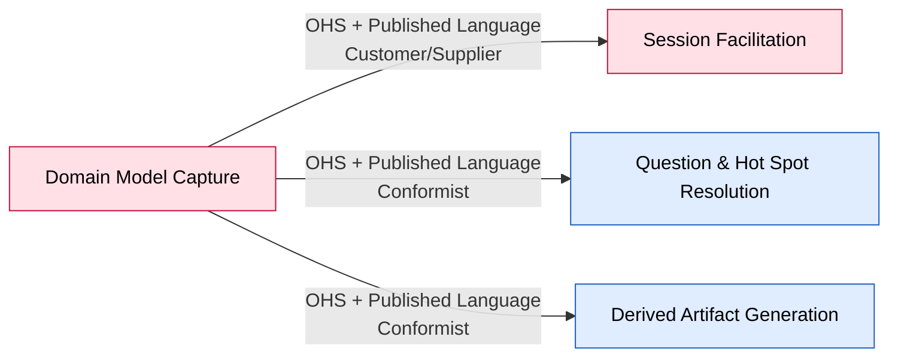

# Bounded Context: Domain Model Capture

> Phase 05–06 canvas. Boundary facts confirmed this session; the event-stormed model is left
> `UNCONFIRMED` pending a Process Modelling or Design-Level EventStorming pass on this context
> specifically.

**Status:** draft • **Provenance:** `[confirmed]` (boundary) / `UNCONFIRMED` (event-stormed model)

- **Purpose:** Own the accepted domain model — a typed graph of Domain Event/Actor/System/Hot Spot
  Building Blocks and their relations, with stable identities, and the shared lifecycle every
  Building Block kind goes through (Reworded / Withdrawn / Reinstated).
- **Subdomain type:** Core
- **Domain experts:** The participant; no dedicated data-modeling expert consulted yet.
- **Owning team:** One team (currently: the participant), owns all four v1 contexts.
- **Status:** draft

## Boundary rationale

- **Language boundary:** Domain Event / Actor / System / Hot Spot — not "Element" or "Node" (implementation
  vocabulary, not EventStorming's language). "Reworded" — not "Rename" — because the underlying
  identity (the id) never changes; only the articulation of an already-recognized fact does. Both
  `[confirmed]`.
- **Capability boundary:** own-the-model (Building Block/relation storage and lifecycle, with the
  invariants that keep it consistent).
- **Consistency boundary:** UNCONFIRMED — strong candidate named in `open-questions.md` #3:
  reinstating a withdrawn Building Block must re-validate its old relations against the board's *current*
  state (a stale position, or a `follows` chain that would now cycle), and the PRD defines no
  resolution rule for a failed re-validation. Needs a Design-Level pass to become an aggregate
  invariant.
- **Does not own:** deciding what to propose or when to close a session (Session Facilitation);
  deciding when a Hot Spot should be raised (Question & Hot Spot Resolution — it only issues the
  generic Building Block-creation call, same as any other kind); projecting the model into readable
  output (Derived Artifact Generation).

## Event-stormed model

> Deferred. Commands/Events/Policies/Queries/Aggregates below are `UNCONFIRMED` pending a
> Process Modelling or Design-Level session on this context.

### Commands

| Command | Actor / source | Handled by | Produces event(s) | Notes |
|---|---|---|---|---|
| UNCONFIRMED (e.g. Create Building Block, Rework Building Block, Withdraw Building Block, Reinstate Building Block) | Session Facilitation, Question & Hot Spot Resolution | UNCONFIRMED | UNCONFIRMED | Named generically from the board's lifecycle stages; not yet modelled as commands |

### Events in

| Event | Published by | Reaction in this context | Notes |
|---|---|---|---|
| UNCONFIRMED | Session Facilitation, Question & Hot Spot Resolution | UNCONFIRMED | Deferred |

### Events out

| Event | Consumed by | Meaning | Produced by |
|---|---|---|---|
| Kind-specific Reworded (e.g. Domain Event Reworded) | Derived Artifact Generation | A Building Block's articulation changed; its identity did not | UNCONFIRMED command |
| Kind-specific Withdrawn (e.g. Actor Withdrawn) | Derived Artifact Generation | A Building Block's connections were severed | UNCONFIRMED command |
| Kind-specific Reinstated (e.g. System Reinstated) | Derived Artifact Generation | A withdrawn Building Block returned, relations re-validated | UNCONFIRMED command |

### Policies

| When this event happens | Then this command/action occurs | Rule / rationale | Status |
|---|---|---|---|
| UNCONFIRMED | — | — | Deferred |

### Queries / views / read models

| Query / view | Used by | Answers | Built from / backed by |
|---|---|---|---|
| The full model graph | Derived Artifact Generation | "What is the current, accepted model?" | UNCONFIRMED — likely the Building Block/relation store directly |

### Aggregates / consistency boundaries

| Aggregate / boundary | Handles commands | Emits events | Consistency rule |
|---|---|---|---|
| UNCONFIRMED (candidate: one Building Block, or the board as a whole) | UNCONFIRMED | UNCONFIRMED | Candidate: reinstatement must re-validate prior relations against current board state — `open-questions.md` #3 |

### External systems

None identified this session.

## Integration arrows

- **Upstream (this context depends on):** none — Capture is the hub.
- **Downstream (consumers of this context):** Session Facilitation (Customer/Supplier — its
  needs are formally accommodated, since it's the primary consumer shaping the contract), Question
  & Hot Spot Resolution (Conformist), Derived Artifact Generation (Conformist).
- **Published language / contracts:** the Building Block lifecycle contract — create / rework / withdraw
  / reinstate, uniform across all Building Block kinds.
- **Anticorruption needs:** none this session — Capture is the upstream of the whole map, so
  nothing protects it from a messier neighbor; its own contract *is* the protection the others get.

## Hot-spots and open questions

| Topic | Type | What's unresolved | Next question / expert |
|---|---|---|---|
| Reinstatement conflict rule | white-spot | No resolution rule when re-validating a reinstated Building Block's relations fails | `../../open-questions.md` #3 — named for Process Modelling or Design-Level |

## Code evidence (as-is)

Not run this session. UNCONFIRMED.

## Opportunities / problems

- This context's aggregate boundary is the single highest-leverage next question — it decides
  whether "the whole board" or "one Building Block" is the unit of consistency, and the reinstatement
  rule hangs on that answer.

<!-- BEGIN lineage:index -->
<!-- END lineage:index -->
