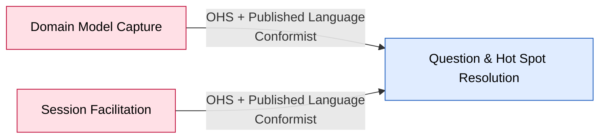

# Bounded Context: Question & Hot Spot Resolution — SUPERSEDED

> **Retired 2026-08-26.** `ddd-strategic-design` adopted the Design-Level finding below: this
> context's boundary does not hold independently of Session Facilitation. Its capability
> (resolution judgment) and read model (open hot spots/questions) now live in
> [`../session-facilitation/canvas.md`](../session-facilitation/canvas.md). This file is preserved
> unedited below for provenance only — do not treat any content past this notice as current. See
> `../../context-map.md`'s "Decision" section and `../../open-questions.md` #17.

> Phase 05–06 canvas. Boundary facts confirmed this session; the event-stormed model is left
> `UNCONFIRMED` pending a Process Modelling session on "the capture loop" — already named as the
> natural next storm by the Big Picture workshop's own README.

> **Candidate finding (Design-Level, 2026-08-26):** this context's boundary tested does not hold as
> independent — evidence points to folding it into Session Facilitation. `[inferred]`, not
> adopted. See `../../context-map.md`'s "Candidate revision" section and
> `../../sessions/2026-08-26-design-level.md`. This canvas is left as-is below, unedited, pending
> `ddd-strategic-design`'s decision on the merge.
>
> **Update 2026-08-26:** the candidate above was adopted. This context is retired.

**Status:** superseded • **Provenance:** `[confirmed]` (boundary) / `UNCONFIRMED` (event-stormed model)

- **Purpose:** Detect and track gaps in a session's model — decide when a Hot Spot should be
  raised, and track whether a question resolves before the session closes.
- **Subdomain type:** Supporting
- **Domain experts:** The participant.
- **Owning team:** One team (currently: the participant), owns all four v1 contexts.
- **Status:** draft

## Boundary rationale

- **Language boundary:** the three named triggers — Absent Stakeholder Named, Knowledge Gap
  Revealed, Session Closed-with-unresolved-Question — and "resolved" / "unresolved" as this
  context's own vocabulary for a question's fate. Distinct from Domain Model Capture's generic
  Building Block lifecycle vocabulary (a Hot Spot Building Block, once raised, follows Capture's
  lifecycle, not this context's).
- **Capability boundary:** detect-and-track-gaps (noun–verb). Confirmed this session as its own
  context rather than folded into Facilitation or Capture: no standalone product value, but a
  genuinely distinct job (noticing what's *missing*, not eliciting or storing what's present) with
  its own pace — a question can stay open across many proposal/accept cycles.
- **Consistency boundary:** UNCONFIRMED — likely candidate: a question's resolved/unresolved state
  at the moment of Session Closed. Needs a Process Modelling pass.
- **Does not own:** the Hot Spot Building Block's own storage/lifecycle once raised (Domain Model
  Capture — this context only issues the "raise" command); the conversation that produces the
  triggering facts (Session Facilitation).

## Event-stormed model

> Deferred to Process Modelling on "the capture loop" (already named as the next session by the
> workshop's own README headline finding).

### Commands

| Command | Actor / source | Handled by | Produces event(s) | Notes |
|---|---|---|---|---|
| Raise Hot Spot | This context (policy-triggered) | Domain Model Capture | Building Block created (Hot Spot kind) | UNCONFIRMED exact command name/shape |

### Events in

| Event | Published by | Reaction in this context | Notes |
|---|---|---|---|
| Absent Stakeholder Named | Session Facilitation | Policy: → Raise Hot Spot | `[storm]` — named, not modelled as a policy until now |
| Knowledge Gap Revealed | Session Facilitation | Policy: → Raise Hot Spot | `[storm]` |
| Session Closed | Session Facilitation | Policy: check every Question Asked for a resolving event; unresolved ones → Raise Hot Spot | `[storm]` |

### Events out

| Event | Consumed by | Meaning | Produced by |
|---|---|---|---|
| UNCONFIRMED (this context's own signal, if any, beyond the Raise Hot Spot command to Capture) | — | — | Deferred |

### Policies

| When this event happens | Then this command/action occurs | Rule / rationale | Status |
|---|---|---|---|
| Absent Stakeholder Named | Raise Hot Spot | A missing perspective is itself a gap worth flagging | `[storm]`, not yet formalized as a policy card |
| Knowledge Gap Revealed | Raise Hot Spot | An admitted gap in the participant's own knowledge is a gap worth flagging | `[storm]` |
| Session Closed AND a Question Asked has no resolving event | Raise Hot Spot | An unresolved question shouldn't silently disappear at close | `[storm]` |

### Queries / views / read models

| Query / view | Used by | Answers | Built from / backed by |
|---|---|---|---|
| Open questions at any point in the session | UNCONFIRMED | "What's still unresolved?" | UNCONFIRMED |

### Aggregates / consistency boundaries

| Aggregate / boundary | Handles commands | Emits events | Consistency rule |
|---|---|---|---|
| UNCONFIRMED (candidate: one Question, tracked from Asked to resolved/unresolved) | — | — | Deferred |

### External systems

None identified this session.

## Integration arrows

- **Upstream (this context depends on):** Domain Model Capture (Conformist — accepts the generic
  Building Block contract as-is to issue Raise Hot Spot) and Session Facilitation (Conformist — accepts
  the curated event set as-is; no leverage to shape Facilitation's design).
- **Downstream (consumers of this context):** none identified this session.
- **Published language / contracts:** none of its own yet identified — it is a pure consumer plus
  one outbound command into Capture's contract.
- **Anticorruption needs:** none — both upstreams are the same team's own clean, deliberate
  contracts.

## Hot-spots and open questions

| Topic | Type | What's unresolved | Next question / expert |
|---|---|---|---|
| Three policy relationships, found not modelled | hot-spot | Exactly the subject of this context; formalizing them is Process Modelling's job | `../../open-questions.md` #4 |
| This session's own hard limit | hot-spot | Solo participant means no inter-expert disagreement was available to surface further boundaries here | `../../open-questions.md` #5 |

## Code evidence (as-is)

Not run this session. UNCONFIRMED.

## Opportunities / problems

- This is the single most fully-specified UNCONFIRMED context in the catalog — the three policies
  are already named precisely; a Process Modelling session on "the capture loop" should be
  comparatively fast to run.

<!-- BEGIN lineage:index -->
<!-- END lineage:index -->