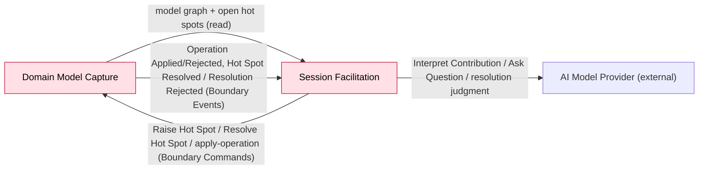

# Bounded Context: Session Facilitation

> **Design-Level pass 1 (2026-08-26)** — `Workshop`, invitations, and the resolution mechanic.
> **Design-Level pass 2 (2026-08-27, resume)** — the *session runtime*: the parts pass 1
> `[carried]` from `boards/capture-loop.md` rather than modelled — contribution interpretation, the
> Proposal lifecycle, the Resolution lifecycle, and question accountability. This pass adds three
> aggregates (`Session`, `Proposal`, `Resolution`), simplifies `Workshop`, and corrects the
> canvas's earlier "handled by Domain Model Capture" attribution of the resolution commands. Full
> reasoning in `sessions/2026-08-27-design-level-session-facilitation-runtime.md`.
> **Design-Level pass 3 (2026-08-27, resume, narrow)** — specifies `open-questions.md` #27: the
> read model behind the `Ask Question` policy. `Ask Question` is the facilitator running an
> interview loop, not reacting to a contribution. Adds three read models (`Facilitation context`
> live, `Prior-session history` frozen-at-close, `Facilitation agenda` derived), a birth-fixed
> immutable `scope` on `Workshop`, and extends `Session`'s close transaction to freeze a
> facilitation summary. No new aggregate. Full reasoning in
> `sessions/2026-08-27-design-level-session-facilitation-context.md`.

> **Absorbed 2026-08-26:** the former Question & Hot Spot Resolution context folded into this one.
> See `../../context-map.md`'s "Decision" section, `../../open-questions.md` #17, and the retired
> [`../question-hot-spot-resolution/canvas.md`](../question-hot-spot-resolution/canvas.md).

**Status:** draft • **Provenance:** `[confirmed]` (boundary) / `[storm]` (event-stormed model)

- **Purpose:** Conduct the AI-facilitated conversation across a `Workshop`'s whole life — from
  choosing its format, through every `Session` any contributor has with it, to raising and
  resolving the hot spots and questions that surface along the way.
- **Subdomain type:** Core
- **Domain experts:** The participant (product owner), currently the sole source of facilitation
  method knowledge for this build.
- **Owning team:** One team (currently: the participant), owns all v1 contexts.

## Boundary rationale

- **Language boundary:** `Workshop` (persists, spans sessions, bound to one format for life) and
  `Session` (one sitting) are this context's own terms. `Contribution` → `Contribution Interpreted`
  → `Building Block Proposed` is a settled three-step sequence (see Ubiquitous Language).
  `[from QHSR]` absorbs the trigger vocabulary — Absent Stakeholder Named, Knowledge Gap Revealed —
  and "resolved"/"unresolved" as a hot spot's fate.
- **Capability boundary:** conduct-conversation-and-propose, spanning an entire `Workshop`'s life.
  `[from QHSR]` detect-and-track-gaps folds in as an extension of the same judgment shape as
  `Interpret Contribution`.
- **Consistency boundary:** **four aggregates** (pass 2 correction — pass 1 named only `Workshop`):
  `Workshop` (format + invitations), `Session` (one sitting; question accountability),
  `Proposal` (one pending model operation), `Resolution` (one pending hot-spot resolution). See
  Aggregates, below, for the invariant-first reasoning.
- **Does not own:** Building Block storage/lifecycle, including the Hot Spot Building Block's
  resolved state and reference (Domain Model Capture); the workshop operation log (Domain Model
  Capture); projecting the model into readable output (Derived Artifact Generation).
- **A stated context constraint, not an aggregate invariant:** *at most one open `Session` per
  workshop, for v1*. It is a business rule (avoid two contributors unknowingly modelling the same
  area; true concurrency is deferred to Multiplayer, `../../open-questions.md` #10/#26), but it is
  a **set-scoped uniqueness rule** across `Session` instances, so no single aggregate can hold it.
  Enforced outside any aggregate by a partial uniqueness constraint (`UNIQUE(workshopId) WHERE
  status = open`); closing a session frees the slot. This is the rule Multiplayer relaxes.

## Event-stormed model

> Commands/events for `Workshop`, invitations, and resolution confirmed `[storm]` 2026-08-26.
> The session runtime (`Session`/`Proposal`/`Resolution`, interpretation choreography, the
> apply-confirmation round trip) confirmed `[storm]` 2026-08-27.

### Commands

| Command | Actor / source | Handled by | Produces event(s) | Notes |
|---|---|---|---|---|
| Start Workshop | Creator (any user, v1) | `Workshop` | Workshop Started | Format chosen here, fixed thereafter |
| Propose Scope | Facilitator (automatic, before / at the start of the first session) | AI Model Provider | Scope Proposed | Mirrors the F05 review shape; the result is `Workshop` state, **not** a log operation (PRD F04 divergence — `../../open-questions.md` #63) |
| Set Scope | Creator | `Workshop` | Scope Set | Accept/edit of the proposed scope. Legal **once**, before or during the first session; rejected thereafter. `scope` is immutable for the `Workshop`'s life |
| Invite Stakeholder | Creator only, v1 | `Workshop` | Stakeholder Invited | "Any member can invite" parked |
| Accept / Decline / Revoke Invitation | Invitee / Invitee / Creator | `Workshop` | Invitation Accepted / Declined / Revoked | Decline from `INVITED` only; revoke from `INVITED` or `ACCEPTED` |
| Start Session | Creator or currently-`ACCEPTED` invitee | app service: reads `Workshop.canStartSession`, then creates `Session` | Session Started | Eligibility is a pure read of `Workshop`; the one-open-session constraint (not an aggregate) rejects a second open session |
| Make Contribution | Domain Expert | `Session` | Contribution Made | Rejected if the session is closed. Always succeeds while open — it is the expert's words |
| Interpret Contribution | automatic (policy, on Contribution Made) | AI Model Provider | Contribution Interpreted | Deferred and retried if the provider is unavailable (`../../open-questions.md` a). Idempotent per contribution id — a contribution is interpreted **at most once** |
| Ask Question | Facilitator (automatic, on Session Started; also ad hoc) | AI Model Provider | Question Asked | `[carried]`; question state recorded on `Session` |
| Answer Question | automatic (policy, on Contribution Interpreted, question-track judgment = answered) | `Session` | Question Answered | Marks that question `Resolved` |
| Reveal Knowledge Gap | automatic (policy) | `Session` | Knowledge Gap Revealed | Marks the question `Resolved` **and** triggers Raise Hot Spot |
| Name Absent Stakeholder | automatic (policy, once per named person) | `Session` | Absent Stakeholder Named | Marks the question `Resolved` **and** triggers Raise Hot Spot |
| Confirm Complete Perspective | automatic (policy) | `Session` | Complete Perspective Confirmed | Marks the question `Resolved` **and** sets the workshop's chosen-problem qualification |
| Attribute Contribution To Another Format | automatic (policy) | Facilitator | Contribution Attributed To Another Format | Terminal for that contribution's content track |
| Propose Building Block | automatic (policy, once per proposal-worthy judgment) | `Proposal` (new instance) | Building Block Proposed | Independent per judgment (`capture-loop` Inv. 4) |
| Edit Proposal | Domain Expert | `Proposal` | Proposal Edited | 0+ times, only before a terminal state |
| Accept Proposal | Domain Expert | `Proposal` | Proposal Accepted | `PROPOSED`/`EDITED`/`APPLY_FAILED` → `ACCEPTED` (apply pending) |
| Reject Proposal | Domain Expert | `Proposal` | Proposal Rejected | Terminal, no building block |
| Propose Resolution | automatic (policy, once per resolves-open-hot-spot judgment) | `Resolution` (new instance) | Resolution Proposed | Mirrors Propose Building Block |
| Edit Resolution | Domain Expert | `Resolution` | Resolution Edited | Edits the (deliberately untyped) reference; before a terminal state |
| Accept Resolution | Domain Expert | `Resolution` | Resolution Accepted | → `ACCEPTED` (apply pending) |
| Reject Resolution | Domain Expert | `Resolution` | Resolution Rejected | Terminal — hot spot stays open |
| Close Session | Domain Expert / Facilitator | `Session` | Session Closed | **Moved from `Workshop` (pass 2).** Stops accepting contributions; computes the unresolved-question snapshot in the same transaction |
| — apply a proposal — (kind-specific: Capture Domain Event / Identify Actor / Identify System / Sequence / Link Cause / Annotate / …) | automatic (policy, on Proposal Accepted) | **Domain Model Capture** | Operation Applied / Operation Rejected | Boundary Command. One accepted proposal = one operation on one aggregate |
| Resolve Hot Spot | automatic (policy, on Resolution Accepted) | **Domain Model Capture** | Hot Spot Resolved / Hot Spot Resolution Rejected | Boundary Command. Facilitation requests; Capture stores the resolution + reference |
| Raise Hot Spot | this context (policy-triggered) | **Domain Model Capture** | Hot Spot Raised | `[carried]`, `[from QHSR]`. Fire-and-forget — no target dependency, cannot bounce the way an apply can |

### Events in

| Event | Published by | Reaction in this context | Notes |
|---|---|---|---|
| Operation Applied (keyed to proposal id; carries the resulting building block id) | Domain Model Capture | `Proposal` → `APPLIED`; records `resultingBuildingBlockId` | **new (pass 2).** The id link Derived Artifact Generation Flow B needs (`../../open-questions.md` #51) |
| Operation Rejected (keyed to proposal id; carries the reason) | Domain Model Capture | `Proposal` → `APPLY_FAILED`; the reason is surfaced to the expert | **new (pass 2)** |
| Hot Spot Resolved (keyed to resolution id) | Domain Model Capture | `Resolution` → `APPLIED` | **new (pass 2)** — the confirming half of Resolve Hot Spot |
| Hot Spot Resolution Rejected (keyed to resolution id; reason: already-resolved / withdrawn) | Domain Model Capture | `Resolution` → `LAPSED`; the expert is told "already resolved / no longer exists" | **new (pass 2)** — no retry path |

### Events out

| Event | Consumed by | Meaning | Produced by |
|---|---|---|---|
| Workshop Started / Stakeholder Invited / Invitation Accepted/Declined/Revoked | (internal) | `Workshop` lifecycle | `Workshop` |
| Scope Proposed / Scope Set | (internal — the scope review UI; then every session reads `Workshop.scope`) | Workshop modelling intent (as-is / to-be / a named area) established | AI Model Provider / `Workshop` |
| Session Started | (internal, triggers Ask Question) | A sitting began | `Session` (birth) |
| Session Closed (carries the unresolved-question ids as of the close) | (internal — sweep policies) | A sitting ended | `Session` |
| Contribution Made / Contribution Interpreted | (internal — fan-out) | Raw input, then the facilitator's judgment | `Session` / AI Model Provider |
| Question Asked / Question Answered / Knowledge Gap Revealed / Absent Stakeholder Named / Complete Perspective Confirmed | (internal; some also cross to Capture via Raise Hot Spot) | Question lifecycle | `Session` / AI Model Provider |
| Building Block Proposed / Proposal Edited / Accepted / Rejected | (internal — the expert's review UI) | Proposal lifecycle | `Proposal` |
| Proposal Applied / Proposal Apply Failed / Proposal Lapsed | (internal; Derived Artifact Generation reads via the session record) | Terminal / transient proposal outcomes | `Proposal` |
| Resolution Proposed / Edited / Accepted / Rejected / Applied / Lapsed | (internal) | Resolution lifecycle | `Resolution` |
| Contribution Attributed To Another Format | (internal) | Content belongs to a deeper format | Facilitator |
| Hot Spot Raised / Hot Spot Resolved | Domain Model Capture | Boundary Events — unchanged in meaning | via Boundary Commands above |

### Policies (all automatic — no managed/human-owned policy in this context)

| When | Then | Notes |
|---|---|---|
| Session Started | Ask Question | The facilitator takes the first step, reading `Facilitation context` (recomputed this turn). **#27 resolved (pass 3)** — read model specified below |
| every facilitator turn (not only Session Started) | Ask Question | The interview loop: each turn the facilitator picks its next move — scope question, probe a phase name, chase an unopened region, run the stakeholder check, or guide a stuck expert — from `Facilitation context` |
| Contribution Made | Interpret Contribution | Deferred + retried if the AI Model Provider is down; idempotent per contribution id |
| Contribution Interpreted, judgment = proposal-worthy (0+) | Propose Building Block | One `Proposal` per judgment |
| Contribution Interpreted, judgment = resolves-open-hot-spot (0+) | Propose Resolution | One `Resolution` per judgment |
| Contribution Interpreted, judgment = belongs-elsewhere | Attribute Contribution To Another Format | Terminal |
| Contribution Interpreted, judgment = knowledge-gap | Reveal Knowledge Gap → Raise Hot Spot | Also resolves the question |
| Contribution Interpreted, judgment = absent-stakeholder (per person) | Name Absent Stakeholder → Raise Hot Spot | Also resolves the question |
| Contribution Interpreted, judgment = complete-perspective | Confirm Complete Perspective | Also resolves the question; sets workshop qualification |
| Contribution Interpreted, question-track judgment = answered | Answer Question | Resolves the question; no content consequence |
| Proposal Accepted | apply the kind-specific operation into Domain Model Capture | Boundary Command; response awaited |
| Operation Applied | `Proposal` → APPLIED | |
| Operation Rejected | `Proposal` → APPLY_FAILED; surface the reason | Corrective — the expert re-edits and re-accepts, or rejects |
| Resolution Accepted | Resolve Hot Spot into Domain Model Capture | Boundary Command; response awaited |
| Hot Spot Resolved | `Resolution` → APPLIED | |
| Hot Spot Resolution Rejected | `Resolution` → LAPSED; tell the expert | No retry |
| Session Closed | for each unresolved question id in the payload: Raise Hot Spot | `[carried]`, `[from QHSR]` — the close-time question sweep |
| Session Closed | compute and freeze this session's facilitation summary, in the **same transaction** as the unresolved-question snapshot | **new (pass 3).** Feeds `Prior-session history` for later sessions of the same `Workshop`; `CLOSED` is terminal so the summary never changes |
| Session Closed | for each `Proposal` in `APPLY_FAILED`: → LAPSED **and** Raise Hot Spot; for each undisposed `Proposal`/`Resolution` (`PROPOSED`/`EDITED`): → LAPSED (quiet) | **new (pass 2).** Unfulfilled intent survives as a hot spot; an untouched guess lapses silently |
| Session Closed | `Workshop` frees its one-open-session slot | Reacts only — `Workshop` no longer tracks sessions directly |

### Queries / views / read models

| Query / view | Used by | Answers | Backed by | Freshness |
|---|---|---|---|---|
| Open hot spots for this workshop | the resolution judgment inside `Interpret Contribution` | "What could this contribution be resolving?" | Domain Model Capture's Hot Spot Building Blocks, filtered to `Open` | — |
| Open questions in this session | `Ask Question` policy; the close-time sweep | "What is still unresolved this sitting?" | projection over the `Session` stream | — |
| Un-interpreted contributions | the deferred-interpretation retry | "What is waiting for the model provider?" | projection over the `Session` stream | — |
| Pending proposals / resolutions in this session | the expert's review UI | "What is waiting on me?" | `Proposal` / `Resolution` aggregates, non-terminal | — |
| `Facilitation context` | `Ask Question` policy, **every turn** | "What should the facilitator ask / do next?" | composite: recent transcript + open questions + open hot spots + thin/unopened regions + `Workshop.scope` + frozen prior-session summary | live inputs recomputed **every facilitator turn**; prior-session half frozen. One physical projection or several is prototyping (`../../open-questions.md` #66) |
| `Prior-session history` | `Facilitation context` | "What happened in earlier sessions of this workshop?" | projection over the **closed** `Session` streams for this `workshopId`; each summary frozen in its `Close Session` transaction | append-only; each entry immutable once written |
| `Facilitation agenda` | `Facilitation context` | "What follow-ups must the facilitator not lose?" | **derived** (not stored): open questions ∪ building blocks that look like unexpanded phase names ∪ pending stakeholder check | recomputed with the live half. Stored notes beyond these categories → `../../open-questions.md` #65 |
| `Thin / unopened regions` | `Facilitation agenda`, `Facilitation context` | "Where is the board empty or shallow?" | projection over Domain Model Capture's graph (building blocks + `follows`/`causedBy` connectivity) — **the same upstream read as `Open hot spots for this workshop`**, new purpose | reads Capture's model graph |

*The expert's apparent state (stuck / terse / fluent) is deliberately **not** a read model — it is
the AI Model Provider's read of the recent transcript at decision time.*

### Aggregates / consistency boundaries

**Invariant-first.** Pass 1 named only `Workshop`; pass 2 found three more the session runtime
needs, each protecting a rule that reaches beyond a single record. **Pass 3 added no aggregate** —
the facilitator's context is a set of read models, "scope is set once" is a new `Workshop`
invariant, and "the prior-session summary is frozen at close" rides on `Session`'s existing atomic
close transaction.

| Aggregate | Protects (the invariant) | Handles | Notes |
|---|---|---|---|
| `Workshop` | Format is fixed at birth; **`scope` is set exactly once (before or during the first session) and is immutable thereafter — birth-fixed, like format (pass 3)**; the invitation state machine; `canStartSession(userId)` is answerable from creator + invitation state | Start Workshop, Set Scope, Invite/Accept/Decline/Revoke, `canStartSession` (read) | Pass 2 **removed** its "one open session" invariant (now a constraint) and `Close Session` (now `Session`'s). Now format + `scope` + invitations. No corrective policy for scope — a scope change means a **new `Workshop`** (templated from this one) |
| `Session` | Lifecycle `OPEN → CLOSED` (terminal); **`Close Session` computes, atomically in one transaction, both the unresolved-question snapshot and this session's frozen facilitation summary (pass 3)**; a contribution is interpreted at most once | Make Contribution, Ask Question, Answer Question, Reveal Knowledge Gap, Name Absent Stakeholder, Confirm Complete Perspective, Close Session | Event-sourced — its stream **is** the session record Derived Artifact Generation Flow B reads. Holds `Map<QuestionId, Open\|Resolved>` and an interpret-once ledger keyed on contribution id |
| `Proposal` | Exactly one disposition state at a time; `ACCEPTED`/`APPLIED`/`REJECTED`/`LAPSED` transitions are legal only from the states the machine allows; no edit after a terminal state | Propose Building Block (birth), Edit/Accept/Reject Proposal, Operation Applied/Rejected (from Capture) | One per proposal-worthy judgment. Records `resultingBuildingBlockId` on `APPLIED` |
| `Resolution` | Same disposition invariant; **every apply bounce is terminal** (no retry) | Propose Resolution (birth), Edit/Accept/Reject Resolution, Hot Spot Resolved / Hot Spot Resolution Rejected (from Capture) | One per resolves-open-hot-spot judgment |

**Why `Proposal` and `Resolution` are two aggregates, not one `kind`-switched aggregate:** their
outcomes diverge. A proposal adds *model content*; a resolution flips a hot spot's *status*.
Resolutions compete for one scarce `Open` state (a second successful resolution can't happen);
proposals don't compete. A proposal bounce is "the goal failed, retry"; a resolution bounce is
"the goal was already achieved (by someone else) or is moot" — terminal. F08's coming
informational-vs-model-affecting split will add resolution-specific payload rules. Merging them
means an `if kind == resolve` branch on every one of those — the "several concepts fused" smell.

**Deliberately not an invariant:** no action in this context is ever blocked by an unresolved hot
spot, of either kind (`[storm]` 2026-08-26). The system may suggest, never force an order of steps.

**Facets not filled** (per the Aggregate Design Canvas): Throughput and Size were not elicited —
an estimate here would be `[inferred]`, not a domain fact. Left open for all four aggregates.

### State machines

**`Workshop`** — unchanged from pass 1 except that session start/close no longer transition it, and
`Set Scope` fixes `scope` once (before or during the first session):

```
        (birth: Start Workshop → Workshop Started)   format fixed, creator set
                                    │
                              Set Scope (once, before/during session 1 → Scope Set)   scope fixed

Invite Stakeholder (creator only)
        │
        ▼
    INVITED ──Accept──▶ ACCEPTED
        │  ╲               │  ╲
   Decline  Revoke      Revoke
        ▼        ▼          ▼
    DECLINED   REVOKED   REVOKED
```

No modelled death — it accumulates workshops-worth of invitations by design. Archive/lock is a
parked feature idea.

**`Session`** (event-sourced):

```
   (birth: Start Session — Workshop.canStartSession checked, one-open-session constraint — → Session Started)
                    │
                    ▼
                 OPEN ──────── Close Session ──────▶ CLOSED  (death — terminal, no reopen)
                    │
  holds Map<QuestionId, Open|Resolved>, updated by
  Ask Question / Answer Question / Reveal Knowledge Gap /
  Name Absent Stakeholder / Confirm Complete Perspective;
  + interpret-once ledger keyed on contribution id
```

PRD F01's "reopen a session where I left it" maps to *starting a new `Session` on the same
`Workshop`* — the model graph is workshop-scoped and carries over.

**`Proposal`:**

```
(birth: Propose Building Block → Building Block Proposed)
        │
        ▼
    PROPOSED ⇄──Edit Proposal──▶ EDITED   (Edit loops on EDITED)
        │  ╲                        │  ╲
     Accept  Reject              Accept  Reject
        ▼      ▼                    ▼      ▼
    ACCEPTED  REJECTED (terminal)  ACCEPTED  REJECTED
   (apply pending)
        │
        ├── Operation Applied  ──▶ APPLIED (terminal; records resultingBuildingBlockId)
        │
        └── Operation Rejected ──▶ APPLY_FAILED (carries reason)
                                     │  ╲        ╲
                              Edit/Accept      Reject
                                (retry)          │
                                     │           ▼
                              (back into loop)  REJECTED

at Session Closed:  PROPOSED / EDITED   → LAPSED (terminal, quiet)
                    APPLY_FAILED        → LAPSED (terminal) + Raise Hot Spot
                    ACCEPTED (in flight)→ allowed to finish post-close; a post-close
                                          APPLY_FAILED raises a hot spot immediately
```

Terminal: `APPLIED`, `REJECTED`, `LAPSED`.

**`Resolution`** — same skeleton, no `APPLY_FAILED`:

```
(birth: Propose Resolution → Resolution Proposed)
        │
        ▼
    PROPOSED ⇄──Edit Resolution──▶ EDITED
        │  ╲                          │  ╲
     Accept  Reject                Accept  Reject
        ▼      ▼                      ▼      ▼
    ACCEPTED  REJECTED (terminal)  ACCEPTED  REJECTED
   (apply pending)
        │
        ├── Hot Spot Resolved            ──▶ APPLIED (terminal)
        └── Hot Spot Resolution Rejected ──▶ LAPSED  (terminal — "already resolved / gone", no retry)

at Session Closed:  PROPOSED / EDITED → LAPSED (terminal)
                    ACCEPTED          → allowed to finish post-close
```

Terminal: `APPLIED`, `REJECTED`, `LAPSED`.

### External systems

| System | Role | Interaction | Notes |
|---|---|---|---|
| AI Model Provider | Backs `Interpret Contribution`, `Ask Question`, and the resolution judgment | Async; a `Contribution Made` whose interpretation cannot run is **queued and retried** when a model (primary or fallback) returns | Technical Mechanism (`subdomain-catalog.md`). Queue/retry mechanics are `anoria-commons:distributed-systems` |
| Voice Input | Optional input channel | On-device (design preference, not binding) | Technical Mechanism |

## Integration arrows

> See `../../context-map.md`. Pass 2 grows the **published language** on the existing Domain Model
> Capture relationship — it does **not** change the pattern (still OHS + Published Language,
> Customer/Supplier). Recorded there as a candidate revision with evidence.



- **Upstream (this context depends on):** Domain Model Capture — OHS + Published Language,
  accommodated as Customer/Supplier.
- **Downstream:** Derived Artifact Generation reads the `Session` stream (the session record) for
  `Export Session Transcript`, and the workshop record (F18 — format, scope, stakeholder answer,
  chosen-problem qualification) for `Export Model` — OHS + Published Language, Conformist
  downstream. A decided context-map edge (`../../open-questions.md` #39, adopted by
  `ddd-strategic-design` 2026-08-28).
- **Boundary Commands (out):** `Raise Hot Spot`, `Resolve Hot Spot`, and the kind-specific
  apply-operation commands (`Capture Domain Event`, `Identify Actor`, `Sequence`, `Link Cause`, …).
- **Boundary Events (in):** `Operation Applied`, `Operation Rejected`, `Hot Spot Resolved`,
  `Hot Spot Resolution Rejected`.
- **Anticorruption needs:** none — Capture is clean/self-owned (same team).

## Hot-spots and open questions

| Topic | Type | What's unresolved | Next |
|---|---|---|---|
| Context shape for the first/next question | ~~white-spot~~ **resolved (pass 3, 2026-08-27)** | `Facilitation context` / `Prior-session history` / `Facilitation agenda` specified above | `../../open-questions.md` #27 |
| Workshop scope: `Workshop` state vs. PRD F04 "accept path" | white-spot, owned | The interaction is F05-shaped but the result is `Workshop` state, not a log operation | `../../open-questions.md` #63 — participant's PRD pass |
| Does EventStormer implement the Big Picture "pick one problem" exit? | white-spot | The chosen problem is a cross-workshop handoff; whether the product models it is unsettled | `../../open-questions.md` #64, unowned |
| `Facilitation agenda`: derived vs. stored notes; `Facilitation context` physical decomposition | white-spot | Settled by prototyping, not modelling | `../../open-questions.md` #65 / #66 |
| `Reject Proposal` / `Reject Resolution` reason | white-spot, minor | Whether a rejection carries a reason | `../../open-questions.md` #55, unowned |
| How a lapsed / apply-failed proposal renders in Flow B | ~~white-spot~~ **resolved 2026-08-28** | `Export Session Transcript` renders all four terminal dispositions distinctly (applied / rejected / never-taken / apply-failed) | `../../open-questions.md` #56 |
| As-is/to-be distinction | white-spot | Not distinguished anywhere | `../../open-questions.md` #6 |
| PRD gap: resolve/close mechanic, and now the Proposal/Session vocabulary | white-spot, owned | F08/F01 plus `Session`/`Workshop`/`lapsed`/`apply-failed` | `../../open-questions.md` #19/#29 — participant owns the PRD pass |
| Invitation expiry, broader invite permissions, workshop archive/lock | parked feature ideas | Not modelled | `../../open-questions.md` #25 |
| Concurrent multi-person sessions | tied to roadmap | The one-open-session constraint is a v1 simplification | `../../open-questions.md` #10/#26 |
| `Hot Spot Raised`/`Hot Spot Resolved` payload | hot-spot | Owned by Domain Model Capture's model | `../../open-questions.md` #13/#32 |

## Code evidence (as-is)

Not run — no `[code]` pass against `src/`. The repo has only scaffold. UNCONFIRMED.

## Opportunities / problems

- `boards/capture-loop.md` is **superseded in parts** by this pass: aggregates are now assigned
  (`Session`/`Proposal`/`Resolution`), `Answer Question`'s owner is confirmed (`Session`, not
  UNCONFIRMED), and the interpretation flow is refined (the apply-confirmation round trip). The
  board file is left unedited per this skill's rule against re-scaling an earlier workshop's
  artifact; a Process Modelling resume would reconcile it. See `../../open-questions.md` #52.
- Domain Model Capture's resume should consider modelling its graph as an event-sourced projection
  over the single-writer workshop operation log, with invariants checked at append time — which
  would dissolve the `Timeline` multi-instance-transaction question. `../../open-questions.md` #48.

<!-- BEGIN lineage:index -->
<!-- END lineage:index -->