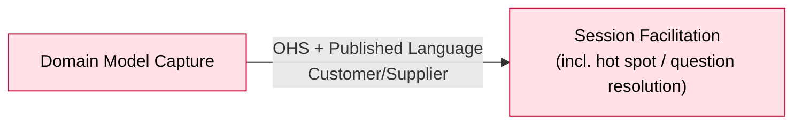

# Bounded Context: Session Facilitation

> Design-Level pass (2026-08-26) — this context's event-stormed model, previously `UNCONFIRMED`,
> is confirmed `[storm]` below. Full reasoning in
> `sessions/2026-08-26-design-level-session-facilitation.md`. Boundary facts (purpose, subdomain
> type, capability/consistency rationale) were confirmed earlier, in the `ddd-strategic-design`
> session (2026-08-25/26); this pass did not change them, only the event-stormed model.

> **Absorbed 2026-08-26:** the former Question & Hot Spot Resolution context folded into this one
> — `ddd-strategic-design` adopted a Design-Level finding that its detection and resolution
> capabilities already live here. See `../../context-map.md`'s "Decision" section,
> `../../open-questions.md` #17, and the retired
> [`../question-hot-spot-resolution/canvas.md`](../question-hot-spot-resolution/canvas.md). This
> Design-Level pass formalizes that resolution capability as commands/events/policies (see
> Policies, below).

**Status:** draft • **Provenance:** `[confirmed]` (boundary) / `[storm]` (event-stormed model)

- **Purpose:** Conduct the AI-facilitated conversation across a `Workshop`'s whole life — from
  choosing its format, through every `Session` any contributor has with it, to raising and
  resolving the hot spots and questions that surface along the way.
- **Subdomain type:** Core
- **Domain experts:** The participant (product owner), currently the sole source of facilitation
  method knowledge for this build.
- **Owning team:** One team (currently: the participant), owns all four v1 contexts.
- **Status:** draft

## Boundary rationale

- **Language boundary:** `Workshop` (persists, spans sessions, bound to exactly one format for
  its life) and `Session` (one sitting, bound to a workshop) are this context's own terms, given by
  the participant directly, not placeholders. "Proposal"/"Contribution" now have a settled,
  three-step relationship (see Ubiquitous Language) rather than an open ambiguity. `[from QHSR]`
  absorbs the trigger vocabulary — Absent Stakeholder Named, Knowledge Gap Revealed — and
  "resolved"/"unresolved" as a hot spot's fate, now fully modelled as commands/events below.
- **Capability boundary:** conduct-conversation-and-propose (noun–verb: session facilitation),
  now understood to span an entire `Workshop`'s life rather than one sitting. `[from QHSR]`
  detect-and-track-gaps folds in as an extension of this same capability: judging whether a
  contribution resolves an open hot spot is the same judgment shape as `Interpret Contribution`.
- **Consistency boundary:** Confirmed this session — **`Workshop` is the aggregate.** It enforces:
  format immutability, the creator/accepted-invitee gate on `Start Session`, invitation state
  transitions, and "at most one open session per workshop" (v1). See Aggregates, below.
- **Does not own:** Building Block storage/lifecycle, including the Hot Spot Building Block's
  resolved state and reference (Domain Model Capture); projecting the model into readable output
  (Derived Artifact Generation).

## Event-stormed model

> Confirmed `[storm]` this Design-Level pass (2026-08-26). Reasoning in
> `sessions/2026-08-26-design-level-session-facilitation.md`.

### Commands

| Command | Actor / source | Handled by | Produces event(s) | Notes |
|---|---|---|---|---|
| Start Workshop | Creator (any user, for v1) | `Workshop` | Workshop Started | Format chosen at this moment, fixed thereafter — no command changes it |
| Invite Stakeholder | Creator only, v1 | `Workshop` | Stakeholder Invited | "Any member can invite" parked as a future-feature idea |
| Accept Invitation | Invitee | `Workshop` | Invitation Accepted | |
| Decline Invitation | Invitee | `Workshop` | Invitation Declined | From `INVITED` only |
| Revoke Invitation | Creator | `Workshop` | Invitation Revoked | From `INVITED` or `ACCEPTED` |
| Start Session | Creator or an invitee with a currently-`ACCEPTED` invitation | `Workshop` | Session Started | Rejected if requester isn't eligible, or a session is already open for this workshop |
| Ask Question | Facilitator (automatic, on Session Started) | AI Model Provider | Question Asked | `[carried]` from `boards/capture-loop.md`; now connected to its trigger |
| Close Session | Domain Expert / Facilitator | `Workshop` | Session Closed | `[carried]` |
| Propose Resolution | automatic (policy) | Facilitator | Resolution Proposed | New — mirrors `Propose Building Block` |
| Accept Resolution | Domain Expert | Domain Model Capture | Resolution Accepted | New |
| Reject Resolution | Domain Expert | Domain Model Capture | Resolution Rejected | New, terminal — hot spot stays open |
| Resolve Hot Spot | automatic (policy, on Resolution Accepted) | Domain Model Capture | Hot Spot Resolved | New — Boundary Command, mirrors `Raise Hot Spot`. Facilitation only requests; Capture stores the resolution + reference |
| Raise Hot Spot | This context (policy-triggered) `[from QHSR]` | Domain Model Capture | Hot Spot created (Hot Spot kind) | `[carried]` — unchanged |

Everything from `Contribution Made` through `Building Block Proposed`/`Contribution Attributed To
Another Format`/`Knowledge Gap Revealed`/`Absent Stakeholder Named`/`Complete Perspective
Confirmed`/`Question Answered` is `[carried]` unchanged from `boards/capture-loop.md` — not
repeated here to avoid two sources of truth; that board remains the canonical fine-grained flow for
the capture loop itself.

### Events in

| Event | Published by | Reaction in this context | Notes |
|---|---|---|---|
| (none) | — | — | This context originates its own flow from `Start Workshop`; nothing external triggers it |

### Events out

| Event | Consumed by | Meaning | Produced by |
|---|---|---|---|
| Workshop Started | (internal) | Birth of a workshop, format fixed | `Workshop` |
| Stakeholder Invited | (internal) | A person was invited to contribute | `Workshop` |
| Invitation Accepted / Declined / Revoked | (internal) | Invitation state changes | `Workshop` |
| Session Started | (internal, triggers Ask Question) | A sitting began, bound to a workshop | `Workshop` |
| Session Closed | Domain Model Capture (sweep policy) | A sitting ended | `[carried]` |
| Resolution Proposed / Accepted / Rejected | (internal) | The resolution mechanic's own lifecycle | new |
| Hot Spot Resolved | Domain Model Capture | Boundary Event — a hot spot's resolution, with its reference, is recorded | new |
| Hot Spot Raised | Domain Model Capture | Boundary Event — unchanged | `[carried]`, `[from QHSR]` |

### Policies

| When this event happens | Then this command/action occurs | Rule / rationale | Status |
|---|---|---|---|
| Session Started | Ask Question | The facilitator always takes the first step, informed by the workshop's purpose and, on a resuming workshop, its accumulated history | `[storm]`, new — the seam into `boards/capture-loop.md` |
| Absent Stakeholder Named | Raise Hot Spot | A missing perspective is itself a gap worth flagging | `[storm]`, `[from QHSR]` |
| Knowledge Gap Revealed | Raise Hot Spot | An admitted gap in the participant's own knowledge is a gap worth flagging | `[storm]`, `[from QHSR]` |
| Session Closed AND a Question Asked has no resolving event | Raise Hot Spot | An unresolved question shouldn't silently disappear at close — it becomes a hot spot, which is the only route by which "resolution" could ever apply to it later | `[storm]`, `[from QHSR]` |
| Contribution Interpreted, judgment=resolves-open-hot-spot | Propose Resolution | Mirrors `Building Block Proposed → Accept Proposal`: interpretation, then deliberate human confirmation, never automatic | `[storm]` — this session, formalizing the predecessor's design |
| Resolution Accepted | Resolve Hot Spot | Facilitation requests; Domain Model Capture stores the resolution and its (deliberately untyped) reference | `[storm]` |
| Resolution Rejected | (none — terminal) | The hot spot stays open; nothing further happens | `[storm]` |

### Queries / views / read models

| Query / view | Used by | Answers | Built from / backed by |
|---|---|---|---|
| Open hot spots for this workshop | The resolution judgment (`Contribution Interpreted`) | "What could this contribution be resolving?" | Domain Model Capture's Hot Spot Building Blocks, filtered to unresolved. Applies to **both** informational and model-affecting kinds — both are resolvable; only model-affecting ones are expected to need resolving eventually |
| Open questions at any point in the session | `[carried]` | "What's still unresolved in this sitting?" | `Question Asked` minus every question with a resolving event, `boards/capture-loop.md` |
| Context for the next question | `Ask Question` policy | "What should the facilitator ask next?" | UNCONFIRMED exact shape — the participant described "whatever context he has" (workshop purpose, prior sessions' history); not yet specified precisely. See Hot-spots below |

### Aggregates / consistency boundaries

| Aggregate / boundary | Handles commands | Emits events | Consistency rule |
|---|---|---|---|
| `Workshop` | Start Workshop, Invite Stakeholder, Accept/Decline/Revoke Invitation, Start Session, Close Session | Workshop Started, Stakeholder Invited, Invitation Accepted/Declined/Revoked, Session Started, Session Closed | See invariants below |

**`Workshop`'s invariants** (invariant-first — named because these are what require one
consistency boundary):

1. Format is fixed at `Workshop Started`; no command changes it. (Structural — no acceptance test
   possible, there is no `When`.)
2. `Start Session` is rejected unless the requester is the creator or holds a currently-`ACCEPTED`
   invitation. Hard, synchronous, no optimistic window.
3. An invitation may be revoked from `INVITED` or `ACCEPTED`, landing on `REVOKED`; a revoked or
   declined invitation no longer satisfies invariant 2.
4. At most one open (unclosed) session exists per workshop at a time, for v1 — `Start Session` is
   rejected otherwise. True concurrent multi-person sessions are deferred to the Multiplayer
   roadmap item (`open-questions.md` #10).

**Deliberately not an invariant:** no action in this context is ever blocked by an unresolved hot
spot, of either kind. The participant confirmed this explicitly — EventStorming workshops are
fluid by design; the system may suggest, never force a required order of steps.

**`Workshop`'s state machine:**

```
                    (birth: Start Workshop → Workshop Started)
                    format fixed, creator set, no open session

Invite Stakeholder (creator only)
        │
        ▼
    INVITED ──Accept Invitation──▶ ACCEPTED
        │  ╲                           │  ╲
   Decline  Revoke Invitation    Revoke Invitation
        │        │                    │
        ▼        ▼                    ▼
    DECLINED   REVOKED             REVOKED

Start Session (creator or ACCEPTED invitee; rejected if a session is already open)
        │
        ▼
  [open session exists] ──Close Session──▶ [no open session]
```

No modelled death for `Workshop` — it accumulates sessions indefinitely by design. Archiving or
locking a "finished" workshop is a parked feature idea (`open-questions.md`), not modelled.
`Session`'s own lifecycle is the simple pair `Started → Closed`; no pause/resume state exists.

**Facets this workshop cannot honestly fill (per `anoria-commons:domain-modeling`'s Aggregate
Design Canvas):** Throughput and Size were not elicited this session — they weren't asked, and an
estimate here would be `[inferred]`, not a domain fact. Left open.

### External systems

| System | Role | Interaction | Notes |
|---|---|---|---|
| AI Model Provider | Backs the facilitator's proposals/questions/resolution judgments | UNCONFIRMED (sync/async) | Technical Mechanism, see `subdomain-catalog.md` — not a subdomain in its own right |
| Voice Input | Optional input channel | On-device, audio never leaves device (design preference, not binding — `open-questions.md`) | Technical Mechanism |

## Integration arrows

> Confirmed Phase 06 relationships — see `../../context-map.md` for the source of truth. Unchanged
> by this session: `Resolve Hot Spot`/`Hot Spot Resolved` extend the existing relationship with
> Domain Model Capture, they don't add a new one.



- **Upstream (this context depends on):** Domain Model Capture — OHS + Published Language, this
  context accommodated as Customer/Supplier (it's the primary consumer shaping the contract),
  including `Raise Hot Spot` and, new this session, `Resolve Hot Spot`.
- **Downstream (consumers of this context):** none identified.
- **Published language / contracts:** none of its own currently identified downstream of this
  context.
- **Anticorruption needs:** none identified; Capture is this context's only upstream and is
  clean/self-owned (same team).

## Hot-spots and open questions

| Topic | Type | What's unresolved | Next question / expert |
|---|---|---|---|
| As-is/to-be distinction | white-spot | Neither this board nor the PRD distinguishes describing the business as it works today vs. as wanted | `../../open-questions.md` #6 |
| `Hot Spot Raised`/`Hot Spot Resolved` payload/granularity | hot-spot | Still not fully settled — owned by a future Design-Level pass on Domain Model Capture, which designs the resolution logic that actually needs this shape | `../../open-questions.md` #13 |
| PRD gap: resolve/close mechanic unspecified | white-spot, owned | F08 defines creation/annotation/counting but no resolve operation; F01's operation-log kind list has no `resolve` verb. This session gives the full candidate design; the participant will update the PRD after this workshop | `../../open-questions.md` #19 |
| Context shape for the first/next question | white-spot | "Whatever context [the facilitator] has" is not precisely specified — how much history, summarized how | new, unowned |
| Invitation expiry, broader invite permissions, workshop archive/lock | parked feature ideas | Deliberately not modelled this session — duration undecided, permission model undecided, archival need unconfirmed | new, unowned |
| Concurrent multi-person sessions | hot-spot, tied to roadmap | "At most one open session per workshop" is a v1 simplification; true concurrency is Multiplayer's problem to solve | `../../open-questions.md` #10 |

## Code evidence (as-is)

Not run this session — no `[code]` pass has been performed against `src/`. UNCONFIRMED.

## Opportunities / problems

- Domain Model Capture's own Design-Level pass should settle `Hot Spot Raised`/`Hot Spot Resolved`'s
  exact payload, now that this session names both the raising and resolving sides precisely.

<!-- BEGIN lineage:index -->
<!-- END lineage:index -->