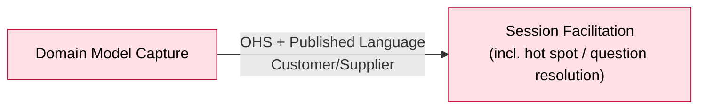

# Bounded Context: Session Facilitation

> Phase 05–06 canvas. Boundary facts confirmed this session; the event-stormed model is left
> `UNCONFIRMED` pending a Process Modelling or Design-Level EventStorming pass on this context
> specifically — Big Picture (already run) stops at the event board and does not produce
> per-context commands/events/policies.

> **Absorbed 2026-08-26:** the former Question & Hot Spot Resolution context folded into this one
> — `ddd-strategic-design` adopted a Design-Level finding that its detection and resolution
> capabilities already live here. See `../../context-map.md`'s "Decision" section,
> `../../open-questions.md` #17, and the retired
> [`../question-hot-spot-resolution/canvas.md`](../question-hot-spot-resolution/canvas.md). The
> sections below fold in that context's surviving content (marked `[from QHSR]`) alongside this
> session's own `UNCONFIRMED` deferrals — both still await a Design-Level pass on this context.

**Status:** draft • **Provenance:** `[confirmed]` (boundary) / `UNCONFIRMED` (event-stormed model)

- **Purpose:** Conduct the AI-facilitated conversation — elicit the expert's narration, propose
  typed Building Blocks from it, and apply the method's required asymmetry (lenient on the human's
  phrasing, strict on names the machine supplies), across a session's lifecycle (start, scope,
  close).
- **Subdomain type:** Core
- **Domain experts:** The participant (product owner), currently the sole source of facilitation
  method knowledge for this build.
- **Owning team:** One team (currently: the participant), owns all four v1 contexts.
- **Status:** draft

## Boundary rationale

- **Language boundary:** "Proposal" and "Contribution" (Facilitation's own pre-acceptance
  artifacts — not yet a Domain Event/Actor/System/Hot Spot, per the board); asymmetric leniency as a
  named behavior, not an implementation detail. `[from QHSR]` absorbs the trigger vocabulary —
  Absent Stakeholder Named, Knowledge Gap Revealed — and "resolved"/"unresolved" as a question's
  fate at Session Closed, now this context's own terms rather than a downstream's.
- **Capability boundary:** conduct-conversation-and-propose (noun–verb: session facilitation).
  Passes the single-name test — one capability, no "and" hiding a second context. `[from QHSR]`
  detect-and-track-gaps folds in as an extension of this same capability, not a second one: the
  Design-Level finding was that judging whether a contribution resolves an open gap is the same
  judgment shape as `Interpret Contribution` already uses.
- **Consistency boundary:** UNCONFIRMED — likely candidate: a session's lifecycle state
  (open/scoped/closed) must stay consistent within one session, now including a question's
  resolved/unresolved state at the moment of Session Closed (`[from QHSR]`). Needs a Design-Level
  pass to confirm any aggregate boundary.
- **Does not own:** Building Block storage/lifecycle (Domain Model Capture); projecting the model
  into readable output (Derived Artifact Generation).

## Event-stormed model

> Deferred. This session confirmed the boundary only. Commands, Events in/out, Policies, Queries,
> and any Aggregates are `UNCONFIRMED` until a Process Modelling or Design-Level session storms
> this context specifically.

### Commands

| Command | Actor / source | Handled by | Produces event(s) | Notes |
|---|---|---|---|---|
| Raise Hot Spot | This context (policy-triggered) `[from QHSR]` | Domain Model Capture | Building Block created (Hot Spot kind) | UNCONFIRMED exact command name/shape — same deferral QHSR left it in |

### Events in

| Event | Published by | Reaction in this context | Notes |
|---|---|---|---|
| UNCONFIRMED | — | — | Deferred |

### Events out

| Event | Consumed by | Meaning | Produced by |
|---|---|---|---|
| UNCONFIRMED | — | — | Deferred — the three triggers below (Absent Stakeholder Named, Knowledge Gap Revealed, Session Closed) are now internal to this context, not published to a downstream, per the 2026-08-26 merge |

### Policies

| When this event happens | Then this command/action occurs | Rule / rationale | Status |
|---|---|---|---|
| Absent Stakeholder Named | Raise Hot Spot | A missing perspective is itself a gap worth flagging | `[storm]`, `[from QHSR]`, not yet formalized as a policy card |
| Knowledge Gap Revealed | Raise Hot Spot | An admitted gap in the participant's own knowledge is a gap worth flagging | `[storm]`, `[from QHSR]` |
| Session Closed AND a Question Asked has no resolving event | Raise Hot Spot | An unresolved question shouldn't silently disappear at close | `[storm]`, `[from QHSR]` |
| A Contribution resolves an open hot spot/question | Interpret Contribution (existing capability, extended) | Resolution is a deliberate, confirmed act — mirrors `Building Block Proposed → Accept Proposal`, not an auto-raise policy — and must carry a recorded reference to what resolved it | `[storm]`, `[from QHSR]` design candidate, `open-questions.md` #19 |

### Queries / views / read models

| Query / view | Used by | Answers | Built from / backed by |
|---|---|---|---|
| Open hot spots / questions at any point in the session | `[from QHSR]`, UNCONFIRMED consumer | "What's still unresolved?" | UNCONFIRMED |

### Aggregates / consistency boundaries

| Aggregate / boundary | Handles commands | Emits events | Consistency rule |
|---|---|---|---|
| UNCONFIRMED | — | — | Deferred |

### External systems

| System | Role | Interaction | Notes |
|---|---|---|---|
| AI Model Provider | Backs the facilitator's proposals/questions | UNCONFIRMED (sync/async) | Technical Mechanism, see `subdomain-catalog.md` — not a subdomain in its own right |
| Voice Input | Optional input channel | On-device, audio never leaves device (design preference, not binding — `open-questions.md`) | Technical Mechanism |

## Integration arrows

> Confirmed Phase 06 relationships — see `../../context-map.md` for the source of truth.

- **Upstream (this context depends on):** Domain Model Capture — OHS + Published Language, this
  context accommodated as Customer/Supplier (it's the primary consumer shaping the contract),
  including the `Raise Hot Spot` call absorbed from Question & Hot Spot Resolution.
- **Downstream (consumers of this context):** none identified — Question & Hot Spot Resolution,
  formerly the one downstream, folded into this context 2026-08-26 (`context-map.md`'s "Decision"
  section).
- **Published language / contracts:** none of its own currently identified downstream of this
  context.
- **Anticorruption needs:** none identified this session; Capture is this context's only upstream
  and is clean/self-owned (same team).

## Hot-spots and open questions

| Topic | Type | What's unresolved | Next question / expert |
|---|---|---|---|
| Format-selection gap | hot-spot | "Workshop Format Selected" is on the board for the whole business line, but v1 hardcodes Big Picture | See `../../open-questions.md` #1 |
| Reinstatement conflict rule | white-spot | No resolution rule for a failed re-validation on reinstate | Named as Process Modelling/Design-Level work, `../../open-questions.md` #3 |
| As-is/to-be distinction | white-spot | Neither this board nor the PRD distinguishes describing the business as it works today vs. as wanted | `../../open-questions.md` #6 |
| Three policy relationships, found not modelled `[from QHSR]` | hot-spot | Formalizing Absent Stakeholder Named / Knowledge Gap Revealed / Session Closed → Raise Hot Spot as policy cards is Process Modelling/Design-Level work on this context | `../../open-questions.md` #4 |
| PRD gap: resolve/close mechanic unspecified `[from QHSR]` | white-spot | F08 defines creation/annotation/counting but no resolve operation; F01's operation-log kind list has no `resolve` verb | `../../open-questions.md` #19 |

## Code evidence (as-is)

Not run this session — no `[code]` pass has been performed against `src/`. UNCONFIRMED.

## Opportunities / problems

- This context's full event-stormed model (Commands/Policies/Queries) needs a Process Modelling
  or Design-Level EventStorming pass — flagged as the natural next session per README.

<!-- BEGIN lineage:index -->
<!-- END lineage:index -->