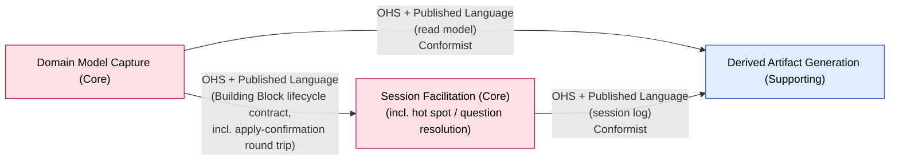

# Context Map

> Phase 06. Every integrating pair of bounded contexts, with the team relationship, the
> integration pattern, the direction of influence (upstream → downstream), and the mechanism.
> This supersedes the discovered-form `context-map.md` written by the Big Picture workshop
> (renamed in spirit, not deleted — see `Superseded draft` below); the storm's candidate seams
> were the input to this session's phase 05–06 work, not a competing artifact.

**This is the decided form.** Every relationship below was reasoned through the U/D
succeeds-independently test and the Core-protection rules, in session with the participant — not
carried over from the storm's `[inferred]` candidates untouched.

## Diagram

| Upstream (U) | Downstream (D) | Relationship | Pattern | Mechanism | Evidence / topic | Notes |
|---|---|---|---|---|---|---|
| Domain Model Capture | Session Facilitation | Upstream-Downstream | OHS + Published Language, accommodated as Customer/Supplier | in-process command/query (v1: single deployable) | Building Block lifecycle contract (create/rework/withdraw/reinstate, incl. Hot Spot Building Blocks raised **and resolved** by Facilitation's own resolution judgment — `Raise Hot Spot`/`Resolve Hot Spot`, formalized as commands 2026-08-26), plus the **apply-confirmation round trip** (`Operation Applied`/`Operation Rejected`, `Hot Spot Resolved`/`Hot Spot Resolution Rejected` — full surface below) | Both Core & volatile. Capture is self-contained and generic; Facilitation cannot ship without it (U/D tell). Facilitation is the primary consumer shaping the contract — its needs are formally accommodated, not merely conformed to. `[confirmed]` |
| Domain Model Capture | Derived Artifact Generation | Upstream-Downstream | OHS + Published Language, Conformist downstream | in-process read model | the read-only model projection (PRD F10) | Thin, stateless projection; no accommodation needed. `[confirmed]` |
| Session Facilitation | Derived Artifact Generation | Upstream-Downstream | OHS + Published Language, Conformist downstream | in-process read model | the **session log** — ordered conversation turns + proposal made/accepted/rejected/applied events | Flow B (transcript export) and Flow C (synthesized summary) both read it; the participant confirmed the transcript and proposal lifecycle "belong to Session Facilitation." An *added* upstream, not a moved boundary — Derived Artifact Generation is a Conformist downstream of **two** Core contexts. Thin projection; no accommodation. `[storm]`, adopted 2026-08-28 |

## Why Capture is the hub, not each pair modelled separately

Confirmed this session: Domain Model Capture's Building Block lifecycle contract is genuinely one Open-Host
Service serving two different downstream consumers (Facilitation, Artifact Generation) rather than
two ad hoc integrations — this is the technical expression of the product's own pitch, "one model,
many derived views." A Core context exposing a deliberate, stable public contract (rather than
leaking internals) is the point, not a violation of Core-protection.

Session Facilitation is a second, smaller Open-Host Service: its **session log** is a published
read model that Derived Artifact Generation conforms to. Both Core contexts publish deliberate
contracts and Derived Artifact Generation conforms to both — the same "one model, many derived
views" shape, one layer out.

## Deployment note

All four contexts currently ship as one deployable (v1 is a single process; see AGENTS.md's layer
rules for the code-level enforcement of these boundaries). The patterns above describe the
**logical** boundary and influence direction; per `modules-first-deployment-last`, splitting any of
these into separate services is a later, evidence-driven call — not implied by this map.

## Decision — Question & Hot Spot Resolution folded into Session Facilitation (2026-08-26)

A Design-Level session on Question & Hot Spot Resolution tested this map's seam against
consistency and integration evidence (its own required step, not a re-decomposition) and found it
does not hold as an independent bounded context. Full reasoning and evidence in
[`sessions/2026-08-26-design-level.md`](sessions/2026-08-26-design-level.md). Summary:

- Detection of the three triggers already executes inside **Session Facilitation**'s own policies
  (confirmed against `boards/capture-loop.md`), not this context.
- The resolution capability this session designed (judge whether a contribution resolves an open
  hot spot/question; requires deliberate human confirmation and a recorded reference) matches
  Session Facilitation's existing `Interpret Contribution` shape exactly — an extension of an
  existing capability, not a new one.
- The one thing that could still have justified separateness — "its own pace, a question can stay
  open across many cycles" — was tested directly: the participant confirmed Session Facilitation's
  own model already spans sessions ("the workshop remains valid if someone else resumes it
  later"), which removes the pace difference.
- Storage/enforcement of the resolution invariant was already Domain Model Capture's job before
  this session and is unchanged.

**Adopted by `ddd-strategic-design`, confirmed with the participant, 2026-08-26.** Question & Hot
Spot Resolution is retired as a bounded context. What survives is a capability (resolution
judgment) and a read model (open hot spots/questions) inside Session Facilitation, not a fourth
context. The diagram and table above now reflect this decision. The retired canvas is preserved,
marked superseded, at
[`bounded-contexts/question-hot-spot-resolution/canvas.md`](bounded-contexts/question-hot-spot-resolution/canvas.md);
its surviving content was merged into
[`bounded-contexts/session-facilitation/canvas.md`](bounded-contexts/session-facilitation/canvas.md).
See `open-questions.md` #17.

## Decision — Session Facilitation → Derived Artifact Generation adopted (2026-08-28)

The Design-Level pass on Derived Artifact Generation
(`sessions/2026-08-27-design-level-derived-artifact-generation.md`) found an integration edge this
map did not record: Flow B (transcript export) and Flow C (synthesized summary) both read Session
Facilitation's **session log** — ordered conversation turns + proposal made/accepted/rejected/applied
events. The participant stated the transcript and the proposal lifecycle "belong to Session
Facilitation."

Reasoned through the U/D test: Session Facilitation succeeds independently of Derived Artifact
Generation; the reverse is false (no artifact without a session to derive it from). Upstream →
downstream, with no power for the downstream to shape the contract — **Conformist**. Session
Facilitation publishes the session log as a deliberate read model → **OHS + Published Language**.

**Adopted by `ddd-strategic-design`, 2026-08-28.** Recorded in the diagram and the main table
above. The inherited **Domain Model Capture → Derived Artifact Generation** seam holds unchanged —
this is an *added* upstream, not a moved boundary. Derived Artifact Generation is a Conformist
downstream of **two** Core contexts. Resolves `open-questions.md` #39.

## Decision — the Domain Model Capture ↔ Session Facilitation surface adopted (2026-08-28)

**Same pattern, fuller published language — not a moved boundary.** Design-Level pass 2 on Session
Facilitation (the session runtime,
`sessions/2026-08-27-design-level-session-facilitation-runtime.md`) added an
**apply-confirmation round trip** to the existing OHS + Published Language, Customer/Supplier
relationship. Domain Model Capture now publishes back, per operation:

| New Boundary Event (Capture → Facilitation) | Keyed to | Consumed by |
|---|---|---|
| `Operation Applied` (carries the resulting building block id) | proposal id | `Proposal` → `APPLIED` |
| `Operation Rejected` (carries the reason) | proposal id | `Proposal` → `APPLY_FAILED` |
| `Hot Spot Resolved` (already existed; now also keyed to resolution id) | resolution id | `Resolution` → `APPLIED` |
| `Hot Spot Resolution Rejected` (already-resolved / withdrawn) | resolution id | `Resolution` → `LAPSED` |

New Boundary Commands (Facilitation → Capture): the kind-specific apply-operation commands
(`Capture Domain Event`, `Identify Actor`, `Sequence`, `Link Cause`, `Annotate`, …) issued on
`Proposal Accepted`, plus `Resolve Hot Spot` on `Resolution Accepted`. `Raise Hot Spot` is
unchanged and fire-and-forget.

**No aggregate spans the seam** — `Proposal`/`Resolution` live entirely in Facilitation and only
*react* to these events. The relationship pattern (OHS + Published Language, Customer/Supplier) is
unchanged; only the contract surface is fuller. **Adopted by `ddd-strategic-design`, 2026-08-28.**
`Operation Applied`'s building-block-id payload also resolves `open-questions.md` #51 (Flow B's
correlation link) in full.

## Superseded draft

The Big Picture workshop's own context map (candidate seams, `[inferred]`, derived from four of
six heuristics in close-out) was the input to this session's phase 05–06 reasoning, not retained
as a parallel source of truth at this path — its full writeup is preserved at
[`sessions/big-picture-context-map.md`](sessions/big-picture-context-map.md). Its three candidates
mapped closely to this decided form:

| Storm candidate | Outcome here |
|---|---|
| Session Lifecycle vs. Modeling Capture | Became **Session Facilitation** vs. **Domain Model Capture** — confirmed as two Core contexts, Capture upstream |
| Facilitation vs. Artifact Consumption | Became **Session Facilitation/Domain Model Capture** vs. **Derived Artifact Generation** — confirmed. Domain Model Capture is the primary upstream (the model projection); Session Facilitation is a second upstream (the session log, adopted 2026-08-28) that the storm candidate anticipated |
| Question & Hot Spot Resolution | Initially confirmed as its own context; later folded into **Session Facilitation** once a Design-Level pass tested and disproved the "runs on its own clock" rationale — see the Decision section above |

<!-- BEGIN lineage:index -->
<!-- END lineage:index -->