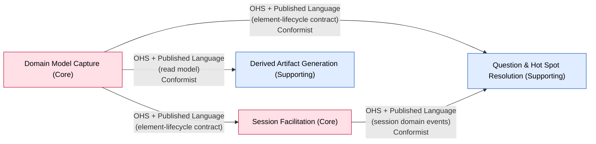

# Context Map

> Phase 06. Every integrating pair of bounded contexts, with the team relationship, the
> integration pattern, the direction of influence (upstream → downstream), and the mechanism.
> This supersedes the discovered-form `context-map.md` written by the Big Picture workshop
> (renamed in spirit, not deleted — see `Superseded draft` below); the storm's candidate seams
> were the input to this session's phase 05–06 work, not a competing artifact.

**This is the decided form.** Every relationship below was reasoned through the U/D
succeeds-independently test and the Core-protection rules, in session with the participant — not
carried over from the storm's `[inferred]` candidates untouched.

## Diagram

| Upstream (U) | Downstream (D) | Relationship | Pattern | Mechanism | Evidence / topic | Notes |
|---|---|---|---|---|---|---|
| Domain Model Capture | Session Facilitation | Upstream-Downstream | OHS + Published Language, accommodated as Customer/Supplier | in-process command/query (v1: single deployable) | element-lifecycle contract (create/rework/withdraw/reinstate) | Both Core & volatile. Capture is self-contained and generic; Facilitation cannot ship without it (U/D tell). Facilitation is the primary consumer shaping the contract — its needs are formally accommodated, not merely conformed to. `[confirmed]` |
| Domain Model Capture | Question & Hot Spot Resolution | Upstream-Downstream | OHS + Published Language, Conformist downstream | in-process command | same element-lifecycle contract, "Raise Hot Spot" as another element-creation call | Hot Spot Resolution has no leverage to shape Capture's contract; accepts it as-is, additive only. `[confirmed]` |
| Domain Model Capture | Derived Artifact Generation | Upstream-Downstream | OHS + Published Language, Conformist downstream | in-process read model | the read-only model projection (PRD F10) | Thin, stateless projection; no accommodation needed. `[confirmed]` |
| Session Facilitation | Question & Hot Spot Resolution | Upstream-Downstream | OHS + Published Language (curated event set), Conformist downstream | in-process domain events | Absent Stakeholder Named, Knowledge Gap Revealed, Session Closed (with unresolved Question Asked) | Hot Spot Resolution depends entirely on these facts and has no leverage back; a deliberately curated set of named events, not Facilitation's whole internal model. `[confirmed]` |

## Why Capture is the hub, not each pair modelled separately

Confirmed this session: Domain Model Capture's element-lifecycle contract is genuinely one Open-Host
Service serving three different downstream consumers (Facilitation, Hot Spot Resolution, Artifact
Generation) rather than three ad hoc integrations — this is the technical expression of the
product's own pitch, "one model, many derived views." A Core context exposing a deliberate, stable
public contract (rather than leaking internals) is the point, not a violation of Core-protection.

## Deployment note

All four contexts currently ship as one deployable (v1 is a single process; see AGENTS.md's layer
rules for the code-level enforcement of these boundaries). The patterns above describe the
**logical** boundary and influence direction; per `modules-first-deployment-last`, splitting any of
these into separate services is a later, evidence-driven call — not implied by this map.

## Superseded draft

The Big Picture workshop's own context map (candidate seams, `[inferred]`, derived from four of
six heuristics in close-out) was the input to this session's phase 05–06 reasoning, not retained
as a parallel source of truth at this path — its full writeup is preserved at
[`sessions/big-picture-context-map.md`](sessions/big-picture-context-map.md). Its three candidates
mapped closely to this decided form:

| Storm candidate | Outcome here |
|---|---|
| Session Lifecycle vs. Modeling Capture | Became **Session Facilitation** vs. **Domain Model Capture** — confirmed as two Core contexts, Capture upstream |
| Facilitation vs. Artifact Consumption | Became **Session Facilitation/Domain Model Capture** vs. **Derived Artifact Generation** — confirmed, Capture (not Facilitation directly) is Artifact Generation's upstream |
| Question & Hot Spot Resolution | Confirmed as its own context, exactly as named, with the "runs on its own clock" evidence carrying through to its Conformist/downstream position on two upstreams |

<!-- BEGIN lineage:index -->
<!-- END lineage:index -->
