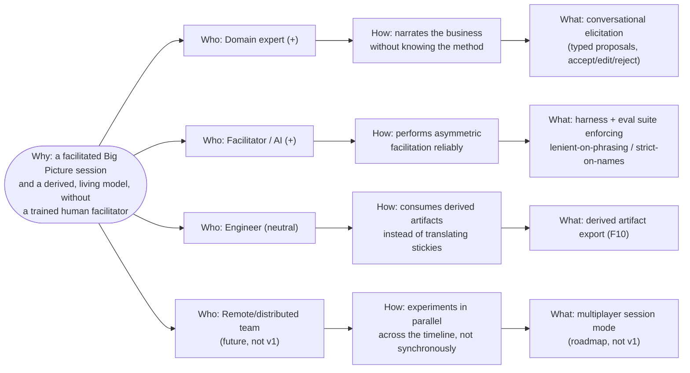

# Business Domain & Goals

> Phase 01. What the business actually does, and the real, impact-traceable goal of this
> initiative. Every later decision should trace back to a goal here.

## Business domain(s)

EventStormer operates in a single business domain: **AI-facilitated collaborative domain
modeling**. It helps a domain expert build a living, typed domain model through conversation with
an AI facilitator, and derives engineering-consumable artifacts from that same model — so there is
never a second document to drift from the first. `[confirmed]`

## Initiative goal

Make EventStorming — and the DDD practice it feeds — adoptable by people who don't know the
method, by having an AI reliably play the scarce, hard-to-train facilitator role. `[confirmed]`

This is deliberately scoped narrower than the broader mission behind it. The participant's own
words, for context (not the traced goal itself):

> "My goal then is to help EventStorming become more known, and easy to adopt. With this, promote
> DDD inside companies and help software development get better results, especially today with
> AI-assisted development." `[storm]`

EventStorming's value — shared understanding across business and IT, a ubiquitous language,
friction-point discovery, a foundation for DDD and system architecture — is well established but
locked behind a niche skill: facilitation. That is the wedge this initiative addresses; growing
DDD/EventStorming adoption industry-wide is the mission this wedge serves, not a goal this
initiative's deliverables are traced to directly.

Also **not** in this initiative's traced scope, but named as the reason the model is shaped the way
it is: traditional (in-person) EventStorming allows parallel conversation and experimentation
across the timeline; synchronous online tooling loses that. Multiplayer is the intended answer,
and a future actor below is scoped accordingly — but it is roadmap, not a v1 deliverable. `[confirmed]`

## Impact Map

**Why:** Domain experts get a facilitated Big Picture session and a derived, living model without
needing a trained human facilitator — laying groundwork for remote/multiplayer sessions and the
deeper EventStorming formats (Process Modelling, Design-Level).

- **Who** — Domain expert / author (`+`)
  - **How** — narrates their business, in their own words, without needing to learn the method's
    vocabulary or notation
    - **What** — conversational elicitation: the facilitator proposes typed Building Blocks, the
      expert accepts, edits, or rejects each one
- **Who** — Facilitator, played by an AI (`+`) — already named as an actor on the board `[storm]`,
  not a new one; the initiative reframes it as the actor whose capability is the product
  - **How** — performs the asymmetric facilitation the method requires: lenient on the human's
    phrasing, strict on names the machine supplies
    - **What** — a harness and eval suite that measure and enforce that asymmetry, per the PRD's
      opportunity statement
- **Who** — Engineer / downstream consumer (`neutral`)
  - **How** — consumes a projection of the living model instead of translating a wall of stickies
    into a second, decaying document
    - **What** — derived artifact export (PRD F10)
- **Who** — Remote/distributed team members (`future, not v1`)
  - **How** — experiment in parallel across different parts of the timeline, instead of being
    bottlenecked by one synchronous meeting
    - **What** — a multiplayer session mode (roadmap; explicitly out of v1, which is single-player)

<!-- BEGIN lineage:index -->
<!-- END lineage:index -->