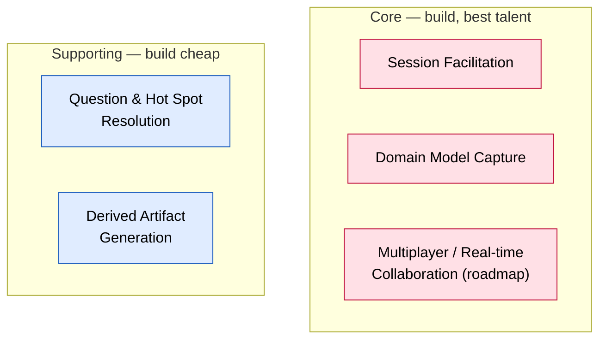

# Subdomain Catalog

> Phases 02–03. The distilled inventory of subdomains, each classified Core / Supporting / Generic
> with the decisive tell and the sourcing decision that follows. The highest-leverage strategic
> decision in the model.

**Status:** draft — every row `[confirmed]` in this session, but nothing here has been re-checked
against downstream bounded-context work yet.

## Landscape

| Subdomain | Type | Why this type (the tell) | Sourcing | Evidence | Confidence | Notes |
|---|---|---|---|---|---|---|
| Session Facilitation | Core | Someone would pay for an AI that reliably plays the scarce, skilled human-facilitator role; the logic (asymmetric leniency, lifecycle judgment) is complex and evolving, not CRUD | Build, best talent | PRD opportunity section ("nothing in a general-purpose chat enforces that asymmetry"); board actors `[storm]` | High | `[confirmed]` |
| Domain Model Capture | Core | The mechanism behind the product's central claim — "board and docs are the same object, no drift" — is the typed graph itself: stable ids, reword propagation, invariants across Building Block/relation kinds | Build, best talent | PRD §1 ("a typed graph of building blocks with stable identities"); §2 opportunity ("against drift") | High | `[confirmed]` |
| Question & Hot Spot Resolution | Supporting | No standalone value (not a product without Facilitation + Capture underneath); the three policy rules found this session read as Complicated/analyzable, not Complex/ever-shifting — they were fully enumerated in one pass | Build in-house, not best-talent priority | `open-questions.md` hot spot 4 (three policy relationships); `context-map.md` candidate seam 3 ("runs on its own clock") | High | `[confirmed]`. Revisit if resolution logic grows materially more complex once Process Modelling formalizes it |
| Derived Artifact Generation | Supporting | Mostly transformation/rendering of an already-correct model; the differentiating judgment lives upstream in Capture and Facilitation, not in the projection step | Build in-house, not best-talent priority | PRD F10; board §"Facilitation vs. Artifact Consumption" candidate seam | High | `[confirmed]` |
| Multiplayer / Real-time Collaboration | Core | Kept as one row for now (not yet built/scoped); differentiator angle — solves remote EventStorming's synchronous-meeting bottleneck. **Flagged**: likely splits into a Generic real-time-sync-infra part (buy: CRDTs/presence/transport) and a Core graph-conflict-resolution-semantics part once actually designed | Build, best talent (provisional) | Participant's stated goal (`domain-and-goals.md`); roadmap, not v1 | Low | Roadmap only — not built, not yet scoped for design. Revisit classification (possible split) when this reaches phase 05 |

## Technical Mechanisms (not subdomains)

- **Voice Input** — on-device speech-to-text (browser built-in / on-device ASR). Low-level infra;
  audio-never-leaves-device is a design preference, not a binding constraint (`open-questions.md`).
- **AI Model Provider Integration** — the LLM backend (Anthropic/OpenAI/etc.) powering the
  facilitator. Off-the-shelf, swappable; no business-differentiating logic of its own.

## Human-core work (software only supports)

- **The domain expert's own business knowledge** — the operational detail, exceptions, and
  workarounds the expert narrates. Session Facilitation elicits and structures this; it never
  replaces the expert's judgment.

<!-- BEGIN lineage:index -->
<!-- END lineage:index -->