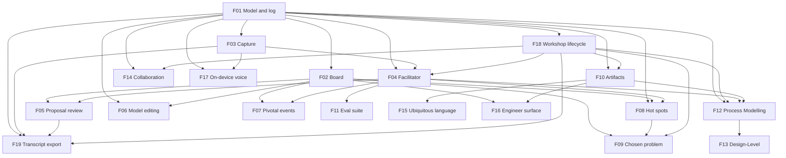

# EventStormer

## 1. Executive summary

Between a business expert who knows how the work actually happens and an engineering team that has to build it, there are today two human translators. One runs the workshop, because the expert does not know EventStorming. The other turns the resulting wall of stickies into technical documentation, because a board is not something a developer can build from. Both are scarce, and when either is unavailable the knowledge stays in someone's head.

EventStormer removes the second translator entirely and replaces the first with an AI facilitator. A domain expert describes their business, out loud or by typing; the facilitator proposes properly-formed building blocks and the expert accepts, edits, or rejects each one. What they build is not a picture of the domain — it is the domain model itself, a typed graph of building blocks with stable identities, and every artifact anyone reads afterwards is derived from it.

That is what makes the second half work. There is no editable second artifact to fall out of step with the model. The readable account in the app is a live projection: reword an event, add detail, or correct how a step really works, and it re-renders on the spot. What you download is a point-in-time render, but it is stamped with the model version it was taken at, so a copy that has gone stale says so rather than passing as current. Documentation stops rotting because there was never supposed to be a separate document.

v1 runs one Big Picture workshop — a single session, end to end — with the expert typing rather than speaking. It produces the model, a structured JSON export, a template-rendered readable account, a template-rendered summary, and a verbatim session transcript — every one a deterministic function of the model or the recorded session, none produced by a language model. Voice arrives as on-device transcription — the audio never leaving the machine is the point, since the input is someone describing their company's operations. The deeper formats — Process Modelling and Design-Level, where engineering does most of its work and where the rot problem bites hardest — are the product's direction, and the model is deliberately shaped to receive them.

## 2. Problem and opportunity

### The problem

**A domain expert cannot run an EventStorming session alone.**
- They know the business; they do not know the method, its notation, or its nuances.
- They do not know how to structure a board — what belongs on the timeline, what hangs off it, what is a phase hiding a whole region of the business.
- So the session requires a facilitator who knows the method, and facilitators are scarce. Where none is available, the session does not happen and the knowledge stays tacit.

**Even a good board is not engineering documentation.**
- A wall of stickies is a shared understanding, not something a developer builds from.
- Someone has to translate it into technical documents — a second specialist, a second pass, and a second artifact.
- That translation is where the expert's language gets lost, because the translator is rarely the person who heard them say it.

**The moment there are two artifacts, they drift.**
- The board lives in one tool and the documentation in another. Reword an event and only one of them knows.
- This is true today with a whiteboard and a wiki, with no AI anywhere near it — which is why it is not a prompting problem and cannot be fixed with a better prompt.
- Confidence in the documentation decays with every change, which is backwards: it should rise as the model matures.

**The decay accelerates exactly where engineering needs the model most.**
- Big Picture is comparatively stable. Process Modelling and Design-Level are where commands, policies, read models and aggregates appear, and where the model changes constantly as understanding sharpens.
- Every rewording, every added command, every correction to how something happens invalidates documentation that nothing automatically updates.
- The result is a familiar failure: a modelling exercise that produced real insight, and documentation nobody trusts six weeks later.

**Facilitation itself goes wrong in a predictable way.**
- An over-eager facilitator corrects the expert's wording, and the expert stops contributing — the method is explicit that a participant who feels examined disengages.
- A facilitator that accepts everything produces phase names and present-tense labels that are useless downstream.
- The correct behaviour is asymmetric: lenient on the human's phrasing, strict on names the machine supplies. Nothing in a general-purpose chat enforces that asymmetry.

### The opportunity

- **Against the missing facilitator:** the AI performs the translation from business language into the method's grammar, so the session can happen with the expert and nobody else.
- **Against the missing translator:** there is no translation step, because the board and the documentation are the same object viewed two ways. What engineering reads is a projection of the model the expert built.
- **Against drift:** one model, stable ids, no second editable source of truth. The in-app account is a live projection that moves with every change; a downloaded copy is a point-in-time render stamped with the model version it was taken at, so a stale copy identifies itself instead of passing as current.
- **Against decay at depth:** the model is a typed graph from the first session, so the deeper formats extend it rather than replacing it. The building blocks Process Modelling adds are new building block and relation kinds, not a new document.
- **Against bad facilitation:** the asymmetry is built into the harness and measured by its eval suite, rather than hoped for in a prompt.

## 3. Target audience

### Primary users

**The domain expert — the author**
- Knows a business in operational detail: the exceptions, the workarounds, the thing that happens on Fridays.
- Has no vocabulary for domain events or read models, and no reason to acquire one.
- Narrates out of order: "and then — well, before that, someone has to approve it."
- Low tolerance for friction and for being corrected; disengages if made to feel examined.
- Must recognise their own business in the result, in their own words, or they will not trust it.
- Success for them is finishing a conversation and having something engineering can actually use.

**The engineer — the consumer**
- Receives the model and builds from it. In v1 they read the exported artifacts; they do not have their own working surface.
- Needs the artifact to still be true next month, not just on the day it was made.
- Will eventually deepen the model themselves — adding commands, policies and aggregates, sharpening terminology — and needs those changes to flow into everything derived from it.
- Cares that the language in the model is the language the business actually uses, because that is what ends up in the code.

### Behavioural profile

Both work from the same model and never from copies of it. Neither is expected to keep two things in sync by hand, and neither is the authority on the other's half: the expert owns what is true about the business, the engineer owns what gets built from it.

## 4. Objectives

### Product objectives

1. **Let a domain expert produce a well-formed model without a facilitator present** and without learning the notation.
2. **Remove the translation step** — engineering consumes a projection of the expert's model, never a hand-made second artifact.
3. **Keep the derived account live in the app and self-dating on the way out** — the in-app readable account re-renders on every change to the model, and every downloaded artifact carries the model version it was rendered at, so nothing a person reads can silently disagree with the model.
4. **Keep the human the authority** — the facilitator proposes, a person disposes, and the model records who did which.
5. **Stay inside the format being run**, and be extensible to the deeper formats without restructuring the model.
6. **Know whether the facilitator is any good** through a repeatable eval rather than impressions.

### Success metrics

**Read the third column before the second.** A metric guaranteed by construction cannot return any value but its target — it confirms the implementation is the implementation, and it is listed because it is worth stating, not because it is evidence the product works. Only the observations can disconfirm anything.

| Objective | Metric | Nature |
|---|---|---|
| Expert produces a model alone | `[ASSUMED]` — a domain expert with no EventStorming training completes a session without asking what a building block kind means. No target was elicited. | Observation |
| No translation step | No artifact has an editable path; every one is generated from the model. | By construction |
| Deterministic artifacts | Every artifact is a pure function of the model or the session record: same input in, byte-identical artifact out. No artifact calls a language model. | Observation |
| Artifacts stay current | An operation applied to the model is reflected in the in-app readable account within the same interaction. Every downloaded artifact records the operation-log position it was rendered at. After a rewording, every **rendered reference** carries the new label and every **quoted passage** is byte-identical to before. | Observation |
| Human authority | Every operation in the log carries an author, and every facilitator-originated operation records both its proposer and the human who accepted it. A silent auto-apply is distinguishable in the log from an accepted one. | Observation |
| Format fidelity | No building block outside the running format's legend exists in any model. | By construction |
| Extensibility | Adding a format adds building block and relation kinds without altering existing ones. | Observation |
| Classifier fidelity | The facilitator does not absorb a deeper-format contribution as an in-format building block — measured by the eval, not by the type system, because the type system cannot see it. | Observation |
| Facilitator quality | A fixture-based eval reports per-assertion results, published in the README. `[ASSUMED]` — no target was elicited. | Observation |

## 5. User stories

### F01. Domain model, operation log and persistence
- As the system, I want every building block to have a stable id independent of its label so that rewording it never breaks a reference
- As the system, I want each building block kind to permit only the relations that make sense for it so that a hot spot can never be marked pivotal or given a predecessor
- As the system, I want an event to have several successors so that a business with two possible outcomes can be modelled honestly
- As the system, I want every operation to carry an author so that the model can show whose words are on the board
- As the system, I want every operation checked against the whole model before it is appended so that the model is never briefly invalid
- As the system, I want the model and its log to belong to the workshop, not to one sitting, so that closing a session never ends the work
- As a domain expert, I want to come back to a workshop and pick up in a new session so that I do not have to describe my business twice

### F02. Backlog and timeline board
- As a domain expert, I want things I have said but not yet placed to sit somewhere visible so that saying something out of order does not lose it
- As a domain expert, I want the board to read left to right in the order things happen so that I can check the story rather than decode a diagram
- As a domain expert, I want to see who or what caused an event shown beneath it so that the timeline stays about time
- As a domain expert, I want to see where the flow splits so that two possible outcomes both appear

### F03. Text capture
- As a domain expert, I want to describe my business in my own words a piece at a time so that I am not composing one long document
- As a domain expert, I want each thing I submit to be treated as one contribution so that the facilitator responds to what I just said
- As the system, I want every segment to record its source and speaker so that adding a voice path later changes nothing downstream

### F04. AI facilitator
- As a domain expert, I want to be asked what business we are mapping, and for that answer to shape every session in this workshop, so that the session starts the way a facilitated one would
- As a domain expert, I want what I said turned into properly-formed building blocks so that I never have to learn the notation
- As a domain expert, I want my own wording kept wherever it is usable so that the model sounds like my business
- As a domain expert, I want to be told when I have named a whole phase rather than something that happened so that the detail underneath does not go missing
- As a domain expert, I want to be told when what I described belongs to a deeper kind of session so that I understand why it is not on the board
- As a domain expert, I want the facilitator to keep going when the AI is briefly unavailable so that my words are still captured and turned into building blocks once it recovers
- As the system, I want the facilitator's output constrained to the operation schema so that a malformed proposal cannot reach the model

### F05. Proposal review
- As a domain expert, I want to see what the facilitator wants to add before it is added so that the model is never something that happened to me
- As a domain expert, I want to edit a proposed building block's wording before accepting it so that the model uses my words
- As a domain expert, I want to reject a proposal in one action so that dismissing a wrong guess is cheaper than arguing with it
- As a domain expert, I want to be told when something I accepted could not be applied so that I can fix it rather than assume it landed

### F06. Direct model editing
- As a domain expert, I want to reword a building block so that I can fix wording the facilitator got almost right
- As a domain expert, I want to withdraw a building block that was wrong so that the mistake stops appearing without being erased from the record
- As a domain expert, I want to say what follows what, and who caused what, so that the model matches reality
- As a domain expert, I want to place and unplace things so that ordering is mine to decide

### F07. Pivotal events
- As a domain expert, I want a handful of major milestones marked so that a long board becomes something I can navigate
- As a domain expert, I want to place the rest of my events relative to those milestones so that sorting a big backlog is not one long list

### F08. Hot spots
- As a domain expert, I want to flag something painful, disputed, or unknown so that the model records the problems and not just the process
- As a domain expert, I want a hot spot attached to the thing it is about so that the context is not lost
- As a domain expert, I want people who are not here but should be to be named so that the model says whose view is missing
- As a domain expert, I want to close a hot spot once it no longer applies, recording what resolved it, so that the model stays a true account of what's still open
- As a domain expert, I want to reopen a hot spot I closed by mistake so that a wrong call is not permanent

### F09. Stakeholder check and chosen problem
- As a domain expert, I want to be asked whether anyone else would tell this differently so that the model knows how complete it is
- As a domain expert, I want to name the one problem most worth attacking so that the session ends in a decision rather than a picture
- As a domain expert, I want that decision qualified honestly when other people should have been consulted so that nobody mistakes my priority for the organisation's

### F10. Derived artifacts
- As an engineer, I want the model as structured JSON so that I can build against it without retyping anything
- As a domain expert, I want a readable account of my model so that I can send it to someone who was not in the session
- As a domain expert, I want a short summary of my model — its spine, its shape, and its open problems — so that I can give someone the gist without walking them through the whole board
- As either user, I want every artifact to be a deterministic function of the model so that the same model always produces the same document and none of them can drift
- As a domain expert, I want the readable account in the app to keep up with the model as I change it so that what I am reading is never behind what I built
- As either user, I want a downloaded artifact to say which version of the model it was rendered from so that an old copy cannot be mistaken for the current one
- As either user, I want the artifact to say what kind of session produced it and what was not covered so that I know what I am reading

### F19. Session transcript export
- As a domain expert, I want the verbatim session transcript, annotated with what each turn produced, so that I can feed the raw conversation into another tool
- As either user, I want to see how many proposals each contributor accepted, edited, and rejected so that the record shows who shaped the model

### F11. Facilitator eval suite
- As the system, I want to replay fixture transcripts and assert what the facilitator proposes so that a prompt change that degrades quality is caught rather than shipped
- As the system, I want per-assertion results rather than one aggregate so that a regression in one behaviour is not hidden by others passing

### F12. Process Modelling support
- As an engineer, I want to deepen a Big Picture model into a process model so that the work already done is reused rather than repeated
- As an engineer, I want commands, policies and read models in the same model so that the deeper detail lives where the shallower detail already is

### F13. Design-Level support
- As an engineer, I want to model one bounded context in detail so that I can build it
- As an engineer, I want aggregates discovered from invariants so that the model earns its structure rather than mirroring a database

### F14. Real-time collaboration
- As a facilitator, I want to invite people into a workshop so that a workshop with a room can use this
- As a participant, I want to see what others are adding so that we are working on one model rather than several

### F15. Ubiquitous language
- As an engineer, I want the terms in the model collected as a glossary so that the code can use the business's words
- As a domain expert, I want to see where the same thing is called two things so that we can talk about it

### F16. Engineer working surface
- As an engineer, I want to work on the model directly so that corrections do not require going back to the expert for every change

### F17. On-device voice transcription
- As a domain expert, I want to describe my business out loud so that I can explain it the way I would to a colleague
- As a domain expert, I want my audio never to leave my machine so that I can talk freely about how my company actually works
- As a domain expert, I want to see my words appear as I speak so that I know I am being heard

### F18. Workshop lifecycle
- As a domain expert, I want to start a workshop and have its format fixed then so that every session in it runs the same method
- As a domain expert, I want to refine the modelling intent — as-is, to-be, or a named area — freely until I start building, so that a mis-framed opening answer is cheap to correct
- As a domain expert, I want the intent locked once modelling has started so that the facilitator never guides a session under a frame that no longer matches the board
- As a domain expert, I want a workshop to hold many sessions over time so that modelling a business is not a single sitting
- As the system, I want at most one session open per workshop at a time so that two people cannot unknowingly model the same area at once

## 6. Functionalities

### F01. Domain model, operation log and persistence

**Provides**
- Building block record — id, kind, label, withdrawn flag, and for events the pivotal marker and placement state (used by F02, F06, F08)
- Relations — `follows` edges between events, and `causedBy` edges from an actor or system to an event (used by F02, F06)
- Board snapshot — all building block records, all relations, hot spot annotations (including a hot spot's open/resolved state and, once resolved, the recorded reference) (used by F04, F10, F12, F19)
- Track grouping — the connected components of `follows`-linked placed events, derived from the relations and never stored (used by F02, F10)
- Operation log — appended operations, each with author, timestamp, kind and target (used by F10, F14, F19)
- Model identity — the workshop's id and its resumable URL, and the current session id (used by F02, F03, F04, F18)

**Capabilities**
- **The model is one per workshop, not per session.** It is the projection of the workshop's append-only operation log, and it outlives every individual session. Replaying the log from empty reproduces the current snapshot exactly.
- Building block kinds for Big Picture are exactly its legend: **domain event, actor, system, hot spot**. There is no representation for a command, policy, read model or aggregate; those arrive with F12 and F13 as new kinds.
- **Kinds are not interchangeable and the model is a discriminated union, not a generic sticky.** An event carries a pivotal marker, a placement state, and relations; an actor and a system carry neither placement nor pivotal marker; a hot spot carries an annotation target and nothing else. A pivotal hot spot or an actor with a predecessor is unrepresentable rather than merely discouraged.
- **Two relations, distinguished by their source kind, so no discriminator field is needed:**
  - `follows` — event to event. The temporal axis. Cycle-checked.
  - `causedBy` — actor or system to event. The causation axis. Its sources never have incoming edges, so it cannot participate in a cycle.
  - An event with no `causedBy` edge is one the business's own systems produced. Absence is the representation; no special marker exists.
- A hot spot annotates any building block other than another hot spot, or nothing at all. **Annotating nothing is a valid permanent state, not a waiting room.**
- Placement means different things per kind: an event is placed when it has a position in the sequence; an actor or system is placed when it causes an event; a hot spot is never placed. The backlog holds what is not yet placed and is a permanent surface, not a low-confidence fallback.
- **There is no re-type operation.** A building block filed under the wrong kind was never that kind; it is withdrawn and a new building block created. Withdrawing preserves the id so references resolve and the misreading stays in the record.
- **The operation log is single-writer and totally ordered.** Within the one open session (F18), operations are applied one at a time in arrival order, each validated against the projection of every operation before it. There is one consistency boundary — the whole model — and because there is only ever one writer, holding it costs nothing.
- **Every mutation is an operation**, appended to the log and never edited in place. The operation kinds are: **capture** (kind-specific — a domain event, an actor, or a system), **reword**, **sequence** / **unsequence** (add or remove one `follows` edge), **insert between** (replace `A→B` with `A→C→B`), **place** / **unplace**, **link cause** / **unlink cause** (add or remove one `causedBy` edge), **annotate** / **unannotate** (set or clear a hot spot's target), **mark pivotal** / **unmark pivotal**, **withdraw** / **reinstate**, **resolve** and **reopen** (a hot spot). The workshop's scope, stakeholder answer and chosen problem are **workshop state (F18), not entries in this log.**
- **`insert between` is one operation, not three.** It is atomic because the append is atomic; no observable state has both the replaced edge and the two new edges. Other successors of `A` are untouched — the graph is a DAG, not a queue.
- **`sequence` and `insert between` are both cycle-checked against the whole graph**, folding the entire log — not just the current session — and are rejected with the offending path named if they would close a cycle.
- **Withdrawal cascades.** Withdrawing an actor or system appends an `unlink cause` for every event that referenced it; withdrawing any building block appends a `withdraw` for every hot spot annotating it. The cascade is just more operations on the same serialized log — no separate transaction. **Reinstating is naked:** no relation is restored, and a reinstated building block re-enters the backlog shaped exactly like a fresh one.
- **`resolve` targets a hot spot only, and always carries a reference** — deliberately untyped: a note, a link, another building block's id, or free text. The schema requires the field to be present; it does not constrain its shape. A hot spot with no reference cannot be resolved. The reference is a **recorded value, not a live pointer**: if it later names a withdrawn building block, that is historical text, not a failure state.
- **`reopen` returns a resolved hot spot to open**, to correct a wrong resolution; the recorded reference stays in the log. A recurring issue with a different cause is a new hot spot, not a reopen.
- **Every operation carries an author.** Who proposed it and who accepted it are both recorded.
- Every operation is validated against the schema for its target's kind **and against the current projection** before it is applied. A failing operation is rejected and the model is unchanged.
- Duplicates, contradictions and granularity mismatches are preserved. The system never merges two building blocks.
- The log is persisted. The **workshop** survives the process that created it and is rebuilt by replaying its log. The workshop is addressable and resumable by URL; F18 governs what a session is and when one opens or closes.

**Experience**
Invisible to both users. Its correctness is what makes F06 and F10 feel instant and trustworthy.

**Error handling**
- Operation fails schema validation → rejected, model unchanged, caller told which field failed. Never partially applied.
- Operation targets a building block id that does not exist, or a kind that does not permit it → rejected as a no-op with an explicit message. A `link cause` or `annotate` naming a withdrawn or missing source or target is rejected the same way.
- `follows` edge, via `sequence` or `insert between`, would create a cycle → rejected with the offending path named.
- Hot spot annotating a hot spot → rejected by the schema; the relation does not exist for that kind.
- `resolve` on a building block that is not a hot spot, or with no reference → rejected as a schema violation; the snapshot is unchanged.
- Concurrent operations on one workshop → applied in log arrival order; the one-open-session rule (F18) is what keeps genuine concurrency rare in v1.

### F02. Backlog and timeline board

**Consumes**
- Building block record — id, kind, label, withdrawn flag, pivotal marker, placement state (from F01)
- Relations — `follows` edges between events, `causedBy` edges from actors or systems to events (from F01)
- Track grouping — connected components of placed events (from F01)
- Model identity — the resumable workshop URL (from F01)

**Capabilities**
- Two surfaces, both always visible: a **backlog** of unplaced building blocks and a **timeline** of placed ones.
- **The timeline is events only, left to right, following `follows` edges.** Building blocks are not grouped by kind; kind is carried by colour. Where events form separate connected tracks, each renders as its own left-to-right run.
- **Actors and systems render beneath the event they caused**, on the vertical axis, never as a timeline position of their own.
- Where an event has several successors the flow visibly splits and both branches are readable.
- Hot spots render as callouts on the building block they annotate, and in a visible list when they annotate nothing.
- Colours follow EventStorming convention: orange events, small yellow actors, pink systems, red hot spots. Kinds are also labelled in plain language.
- Withdrawn building blocks — including hot spots withdrawn by cascade — are hidden by default and can be revealed.
- The board updates immediately on every applied operation, whatever its source. It is a live graph view of the model, alongside F10's live in-app readable account; the downloadable artifacts are the point-in-time renders.
- **Position is derived, never authored.** A building block's place on screen is computed from its relations. There is no coordinate a person can set, no building block they can drag to a place of their own choosing, and the model stores no pixel value.
- Panning and zooming the *view* is navigation, not positioning, and is expected — a board of any size outgrows a single screen. It changes nothing in the model.

**Experience**
A resumed workshop opens on its existing model. A new one opens with the facilitator's scope question and an otherwise empty board. Accepted building blocks arrive in the backlog; as they are placed they move to the timeline. Both surfaces stay visible so the person can always see what is unplaced.

### F03. Text capture

**Consumes**
- Model identity — the current session id (from F01)

**Provides**
- Transcript segment — text, timestamp, source (typed or spoken), and the speaker (used by F04, F19)

**Capabilities**
- The person writes what they want to say and submits it; each submission becomes one transcript segment.
- Every segment carries its speaker and a source marker. **The marker exists in v1 even though every segment is typed**, so that adding a voice path changes nothing downstream — the facilitator, the log and the artifacts are all indifferent to how a segment was produced.
- Segments are timestamped, so a building block can be traced back to what produced it.
- Submitting is deliberately per-contribution rather than per-document: the person says one thing, the facilitator responds, and the loop is short.
- **v1 has no audio path at all.** Voice is on-device transcription and arrives with that feature.

**Experience**
A text field sits below the board with a submit control. Submitting clears it and sends the segment. Nothing about the surface implies a second, better input method is missing.

**Error handling**
- Empty or whitespace-only submission → no segment is produced and nothing reaches the facilitator.
- Submission while a previous segment is still being processed → queued rather than dropped, so a person typing quickly does not lose a contribution.

### F04. AI facilitator

**Consumes**
- Transcript segment — text, timestamp, spoken-or-typed, speaker (from F03)
- Board snapshot — all building block records, relations, hot spot annotations (from F01)
- Workshop record — the modelling intent (scope), whether it has been set yet, and the format (from F18)
- Facilitation context — assembled each turn from the recent transcript (F03), the open questions and frozen summaries of earlier closed sessions on the workshop (F18), and the open hot spots and thinly-covered or unopened regions of the model (F01)

**Provides**
- Proposed operation — operation kind, target building block id where applicable, proposed label, proposed building block kind, proposed relations, proposed reference (for a `resolve` proposal), and a short rationale (used by F05, F07, F08, F11, F12)

**Capabilities**
- Runs server-side. A transcript segment plus the current context go in; proposed operations come out, constrained to the operation schema.
- **The session opens with a facilitator question** — what business are we mapping — **and the answer establishes the workshop's scope, not a building block.** Scope is a free-form statement of modelling intent: the business as-is, as it is wanted to be (to-be), or a named area of it. It is set through a propose / edit / accept interaction shaped like proposal review (F05), but the result is workshop state (F18), not an operation in the model log. **Scope can be set and revised freely until the first building block is captured; from that operation on it is immutable**, and a later change of modelling intent means a new workshop.
- **`Ask Question` is the facilitator running an interview, not a reflex to each contribution.** Every turn it chooses its next move from the facilitation context — ask the scope question, probe a phase name, chase a region nobody has opened, run the stakeholder check, or actively guide an expert who does not know how to begin.
- **The quality bar is asymmetric, and this is the feature's defining behaviour.** Lenient on the human's phrasing: a recognisable event name is proposed substantially as said. Strict on names the facilitator supplies itself: past tense, a named state transition, business language.
- **Each proposal self-reports which side of that bar it was judged on**, so a reader can see whose words these are. The self-report drives the interface only; the eval verifies it independently against the transcript rather than trusting it.
- The one correction made on the spot regardless of source is an **aggregated phase name**. The facilitator does not accept it as an event; it asks what actually happens inside it, and that question is answerable through the normal capture channel.
- Where the person describes a command, policy, read model or aggregate, the facilitator says this belongs to a deeper session and names which, rather than absorbing it.
- **Interpreting a contribution judges two independent things, not one:** what it describes (which may propose zero, one, or several building blocks, point to a deeper format, or propose resolving an open hot spot — independently and in any combination), and separately, whether it resolves whichever facilitator question is still open. A contribution can do the first without the second — describing a real building block while leaving the question that prompted it unanswered — and the facilitator does not treat "something was said" as "the question is answered."
- Proposes relations as well as building blocks — what an event follows, and who or what caused it. Where it cannot place confidently it proposes the backlog.
- **Reword proposals against existing building blocks are held back during early capture**, because normalising while the person is still talking is the anti-pattern the method names. Rewordings become available once the model has structure.
- Never proposes withdrawing a building block a human authored.
- Each proposal carries a short plain-language rationale.

**Experience**
The user meets this feature entirely through F05 — they answer the opening question, then talk, and proposals appear.

**Error handling**
- Output fails schema validation → retried; on repeated failure the segment is dropped with a visible "didn't catch that" rather than a stack trace.
- **Model provider unavailable → the contribution is still recorded, and its interpretation is queued and retried when a model (primary or fallback) returns.** A contribution is interpreted **at most once**. The model stays fully editable by hand via F06 in the meantime.
- Proposal targets a building block id not in the model, or would create a cycle → discarded before it is shown.

### F05. Proposal review

**Consumes**
- Proposed operation — operation kind, target building block id where applicable, proposed label, proposed building block kind, proposed relations, proposed reference (for a `resolve` proposal), rationale (from F04)

**Provides**
- Session record — the conversation turns in order, and for each proposal its lifecycle (proposed, edited, accepted, rejected, applied, apply-failed, lapsed) with timing and the resulting building block id (used by F10)

**Capabilities**
- Proposals are presented for explicit disposition; nothing is applied without one.
- Each can be accepted, edited then accepted, or rejected. Editing covers the label and the building block kind.
- Accepting emits the operation with the accepting human as author, alongside the facilitator as proposer. Both are retained.
- **Accepting a proposal is not the same as the building block appearing.** Acceptance records the operation and hands it to the model (F01) to apply; the building block shows up a moment later, when the apply confirms. The gap is normal and the interface covers it.
- **A proposal can still fail at apply time** — its target was withdrawn by a sibling proposal or a direct edit, or the edge it adds would now close a cycle. The proposal then returns to the person with the reason, to edit and re-accept or to reject. **Acceptance is not a terminal state.**
- Rejecting emits nothing and leaves nothing behind.
- **Proposals are batched and capped per segment**, so a long monologue produces a reviewable set rather than a queue that can only be clicked through.
- Facilitator questions and out-of-format notices appear here as messages with no accept control, because there is nothing to accept. A question is answered through the normal capture channel like any other contribution, and the answer reaches the facilitator as an ordinary transcript segment.
- An unanswered question stays visible for the rest of the session rather than scrolling out of view.
- **At session close:** a proposal never acted on lapses quietly; a proposal that was accepted but failed to apply lapses and raises a hot spot, because the person asked for something the system could not deliver; a proposal still mid-apply is allowed to finish.

**Experience**
Proposals appear in a review area, visually distinct from both surfaces so that "not yet in the model" is unmistakable. Each shows the proposed label, its kind in plain language, where it would go, and why. Accept applies it moments later; reject dismisses it.

**Error handling**
- Accepted operation fails validation at F01 → the proposal returns with the reason rather than vanishing as though accepted, and can be edited and re-accepted or rejected.
- Accepted proposal targets a building block withdrawn since it was proposed → the proposal returns with an explanation, on the same path.

### F06. Direct model editing

**Consumes**
- Building block record — id, kind, label, withdrawn flag, pivotal marker, placement state (from F01)
- Relations — `follows` and `causedBy` edges (from F01)

**Capabilities**
- Reword a building block's label in place. **Before the rewording is committed the interface shows where that building block is referenced** — the relations, annotations and derived artifacts that mention it — and shows the same references after, so propagation is visible rather than assumed.
- Withdraw a building block, and reinstate a withdrawn one. There is no re-type and no destructive delete. Reinstating restores no relations.
- Add or remove a `follows` edge, including creating a branch; insert an event between two already sequenced.
- Add or remove a `causedBy` edge, attaching an actor or system to the event it caused.
- Place and unplace building blocks between backlog and timeline.
- Each action emits exactly one operation, authored by whoever performed it. Ids survive all of them.
- Withdrawing an event with edges on both sides does not silently rejoin its neighbours. Withdrawing an actor, system, or annotated building block cascades (F01) — the dependent edges and hot spots are withdrawn too, as follow-on operations.

**Experience**
A building block is clicked to edit; the label becomes editable inline. Changes apply on commit, and the board and the in-app readable account update immediately with no save action; a fresh download reflects the change the next time it is generated.

**Error handling**
- Rewording to an empty label → rejected inline, previous label retained.
- Edge that would create a cycle → rejected inline with the offending path named.
- Relation not permitted for the two kinds involved → rejected inline, naming why.

### F07. Pivotal events

**Consumes**
- Proposed operation — operation kind, target building block id, proposed label, proposed building block kind, rationale (from F04)

**Capabilities**
- Four to five events are marked pivotal — provisional anchors whose job is to make sorting the rest cheap.
- The facilitator proposes candidates; the person disposes through the normal review path.
- Marks are provisional and removable at any time; nothing else depends on them.
- Pivotal events are visually distinct and act as reference points for placing backlog items.

**Experience**
Once there are enough events, the person is offered a few suggested milestones. Backlog placement then offers before/after/between relative to a milestone rather than an undifferentiated list.

### F08. Hot spots

**Consumes**
- Proposed operation — operation kind, target building block id, proposed label, proposed building block kind, proposed reference (for a `resolve` proposal), rationale (from F04)
- Building block record — id, kind, label, withdrawn flag (from F01)

**Provides**
- Hot spot inventory — hot spot ids, labels, the building block ids they annotate, whether each is open or resolved, and, once resolved, the recorded reference (used by F09)

**Capabilities**
- A hot spot records pain, dispute, risk, or missing information, and is available from the first minute.
- **Two distinct routes create a hot spot, and only one goes through review.** When the person describes friction, uncertainty or disagreement as content, the facilitator proposes a hot spot like any other building block, through the normal F05 accept/edit/reject path; the person can also create one directly. By contrast, a hot spot triggered by an absent stakeholder, a revealed knowledge gap, or a question left unresolved at session close (below) is created directly, with no review step — the triggering fact is itself the confirmation, so nothing is left to accept or reject.
- **An absent stakeholder raises a hot spot** — the method's own prescription for a perspective that was not in the room — naming who is missing.
- A hot spot annotates any building block except another hot spot, or nothing.
- **Withdrawing the building block a hot spot annotates withdraws the hot spot too** (F01's cascade), rather than leaving a dangling annotation.
- Hot spots are counted and the count is visible.
- **Every facilitator question still unanswered when the session closes becomes a hot spot**, flagging the region that was never opened. A question counts as answered only by a direct resolving response — a plain on-topic answer, a revealed knowledge gap, a named absent stakeholder, or the stakeholder-check's complete-perspective confirmation — never merely because the contribution also produced an unrelated building block proposal. A phase name nobody expanded is exactly the hidden detail the board exists to reveal.
- **A model with no hot spots is reported at close as a signal to interpret rather than a pass or a failure**, since what it means depends on F09's stakeholder answer and on how mature the business is.
- **A hot spot is one of two kinds, and the kind decides whether resolving it is ever necessary — never whether it is possible.** An *informational* hot spot (e.g. "this integration is slow") records a permanent fact about the business and carries no expectation of closure. A *model-affecting* hot spot closes an open question or corrects something in the model itself, and has a genuine done state. Both kinds can be resolved by a later contribution; only the model-affecting kind is ever expected to be. Whether the kind is stored as an explicit field or derived is an open detail; the resolvability rule above is what is decided.
- **Resolving a hot spot is deliberate, never inferred.** When a contribution appears to close an open hot spot, the facilitator proposes the resolution through the same F05 accept/edit/reject path as any other proposal — this is not one of the direct-creation triggers above. Accepting requires a recorded reference to what resolved it (see F01); rejecting leaves the hot spot open, exactly as a rejected building-block proposal leaves nothing behind.
- **A resolved hot spot can be reopened** if the resolution turns out wrong; the recorded reference stays in the log.
- **Nothing in the product is gated on a hot spot's resolution.** An unresolved model-affecting hot spot is a signal, never a blocker — no action, view, or downstream feature requires it to be closed first.

**Experience**
Hot spots render as callouts on the building block they annotate, with a running count visible during the session. A resolved hot spot's callout shows its reference; an open one does not; reopening clears the resolved state.

### F09. Stakeholder check and chosen problem

**Consumes**
- Hot spot inventory — hot spot ids, labels, annotated building block ids, open state (from F08)

**Provides**
- Workshop qualification — the stakeholder answer and the chosen problem, with its qualification, recorded on the workshop (used by F18, F10)

**Capabilities**
- At close the person is asked **whether anyone else would tell this differently.**
  - **Nobody else** — the population is complete, and the chosen problem stands unqualified.
  - **Somebody** — each named person becomes an absent-stakeholder hot spot, and the chosen problem is recorded as provisional pending them.
- The person then names the one problem most worth attacking, chosen from the hot spots currently open rather than invented — a resolved hot spot is no longer a candidate.
- Choosing is skippable, and the reason is recorded: no problem chosen, or no real impediments yet — the latter being the expected answer from a business that has not operated long enough to have any.
- **The stakeholder answer and the chosen problem are recorded on the workshop (F18)**, not as operations in the model log. Both appear in every derived artifact, with their qualification.
- Carrying the chosen problem forward to seed the scope of a later workshop is **out of v1 scope** (section 7).

**Experience**
At close the person is asked the stakeholder question, then shown the model's hot spots and asked which matters most. One click chooses; a skip control is equally available and equally sized.

### F10. Derived artifacts

**Consumes**
- Board snapshot — all building block records, relations, hot spot annotations (from F01)
- Operation log — appended operations with author, timestamp, kind and target (from F01)
- Track grouping — connected components of placed events (from F01)
- Workshop record — format, scope, stakeholder answer, chosen-problem qualification (from F18)

**Provides**
- Structured outcome — the JSON export, the template-rendered readable account, and the template-rendered summary, every one a deterministic function of the model (used by F12, F15, F16)

**Capabilities**
- **Three deterministic artifacts**: a **JSON export** for engineering, a **template-rendered Markdown readable account** — the full walk of the model — and a **template-rendered Markdown summary** — the gist. Same model in, byte-identical artifact out. The readable account is also shown as a **live in-app view**; the JSON export and the summary are produced on request.
- **The readable account and the summary are rendered from templates over the snapshot, never generated by a language model.** Determinism is the property these artifacts exist to guarantee; a model call in either path would break it — which is why an AI-written narrative summary is deliberately not a v1 artifact (section 7).
- **The summary is the model's own outline**, assembled deterministically: the workshop scope and format; the pivotal events in `follows` order as the spine; counts of each building block kind and of placed-vs-backlog events, disconnected tracks, and branch points; each branch point named; the chosen problem with its qualification and the open model-affecting hot spots; and the model-derived coverage gaps (events with no cause, unplaced events) alongside the format steps not run. It carries no causal prose or cross-board interpretation — those would require a language model.
- **The JSON export is a direct serialisation of the model** — building blocks, both relation kinds, annotations, provenance and the operation log — and it round-trips: importing it reproduces the model exactly.
- **Every artifact distinguishes two kinds of text, and the distinction is load-bearing:**
  - A **rendered reference** resolves a building block id at render time. It always carries that building block's current label, and it cannot go stale — the graph guarantees it.
  - **Quoted evidence** is frozen free text reproduced verbatim: what someone actually said, and the facilitator's stored rationale for a proposal. It must **not** follow a rewording, because paraphrasing it would destroy the only record of what was said.
- It follows that **a label typed into free text is quoted evidence and will diverge from the model by design.** That is a property to state plainly in the artifact, not a defect to repair. (The JSON export and the summary contain no quoted evidence; only the readable account does.)
- The readable account and the summary state the format that produced them, that they rest on however many narrators actually contributed, the scope and the chosen problem with their qualification, and **which steps of the format were not run** — so a reader can distinguish a model that skipped a step from one that ran it and found nothing.
- **The in-app readable account is live.** It re-renders on every applied operation, whatever its source — the same coupling that keeps the board (F02) current — so the visible account never disagrees with the model. Folding the whole operation log is cheap enough that this needs no staleness fallback; if rendering is ever debounced under load, the view says it is catching up.
- **Every downloaded artifact records the operation-log position and the timestamp it was rendered at**, embedded in the file. A copy that has fallen behind the model identifies itself as a point-in-time render rather than passing as current.
- Downloads are produced on request; nothing is materialised between requests, and requesting one artifact never produces another.
- Artifacts are viewable in the app and downloadable.
- **v1 does not claim compatibility with any external documentation toolchain.** The export is EventStormer's own model, documented, and any bridge to another format is a separate concern.

**Experience**
A panel beside the board renders the readable account and updates it as the model changes — the visible coupling is what makes determinism legible rather than asserted. A download control produces any of the three artifacts, each stamped with the model version it was rendered at.

### F11. Facilitator eval suite

**Consumes**
- Proposed operation — operation kind, target building block id where applicable, proposed label, proposed building block kind, rationale (from F04)

**Capabilities**
- Fixture transcripts with expected facilitator behaviour, run on demand from the command line against the real model.
- Assertions cover: correct building block kind; past tense on facilitator-supplied event names; a phase name flagged; a near-miss that is a real event **not** flagged as a phase; a deeper-format contribution reported and named; and a human's awkward phrasing kept rather than rewritten.
- **The kept-phrasing assertion is verified against the transcript, not against the facilitator's self-report** — the proposed label's content words are checked for presence in the segment that produced it. The self-report is compared to that finding, so a facilitator that mislabels its own bar is itself a failure the suite catches.
- **Every assertion is reported separately.** There is no single aggregate that a regression in one behaviour can hide inside.
- Each case is run more than once, and the per-assertion result records how many runs passed, so a non-deterministic result is visible as one rather than being resolved by whichever run happened last.
- Results are published in the README with the run count stated.

**Experience**
Developer-facing only.

### F12. Process Modelling support

**Consumes**
- Board snapshot — all building block records, relations, hot spot annotations (from F01)
- Workshop record — the scope (from F18)
- Proposed operation — operation kind, target building block id, proposed label, proposed building block kind, rationale (from F04)
- Structured outcome — the JSON export and the readable account (from F10)

**Provides**
- Process-model building blocks — commands, policies and read models, and their relations to existing events (used by F13)

**Capabilities**
- Adds the Process Modelling legend as new building block kinds — command, policy, read model — and the relations between them, extending the model rather than replacing it.
- A command sits between an actor and the event it produces, so a `causedBy` edge becomes a two-step path without existing edges being rewritten.
- Scoped to one named process, harvesting the event vocabulary from an existing Big Picture model rather than re-deriving it.

**Experience**
Not yet designed.

### F13. Design-Level support

**Consumes**
- Process-model building blocks — commands, policies, read models and their relations to events (from F12)

**Capabilities**
- Adds aggregates, boundary commands and boundary events, scoped to one bounded context.
- Aggregates are arrived at from invariants rather than from the data they contain.

**Experience**
Not yet designed.

### F14. Real-time collaboration

**Consumes**
- Operation log — appended operations with author, timestamp, kind and target (from F01)
- Workshop record — the participant list and invitation state (from F18)

**Capabilities**
- The creator invites people into a workshop; each invitation is accepted, declined, or revoked.
- Several participants in one session, each operation already carrying its author.
- Collaboration is a broadcast over the existing operation log; the one-open-session rule (F18) is what relaxes here, and the model itself needs no change to support it.
- With a room present, F09's stakeholder question is answered by the room's composition rather than by asking.

**Experience**
Not yet designed.

### F15. Ubiquitous language

**Consumes**
- Structured outcome — the JSON export and the readable account (from F10)

**Capabilities**
- Collects the terms used across the model into a glossary derived from it, not maintained beside it.
- Surfaces where the same thing is named two ways, without resolving it — the divergence is the finding.

**Experience**
Not yet designed.

### F16. Engineer working surface

**Consumes**
- Structured outcome — the JSON export and the readable account (from F10)

**Capabilities**
- A surface for engineers to work on the model directly, with the same operations and the same authorship recording.

**Experience**
Not yet designed.

### F17. On-device voice transcription

**Consumes**
- Model identity — the current session id (from F01)
- Transcript segment — the shape a captured segment must match (from F03)

**Capabilities**
- Speech is captured and transcribed **entirely on the person's machine**. The audio does not leave the device, and no third party processes it.
- This rules out the browser's built-in speech recognition, which in every shipping implementation streams audio to the browser vendor's servers. A product whose input is a description of how a company operates cannot use it.
- Produces transcript segments identical in shape to typed ones, so nothing downstream distinguishes them beyond the source marker.
- The person owns the audio buffer rather than a recogniser's session lifecycle, so a long narration with thinking pauses is captured whole.
- Costs a one-time model download on first use, which the person is told about before it happens.

**Experience**
Not yet designed.

### F18. Workshop lifecycle

**Consumes**
- Model identity — the workshop id and its resumable URL (from F01)

**Provides**
- Session lifecycle — whether a session is open, when it opened and closed, and the one-open-session-per-workshop rule (used by F03, F04)
- Workshop record — format (fixed at creation), scope (fixed at first capture), the stakeholder answer and chosen-problem qualification once F09 records them, and the list of sessions (used by F04, F09, F10, F14, F19)

**Capabilities**
- **In v1 this feature is deliberately thin**: persistence and the resumable URL, the birth-fixed format, the scope interaction, and sessions that open and close (with the close-time question sweep and facilitation-summary freeze). Multi-participant membership, invitations, and concurrent sessions are all F14's — F18 is where they will attach, not behaviour v1 builds.
- A **workshop** is created with its format chosen then and **fixed for its life**. v1 hardcodes Big Picture, but the format is a real field, not an assumption.
- A workshop **persists across many sessions**. A **session** is one sitting; closing it ends the sitting, not the workshop. Returning to a workshop starts a **new session** on the same model — this is what "reopen where I left it" means; a closed session never reopens.
- **Scope** — the modelling intent, free-form: the business as-is, to-be, or a named area — is set and revised through the facilitator interaction in F04. It stays editable until the **first building block is captured**; from that operation on it is **immutable**. Before any capture there is no model content to reinterpret, so revising scope costs nothing; once modelling has started, a change of intent means a new workshop.
- **At most one session is open per workshop at a time.** This is a v1 simplification that keeps two people from unknowingly modelling the same area; F14 relaxes it.
- A session closes explicitly. On close, the workshop records which facilitator questions were still unanswered — F08 sweeps them into hot spots — and freezes a summary of the session for later sessions' facilitation context (F04). Both are computed in the same step, consistent as of the close.
- **Invitations and multi-participant membership are not in v1** — a v1 workshop has one participant. They arrive with F14.

**Experience**
Creating a workshop is a short step before the first session: confirm (implicitly) the Big Picture format, then answer the facilitator's scope question — which you can still refine until you accept the first building block. Thereafter the workshop is a URL you return to; each visit is a new session on the same model.

**Error handling**
- `set scope` attempted after the first building block is captured → rejected, scope unchanged.
- `start session` while one is already open → rejected; the open session is untouched.
- Unknown or corrupt workshop URL → the user is offered a new workshop, and the corrupt log is preserved rather than overwritten.

### F19. Session transcript export

**Consumes**
- Transcript segment — text, timestamp, source, speaker (from F03)
- Session record — the conversation turns in order, and each proposal's lifecycle (proposed, edited, accepted, rejected, applied, apply-failed, lapsed) with timing and the resulting building block id (from F05)
- Board snapshot — building block records, to name what each turn produced (from F01)
- Workshop record — format, scope (from F18)

**Provides**
- Session transcript export — every turn in order, annotated with what it produced (consumed by people; nothing downstream depends on it)

**Capabilities**
- **One deterministic artifact, generated on demand.** Every conversation turn in order, each annotated with the proposal it produced, that proposal's disposition, and the building block it became. Verbatim reproduction, no summarisation. The same session record produces a byte-identical transcript export.
- **It reports, per contributor, how many proposals they accepted, edited, and rejected** — counts only, no interpretation. This reporting lives here rather than in F10 because an edit and a rejection reach the session record but never the operation log.
- It states the workshop format and scope, and embeds the session-record position and timestamp it was rendered at, exactly as F10's downloads do.
- It is viewable in the app and downloadable.
- **Nothing here calls a language model.** A prose narrative of the session is exactly the artifact that cannot carry the determinism guarantee, so it is not a v1 artifact (section 7); the deterministic gist lives in F10's summary.

**Experience**
A generate/download control alongside F10's produces the transcript export on request.

## 7. Out of scope

**Not this product**
- Freeform canvas positioning: dragging a building block to a coordinate of its own, storing pixel positions, freehand drawing, or hand-drawn connectors. Position is computed from relations or it is not position. *(Panning and zooming the view is navigation and is in scope — it changes nothing in the model.)*
- Materialising downloadable artifact files on every operation. The in-app readable account updates live; the JSON export, the summary, and the transcript export are generated on request and stamped with the model version they render.
- **Any artifact generated by a language model.** Every v1 artifact is a deterministic render of the model or the session record. An AI-written narrative summary — fluid prose, causal connective tissue, cross-board themes — was considered and deliberately deferred, precisely because it cannot carry the determinism guarantee and would be the artifact most likely to be mistaken for the model. The deterministic summary in F10 covers the "give me the gist" need without that risk.
- Promotion of any artifact from `draft` to `confirmed`. That is a decision made with people, and it belongs to whoever owns the domain documentation.
- **The cross-workshop handoff.** A Big Picture workshop's chosen problem is not carried forward to seed the scope of a later Process Modelling or Design-Level workshop. F09 records the chosen problem in the workshop; wiring it into the next workshop's scope is a separate concern.
- **Workshop invitations and multi-participant membership.** A v1 workshop has one participant. Inviting others, and the accept / decline / revoke lifecycle, arrive with real-time collaboration (F14).
- **Scope change once modelling has started.** Scope is revisable freely until the first building block is captured; after that, changing modelling intent means a new workshop. There is no in-place scope edit on a workshop that already has model content.
- **Workshop archiving or locking.** A workshop has no modelled end state in v1.
- **Transcription by any third party**, hosted or browser-built-in. The browser's own speech recognition is excluded on exactly these grounds: in every shipping implementation it uploads audio to the browser vendor. Transcription in this product is on-device or it does not happen.
- Speaker diarisation, multi-microphone capture, recording playback.
- Compatibility with any external documentation toolchain's file layout or lineage conventions.
- **Deriving EventStorming or Strategic-DDD artifacts — boards, canvases, context maps — from the model.** A structured artifact generator for other method outputs is not a v1 concern.
- Accounts, authentication, authorization.
- Deployment, uptime, monitoring, hardening.

**In the product, not in v1** *(these are functionalities in section 6 and appear in the dependency graph at priority 3)*
- Process Modelling and Design-Level support.
- Real-time collaboration, including workshop invitations.
- The ubiquitous language glossary.
- An engineer-facing working surface — in v1 the engineer consumes the export and does not edit.
- On-device voice transcription. v1 is text entry only; the segment shape already carries a source marker so the voice path adds an input method rather than changing the model.

**Big Picture moves not built in v1**
- Swimlanes and frame maps. Pivotal events are the only structuring move.
- Value markers and emotion polarity.
- Binding constraints, language divergence, and deliberately-declined capabilities as their own elicitation round.
- Candidate bounded contexts and seam derivation.
- Conversational-system areas.

## 8. Dependency graph

> Dependency edges are derived from the `Consumes` declarations in section 6 and from which features cannot render without which surfaces. They were **not** individually confirmed by a human, so the graph is structural rather than decided. No edge encodes a sequencing preference.

| # | Feature | Priority | Dependencies |
|---|---|---|---|
| F01 | Domain model, operation log and persistence | 1 | None |
| F02 | Backlog and timeline board | 1 | F01 |
| F03 | Text capture | 1 | F01 |
| F04 | AI facilitator | 1 | F01, F03, F18 |
| F05 | Proposal review | 1 | F02, F04 |
| F06 | Direct model editing | 1 | F01, F02 |
| F07 | Pivotal events | 2 | F02, F04 |
| F08 | Hot spots | 2 | F01, F02, F04 |
| F09 | Stakeholder check and chosen problem | 1 | F02, F08, F18 |
| F10 | Derived artifacts | 1 | F01, F18 |
| F11 | Facilitator eval suite | 2 | F04 |
| F12 | Process Modelling support | 3 | F01, F04, F10, F18 |
| F13 | Design-Level support | 3 | F12 |
| F14 | Real-time collaboration | 3 | F01, F18 |
| F15 | Ubiquitous language | 3 | F10 |
| F16 | Engineer working surface | 3 | F02, F10 |
| F17 | On-device voice transcription | 3 | F01, F03 |
| F18 | Workshop lifecycle | 1 | F01 |
| F19 | Session transcript export | 2 | F01, F03, F05, F18 |

### Foundation features
These features set up shared project infrastructure. In a greenfield project they must be implemented sequentially, before or alongside anything that depends on them:
- **F01 Domain model, operation log and persistence** — project bootstrap, the building block and operation schemas every other feature validates against, the two relations, the authored append-only log, and the persisted store that the whole product is a view onto.
- **F18 Workshop lifecycle** — the workshop-and-session container F01's log is keyed to: format fixed at birth, scope fixed at the first capture, session start/close, and the one-open-session rule that lets the log stay single-writer. Depends on F01 (it wraps the model) and lands in wave 2; sequence it immediately after F01, before anything in wave 3.

### Execution waves
Features within the same wave can be built in parallel. A wave starts only after every feature in earlier waves is complete.

Foundation features cannot run in parallel in a greenfield project even when they land in the same wave, because they touch the same scaffolding files, and must be sequenced until the base is in place.

- **Wave 1**: F01
- **Wave 2**: F02, F03, F18
- **Wave 3**: F04, F06, F10, F14, F17
- **Wave 4**: F05, F07, F08, F11, F12, F15, F16
- **Wave 5**: F09, F13, F19

*F10 is the deterministic core — the JSON export, the readable account, and the summary, all template renders over the model — and depends only on F01 and F18, so it lands in wave 3. The verbatim transcript export is split out as F19, which reads the proposal lifecycle (F05) for its per-turn annotations and lands in wave 5. F12/F13's wave numbers reflect dependency depth only; both remain priority 3 and are not ready to spec.*

### Priority levels
- **1** = Essential — the product does not work without it
- **2** = Important — significant added value
- **3** = Desirable — incremental improvement

## 9. Acceptance criteria

### F01. Domain model, operation log and persistence
- A building block's id is unchanged after its label is changed.
- An operation that fails schema validation is rejected, and the snapshot before and after is identical.
- An operation that fails validation against the current projection is rejected, and the snapshot before and after is identical.
- Replaying the operation log from empty reproduces the current snapshot exactly.
- The model belongs to the workshop: closing every session and reopening the workshop presents the same model, rebuilt from the log.
- An event can be given two successors and both are retained.
- A `follows` edge that would create a cycle is rejected and the graph is unchanged.
- `insert between` is a single operation; no observable state has both the replaced edge and the two new edges, and other successors of the first event are untouched.
- `insert between` is cycle-checked like `sequence`; one that would close a cycle is rejected and the log is unchanged.
- An actor or system cannot be given a `follows` edge, a pivotal marker, or a placement position; each is rejected by its kind's schema.
- A hot spot cannot be marked pivotal, given any relation other than an annotation, or made to annotate another hot spot.
- A hot spot annotating nothing is valid and is not reported as incomplete.
- Two building blocks with identical labels can both exist; nothing merges or deduplicates them.
- There is no operation that changes a building block's kind.
- Withdrawing preserves the building block and its id; references to it still resolve.
- Withdrawing an actor or system appends an `unlink cause` for every event that referenced it; the events remain, without that cause.
- Withdrawing a building block that a hot spot annotates appends a `withdraw` for that hot spot; no dangling annotation remains.
- Reinstating a withdrawn building block restores no relations; it is shaped like a freshly captured one.
- A `link cause` or `annotate` naming a withdrawn or missing building block is rejected as a no-op; the log is unchanged.
- Every operation in the log carries an author, and the log records both proposer and accepter for facilitator-originated operations.
- A `resolve` operation with no reference is rejected as a schema violation; the snapshot before and after is identical.
- `resolve` is rejected for any building block that is not a hot spot.
- `reopen` returns a resolved hot spot to open and keeps the recorded reference in the log.
- The workshop's scope, stakeholder answer and chosen problem are not entries in the operation log; there is no operation kind that writes them.

### F02. Backlog and timeline board
- Building blocks are not grouped by kind; placed events render in `follows` order along the timeline.
- Events in separate connected tracks each render as their own left-to-right run.
- An actor or system renders beneath the event it caused, and never occupies a timeline position of its own.
- An event with two successors renders both branches, and neither is hidden.
- No user action causes a coordinate to be stored; the model contains no pixel value anywhere.
- An unplaced building block appears in the backlog and not on the timeline; placing it moves it, and unplacing returns it.
- A hot spot annotating nothing is visible somewhere, not silently absent.
- Withdrawn building blocks, including hot spots withdrawn by cascade, are hidden by default and can be revealed.

### F03. Text capture
- A captured segment carries the session id, the speaker, a timestamp, and a source marker.
- Every segment produced in v1 carries source `typed`; no code path produces any other value.
- An empty or whitespace-only submission produces no segment and reaches the facilitator not at all.
- A segment submitted while another is in flight is processed rather than dropped.
- The segment shape contains no field that only a voice path could populate, so adding one requires no change to the segment contract.

### F04. AI facilitator
- Every operation returned satisfies the operation schema for its target's kind.
- The session's first facilitator output is the scope question; the answer sets the workshop's scope, no building block is proposed before the scope is set, and no operation is written to the model log for the scope.
- The scope can be revised through the facilitator interaction until the first building block is captured; a revision after that is rejected and the scope is unchanged.
- A transcript describing a completed business fact yields a proposed domain event in past tense.
- A transcript naming an aggregated phase is flagged as a phase rather than accepted as an event.
- A transcript describing a command, policy, read model or aggregate produces a notice naming the deeper format, and no building block.
- A recognisable but awkwardly-phrased business fact from the human is proposed with the human's wording retained.
- A flagged phase name produces a question the person can answer through the normal capture channel, and the answer reaches the facilitator as a segment.
- A contribution that produces a building-block proposal without directly answering the question it was given for leaves that question open; the facilitator records no resolution against it from that contribution alone.
- Every proposal records whether it was judged under the lenient or the strict bar.
- No proposal withdraws a building block authored by a human.
- When the model provider is unavailable, the contribution is still recorded, its interpretation is queued, and it is interpreted exactly once when a provider returns; the model stays editable by hand meanwhile.
- A contribution already interpreted is not interpreted again, and no duplicate proposals result.

### F05. Proposal review
- No facilitator-originated mutation is applied without an explicit human accept.
- An applied operation records both the facilitator as proposer and the accepting human as author.
- Accepting a proposal records the operation; the building block may appear after a brief delay, not necessarily synchronously.
- A proposal that fails at apply time returns to the person with the reason, and can be edited and re-accepted or rejected; acceptance is not a terminal state.
- Rejecting a proposal leaves the snapshot unchanged and leaves nothing behind.
- Editing a proposal's label before accepting results in a building block carrying the edited label.
- Proposals from one segment are capped; a segment that would exceed the cap produces a reviewable set rather than an unbounded queue.
- A facilitator question or out-of-format notice is displayed with no accept control.
- A facilitator question remains visible until it is answered or the session closes.
- At session close: a proposal never acted on lapses with no hot spot; a proposal accepted but not applied lapses and raises exactly one hot spot; a proposal still applying is allowed to finish.

### F06. Direct model editing
- Rewording produces exactly one operation and the building block retains its id.
- The rendered references shown before a rewording and after it are the same set, and every one of them carries the new label. Quoted evidence is not counted among them.
- There is no control anywhere that changes a building block's kind.
- Withdrawing a building block with edges on both sides does not create an edge between its neighbours.
- A withdrawn building block can be reinstated, with its id intact and no relations restored.
- Rewording to an empty label is rejected and the previous label is retained.
- A `causedBy` edge can only be created from an actor or system to an event; any other pairing is rejected.
- Adding a `follows` edge that would create a cycle is rejected and the graph is unchanged.

### F07. Pivotal events
- Marking an event pivotal produces exactly one operation and changes nothing else about it.
- A pivotal mark can be removed, leaving the event and its edges intact.
- Only events can be marked pivotal.

### F08. Hot spots
- A hot spot can annotate any building block except another hot spot, and the annotation survives a rewording of that building block.
- A hot spot can exist annotating nothing, and is not reported as an error or an incomplete state.
- An absent stakeholder named at close produces a hot spot naming who is missing.
- The visible hot spot count matches the number of hot spot building blocks in the snapshot.
- Every facilitator question unanswered at session close produces exactly one hot spot naming what was not opened.
- A question left open by a building-block proposal that never directly resolved it is still swept into a hot spot at session close, exactly as if it had received no reply at all.
- A hot spot triggered by an absent stakeholder, a revealed knowledge gap, or an unresolved question at close appears in the model with no facilitator proposal, no accept control, and no rejection path — it is never presented through F05.
- Withdrawing the building block a hot spot annotates withdraws the hot spot too; no dangling annotation remains.
- An informational hot spot and a model-affecting hot spot can each be resolved by a later contribution; neither kind is resolvable-only-in-principle.
- A proposed resolution accepted through F05 marks the hot spot resolved and records the reference given; a proposed resolution rejected through F05 leaves the hot spot open and unaffected, identical in effect to a rejected building-block proposal.
- A resolved hot spot can be reopened, returning it to open with the recorded reference retained.
- No feature reads a hot spot's open/resolved state as a precondition for any other action; an unresolved hot spot never blocks anything.

### F09. Stakeholder check and chosen problem
- The stakeholder question is asked before the chosen problem is offered.
- Answering that nobody else would tell it differently records the chosen problem unqualified.
- Naming other people produces one absent-stakeholder hot spot per person and records the chosen problem as provisional.
- Problem candidates are exactly the hot spots currently open in the model; a resolved hot spot is never offered as a candidate, and no candidate is generated that isn't a hot spot at all.
- Skipping records which reason applied, and the artifacts state that reason rather than omitting the section.
- The stakeholder answer and the chosen problem are recorded on the workshop, not as operations in the model log.

### F10. Derived artifacts
- All three artifacts are generated from the model snapshot and workshop record alone, with no hand-editable path in any of them.
- None of the three is produced by a call to a language model.
- The same model produces a byte-identical JSON export, readable account, and summary every time.
- The in-app readable account reflects an applied operation within the same interaction, without a manual refresh.
- The JSON export and the summary are produced only on request; requesting one artifact never produces another.
- Every downloaded artifact — JSON export, readable account, summary — embeds the operation-log position and timestamp it was rendered at.
- After a rewording, every rendered reference in a freshly generated artifact carries the new label.
- After a rewording, every quoted passage in the readable account is byte-identical to what it was before the rewording.
- Rewording a building block whose label is a substring of another building block's label leaves that other building block's rendered references untouched.
- The JSON export round-trips: importing it reproduces an identical snapshot.
- The readable account marks which of its passages are quoted evidence, so a reader can tell a stale-looking label from a faithful quotation.
- The summary contains the pivotal events in `follows` order, a count for each building block kind, every branch point named, the chosen problem with its qualification, and the open model-affecting hot spots — and nothing that is not derivable from the model.
- The readable account and the summary name the format that produced them, the number of contributors, the scope and chosen problem with their qualification, and which steps of the format were not run.
- No artifact claims compatibility with an external toolchain.

### F11. Facilitator eval suite
- The suite runs from the command line against the real model and reports each assertion separately.
- No single aggregate figure is reported in place of the per-assertion results.
- Each case is run more than once and the per-assertion result states how many runs passed.
- The suite includes a near-miss case: a genuine event that superficially resembles a phase name, asserted **not** to be flagged.
- The suite includes a case asserting a human's awkward phrasing is retained rather than rewritten.
- The README carries the per-assertion results and the run count.
- The kept-phrasing assertion fails when a proposed label shares no content words with the segment that produced it, regardless of what the facilitator reported about its own bar.

### F12. Process Modelling support
Acceptance criteria not yet elicited — F12 is not ready to spec. It is present so the model's extensibility is visible in the graph and can be designed against; its behaviour has not been discussed.

### F13. Design-Level support
Acceptance criteria not yet elicited — F13 is not ready to spec, for the same reason as F12.

### F14. Real-time collaboration
Acceptance criteria not yet elicited — F14 is not ready to spec. It is deliberately shaped for by the authored operation log and the workshop record's participant list, but no behaviour was decided.

### F15. Ubiquitous language
Acceptance criteria not yet elicited — F15 is not ready to spec. It was identified as part of the product thesis; nothing about its behaviour has been discussed.

### F16. Engineer working surface
Acceptance criteria not yet elicited — F16 is not ready to spec. v1 deliberately makes the engineer a consumer rather than a user.

### F17. On-device voice transcription
Acceptance criteria not yet elicited — F17 is not ready to spec. The confidentiality constraint is decided (audio does not leave the device, which excludes browser-built-in recognition); no bar for accuracy, latency, model download size, or hardware floor was decided.

### F18. Workshop lifecycle
- A workshop's format is set at creation and no operation changes it afterward.
- A workshop's scope can be set and revised through the facilitator interaction while the model is empty; a `set scope` after the first building block is captured is rejected and the scope is unchanged.
- Revising the scope before any capture leaves the workshop with the revised scope and no model content, and the earlier scope value is not retained anywhere in the model.
- Closing every session and reopening the workshop by URL presents the same model.
- A second `start session` while one session is open is rejected and the open session is untouched; after that session closes, `start session` succeeds and creates a new session on the same model.
- An unknown or corrupt workshop URL offers a new workshop and preserves the corrupt log rather than overwriting it.
- A v1 workshop has exactly one participant; there is no invitation path.
- Closing a session records the unanswered facilitator questions and freezes the session's facilitation summary in the same step, both consistent as of the close.

### F19. Session transcript export
- The transcript export reproduces every conversation turn in order, each annotated with the proposal it produced, that proposal's disposition, and the resulting building block; nothing is summarised.
- The transcript export is deterministic: the same session record produces a byte-identical transcript export.
- The transcript export reports accept, edit and reject counts per contributor, and states no judgement about them.
- No part of the transcript export is produced by a call to a language model.
- It is generated only on request; nothing is materialised between requests.
- It embeds the session-record position and timestamp it was rendered at.
- It states the workshop format and scope.

### Cross-feature integration
- **F02 ← F01 (building block record):** a building block created by an operation appears on the surface matching its placement state, with label, kind and markers matching the record.
- **F02 ← F01 (relations):** a `follows` edge renders as a timeline connection between exactly those two events; a `causedBy` edge renders its source beneath exactly that event.
- **F02 ← F01 (model identity):** opening a workshop URL renders the model belonging to that workshop id; an unknown id offers a new workshop rather than an error.
- **F03 ← F01 (model identity):** a transcript segment carries the session id of the session it was captured in.
- **F04 ← F03 (transcript segment):** a segment reaches the facilitator with its text and speaker intact, and the proposals derive from that text.
- **F04 ← F01 (board snapshot):** given a model containing an existing event, the facilitator can propose a relation or a rewording targeting that event's actual id.
- **F04 ← F18 (workshop scope):** the opening scope answer sets the workshop's scope; no model-log operation is written for it, and a further revision is accepted until the first building block is captured, rejected after.
- **F05 ← F04 (proposed operation):** every proposal returned is presented for disposition, and its label, kind, relations and rationale as displayed match what was returned.
- **F05 ← F04 (proposed operation, resolve):** a resolve proposal displays the reference given, and accepting it emits a `resolve` operation carrying that same reference.
- **F05 → F01 (apply round trip):** an accepted proposal produces exactly one operation; if it fails to apply, the proposal is returned with the reason and is not treated as terminal.
- **F06 ← F01 (building block record):** an edit targets the building block by its id, and the resulting operation names that same id.
- **F06 ← F01 (relations):** removing a rendered connection produces an operation naming exactly that source and target pair and that relation kind.
- **F07 ← F04 (proposed operation):** a pivotal-mark proposal names an event id in the model, and accepting it marks that event.
- **F08 ← F04 (proposed operation):** a hot spot proposal names the building block it annotates by id, and accepting it produces an annotation of that building block.
- **F08 ← F04 (proposed operation, resolve):** a resolve proposal names the open hot spot it targets by id, and accepting it marks that hot spot resolved with the reference given.
- **F08 ← F01 (building block record):** withdrawing the building block a hot spot annotates withdraws the hot spot, by cascade, rather than leaving it dangling.
- **F09 ← F08 (hot spot inventory):** the candidate list matches the open hot spots in the inventory exactly, by id and label; a resolved hot spot never appears in it.
- **F09 → F18 (workshop qualification):** the stakeholder answer and the chosen problem, with its qualification, are recorded on the workshop and read from there by the artifacts.
- **F10 ← F01 (board snapshot):** the artifacts generated at any moment correspond to the snapshot at that moment, with no building block present in one and absent in the other.
- **F10 ← F01 (operation log):** the readable account's contributor count and the export's provenance derive from the authors recorded in the log; each downloaded artifact records the log position it was rendered at.
- **F10 ← F01 (applied operations):** an operation applied to the model updates the in-app readable account within the same interaction — the same coupling F02's board relies on.
- **F10 ← F18 (workshop record):** the readable account and the summary name the workshop's format and state its scope and the chosen-problem qualification.
- **F11 ← F04 (proposed operation):** the suite asserts against the operations the facilitator actually returns, not against a recorded fixture of them.
- **F18 ← F01:** the workshop's model is the projection of the operation log F01 owns; the workshop adds the lifecycle around it and does not duplicate the model state.
- **F19 ← F05 (session record):** each turn in the transcript export is annotated with its proposal's disposition and the resulting building block id; the per-contributor edit and reject counts come from here, since neither an edit nor a rejection reaches the operation log.
- **F19 ← F01 (board snapshot):** the building block a turn produced is named by resolving its id against the current model.
- **F19 ← F18 (workshop record):** the transcript export states the workshop's format and scope.
- **F12 ← F01, F04, F10, F18:** integration criteria not yet elicited, because F12's behaviour has not been designed.
- **F13 ← F12:** integration criteria not yet elicited, for the same reason.
- **F14 ← F01, F18:** integration criteria not yet elicited; the log's author field and the workshop's participant list exist to serve this and no behaviour has been decided.
- **F15 ← F10 (structured outcome):** integration criteria not yet elicited.
- **F16 ← F02, F10:** integration criteria not yet elicited.
- **F17 ← F01, F03:** integration criteria not yet elicited; the segment contract F03 already defines is what this feature must satisfy.

> Criteria absent for F12–F17 because those features are in the product view but were not designed in this session. Each carries an id, stories, a dependency row and enough capability description to be built against later; none is ready to hand to Specify.
