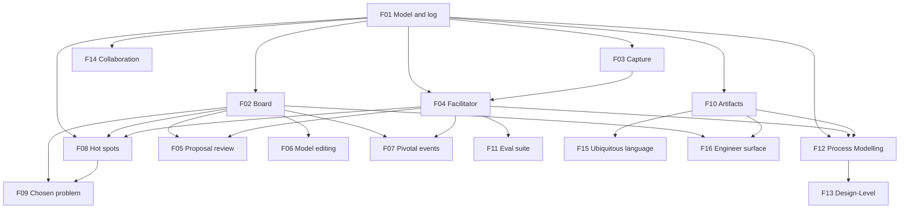

# EventStormer

## 1. Executive summary

Between a business expert who knows how the work actually happens and an engineering team that has to build it, there are today two human translators. One runs the workshop, because the expert does not know EventStorming. The other turns the resulting wall of stickies into technical documentation, because a board is not something a developer can build from. Both are scarce, and when either is unavailable the knowledge stays in someone's head.

EventStormer removes the second translator entirely and replaces the first with an AI facilitator. A domain expert describes their business, out loud or by typing; the facilitator proposes properly-formed elements and the expert accepts, edits, or rejects each one. What they build is not a picture of the domain — it is the domain model itself, a typed graph of records with stable identities, and every artifact anyone reads afterwards is derived from it.

That is what makes the second half work. Engineering does not receive an export that immediately begins to age; it consumes a projection of a living model. When someone renames an event, adds detail, or corrects how a step really works, every derived artifact follows in the same instant, because there is no second artifact to update. Documentation stops rotting because there was never supposed to be a separate document.

v1 runs one Big Picture session end to end and produces a model plus a readable account of it. The deeper formats — Process Modelling and Design-Level, where engineering does most of its work and where the rot problem bites hardest — are the product's direction, and the model is deliberately shaped to receive them.

## 2. Problem and opportunity

### The problem

**A domain expert cannot run an EventStorming session alone.**
- They know the business; they do not know the method, its notation, or its nuances.
- They do not know how to structure a board — what belongs on the timeline, what hangs off it, what is a phase hiding a whole region of the business.
- So the session requires a facilitator who knows the method, and facilitators are scarce. Where none is available, the session does not happen and the knowledge stays tacit.

**Even a good board is not engineering documentation.**
- A wall of stickies is a shared understanding, not something a developer builds from.
- Someone has to translate it into technical documents — a second specialist, a second pass, and a second artifact.
- That translation is where the expert's language gets lost, because the translator is rarely the person who heard them say it.

**The moment there are two artifacts, they drift.**
- The board lives in one tool and the documentation in another. Rename an event and only one of them knows.
- This is true today with a whiteboard and a wiki, with no AI anywhere near it — which is why it is not a prompting problem and cannot be fixed with a better prompt.
- Confidence in the documentation decays with every change, which is backwards: it should rise as the model matures.

**The decay accelerates exactly where engineering needs the model most.**
- Big Picture is comparatively stable. Process Modelling and Design-Level are where commands, policies, read models and aggregates appear, and where the model changes constantly as understanding sharpens.
- Every rename, every added command, every correction to how something happens invalidates documentation that nothing automatically updates.
- The result is a familiar failure: a modelling exercise that produced real insight, and documentation nobody trusts six weeks later.

**Facilitation itself goes wrong in a predictable way.**
- An over-eager facilitator corrects the expert's wording, and the expert stops contributing — the method is explicit that a participant who feels examined disengages.
- A facilitator that accepts everything produces phase names and present-tense labels that are useless downstream.
- The correct behaviour is asymmetric: lenient on the human's phrasing, strict on names the machine supplies. Nothing in a general-purpose chat enforces that asymmetry.

### The opportunity

- **Against the missing facilitator:** the AI performs the translation from business language into the method's grammar, so the session can happen with the expert and nobody else.
- **Against the missing translator:** there is no translation step, because the board and the documentation are the same object viewed two ways. What engineering reads is a projection of the model the expert built.
- **Against drift:** one model, stable ids, derived artifacts. A rename propagates by construction rather than by discipline, because there is one record and no second copy to forget.
- **Against decay at depth:** the model is a typed graph from the first session, so the deeper formats extend it rather than replacing it. The elements Process Modelling adds are new node and relation kinds, not a new document.
- **Against bad facilitation:** the asymmetry is built into the harness and measured by its eval suite, rather than hoped for in a prompt.

## 3. Target audience

### Primary users

**The domain expert — the author**
- Knows a business in operational detail: the exceptions, the workarounds, the thing that happens on Fridays.
- Has no vocabulary for domain events or read models, and no reason to acquire one.
- Narrates out of order: "and then — well, before that, someone has to approve it."
- Low tolerance for friction and for being corrected; disengages if made to feel examined.
- Must recognise their own business in the result, in their own words, or they will not trust it.
- Success for them is finishing a conversation and having something engineering can actually use.

**The engineer — the consumer**
- Receives the model and builds from it. In v1 they read the exported model; they do not have their own working surface.
- Needs the artifact to still be true next month, not just on the day it was made.
- Will eventually deepen the model themselves — adding commands, policies and aggregates, sharpening terminology — and needs those changes to flow into everything derived from it.
- Cares that the language in the model is the language the business actually uses, because that is what ends up in the code.

### Behavioural profile

Both work from the same model and never from copies of it. Neither is expected to keep two things in sync by hand, and neither is the authority on the other's half: the expert owns what is true about the business, the engineer owns what gets built from it.

## 4. Objectives

### Product objectives

1. **Let a domain expert produce a well-formed model without a facilitator present** and without learning the notation.
2. **Remove the translation step** — engineering consumes a projection of the expert's model, never a hand-made second artifact.
3. **Keep every derived artifact current by construction**, so that a change to the model cannot leave a derived artifact stale.
4. **Keep the human the authority** — the facilitator proposes, a person disposes, and the model records who did which.
5. **Stay inside the format being run**, and be extensible to the deeper formats without restructuring the model.
6. **Know whether the facilitator is any good** through a repeatable eval rather than impressions.

### Success metrics

**Read the third column before the second.** A metric guaranteed by construction cannot return any value but its target — it confirms the implementation is the implementation, and it is listed because it is worth stating, not because it is evidence the product works. Only the observations can disconfirm anything.

| Objective | Metric | Nature |
|---|---|---|
| Expert produces a model alone | `[ASSUMED]` — a domain expert with no EventStorming training completes a session without asking what an element kind means. No target was elicited. | Observation |
| No translation step | No artifact has an editable path; every one is generated from the model. | By construction |
| Artifacts stay current | After a rename, every **rendered reference** in every artifact carries the new label, and every **quoted passage** is byte-identical to what it was before. | Observation |
| Human authority | Every operation in the log carries an author, and every facilitator-originated operation records both its proposer and the human who accepted it. A silent auto-apply is distinguishable in the log from an accepted one. | Observation |
| Format fidelity | No element outside the running format's legend exists in any model. | By construction |
| Extensibility | Adding a format adds node and relation kinds without altering existing ones. | Observation |
| Classifier fidelity | The facilitator does not absorb a deeper-format contribution as an in-format element — measured by the eval, not by the type system, because the type system cannot see it. | Observation |
| Facilitator quality | A fixture-based eval reports per-assertion results, published in the README. `[ASSUMED]` — no target was elicited. | Observation |

## 5. User stories

### F01. Domain model, operation log and persistence
- As the system, I want every node to have a stable id independent of its label so that renaming it never breaks a reference
- As the system, I want each node kind to permit only the relations that make sense for it so that a hot spot can never be marked pivotal or given a predecessor
- As the system, I want an event to have several successors so that a business with two possible outcomes can be modelled honestly
- As the system, I want every operation to carry an author so that the model can show whose words are on the board
- As the system, I want the session to survive being closed so that a model is something you return to rather than something you finish in one sitting
- As a domain expert, I want to reopen a session where I left it so that I do not have to describe my business twice

### F02. Backlog and timeline board
- As a domain expert, I want things I have said but not yet placed to sit somewhere visible so that saying something out of order does not lose it
- As a domain expert, I want the board to read left to right in the order things happen so that I can check the story rather than decode a diagram
- As a domain expert, I want to see who or what caused an event shown beneath it so that the timeline stays about time
- As a domain expert, I want to see where the flow splits so that two possible outcomes both appear

### F03. Voice and text capture
- As a domain expert, I want to describe my business out loud so that I can explain it the way I would to a colleague
- As a domain expert, I want to see my words appear as I speak so that I know I am being heard
- As a domain expert, I want to type instead when I cannot talk so that a noisy room does not end the session

### F04. AI facilitator
- As a domain expert, I want to be asked what business we are mapping so that the session starts the way a facilitated one would
- As a domain expert, I want what I said turned into properly-formed elements so that I never have to learn the notation
- As a domain expert, I want my own wording kept wherever it is usable so that the model sounds like my business
- As a domain expert, I want to be told when I have named a whole phase rather than something that happened so that the detail underneath does not go missing
- As a domain expert, I want to be told when what I described belongs to a deeper kind of session so that I understand why it is not on the board
- As the system, I want the facilitator's output constrained to the operation schema so that a malformed proposal cannot reach the model

### F05. Proposal review
- As a domain expert, I want to see what the facilitator wants to add before it is added so that the model is never something that happened to me
- As a domain expert, I want to edit a proposed element's wording before accepting it so that the model uses my words
- As a domain expert, I want to reject a proposal in one action so that dismissing a wrong guess is cheaper than arguing with it

### F06. Direct model editing
- As a domain expert, I want to rename an element so that I can fix wording the facilitator got almost right
- As a domain expert, I want to archive an element that was wrong so that the mistake stops appearing without being erased from the record
- As a domain expert, I want to say what follows what, and who caused what, so that the model matches reality
- As a domain expert, I want to place and unplace things so that ordering is mine to decide

### F07. Pivotal events
- As a domain expert, I want a handful of major milestones marked so that a long board becomes something I can navigate
- As a domain expert, I want to place the rest of my events relative to those milestones so that sorting a big backlog is not one long list

### F08. Hot spots
- As a domain expert, I want to flag something painful, disputed, or unknown so that the model records the problems and not just the process
- As a domain expert, I want a hot spot attached to the thing it is about so that the context is not lost
- As a domain expert, I want people who are not here but should be to be recorded so that the model says whose view is missing

### F09. Stakeholder check and chosen problem
- As a domain expert, I want to be asked whether anyone else would tell this differently so that the model knows how complete it is
- As a domain expert, I want to name the one problem most worth attacking so that the session ends in a decision rather than a picture
- As a domain expert, I want that decision qualified honestly when other people should have been consulted so that nobody mistakes my priority for the organisation's

### F10. Derived artifacts
- As an engineer, I want the model as structured data so that I can build against it without retyping anything
- As a domain expert, I want a readable account of my model so that I can send it to someone who was not in the session
- As either user, I want both to update the instant the model changes so that I never wonder which is current
- As either user, I want the artifact to say what kind of session produced it and what was not covered so that I know what I am reading

### F11. Facilitator eval suite
- As the system, I want to replay fixture transcripts and assert what the facilitator proposes so that a prompt change that degrades quality is caught rather than shipped
- As the system, I want per-assertion results rather than one aggregate so that a regression in one behaviour is not hidden by others passing

### F12. Process Modelling support
- As an engineer, I want to deepen a Big Picture model into a process model so that the work already done is reused rather than repeated
- As an engineer, I want commands, policies and read models in the same model so that the deeper detail lives where the shallower detail already is

### F13. Design-Level support
- As an engineer, I want to model one bounded context in detail so that I can build it
- As an engineer, I want aggregates discovered from invariants so that the model earns its structure rather than mirroring a database

### F14. Real-time collaboration
- As a facilitator, I want several people in one session so that a workshop with a room can use this
- As a participant, I want to see what others are adding so that we are working on one model rather than several

### F15. Ubiquitous language
- As an engineer, I want the terms in the model collected as a glossary so that the code can use the business's words
- As a domain expert, I want to see where the same thing is called two things so that we can talk about it

### F16. Engineer working surface
- As an engineer, I want to work on the model directly so that corrections do not require going back to the expert for every change

## 6. Functionalities

### F01. Domain model, operation log and persistence

**Provides**
- Node record — id, kind, label, archived flag, and for events the pivotal marker and placement state (used by F02, F06, F08)
- Relations — `follows` edges between events, and `causedBy` edges from an actor or system to an event (used by F02, F06)
- Board snapshot — all node records, all relations, hot spot annotations, the session's business scope, the stakeholder answer, and the chosen problem where one exists (used by F04, F10, F12)
- Session identity — session id and its resumable session URL (used by F02, F03)
- Operation log — appended operations, each with author, timestamp, kind and target (used by F10, F14)

**Capabilities**
- Node kinds for Big Picture are exactly its legend: **domain event, actor, system, hot spot**. There is no representation for a command, policy, read model or aggregate; those arrive with F12 and F13 as new kinds.
- **Kinds are not interchangeable and the model is a discriminated union, not a generic sticky.** An event carries a pivotal marker, a placement state, and relations; an actor and a system carry neither placement nor pivotal marker; a hot spot carries an annotation target and nothing else. A pivotal hot spot or an actor with a predecessor is unrepresentable rather than merely discouraged.
- **Two relations, distinguished by their source kind, so no discriminator field is needed:**
  - `follows` — event to event. The temporal axis. Cycle-checked.
  - `causedBy` — actor or system to event. The causation axis. Its sources never have incoming edges, so it cannot participate in a cycle.
  - An event with no `causedBy` edge is one the business's own systems produced. Absence is the representation; no special marker exists.
- A hot spot annotates any node other than another hot spot, or nothing at all. **Annotating nothing is a valid permanent state, not a waiting room.**
- Placement means different things per kind: an event is placed when it has a position in the sequence; an actor or system is placed when it causes an event; a hot spot is never placed. The backlog holds what is not yet placed and is a permanent surface, not a low-confidence fallback.
- **There is no re-type operation.** An element filed under the wrong kind was never that kind; it is archived and a new element created. Archiving preserves the id so references resolve and the misreading stays in the record.
- Every mutation is an operation — create, rename, relate, unrelate, place, unplace, mark pivotal, archive, set scope, set stakeholder answer, set chosen problem — appended to a log and never edited in place.
- **Every operation carries an author.** Who proposed it and who accepted it are both recorded.
- Every operation is validated against the schema for its target's kind before it is applied. A failing operation is rejected and the model is unchanged.
- Duplicates, contradictions and granularity mismatches are preserved. The system never merges two nodes.
- The log is persisted. A session survives the process that created it and is reopened by replaying its log. Sessions are addressable and resumable by URL.

**Experience**
Invisible to both users. Its correctness is what makes F06 and F10 feel instant and trustworthy.

**Error handling**
- Operation fails schema validation → rejected, model unchanged, caller told which field failed. Never partially applied.
- Operation targets a node id that does not exist, or a kind that does not permit it → rejected as a no-op with an explicit message.
- `follows` edge would create a cycle → rejected with the offending path named.
- Hot spot annotating a hot spot → rejected by the schema; the relation does not exist for that kind.
- Unknown or corrupt session on resume → the user is offered a new session rather than an error page, and the corrupt log is preserved rather than overwritten.
- Concurrent operations on one session → applied in log arrival order.

### F02. Backlog and timeline board

**Consumes**
- Node record — id, kind, label, archived flag, pivotal marker, placement state (from F01)
- Relations — `follows` edges between events, `causedBy` edges from actors or systems to events (from F01)
- Session identity — session id and resumable session URL (from F01)

**Capabilities**
- Two surfaces, both always visible: a **backlog** of unplaced elements and a **timeline** of placed ones.
- **The timeline is events only, left to right, following `follows` edges.** Elements are not grouped by kind; kind is carried by colour.
- **Actors and systems render beneath the event they caused**, on the vertical axis, never as a timeline position of their own.
- Where an event has several successors the flow visibly splits and both branches are readable.
- Hot spots render as callouts on the node they annotate, and in a visible list when they annotate nothing.
- Colours follow EventStorming convention: orange events, small yellow actors, pink systems, red hot spots. Kinds are also labelled in plain language.
- Archived elements are hidden by default and can be revealed.
- The board updates immediately on every applied operation, whatever its source.
- No canvas, no coordinate dragging, no zoom. Position is sequence and relation, not pixels.

**Experience**
A resumed session opens on its existing model. A new one opens with the facilitator's scope question and an otherwise empty board. Accepted elements arrive in the backlog; as they are placed they move to the timeline. Both surfaces stay visible so the person can always see what is unplaced.

### F03. Voice and text capture

**Consumes**
- Session identity — session id (from F01)

**Provides**
- Transcript segment — text, timestamp, whether it was spoken or typed, and the speaker (used by F04)

**Capabilities**
- Speech is captured in the browser and transcribed live, with partial results shown as the person speaks.
- A text input is always available as an equal path, not a failure fallback.
- Segments carry the speaker, so provenance survives into F14's multi-participant case unchanged.
- Support is limited to browsers with native speech recognition. A stated limitation, not a supported matrix.

**Experience**
A microphone control starts and stops listening; the interim transcript is visible and updating while it does. Typing and submitting produces an identical segment.

**Error handling**
- Microphone permission denied → the text path is offered immediately with a plain explanation, and the session continues.
- Speech recognition unavailable → the microphone control is not shown and the text path is presented as the normal way in, with no error language.
- Empty or unintelligible audio → nothing is sent to the facilitator and the person is told nothing was heard.

### F04. AI facilitator

**Consumes**
- Transcript segment — text, timestamp, spoken-or-typed, speaker (from F03)
- Board snapshot — all node records, relations, hot spot annotations, business scope, stakeholder answer, chosen problem (from F01)

**Provides**
- Proposed operation — operation kind, target node id where applicable, proposed label, proposed node kind, proposed relations, and a short rationale (used by F05, F07, F08, F11, F12)

**Capabilities**
- Runs server-side. A transcript segment plus the current snapshot go in; proposed operations come out, constrained to the operation schema.
- **The session opens with a facilitator question** — what business are we mapping — and the answer sets the session scope through the normal accept path. Big Picture deliberately does not pre-narrow scope, so the question asks for the business line rather than a slice of it, and the facilitator does not narrow the answer.
- **The quality bar is asymmetric, and this is the feature's defining behaviour.** Lenient on the human's phrasing: a recognisable event name is proposed substantially as said. Strict on names the facilitator supplies itself: past tense, a named state transition, business language.
- **Each proposal self-reports which side of that bar it was judged on**, so a reader can see whose words these are. The self-report drives the interface only; the eval verifies it independently against the transcript rather than trusting it.
- The one correction made on the spot regardless of source is an **aggregated phase name**. The facilitator does not accept it as an event; it asks what actually happens inside it, and that question is answerable through the normal capture channel.
- Where the person describes a command, policy, read model or aggregate, the facilitator says this belongs to a deeper session and names which, rather than absorbing it.
- Proposes relations as well as elements — what an event follows, and who or what caused it. Where it cannot place confidently it proposes the backlog.
- **Rename proposals against existing elements are held back during early capture**, because normalising while the person is still talking is the anti-pattern the method names. Renames become available once the model has structure.
- Never proposes archiving an element a human authored.
- Each proposal carries a short plain-language rationale.

**Experience**
The user meets this feature entirely through F05 — they answer the opening question, then talk, and proposals appear.

**Error handling**
- Output fails schema validation → retried; on repeated failure the segment is dropped with a visible "didn't catch that" rather than a stack trace.
- Model API unavailable → the person is told, and the model remains fully editable by hand via F06.
- Proposal targets a node id not in the model, or would create a cycle → discarded before it is shown.

### F05. Proposal review

**Consumes**
- Proposed operation — operation kind, target node id where applicable, proposed label, proposed node kind, proposed relations, rationale (from F04)

**Capabilities**
- Proposals are presented for explicit disposition; nothing is applied without one.
- Each can be accepted, edited then accepted, or rejected. Editing covers the label and the element kind.
- Accepting emits the operation with the accepting human as author, alongside the facilitator as proposer. Both are retained.
- Rejecting emits nothing and leaves nothing behind.
- **Proposals are batched and capped per segment**, so a long monologue produces a reviewable set rather than a queue that can only be clicked through.
- Facilitator questions and out-of-format notices appear here as messages with no accept control, because there is nothing to accept. A question is answered by speaking or typing like any other contribution, and the answer reaches the facilitator as an ordinary transcript segment.
- An unanswered question stays visible for the rest of the session rather than scrolling out of view.

**Experience**
Proposals appear in a review area, visually distinct from both surfaces so that "not yet in the model" is unmistakable. Each shows the proposed label, its kind in plain language, where it would go, and why. Accept applies it immediately; reject dismisses it.

**Error handling**
- Accepted operation fails validation at F01 → the proposal returns with the reason rather than vanishing as though accepted.
- Accepted proposal targets an element archived since it was proposed → withdrawn with an explanation.

### F06. Direct model editing

**Consumes**
- Node record — id, kind, label, archived flag, pivotal marker, placement state (from F01)
- Relations — `follows` and `causedBy` edges (from F01)

**Capabilities**
- Rename an element's label in place. **Before the rename is committed the interface shows where that element is referenced** — the relations, annotations and derived artifacts that mention it — and shows the same references after, so propagation is visible rather than assumed.
- Archive an element, and restore an archived one. There is no re-type and no destructive delete.
- Add or remove a `follows` edge, including creating a branch.
- Add or remove a `causedBy` edge, attaching an actor or system to the event it caused.
- Place and unplace elements between backlog and timeline.
- Each action emits exactly one operation, authored by whoever performed it. Ids survive all of them.
- Archiving an event with edges on both sides does not silently rejoin its neighbours.

**Experience**
An element is clicked to edit; the label becomes editable inline. Changes apply on commit, and the board and every derived artifact update immediately with no save action.

**Error handling**
- Rename to an empty label → rejected inline, previous label retained.
- Edge that would create a cycle → rejected inline with the offending path named.
- Relation not permitted for the two kinds involved → rejected inline, naming why.

### F07. Pivotal events

**Consumes**
- Proposed operation — operation kind, target node id, proposed label, proposed node kind, rationale (from F04)

**Capabilities**
- Four to five events are marked pivotal — provisional anchors whose job is to make sorting the rest cheap.
- The facilitator proposes candidates; the person disposes through the normal review path.
- Marks are provisional and removable at any time; nothing else depends on them.
- Pivotal events are visually distinct and act as reference points for placing backlog items.

**Experience**
Once there are enough events, the person is offered a few suggested milestones. Backlog placement then offers before/after/between relative to a milestone rather than an undifferentiated list.

### F08. Hot spots

**Consumes**
- Proposed operation — operation kind, target node id, proposed label, proposed node kind, rationale (from F04)
- Node record — id, kind, label, archived flag (from F01)

**Provides**
- Hot spot inventory — hot spot ids, labels, the node ids they annotate, and whether each is open (used by F09)

**Capabilities**
- A hot spot records pain, dispute, risk, or missing information, and is available from the first minute.
- The facilitator proposes one when the person describes friction, uncertainty or disagreement; the person can also create one directly.
- **An absent stakeholder is recorded as a hot spot** — the method's own prescription for a perspective that was not in the room — naming who is missing.
- A hot spot annotates any node except another hot spot, or nothing.
- Hot spots are counted and the count is visible.
- **Every facilitator question still unanswered when the session closes becomes a hot spot**, recording the region that was never opened. A phase name nobody expanded is exactly the hidden detail the board exists to reveal.
- **A model with no hot spots is reported at close as a signal to interpret rather than a pass or a failure**, since what it means depends on F09's stakeholder answer and on how mature the business is.

**Experience**
Hot spots render as callouts on the node they annotate, with a running count visible during the session.

### F09. Stakeholder check and chosen problem

**Consumes**
- Hot spot inventory — hot spot ids, labels, annotated node ids, open state (from F08)

**Capabilities**
- At close the person is asked **whether anyone else would tell this differently.**
  - **Nobody else** — the population is complete, and the chosen problem stands unqualified.
  - **Somebody** — each named person becomes an absent-stakeholder hot spot, and the chosen problem is recorded as provisional pending them.
- The person then names the one problem most worth attacking, chosen from the hot spots actually present rather than invented.
- Choosing is skippable, and the reason is recorded: no problem chosen, or no real impediments yet — the latter being the expected answer from a business that has not operated long enough to have any.
- Both the stakeholder answer and the chosen problem appear in every derived artifact, with their qualification.

**Experience**
At close the person is asked the stakeholder question, then shown the model's hot spots and asked which matters most. One click chooses; a skip control is equally available and equally sized.

### F10. Derived artifacts

**Consumes**
- Board snapshot — all node records, relations, hot spot annotations, business scope, stakeholder answer, chosen problem (from F01)
- Operation log — appended operations with author, timestamp, kind and target (from F01)

**Provides**
- Derived artifact set — the structured model export and the readable account (used by F12, F15, F16)

**Capabilities**
- Two artifacts, both derived from the model: a **structured export** for engineering, and a **readable account** for people.
- **The structured export is JSON**, a direct serialisation of the model including nodes, both relation kinds, annotations, provenance and the operation log. It round-trips: importing it reproduces the model exactly.
- **The readable account is rendered from a template over the snapshot, never generated by a language model.** Determinism is the product's central claim and a model call in this path would break it.
- **Every artifact distinguishes two kinds of text, and the distinction is load-bearing:**
  - A **rendered reference** resolves a node id at render time. It always carries that node's current label, and it cannot go stale — the graph guarantees it.
  - **Quoted evidence** is frozen free text reproduced verbatim: what someone actually said, and the facilitator's stored rationale for a proposal. It must **not** follow a rename, because paraphrasing it would destroy the only record of what was said.
- It follows that **a label typed into free text is quoted evidence and will diverge from the model by design.** That is a property to state plainly in the artifact, not a defect to repair. The transcript and the stored rationales are the two places this happens.
- Every artifact states the format that produced it, that it rests on however many narrators actually contributed, and **which steps of the format were not run** — so a reader can distinguish a model that skipped a step from one that ran it and found nothing.
- The readable account states, per contributor, how many proposals they accepted, edited, and rejected. It reports the counts and does not interpret them.
- Both regenerate on every applied operation. Neither has a hand-editable path.
- Artifacts are viewable in the app and downloadable.
- **v1 does not claim compatibility with any external documentation toolchain.** The export is EventStormer's own model, documented, and any bridge to another format is a separate concern.

**Experience**
A panel beside the board shows the readable account updating live as the model changes — the visible coupling is what makes determinism legible rather than asserted. A download control produces both artifacts.

### F11. Facilitator eval suite

**Consumes**
- Proposed operation — operation kind, target node id where applicable, proposed label, proposed node kind, rationale (from F04)

**Capabilities**
- Fixture transcripts with expected facilitator behaviour, run on demand from the command line against the real model.
- Assertions cover: correct element kind; past tense on facilitator-supplied event names; a phase name flagged; a near-miss that is a real event **not** flagged as a phase; a deeper-format contribution reported and named; and a human's awkward phrasing kept rather than rewritten.
- **The kept-phrasing assertion is verified against the transcript, not against the facilitator's self-report** — the proposed label's content words are checked for presence in the segment that produced it. The self-report is compared to that finding, so a facilitator that mislabels its own bar is itself a failure the suite catches.
- **Every assertion is reported separately.** There is no single aggregate that a regression in one behaviour can hide inside.
- Each case is run more than once, and the per-assertion result records how many runs passed, so a non-deterministic result is visible as one rather than being resolved by whichever run happened last.
- Results are published in the README with the run count stated.

**Experience**
Developer-facing only.

### F12. Process Modelling support

**Consumes**
- Board snapshot — all node records, relations, hot spot annotations, business scope (from F01)
- Proposed operation — operation kind, target node id, proposed label, proposed node kind, rationale (from F04)
- Derived artifact set — the structured export and the readable account (from F10)

**Provides**
- Process-model elements — commands, policies and read models, and their relations to existing events (used by F13)

**Capabilities**
- Adds the Process Modelling legend as new node kinds — command, policy, read model — and the relations between them, extending the model rather than replacing it.
- A command sits between an actor and the event it produces, so a `causedBy` edge becomes a two-step path without existing edges being rewritten.
- Scoped to one named process, harvesting the event vocabulary from an existing Big Picture model rather than re-deriving it.

**Experience**
Not yet designed.

### F13. Design-Level support

**Consumes**
- Process-model elements — commands, policies, read models and their relations to events (from F12)

**Capabilities**
- Adds aggregates, boundary commands and boundary events, scoped to one bounded context.
- Aggregates are arrived at from invariants rather than from the data they contain.

**Experience**
Not yet designed.

### F14. Real-time collaboration

**Consumes**
- Operation log — appended operations with author, timestamp, kind and target (from F01)

**Capabilities**
- Several participants in one session, each operation already carrying its author.
- Collaboration is a broadcast over the existing operation log; no model change is required to support it.
- With a room present, F09's stakeholder question is answered by the room's composition rather than by asking.

**Experience**
Not yet designed.

### F15. Ubiquitous language

**Consumes**
- Derived artifact set — the structured export and the readable account (from F10)

**Capabilities**
- Collects the terms used across the model into a glossary derived from it, not maintained beside it.
- Surfaces where the same thing is named two ways, without resolving it — the divergence is the finding.

**Experience**
Not yet designed.

### F16. Engineer working surface

**Consumes**
- Derived artifact set — the structured export and the readable account (from F10)

**Capabilities**
- A surface for engineers to work on the model directly, with the same operations and the same authorship recording.

**Experience**
Not yet designed.

## 7. Out of scope

**Not this product**
- Freeform canvas positioning, coordinate dragging, pan, zoom, connectors, drawing.
- Promotion of any artifact from `draft` to `confirmed`. That is a decision made with people, and it belongs to whoever owns the domain documentation.
- Server-side or hosted transcription; speaker diarisation, multi-microphone capture, recording playback.
- Compatibility with any external documentation toolchain's file layout or lineage conventions.
- Accounts, authentication, authorization.
- Deployment, uptime, monitoring, hardening.

**In the product, not in v1** *(these are functionalities in section 6 and appear in the dependency graph at priority 3)*
- Process Modelling and Design-Level support.
- Real-time collaboration.
- The ubiquitous language glossary.
- An engineer-facing working surface — in v1 the engineer consumes the export and does not edit.

**Big Picture moves not built in v1**
- Swimlanes and frame maps. Pivotal events are the only structuring move.
- Value markers and emotion polarity.
- Binding constraints, language divergence, and deliberately-declined capabilities as their own elicitation round.
- Candidate bounded contexts and seam derivation.
- Conversational-system areas.

## 8. Dependency graph

> Dependency edges are derived from the `Consumes` declarations in section 6 and from which features cannot render without which surfaces. They were **not** individually confirmed by a human, so the graph is structural rather than decided. No edge encodes a sequencing preference.

| # | Feature | Priority | Dependencies |
|---|---|---|---|
| F01 | Domain model, operation log and persistence | 1 | None |
| F02 | Backlog and timeline board | 1 | F01 |
| F03 | Voice and text capture | 1 | F01 |
| F04 | AI facilitator | 1 | F01, F03 |
| F05 | Proposal review | 1 | F02, F04 |
| F06 | Direct model editing | 1 | F02 |
| F07 | Pivotal events | 2 | F02, F04 |
| F08 | Hot spots | 2 | F01, F02, F04 |
| F09 | Stakeholder check and chosen problem | 1 | F02, F08 |
| F10 | Derived artifacts | 1 | F01 |
| F11 | Facilitator eval suite | 2 | F04 |
| F12 | Process Modelling support | 3 | F01, F04, F10 |
| F13 | Design-Level support | 3 | F12 |
| F14 | Real-time collaboration | 3 | F01 |
| F15 | Ubiquitous language | 3 | F10 |
| F16 | Engineer working surface | 3 | F02, F10 |

### Foundation features
These features set up shared project infrastructure. In a greenfield project they must be implemented sequentially, before or alongside anything that depends on them:
- **F01 Domain model, operation log and persistence** — project bootstrap, the node and operation schemas every other feature validates against, the two relations, the authored append-only log, and the persisted session store that the whole product is a view onto.

### Execution waves
Features within the same wave can be built in parallel. A wave starts only after every feature in earlier waves is complete.

Foundation features cannot run in parallel in a greenfield project even when they land in the same wave, because they touch the same scaffolding files, and must be sequenced until the base is in place.

- **Wave 1**: F01
- **Wave 2**: F02, F03, F10, F14
- **Wave 3**: F04, F06, F15, F16
- **Wave 4**: F05, F07, F08, F11, F12
- **Wave 5**: F09, F13

### Priority levels
- **1** = Essential — the product does not work without it
- **2** = Important — significant added value
- **3** = Desirable — incremental improvement

## 9. Acceptance criteria

### F01. Domain model, operation log and persistence
- A node's id is unchanged after its label is changed.
- An operation that fails schema validation is rejected, and the snapshot before and after is identical.
- Replaying the operation log from empty reproduces the current snapshot exactly.
- A session closed and reopened presents the same model it had when closed.
- An event can be given two successors and both are retained.
- A `follows` edge that would create a cycle is rejected and the graph is unchanged.
- An actor or system cannot be given a `follows` edge, a pivotal marker, or a placement position; each is rejected by its kind's schema.
- A hot spot cannot be marked pivotal, given any relation other than an annotation, or made to annotate another hot spot.
- A hot spot annotating nothing is valid and is not reported as incomplete.
- Two nodes with identical labels can both exist; nothing merges or deduplicates them.
- There is no operation that changes a node's kind.
- Archiving preserves the node and its id; references to it still resolve.
- Every operation in the log carries an author, and the log records both proposer and accepter for facilitator-originated operations.

### F02. Backlog and timeline board
- Elements are not grouped by kind; placed events render in `follows` order along the timeline.
- An actor or system renders beneath the event it caused, and never occupies a timeline position of its own.
- An event with two successors renders both branches, and neither is hidden.
- An unplaced element appears in the backlog and not on the timeline; placing it moves it, and unplacing returns it.
- A hot spot annotating nothing is visible somewhere, not silently absent.
- Archived elements are hidden by default and can be revealed.

### F03. Voice and text capture
- A captured segment carries the session id, the speaker, a timestamp, and whether it was spoken or typed.
- With microphone permission denied, the text path is offered and the session continues; no error state blocks it.
- In a browser without speech recognition, no microphone control is rendered and the text path is presented as the normal way in, with no error language.
- Empty or unintelligible audio produces no segment and no proposal, and the person is told nothing was heard.
- A typed submission and a spoken utterance produce segments of identical shape, distinguishable only by their spoken-or-typed marker.
- No criterion asserts transcription accuracy or latency. Both are properties of a browser API this product does not control and cannot repair, so asserting them would measure someone else's component.

### F04. AI facilitator
- Every operation returned satisfies the operation schema for its target's kind.
- The session's first facilitator output is the scope question, and no element is proposed before the scope is set.
- A transcript describing a completed business fact yields a proposed domain event in past tense.
- A transcript naming an aggregated phase is flagged as a phase rather than accepted as an event.
- A transcript describing a command, policy, read model or aggregate produces a notice naming the deeper format, and no element.
- A recognisable but awkwardly-phrased business fact from the human is proposed with the human's wording retained.
- A flagged phase name produces a question the person can answer through the normal capture channel, and the answer reaches the facilitator as a segment.
- Every proposal records whether it was judged under the lenient or the strict bar.
- No proposal archives an element authored by a human.
- When the model API is unavailable, no proposal is produced and the model remains editable by hand.

### F05. Proposal review
- No facilitator-originated mutation is applied without an explicit human accept.
- An applied operation records both the facilitator as proposer and the accepting human as author.
- Rejecting a proposal leaves the snapshot unchanged and leaves nothing behind.
- Editing a proposal's label before accepting results in an element carrying the edited label.
- Proposals from one segment are capped; a segment that would exceed the cap produces a reviewable set rather than an unbounded queue.
- A facilitator question or out-of-format notice is displayed with no accept control.
- A facilitator question remains visible until it is answered or the session closes.

### F06. Direct model editing
- Renaming produces exactly one operation and the element retains its id.
- The rendered references shown before a rename and after it are the same set, and every one of them carries the new label. Quoted evidence is not counted among them.
- There is no control anywhere that changes an element's kind.
- Archiving an element with edges on both sides does not create an edge between its neighbours.
- An archived element can be restored, with its id and relations intact.
- Renaming to an empty label is rejected and the previous label is retained.
- A `causedBy` edge can only be created from an actor or system to an event; any other pairing is rejected.
- Adding a `follows` edge that would create a cycle is rejected and the graph is unchanged.

### F07. Pivotal events
- Marking an event pivotal produces exactly one operation and changes nothing else about it.
- A pivotal mark can be removed, leaving the event and its edges intact.
- Only events can be marked pivotal.

### F08. Hot spots
- A hot spot can annotate any node except another hot spot, and the annotation survives a rename of that node.
- A hot spot can exist annotating nothing, and is not reported as an error or an incomplete state.
- An absent stakeholder named at close produces a hot spot recording who is missing.
- The visible hot spot count matches the number of hot spot nodes in the snapshot.
- Every facilitator question unanswered at session close produces exactly one hot spot naming what was not opened.
- Archiving an annotated node leaves the hot spot resolvable rather than dangling.

### F09. Stakeholder check and chosen problem
- The stakeholder question is asked before the chosen problem is offered.
- Answering that nobody else would tell it differently records the chosen problem unqualified.
- Naming other people produces one absent-stakeholder hot spot per person and records the chosen problem as provisional.
- Problem candidates are exactly the hot spots present in the model; no candidate is generated that is not one.
- Skipping records which reason applied, and the artifacts state that reason rather than omitting the section.

### F10. Derived artifacts
- Both artifacts are generated from the snapshot alone, with no hand-editable path in either.
- The readable account is produced without any call to a language model.
- After a rename, every rendered reference in both artifacts carries the new label.
- After a rename, every quoted passage in both artifacts is byte-identical to what it was before the rename.
- Renaming an element whose label is a substring of another element's label leaves that other element's rendered references untouched.
- Each artifact marks which of its passages are quoted evidence, so a reader can tell a stale-looking label from a faithful quotation.
- Both artifacts update within the same interaction as the operation that changed the model.
- The JSON export round-trips: importing it reproduces an identical snapshot.
- The readable account reports accept, edit and reject counts per contributor, and states no judgement about them.
- Every artifact names the format that produced it, the number of contributors, and which steps of the format were not run.
- No artifact claims compatibility with an external toolchain.

### F11. Facilitator eval suite
- The suite runs from the command line against the real model and reports each assertion separately.
- No single aggregate figure is reported in place of the per-assertion results.
- Each case is run more than once and the per-assertion result states how many runs passed.
- The suite includes a near-miss case: a genuine event that superficially resembles a phase name, asserted **not** to be flagged.
- The suite includes a case asserting a human's awkward phrasing is retained rather than rewritten.
- The README carries the per-assertion results and the run count.
- The kept-phrasing assertion fails when a proposed label shares no content words with the segment that produced it, regardless of what the facilitator reported about its own bar.

### F12. Process Modelling support
Acceptance criteria not yet elicited — F12 is not ready to spec. It is present so the model's extensibility is visible in the graph and can be designed against; its behaviour has not been discussed.

### F13. Design-Level support
Acceptance criteria not yet elicited — F13 is not ready to spec, for the same reason as F12.

### F14. Real-time collaboration
Acceptance criteria not yet elicited — F14 is not ready to spec. It is deliberately shaped for by the authored operation log, but no behaviour was decided.

### F15. Ubiquitous language
Acceptance criteria not yet elicited — F15 is not ready to spec. It was identified as part of the product thesis; nothing about its behaviour has been discussed.

### F16. Engineer working surface
Acceptance criteria not yet elicited — F16 is not ready to spec. v1 deliberately makes the engineer a consumer rather than a user.

### Cross-feature integration
- **F02 ← F01 (node record):** a node created by an operation appears on the surface matching its placement state, with label, kind and markers matching the record.
- **F02 ← F01 (relations):** a `follows` edge renders as a timeline connection between exactly those two events; a `causedBy` edge renders its source beneath exactly that event.
- **F02 ← F01 (session identity):** opening a session URL renders the model belonging to that session id; an unknown id offers a new session rather than an error.
- **F03 ← F01 (session identity):** a transcript segment carries the session id of the session it was captured in.
- **F04 ← F03 (transcript segment):** a segment reaches the facilitator with its text and speaker intact, and the proposals derive from that text.
- **F04 ← F01 (board snapshot):** given a model containing an existing event, the facilitator can propose a relation or rename targeting that event's actual id.
- **F05 ← F04 (proposed operation):** every proposal returned is presented for disposition, and its label, kind, relations and rationale as displayed match what was returned.
- **F06 ← F01 (node record):** an edit targets the node by its id, and the resulting operation names that same id.
- **F06 ← F01 (relations):** removing a rendered connection produces an operation naming exactly that source and target pair and that relation kind.
- **F07 ← F04 (proposed operation):** a pivotal-mark proposal names an event id in the model, and accepting it marks that event.
- **F08 ← F04 (proposed operation):** a hot spot proposal names the node it annotates by id, and accepting it produces an annotation of that node.
- **F08 ← F01 (node record):** a hot spot's annotation resolves to a real node, and archiving that node leaves it resolvable.
- **F09 ← F08 (hot spot inventory):** the candidate list matches the hot spot inventory exactly, by id and label.
- **F10 ← F01 (board snapshot):** the artifacts rendered at any moment correspond to the snapshot at that moment, with no element present in one and absent in the other.
- **F10 ← F01 (operation log):** the readable account's contributor count and the export's provenance derive from the authors recorded in the log.
- **F11 ← F04 (proposed operation):** the suite asserts against the operations the facilitator actually returns, not against a recorded fixture of them.
- **F12 ← F01, F04, F10:** integration criteria not yet elicited, because F12's behaviour has not been designed.
- **F13 ← F12:** integration criteria not yet elicited, for the same reason.
- **F14 ← F01 (operation log):** integration criteria not yet elicited; the log's author field exists to serve this and no behaviour has been decided.
- **F15 ← F10 (derived artifact set):** integration criteria not yet elicited.
- **F16 ← F02, F10:** integration criteria not yet elicited.

> Criteria absent for F12–F16 because those features are in the product view but were not designed in this session. Each carries an id, stories, a dependency row and enough capability description to be built against later; none is ready to hand to Specify.
